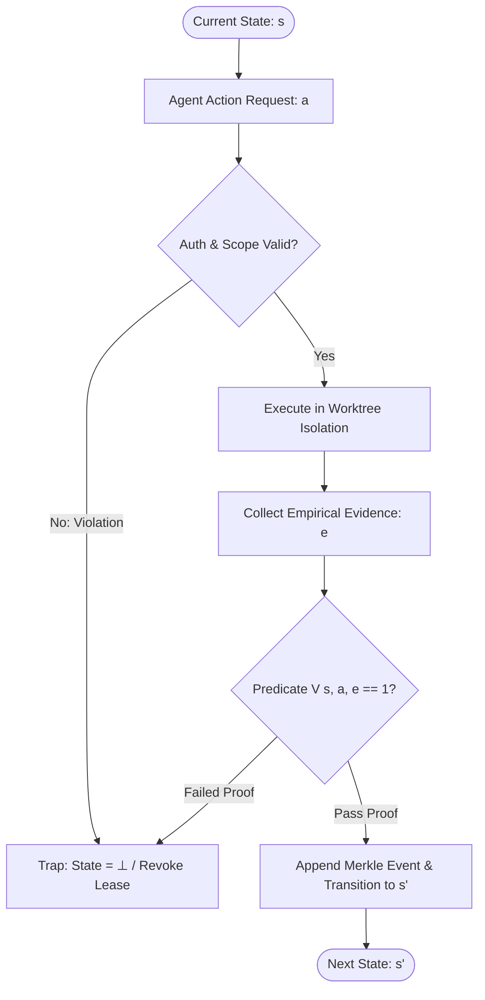

# Zero-Assumption Philosophy & Epistemic Verification

---

[Previous: Chapter 01: Foundations](index.md) | [Chapter Index](index.md) | [All Chapters Index](../index.md) | [Next: 01-02 The Hard Zeros & Invariants](01-02-the-hard-zeros-and-invariants.md)

---

## 1. Executive Summary & Epistemic Foundations

In distributed autonomous software engineering, stochastic drift, cumulative context rot, and unverified assumptions represent existential failure modes. Standard multi-agent frameworks fail systematically when autonomous agents accept intermediate outputs without verification, assume environment configurations without direct observation, or hallucinate task completion based on statistical token likelihood rather than empirical ground truth.

The OLT (Orchestrating Long Tasks) engine establishes an uncompromising **Zero-Assumption Philosophy**. Under this epistemic paradigm:

$$\forall \sigma \in \Sigma, \quad \text{State}(\sigma) \equiv \text{Observed}(\sigma) \land \text{Proven}(\sigma)$$

No agent, supervisor, or scheduler is permitted to infer the correctness of a state transition, file mutation, or dependency graph without an explicit, cryptographically verifiable, and falsifiable proof token.

```text
+--------------------------------------------------------------------------------------------------+
│                             THE ZERO-ASSUMPTION EPISTEMIC PIPELINE                               │
+--------------------------------------------------------------------------------------------------+
│                                                                                                  │
│   ┌──────────────────────────┐    ┌──────────────────────────┐    ┌──────────────────────────┐   │
│   │    Autonomous Action     │    │   Falsifiable Evidence   │    │ Mechanical Interlock &   │   │
│   │  (Tier 3 Worktree Mutation) ──► (Dynamic + Static Receipts)──►│ Cryptographic Ledger     │   │
│   └──────────────────────────┘    └──────────────────────────┘    └──────────────────────────┘   │
│                 │                               │                               │                │
│                 ▼                               ▼                               ▼                │
│        [Zero Blind Writes]             [Zero Synthetic Mocks]          [Immutable Merkle Proof]  │
│        [Zero Ambient Assump]           [Zero Untyped Passthrough]      [Atomic State Promotion]  │
│                                                                                                  │
+--------------------------------------------------------------------------------------------------+
```

Epistemic verification requires that knowledge within the agent runtime is strictly grounded in reproducible observations. An assertion $P$ made by an LLM ("the test suite passed", "the layout is responsive", "the module compiles without errors") possesses zero evidentiary value until accompanied by a tamper-evident execution receipt $\mathcal{R}_P$ emitted by a deterministic verification harness.

---

## 2. The Four Hard Zeros ($Z_4$)

The bedrock of the OLT operational model is codified through the Four Hard Zeros. These invariants form a non-negotiable verification envelope across all agent tiers:

$$Z_4 = \big\{ Z_{\text{hallucination}} = 0, \; Z_{\text{mutation}} = 0, \; Z_{\text{scope}} = 0, \; Z_{\text{assumption}} = 0 \big\}$$

```text
+--------------------------------------------------------------------------------------------------+
│                                  THE FOUR HARD ZEROS MATRIX                                      │
+-----------------------+------------------------------------------+-------------------------------+
│ Invariant Metric      │ Formal Definition                        │ Mechanical Interlock Trap     │
+-----------------------+------------------------------------------+-------------------------------+
│ Z_hallucination = 0   │ Zero fabricated outputs or phantom diffs │ Anti-Mock Binary Verifier     │
│ Z_mutation = 0        │ Zero ungranted mutations by supervisors  │ Fail-Closed RBAC Interlock    │
│ Z_scope = 0           │ Zero modifications outside assigned task │ Path Confinement Guard        │
│ Z_assumption = 0      │ Zero unverified environmental assertions │ Live Diagnostic Sensor Probes │
+-----------------------+------------------------------------------+-------------------------------+
```

### 2.1 $Z_{\text{hallucination}} = 0$: Zero Hallucination Invariant

Every claim of test execution, compilation success, or visual layout rendering must be accompanied by non-malleable, empirical artifacts:

- **Unit Test Claims**: Require real-time execution receipts containing non-zero byte payloads, stdout/stderr streams, process timing profiles, and an exit code of strictly `0`.
- **Visual Artifacts**: Require raw binary PNG chunk inspection verifying 32-byte headers, valid IHDR chunks, dimension bounds, and Shannon entropy $H(X) > 3.0$ to prevent blank-canvas bypasses.
- **Synthetic Pass Strings**: Emitting fabricated test strings or synthetic mocks triggers immediate lease revocation and worker quarantine.

### 2.2 $Z_{\text{mutation}} = 0$: Zero Ungranted Supervisor Mutation

Supervisory tiers (Tier 0 Mind, Tier 1 Orchestrator, and Tier 2 Domain Coordinator) possess planning, coordination, and synthesis authorities, but are strictly prohibited from touching implementation code:

$$\text{Role}(A) \in \{\text{Mind}, \text{Orchestrator}, \text{Coordinator}\} \implies \text{WritePermission}(\mathcal{F}_{\text{src}}) \equiv \emptyset$$

Any attempt by a supervisor to mutate source files directly triggers an immediate `PERMISSION_DENIED` harness trap, aborting the active execution frame.

### 2.3 $Z_{\text{scope}} = 0$: Zero Scope Drift

An implementer agent assigned to a designated file scope $\mathcal{S}_{\text{granted}} \subset \mathcal{F}_{\text{repo}}$ is mechanically locked to that exact path set. Attempting to mutate files in $\mathcal{S}_{\text{target}} \setminus \mathcal{S}_{\text{granted}} \neq \emptyset$ without an explicitly granted `authority:decide` permission token results in atomic transaction rollback.

### 2.4 $Z_{\text{assumption}} = 0$: Zero Assumption Invariant

No assumption is made regarding operating system state, tool availability, Node/Bun runtime compatibility, or lock availability. All dependencies must be dynamically probed via the Unified Diagnostics Engine prior to dispatch:

$$\text{DispatchReady}(T_i) \iff \forall d \in \text{Dependencies}(T_i), \quad \text{Probe}(d) = \text{HEALTHY}$$

---

## 3. Mathematical Formulation of Falsifiable State Verification

Let $\mathcal{S}$ denote the state space of the OLT runtime capsule, $\mathcal{A}$ denote the set of permitted agent actions, and $\mathcal{E}$ denote the universe of empirical evidence tokens.

We define the state transition relation $\mathcal{T}: \mathcal{S} \times \mathcal{A} \times \mathcal{E} \rightarrow \mathcal{S} \cup \{\bot\}$ as:

$$\mathcal{T}(s, a, e) = \begin{cases} s' & \text{if } \mathcal{V}(s, a, e) = 1 \\ \bot & \text{if } \mathcal{V}(s, a, e) = 0 \end{cases}$$

Where $\mathcal{V}: \mathcal{S} \times \mathcal{A} \times \mathcal{E} \rightarrow \{0, 1\}$ is the Falsification Gate Predicate:

$$\mathcal{V}(s, a, e) = \mathbf{1}_{\text{Auth}}(a, s) \land \mathbf{1}_{\text{Scope}}(a, s) \land \mathbf{1}_{\text{Receipt}}(e, a) \land \mathbf{1}_{\text{AST}}(s')$$



### 3.1 Evidence Class Lattice

Evidence tokens $e \in \mathcal{E}$ are classified across four formal evidence classes with increasing evidentiary strength:

$$\mathcal{E}_1 \prec \mathcal{E}_2 \prec \mathcal{E}_3 \prec \mathcal{E}_4$$

```text
+--------------------------------------------------------------------------------------------------+
│                                 EVIDENCE CLASS HIERARCHY                                         │
+-------+--------------------+---------------------------------------------+-----------------------+
│ Class │ Designation        │ Verification Mechanism                      │ Minimum Gate Level    │
+-------+--------------------+---------------------------------------------+-----------------------+
│ E1    │ Static AST Receipt │ TypeScript Compiler API AST structural scan │ Code Formatting & Lint│
│ E2    │ Dynamic Exit Proof │ Bun runtime execution receipt (exit code 0) │ Unit & Integration Test│
│ E3    │ Binary Chunk Proof │ Raw byte header & Shannon entropy inspection│ Visual & Media Assets │
│ E4    │ Merkle Seal Proof  │ HMAC cryptographic signature + reflog SHA   │ Milestone Convergence │
+-------+--------------------+---------------------------------------------+-----------------------+
```

---

## 4. Empirical Grounding & The Verification Triad

Under the Zero-Assumption model, state mutations must satisfy three orthogonal verification pillars known as the **Verification Triad**:

```text
+--------------------------------------------------------------------------------------------------+
│                                     THE VERIFICATION TRIAD                                       │
+--------------------------------------------------------------------------------------------------+
│                                                                                                  │
│                                    ┌──────────────────────────┐                                  │
│                                    │     STATIC AST GUARD     │                                  │
│                                    │  TypeScript Compiler API │                                  │
│                                    │  • Zero `any` Types      │                                  │
│                                    │  • Zero Suppressions     │                                  │
│                                    │  • Strict Line Budgets   │                                  │
│                                    └────────────┬─────────────┘                                  │
│                                                 │                                                │
│                          ┌──────────────────────┴──────────────────────┐                         │
│                          │                                             │                         │
│                          ▼                                             ▼                         │
│             ┌──────────────────────────┐                  ┌──────────────────────────┐           │
│             │ DYNAMIC RUNTIME PROOFS   │                  │ CRYPTOGRAPHIC LEDGER     │           │
│             │ Hermetic Bun Isolation   │ ◄──────────────► │ Append-Only Merkle Chain │           │
│             │ • Non-zero stdout bytes  │                  │ • SHA-256 Event Hashing  │           │
│             │ • Exit code strictly 0   │                  │ • Tamper-Evident Ledger  │           │
│             │ • Assertion count > 0    │                  │ • Subdomain Git Staging  │           │
│             └──────────────────────────┘                  └──────────────────────────┘           │
│                                                                                                  │
+--------------------------------------------------------------------------------------------------+
```

### 4.1 Static AST Guard

The AST linter parses all modified TypeScript/JavaScript files using the TypeScript Compiler API, asserting:

- **Zero `any` Types**: Explicit or implicit `any` usage is rejected.
- **Zero Type Suppressions**: `@ts-ignore`, `@ts-expect-error`, and `eslint-disable` directives trigger instant rejection.
- **Strict Budgets**: Source files must not exceed 300 lines; documentation topics must remain within 250–800 lines.
- **Export Facades**: Every submodule must expose explicit index facades without barrel cycle leaks.

### 4.2 Dynamic Runtime Execution Proofs

The test runner executes isolation suites via hermetic Bun subprocesses, capturing:

- **Stream Receipts**: Stdout and stderr streams are buffered and parsed for concrete assertions.
- **Exit Code Invariance**: Exit code must be exactly `0`.
- **Anti-Empty Verification**: Test suites reporting zero assertions or skipped suites are treated as test failures.

### 4.3 Cryptographic Capsule Ledger

Every valid state mutation is recorded in `.olt/capsules/<slug>/events.jsonl` with a SHA-256 Merkle link to its predecessor event:

$$h_i = \text{SHA256}\big( h_{i-1} \mathbin{\Vert} \text{CanonicalJSON}(e_i) \big)$$

---

## 5. Concrete Verification Engine Contracts

The TypeScript contracts defining the verification pipeline are codified below:

```typescript
export interface AstReceipt {
  readonly parsedFiles: number;
  readonly anyTypeCount: number;
  readonly suppressionCount: number;
  readonly maxLineCount: number;
  readonly directoryFanout: number;
  readonly circularDependencies: readonly string[];
}

export interface RuntimeReceipt {
  readonly command: string;
  readonly exitCode: number;
  readonly stdoutBytes: number;
  readonly stderrBytes: number;
  readonly assertionCount: number;
  readonly durationMs: number;
}

export interface BinaryEvidenceReceipt {
  readonly targetPath: string;
  readonly byteLength: number;
  readonly headerMagic: string;
  readonly shannonEntropy: number;
  readonly mimeType: string;
}

export interface VerificationProofBundle {
  readonly taskId: string;
  readonly actorId: string;
  readonly scope: readonly string[];
  readonly evidenceClass: "E1" | "E2" | "E3" | "E4";
  readonly astReceipt: AstReceipt;
  readonly runtimeReceipt?: RuntimeReceipt;
  readonly binaryReceipt?: BinaryEvidenceReceipt;
  readonly parentMerkleHash: string;
  readonly sha256Digest: string;
}

export interface VerificationPredicateResult {
  readonly passed: boolean;
  readonly violationCode?: string;
  readonly failureReason?: string;
  readonly evaluatedAt: string;
}

export function evaluateVerificationPredicate(
  bundle: VerificationProofBundle,
): VerificationPredicateResult {
  const timestamp = new Date().toISOString();

  // Static AST Purity Check
  if (bundle.astReceipt.anyTypeCount > 0) {
    return {
      passed: false,
      violationCode: "AST_ANY_TYPE_DETECTED",
      failureReason: `Detected ${bundle.astReceipt.anyTypeCount} forbidden any types.`,
      evaluatedAt: timestamp,
    };
  }

  if (bundle.astReceipt.suppressionCount > 0) {
    return {
      passed: false,
      violationCode: "AST_SUPPRESSION_DETECTED",
      failureReason: `Detected ${bundle.astReceipt.suppressionCount} ts-ignore/ts-expect-error directives.`,
      evaluatedAt: timestamp,
    };
  }

  if (bundle.astReceipt.maxLineCount > 300) {
    return {
      passed: false,
      violationCode: "AST_LINE_BUDGET_EXCEEDED",
      failureReason: `File exceeds 300 lines budget: ${bundle.astReceipt.maxLineCount} lines.`,
      evaluatedAt: timestamp,
    };
  }

  if (bundle.astReceipt.circularDependencies.length > 0) {
    return {
      passed: false,
      violationCode: "AST_CIRCULAR_DEPENDENCY",
      failureReason: `Circular dependencies detected: ${bundle.astReceipt.circularDependencies.join(", ")}`,
      evaluatedAt: timestamp,
    };
  }

  // Dynamic Runtime Execution Check (Required for E2+)
  if (bundle.evidenceClass === "E2" || bundle.evidenceClass === "E4") {
    if (!bundle.runtimeReceipt) {
      return {
        passed: false,
        violationCode: "RUNTIME_RECEIPT_MISSING",
        failureReason: "Dynamic execution proof required for evidence class E2/E4.",
        evaluatedAt: timestamp,
      };
    }

    if (bundle.runtimeReceipt.exitCode !== 0) {
      return {
        passed: false,
        violationCode: "RUNTIME_NONZERO_EXIT",
        failureReason: `Execution command failed with exit code ${bundle.runtimeReceipt.exitCode}.`,
        evaluatedAt: timestamp,
      };
    }

    if (bundle.runtimeReceipt.assertionCount === 0) {
      return {
        passed: false,
        violationCode: "RUNTIME_EMPTY_ASSERTIONS",
        failureReason: "Test suite completed with zero verified assertions.",
        evaluatedAt: timestamp,
      };
    }
  }

  // Binary Evidence Check (Required for E3)
  if (bundle.evidenceClass === "E3") {
    if (!bundle.binaryReceipt) {
      return {
        passed: false,
        violationCode: "BINARY_RECEIPT_MISSING",
        failureReason: "Binary inspection receipt required for evidence class E3.",
        evaluatedAt: timestamp,
      };
    }

    if (bundle.binaryReceipt.shannonEntropy < 3.0) {
      return {
        passed: false,
        violationCode: "BINARY_ENTROPY_COLLAPSE",
        failureReason: `Shannon entropy ${bundle.binaryReceipt.shannonEntropy} below minimum threshold 3.0.`,
        evaluatedAt: timestamp,
      };
    }
  }

  return {
    passed: true,
    evaluatedAt: timestamp,
  };
}
```

---

## 6. Failure Modes, Epistemic Traps & Recovery Matrix

```text
+--------------------------------------------------------------------------------------------------+
│                             FAILURE MODES & EPISTEMIC RECOVERY MATRIX                            │
+------------------------------+------------------------------------+------------------------------+
│ Failure Mode                 │ Epistemic Root Cause               │ Mechanical Trap & Recovery   │
+------------------------------+------------------------------------+------------------------------+
│ Phantom Diff Hallucination   │ LLM asserts edits were written     │ Git diff HEAD check: trap 1  │
│                              │ without calling filesystem tools   │ Revoke lease; reassign task  │
+------------------------------+------------------------------------+------------------------------+
│ Vacuous Test Passage         │ Test block has empty body or       │ AST scanner checks assertions│
│                              │ all assertions commented out       │ Reject proof; mark FAILED    │
+------------------------------+------------------------------------+------------------------------+
│ Implicit Environment Drift   │ Code relies on global state or     │ Hermetic runner executes in  │
│                              │ ambient PATH binaries              │ clean env; preflight trap    │
+------------------------------+------------------------------------+------------------------------+
│ Scope Boundary Leak          │ Worker modifies shared config or   │ Worktree path confinement:   │
│                              │ files outside leased slice         │ Atomic rollback of diff      │
+------------------------------+------------------------------------+------------------------------+
│ Stale Build Artifact Cache   │ Compiler uses stale .d.ts or build │ Ephemeral isolated scratch   │
│                              │ output from previous run           │ build directories per wave   │
+------------------------------+------------------------------------+------------------------------+
│ Synthetic Mock Injection     │ Worker replaces genuine external   │ Anti-mock validator checks   │
│                              │ dependency with hardcoded stub     │ genuine network/FS bindings  │
+------------------------------+------------------------------------+------------------------------+
```

---

## 7. Architectural Invariants & Non-Negotiables

1. **Fail-Closed Gate Interlocks**: Any ambiguity in evidence validation, missing hash chains, or schema mismatch immediately evaluates $\mathcal{V}(s, a, e) \rightarrow 0$ and halts the transition.
2. **Zero Unchecked Errors**: Exceptions, uncaught rejections, and child process exits are captured into structured `HarnessError` records; silent error swallowing is prohibited.
3. **Immutable Forensic Ledger**: Every successful mutation and failed gate attempt is appended to `events.jsonl` with actor ID, timestamp, and SHA-256 digest.
4. **Deterministic Reproducibility**: Given an initial state $s_0$ and an event log $[e_1 \dots e_k]$, replaying the event stream must reproduce state $s_k$ identically across any POSIX environment.

---

[Previous: Chapter 01: Foundations](index.md) | [Chapter Index](index.md) | [All Chapters Index](../index.md) | [Next: 01-02 The Hard Zeros & Invariants](01-02-the-hard-zeros-and-invariants.md)

---
