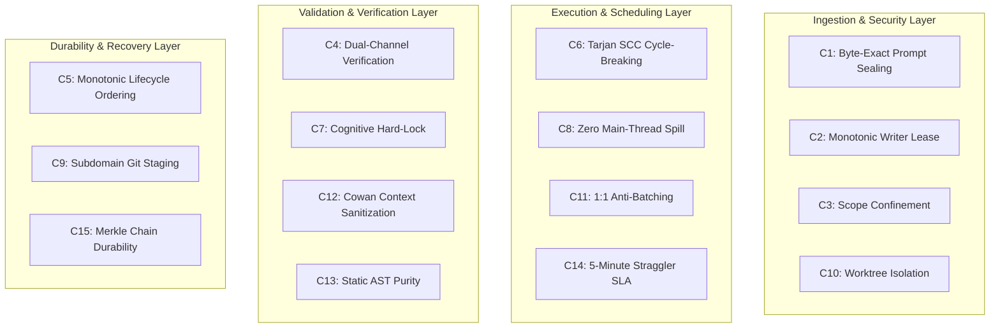
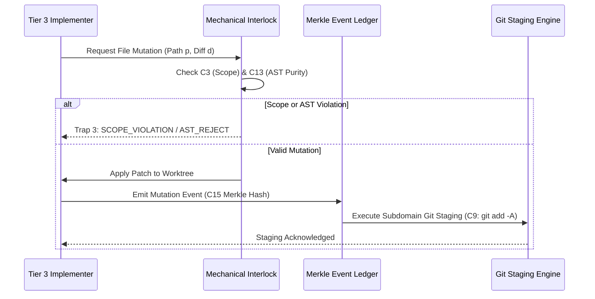

# The 4 Hard Zeros & Formal Invariant Catalog

---

[Previous: 01-01 Zero-Assumption Philosophy](01-01-zero-assumption-philosophy.md) | [Chapter Index](index.md) | [All Chapters Index](../index.md) | [Next: 01-03 Deterministic State Machine](01-03-deterministic-capsule-state-machine.md)

---

## 1. Executive Overview

The OLT (Orchestrating Long Tasks) engine is architected around absolute invariant safety. In distributed autonomous engineering environments, unconstrained agents naturally degenerate into race conditions, state corruption, and silent hallucinations.

To eliminate these vulnerabilities, OLT establishes two layers of mechanical constraints:

1. **The 4 Hard Zeros ($Z_4$)**: Absolute negative constraints enforced across all tiers.
2. **The Formal Invariant Catalog ($\mathcal{C}_{1 \dots 15}$)**: Strict mathematical guarantees covering prompt ingestion, leasing, dual-channel verification, Merkle durability, and filesystem hygiene.

```text
+--------------------------------------------------------------------------------------------------+
│                                 THE OLT INVARIANT ARCHITECTURE                                   │
+--------------------------------------------------------------------------------------------------+
│                                                                                                  │
│   ┌────────────────────────────────────────────────────────────────────────────────────────┐     │
│   │                        THE 4 HARD ZEROS (Negative Constraints)                         │     │
│   │    [Zero Hallucination]   [Zero Silent Mutation]   [Zero Scope Drift]   [Zero Assump]  │     │
│   └───────────────────────────────────────────┬────────────────────────────────────────────┘     │
│                                               │                                                  │
│                                               ▼                                                  │
│   ┌────────────────────────────────────────────────────────────────────────────────────────┐     │
│   │                   THE FORMAL INVARIANT CATALOG (Positive Guarantees)                   │     │
│   │    C1: Byte-Exact Prompt Sealing             C8:  Zero Main-Thread Spill               │     │
│   │    C2: Monotonic Writer Lease                C9:  Subdomain Git Staging                │     │
│   │    C3: Strict Scope Confinement              C10: Out-of-Repo Worktree Isolation       │     │
│   │    C4: Dual-Channel Verification             C11: Strict 1:1 Anti-Batching             │     │
│   │    C5: Monotonic Lifecycle Ordering          C12: Cowan Context Budget Sanitization    │     │
│   │    C6: Tarjan SCC Cycle-Breaking             C13: Static AST Purity Enforcement        │     │
│   │    C7: Cognitive Validator Hard-Lock         C14: 5-Minute Straggler SLA Revocation    │     │
│   │                                              C15: Merkle Chain Durability              │     │
│   └────────────────────────────────────────────────────────────────────────────────────────┘     │
│                                                                                                  │
+--------------------------------------------------------------------------------------------------+
```

---

## 2. The 4 Hard Zeros ($Z_4$)

The 4 Hard Zeros represent absolute operational boundaries. A violation of any single Hard Zero triggers an immediate, uncatchable fatal trap, aborting the active execution wave and revoking the violating agent's authorization.

```text
+---------------------------+------------------------------------------+---------------------------+
| Invariant Identifier      | Operational Definition                   | Mechanical Trap           |
+---------------------------+------------------------------------------+---------------------------+
| Z_hallucination = 0       | Zero acceptance of unverified prose claims | Anti-Mock Binary Verifier |
+---------------------------+------------------------------------------+---------------------------+
| Z_mutation = 0            | Zero filesystem edits without event logs | Merkle Event Gate Interlock|
+---------------------------+------------------------------------------+---------------------------+
| Z_scope = 0               | Zero edits outside granted directory scopes| Path Confinement Guard    |
+---------------------------+------------------------------------------+---------------------------+
| Z_assumption = 0          | Zero implicit dependencies or hidden env | Live Diagnostic Probes    |
+---------------------------+------------------------------------------+---------------------------+
```

### 2.1 Zero Hallucination ($Z_{\text{hallucination}} = 0$)

Every claim of task completion, test pass, or interface rendering must be backed by a Class 1–4 falsifiable evidence receipt. Prose summaries asserting success without raw stdout receipts, non-zero exit codes, or valid image binary chunks are rejected fail-closed.

### 2.2 Zero Silent Mutation ($Z_{\text{mutation}} = 0$)

No file on disk may be created, modified, or deleted without:

1. Emitting an atomic mutation event record into `events.jsonl`.
2. Appending the event hash to the capsule SHA-256 Merkle chain.
3. Staging the modification into the git index via immediate `git add -A`.

### 2.3 Zero Out-of-Scope Edits ($Z_{\text{scope}} = 0$)

Every subagent is leased with an explicit target scope $\mathcal{S}_{\text{granted}} = \{p_1, p_2, \dots, p_k\}$. Any write or delete attempt targeting a path $p' \notin \mathcal{S}_{\text{granted}}$ is intercepted by the path confinement engine, raising `SCOPE_CONFINEMENT_VIOLATION`.

### 2.4 Zero Undocumented Assumptions ($Z_{\text{assumption}} = 0$)

Requirements must explicitly specify all preconditions, environment flags, runtime schemas, and external dependencies. Assumptions regarding compiler state, ambient environment variables, or tool existence are prohibited.

---

## 3. Formal Invariant Catalog ($\mathcal{C}_1 \dots \mathcal{C}_{15}$)



### Detailed Mathematical Specifications

#### $\mathcal{C}_1$: Byte-Exact Prompt Sealing & Ingestion

The user's initial prompt $P$ is ingested verbatim and sealed on disk under mode `0444` (read-only) before any scheduling or decomposition occurs:

$$\mathcal{M}_{\text{prompt}} = \Big\langle P, \; \text{SHA256}(P), \; 0444_{\text{octal}}, \; |P|_{\text{bytes}} \Big\rangle$$

Any subsequent tampering with `prompt.md` alters its SHA-256 digest, causing `doctor:preflight` to fail-closed.

#### $\mathcal{C}_2$: Monotonic Writer Lease Protocol

Every worker claiming task $T_i$ must obtain an exclusive, monotonic lease token:

$$\text{LeaseToken}(T_i, A_j, \tau) = \text{HMAC}_{K}\big( T_i \mathbin{\Vert} A_j \mathbin{\Vert} \tau \mathbin{\Vert} \text{seq}_k \big)$$

Where $\text{seq}_k > \text{seq}_{k-1}$. A write to capsule state is accepted if and only if the lease token matches the active holder under POSIX advisory `flock`.

#### $\mathcal{C}_3$: Strict Scope Confinement

Path confinement evaluates write targets against assigned scope:

$$\text{EvaluatePath}(p) = \begin{cases} \text{PERMIT} & \text{if } \exists s \in \mathcal{S}_{\text{granted}} : p \subseteq s \land \forall f \in \mathcal{S}_{\text{forbidden}} : p \nsubseteq f \\ \text{DENY} & \text{otherwise} \end{cases}$$

#### $\mathcal{C}_4$: Dual-Channel Verification Interlock

A task cannot transition to `COMPLETED` without simultaneous satisfaction across cognitive and mechanical verification channels:

$$\text{Satisfied}(T_i) \iff \big(\text{CognitiveVerdict}(T_i) = \text{PASS}\big) \land \big(\text{ExitCode}(\text{CheckCmd}) = 0\big) \land \big(\text{ASTViolations} = 0\big)$$

#### $\mathcal{C}_5$: Monotonic Lifecycle Ordering

Let $\mathcal{L}$ be the strictly ordered set of lifecycle states:

$$\text{INIT} \prec \text{ADMITTED} \prec \text{PLANNING} \prec \text{EXECUTING} \prec \text{VALIDATING} \prec \text{COMPLETED}$$

$$\forall t_1 < t_2, \quad \text{State}(t_1) \preceq_{\mathcal{L}} \text{State}(t_2)$$

Backward lifecycle rollbacks are strictly forbidden. Regression repairs are modeled as forward-directed repair waves.

#### $\mathcal{C}_6$: Tarjan SCC Cycle-Breaking & Kahn Toposort

The task graph $G = (V, E)$ must be a Directed Acyclic Graph (DAG). If cycles exist ($|\text{SCC}(G)| > 1$), Tarjan's SCC algorithm identifies the cycle $C \subseteq V$, and the scheduler breaks the cycle at the lowest priority edge $e_{\text{min}} = \arg\min_{e \in C} \text{Weight}(e)$:

$$G' = (V, E \setminus \{e_{\text{min}}\})$$

#### $\mathcal{C}_7$: Cognitive Validator Command Hard-Lock

Validator agents auditing code are mechanically locked from executing terminal commands:

$$\text{Role}(A) = \text{Validator} \implies \text{CommandExecution}(A) \equiv \emptyset$$

Validation is purely cognitive and AST-driven, preventing compromised validators from masking implementation defects.

#### $\mathcal{C}_8$: Zero Main-Thread Spill (Quiet Mandate)

All subagent communications, status ticks, and diagnostics must be routed to `.olt/telemetry.jsonl` and individual mailboxes `.olt/mailbox/<agent_id>/`. The interactive user channel remains completely silent during autonomous waves.

#### $\mathcal{C}_9$: Subdomain Git Staging & Reflog Safety

Immediately upon completing any discrete documentation, test, or code unit, the system must execute:

$$\text{Exec}(\texttt{"git add -A"})$$

This guarantees that all intermediate progress is preserved in the git reflog and index, preventing state loss across agent resets.

#### $\mathcal{C}_{10}$: Out-of-Repo Worktree Isolation

Parallel implementers operate within dedicated out-of-repo worktrees located under `.olt/worktrees/<task_id>/`. Direct mutations to the main repository workspace during concurrent waves are prohibited.

#### $\mathcal{C}_{11}$: Strict 1:1 Anti-Batching

An implementer agent may only be assigned exactly one discrete task per lease cycle:

$$|\text{AssignedTasks}(A_i)| \equiv 1$$

Multi-task bundling ("batching") is prohibited to prevent cascading failure blast radiuses.

#### $\mathcal{C}_{12}$: Cowan Context Budget Sanitization ($<150{,}000$ Tokens)

Stdout streams and reference manuals entering LLM context are sanitized and capped:

$$\text{TokenCount}(\text{ContextPayload}) \le 150{,}000 \text{ Cowan Tokens}$$

#### $\mathcal{C}_{13}$: Static AST Purity Enforcement

Every TypeScript source file must pass AST static analysis:

- Zero implicit or explicit `any` types.
- Zero `@ts-ignore` or `@ts-expect-error` suppressions.
- Line budget: $\text{Lines}(F) \le 300$ for code files, $250 \le \text{Lines}(D) \le 800$ for docs.
- Directory fanout: $\text{Children}(\text{Dir}) \le 10$.

#### $\mathcal{C}_{14}$: 5-Minute Straggler SLA Revocation

Any task leased to a worker without a heartbeat update for $\Delta t > 300\text{s}$ is marked as a straggler:

$$\text{Now}() - \text{LastHeartbeat}(T_i) > 300\text{s} \implies \text{RevokeLease}(T_i) \land \text{Requeue}(T_i)$$

#### $\mathcal{C}_{15}$: SHA-256 Merkle Chain Durability

Every event $e_k$ appended to `events.jsonl` incorporates the cryptographic hash of the preceding event:

$$h_0 = \text{SHA256}(\text{CapsuleManifest})$$
$$h_k = \text{SHA256}\big( h_{k-1} \mathbin{\Vert} \text{CanonicalJSON}(e_k) \big)$$

---

## 4. Invariant Enforcement Architecture



---

[Previous: 01-01 Zero-Assumption Philosophy](01-01-zero-assumption-philosophy.md) | [Chapter Index](index.md) | [All Chapters Index](../index.md) | [Next: 01-03 Deterministic State Machine](01-03-deterministic-capsule-state-machine.md)

---
