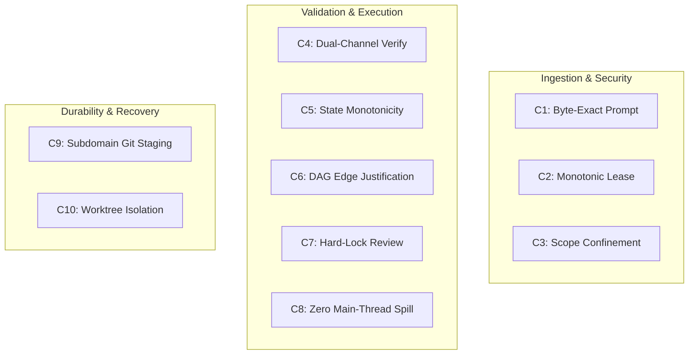

# The 4 Hard Zeros & Formal Invariant Catalog

[OLT Documentation Hub](../../README.md) > [Architecture Index](../index.md) > [Chapter 01](./index.md) > 01-02 Hard Zeros & Invariants

---

[⏮️ Previous: 01-01 Zero-Assumption Philosophy](01-01-zero-assumption-philosophy.md) | [📂 Chapter Index](index.md) | [📚 All Chapters Index](../index.md) | [⏭️ Next: 01-03 Deterministic State Machine](01-03-deterministic-capsule-state-machine.md)
---

## 1. The 4 Hard Zeros

OLT establishes four absolute negative constraints known as the **4 Hard Zeros**. A single violation of any Hard Zero immediately aborts execution and revokes agent leases.

```text
┌─────────────────────────────────────────────────────────────────────────────┐
│                             THE 4 HARD ZEROS                                │
├───────────────────────────┬─────────────────────────────────────────────────┤
│ 1. Zero Hallucination     │ Zero acceptance of unverified prose claims.     │
│ 2. Zero Silent Mutation   │ Zero filesystem changes without event receipts. │
│ 3. Zero Out-of-Scope Edit │ Zero edits outside assigned directory scopes.   │
│ 4. Zero Undocumented Assm │ Zero implicit dependencies or hidden configs.   │
└───────────────────────────┴─────────────────────────────────────────────────┘
```

### 1.1 Zero Hallucination

Every factual assertion regarding code behavior, compilation status, or test pass rates must be backed by a Class 1–4 falsifiable evidence receipt.

### 1.2 Zero Silent Mutation

No file on disk may be created, modified, or deleted without generating an atomic transaction event in `events.jsonl` and staging the modification into git index via `git add -A`.

### 1.3 Zero Out-of-Scope Edits

Agents are leased with an explicit target scope $\mathcal{S} = \{p_1, p_2, \dots, p_k\}$. Any write attempt to a path $p' \notin \mathcal{S}$ is blocked by the path confinement engine with `SCOPE_CONFINEMENT_VIOLATION`.

### 1.4 Zero Undocumented Assumptions

Requirements must explicitly specify all preconditions, environment flags, and schema dependencies. Implicit environment assumptions are treated as preplanning defects.

---

## 2. Formal Invariant Catalog ($C_1 \dots C_{10}$)



### Deep Mathematical Specifications

#### $C_1$: Byte-Exact Prompt Sealing

$$\mathcal{M}_{\text{prompt}} = \left\{ \text{raw}: P, \text{sha256}: \text{SHA256}(P), \text{mode}: 0444, \text{len}: |P| \right\}$$
The user prompt is written to disk at `manifest.prompt_file` with Unix mode `0444` (read-only) and hashed before any agent parses it.

#### $C_2$: Monotonic Writer Lease

$$\text{LeaseToken} = \text{HMAC}_{K}(\text{task\_id} \mathbin{\Vert} \text{agent\_id} \mathbin{\Vert} \text{lease\_seq})$$
Only the bearer of the highest monotonic lease sequence $\text{seq} > \text{seq}_{\text{current}}$ holding the POSIX advisory `flock` lock may mutate task records.

#### $C_3$: Scope Confinement

$$\text{PathPolicy}(p) = \begin{cases} \text{ALLOW} & \text{if } \exists s \in \mathcal{S}_{\text{granted}} : p \in s \land \forall f \in \mathcal{S}_{\text{forbidden}} : p \notin f \\ \text{DENY} & \text{otherwise} \end{cases}$$

#### $C_4$: Dual-Channel Verification

A task cannot transition to `verified` without simultaneous satisfaction of both cognitive and mechanical validation channels:
$$\text{Verified}(T) \iff (\text{ValidatorVerdict} = \text{"pass"}) \land (\text{ExitCode}(\text{CheckCmd}) = 0) \land (\text{ASTViolations} = 0)$$

#### $C_5$: State Monotonicity

Let $\mathcal{L}$ be the total order of lifecycle phases:
$$\text{init} < \text{planning} < \text{planned} < \text{executing} < \text{validating} < \text{completed}$$
$$\forall t_1 < t_2, \quad \text{Phase}(S(t_1)) \le_{\mathcal{L}} \text{Phase}(S(t_2))$$
State rollbacks are strictly forbidden. Regressions trigger repair branches rather than backward state mutation.

---

[⏮️ Previous: 01-01 Zero-Assumption Philosophy](01-01-zero-assumption-philosophy.md) | [📂 Chapter Index](index.md) | [📚 All Chapters Index](../index.md) | [⏭️ Next: 01-03 Deterministic State Machine](01-03-deterministic-capsule-state-machine.md)
---
