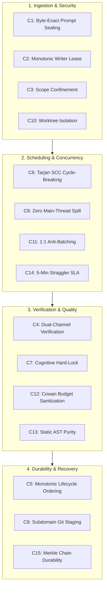
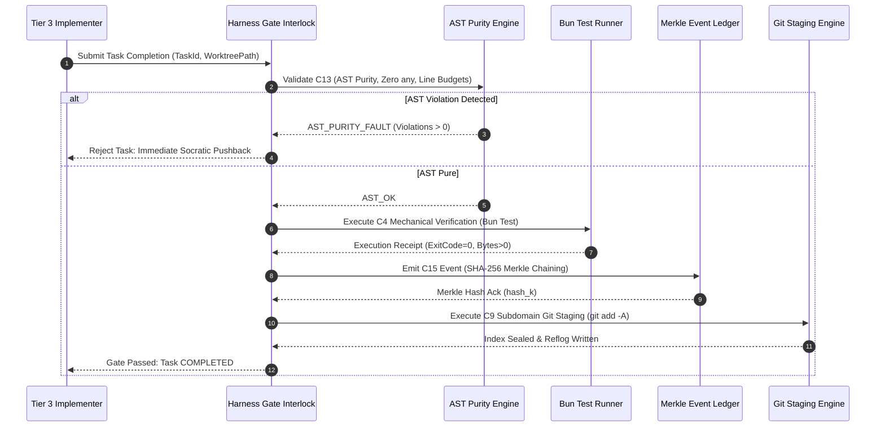

# The Hard Zeros & Positive Invariant Catalog

---

[Previous: 01-01 Zero-Assumption Philosophy](01-01-zero-assumption-philosophy.md) | [Chapter Index](index.md) | [All Chapters Index](../index.md) | [Next: 01-03 Deterministic Capsule State Machine](01-03-deterministic-capsule-state-machine.md)

---

## 1. Executive Overview

In autonomous distributed engineering systems, unconstrained agents naturally degenerate into race conditions, state drift, corrupted reflogs, and silent hallucinations. Left to statistical token generation alone, multi-agent frameworks lack the boundary guarantees necessary for mission-critical software production.

To eliminate these vulnerabilities, the OLT (Orchestrating Long Tasks) architecture imposes a dual-layer mechanical containment model:

1. **The Extended Hard Zeros ($Z_8$)**: Absolute negative boundary conditions enforced across all agent tiers and operational phases.
2. **The Formal Positive Invariant Catalog ($\mathcal{C}_{1 \dots 15}$)**: Strict mathematical and structural guarantees governing prompt ingestion, monotonic leasing, DAG cycle elimination, dual-channel verification, and cryptographic durability.

```text
+--------------------------------------------------------------------------------------------------+
│                                 THE OLT INVARIANT LATTICE ARCHITECTURE                           │
+--------------------------------------------------------------------------------------------------+
│                                                                                                  │
│   ┌────────────────────────────────────────────────────────────────────────────────────────┐     │
│   │                        THE EXTENDED HARD ZEROS (Negative Bounds)                       │     │
│   │   Z_kill=0         Z_mutation=0      Z_dump=0            Z_emoji=0                     │     │
│   │   Z_broken_link=0  Z_unvalidated=0   Z_unstaged_crash=0  Z_fabrication=0               │     │
│   └───────────────────────────────────────────┬────────────────────────────────────────────┘     │
│                                               │                                                  │
│                                               ▼                                                  │
│   ┌────────────────────────────────────────────────────────────────────────────────────────┐     │
│   │                   THE POSITIVE INVARIANT CATALOG (System Guarantees)                   │     │
│   │   C1: Byte-Exact Prompt Sealing             C9:  Subdomain Git Staging                 │     │
│   │   C2: Monotonic Writer Lease                C10: Out-of-Repo Worktree Isolation        │     │
│   │   C3: Strict Scope Confinement              C11: Strict 1:1 Anti-Batching              │     │
│   │   C4: Dual-Channel Verification             C12: Cowan Context Budget (<150k tokens)   │     │
│   │   C5: Monotonic Lifecycle Ordering          C13: Static AST Purity Enforcement         │     │
│   │   C6: Tarjan SCC Cycle-Breaking             C14: 5-Minute Straggler SLA Revocation     │     │
│   │   C7: Cognitive Validator Hard-Lock         C15: SHA-256 Merkle Chain Durability       │     │
│   │   C8: Zero Main-Thread Spill                                                           │     │
│   └────────────────────────────────────────────────────────────────────────────────────────┘     │
│                                                                                                  │
+--------------------------------------------------------------------------------------------------+
```

---

## 2. Exhaustive Formulation of the Extended Hard Zeros ($Z_8$)

The Hard Zeros represent inviolable operational constraints. Any breach triggers a non-catchable fatal trap, aborting the active transaction and revoking the agent lease.

```text
+--------------------------------------------------------------------------------------------------+
│                                    THE HARD ZEROS SPECIFICATION                                  │
+-----------------------+------------------------------------------+-------------------------------+
│ Identifier            │ Operational Definition                   │ Mechanical Trap & Enforcer    │
+-----------------------+------------------------------------------+-------------------------------+
│ Z_kill = 0            │ Zero ungraceful or untracked worker kills│ Supervisor SIGTERM Watchdog   │
│ Z_mutation = 0        │ Zero ungranted mutations by supervisors  │ Fail-Closed RBAC Interlock    │
│ Z_dump = 0            │ Zero uncurated raw source dumps to LLM   │ Cowan Context Sanitizer       │
│ Z_emoji = 0           │ Zero emojis across docs, logs, and code  │ Unicode UTF-8 AST Linter      │
│ Z_broken_link = 0     │ 100% relative link integrity on disk     │ Graph Link Integrity Suite    │
│ Z_unvalidated = 0     │ Zero unvalidated task completions        │ Dual-Channel Verification Gate│
│ Z_unstaged_crash = 0  │ Zero unstaged changes on agent exit      │ Subdomain Git Staging Trigger │
│ Z_fabrication = 0     │ Zero synthetic mocks or phantom diffs    │ Anti-Mock Binary Inspector    │
+-----------------------+------------------------------------------+-------------------------------+
```

### 2.1 $Z_{\text{kill}} = 0$: Zero Orphaned Worker Kills

Subagent processes cannot be terminated abruptly without lifecycle accounting. If a worker must be stopped, the supervisor issues a graceful shutdown sequence via the mailbox, flushes telemetry, and reclaims locks:

$$\text{Terminated}(A) \implies \text{Flushed}(\text{Telemetry}_A) \land \text{Released}(\text{Lock}_A) \land \text{Recorded}(\text{Event}_{\text{killed}})$$

### 2.2 $Z_{\text{mutation}} = 0$: Zero Ungranted Supervisor Mutations

Supervisors (Tier 0 Mind, Tier 1 Orchestrator, Tier 2 Coordinator) are strictly read-only relative to the target codebase. All write operations must be dispatched to Tier 3 Implementers:

$$\text{Role}(A) \in \{\text{Mind}, \text{Orchestrator}, \text{Coordinator}\} \implies \forall f \in \mathcal{F}_{\text{src}}, \quad \text{Write}(A, f) = \bot$$

### 2.3 $Z_{\text{dump}} = 0$: Zero Monolithic Context Dumps

Injecting entire codebases or unindexed file dumps into LLM context windows causes severe cognitive degradation. The harness sanitizes all context payloads, ensuring token bounds remain strictly below the Cowan budget:

$$\text{Tokens}(\text{Payload}_{\text{LLM}}) \le 150{,}000 \text{ Cowan Tokens}$$

### 2.4 $Z_{\text{emoji}} = 0$: Zero Unicode Emoji Invariant

Technical documentation, logs, commit messages, and source code must be entirely free of pictorial emojis. Enforced via automated AST and UTF-8 code point filters:

$$\forall c \in \text{TextDocument}, \quad \text{UnicodeCategory}(c) \notin \{\text{So}, \text{Sk}_{\text{emoji}}\}$$

### 2.5 $Z_{\text{broken\_link}} = 0$: 100% Link Integrity

Every relative markdown link, file reference, and symbol path must resolve to a valid, existing on-disk file:

$$\forall \ell \in \text{Links}(\text{Docs}), \quad \text{FileExists}(\text{ResolvePath}(\ell)) \equiv \text{True}$$

### 2.6 $Z_{\text{unvalidated}} = 0$: Zero Unvalidated Completions

No task may transition to `COMPLETED` without dual-channel cognitive and mechanical validation receipts.

### 2.7 $Z_{\text{unstaged\_crash}} = 0$: Zero Unstaged Crash Vulnerability

Every unit of progress must be immediately staged to the Git index (`git add -A`), eliminating dirty working tree exposure in the event of mid-flight agent termination.

### 2.8 $Z_{\text{fabrication}} = 0$: Zero Synthetic Fabrication

Agents cannot fabricate test outcomes, pass strings, or mock external services to satisfy verification gates. All evidence must derive from real child process executions.

---

## 3. The Formal Positive Invariant Catalog ($\mathcal{C}_1 \dots \mathcal{C}_{15}$)



### Detailed Mathematical Formulations

#### $\mathcal{C}_1$: Byte-Exact Prompt Sealing & Ingestion

The raw user prompt $P$ is ingested verbatim, written to `prompt.md`, and marked read-only (`chmod 0444`):

$$\mathcal{M}_{\text{prompt}} = \Big\langle P, \; \text{SHA256}(P), \; 0444_{\text{octal}}, \; |P|_{\text{bytes}} \Big\rangle$$

#### $\mathcal{C}_2$: Monotonic Writer Lease Protocol

Every task $T_i$ claimed by worker $A_j$ generates a monotonically incrementing lease HMAC token:

$$\text{LeaseToken}(T_i, A_j, \tau) = \text{HMAC}_K\big( T_i \mathbin{\Vert} A_j \mathbin{\Vert} \tau \mathbin{\Vert} \text{seq}_k \big), \quad \text{seq}_k > \text{seq}_{k-1}$$

#### $\mathcal{C}_3$: Strict Scope Confinement

Path confinement evaluates write targets against granted and forbidden path sets:

$$\text{PathPermitted}(p) \iff \Big( \exists s \in \mathcal{S}_{\text{granted}} : p \subseteq s \Big) \land \Big( \forall f \in \mathcal{S}_{\text{forbidden}} : p \nsubseteq f \Big)$$

#### $\mathcal{C}_4$: Dual-Channel Verification Interlock

A task requires simultaneous satisfaction of cognitive and mechanical verification channels:

$$\text{GatePassed}(T_i) \iff \big(\text{CognitiveVerdict}(T_i) = \text{PASS}\big) \land \big(\text{ExitCode}(\text{Runner}) = 0\big) \land \big(\text{ASTFaults} = 0\big)$$

#### $\mathcal{C}_5$: Monotonic Lifecycle Ordering

Lifecycle states form a strict partially ordered set under transitive relation $\prec_{\mathcal{L}}$:

$$\text{INIT} \prec \text{ADMITTED} \prec \text{PLANNING} \prec \text{EXECUTING} \prec \text{VALIDATING} \prec \text{COMPLETED}$$

#### $\mathcal{C}_6$: Tarjan SCC Cycle-Breaking & Kahn Toposort

If the dependency graph contains strongly connected components ($|\text{SCC}(G)| > 1$), the cycle is broken by eliminating the minimal-weight edge:

$$e_{\text{cut}} = \arg\min_{e \in \text{Cycle}} \text{Weight}(e), \quad G' = (V, E \setminus \{e_{\text{cut}}\})$$

#### $\mathcal{C}_7$: Cognitive Validator Command Hard-Lock

Validator subagents auditing implementation correctness are mechanically stripped of terminal execution privileges:

$$\text{Role}(A) = \text{Validator} \implies \text{PermittedTools}(A) \cap \{\text{run\_command}, \text{exec}\} \equiv \emptyset$$

#### $\mathcal{C}_8$: Zero Main-Thread Spill (Quiet Mandate)

Interactive user streams receive zero raw subagent chatter. All telemetry routes to `.olt/telemetry.jsonl` and actor mailboxes `.olt/mailbox/<actor_id>/`.

#### $\mathcal{C}_9$: Subdomain Git Staging & Reflog Safety

Upon completion of every coherent task unit, the workspace executes atomic staging:

$$\Delta \mathcal{W} \neq \emptyset \implies \text{Exec}(\texttt{"git add -A"})$$

#### $\mathcal{C}_{10}$: Out-of-Repo Worktree Isolation

Parallel workers operate in hermetic worktrees under `.olt/worktrees/<task_id>/`, never touching the root workspace concurrently.

#### $\mathcal{C}_{11}$: Strict 1:1 Anti-Batching

A worker is leased exactly one discrete task per execution wave:

$$|\text{ActiveTasks}(A_i)| \equiv 1$$

#### $\mathcal{C}_{12}$: Cowan Context Budget Sanitization

Dynamic outputs entering agent context are truncated, sanitized, and bound to $< 150{,}000$ tokens.

#### $\mathcal{C}_{13}$: Static AST Purity Enforcement

TypeScript files must satisfy AST constraints: zero `any`, zero suppressions, source lines $\le 300$, documentation lines $\in [250, 800]$, directory child count $\le 10$.

#### $\mathcal{C}_{14}$: 5-Minute Straggler SLA Revocation

Heartbeats are monitored every 30 seconds. Inactivity exceeding 300 seconds triggers lease reclamation:

$$\text{Now}() - \text{LastHeartbeat}(T_i) > 300\text{s} \implies \text{RevokeLease}(T_i) \land \text{Requeue}(T_i)$$

#### $\mathcal{C}_{15}$: SHA-256 Merkle Chain Durability

Events appended to `events.jsonl` are cryptographically chained:

$$h_0 = \text{SHA256}(\text{manifest.json}), \quad h_k = \text{SHA256}\big( h_{k-1} \mathbin{\Vert} \text{CanonicalJSON}(e_k) \big)$$

---

## 4. Mechanical Interlock Verification Sequence



---

## 5. Invariant Engine TypeScript Contracts

```typescript
export enum InvariantErrorCode {
  KILL_UNTRACKED = "ERR_Z_KILL_VIOLATION",
  MUTATION_UNAUTHORIZED = "ERR_Z_MUTATION_SUPERVISOR_DENIED",
  CONTEXT_OVERFLOW = "ERR_Z_DUMP_COWAN_EXCEEDED",
  EMOJI_DETECTED = "ERR_Z_EMOJI_FOUND",
  BROKEN_LINK = "ERR_Z_BROKEN_LINK_FOUND",
  UNVALIDATED_MERGE = "ERR_Z_UNVALIDATED_COMPLETION",
  UNSTAGED_CRASH = "ERR_Z_UNSTAGED_PROGRESS",
  SYNTHETIC_MOCK = "ERR_Z_FABRICATION_MOCK_TRAP",
  SCOPE_VIOLATION = "ERR_C3_SCOPE_CONFINEMENT",
  SLA_TIMEOUT = "ERR_C14_STRAGGLER_REVOCATION",
  MERKLE_MISMATCH = "ERR_C15_MERKLE_CHAIN_BROKEN",
}

export interface InvariantDefinition {
  readonly id: string;
  readonly name: string;
  readonly category: "Ingestion" | "Scheduling" | "Verification" | "Durability";
  readonly isHardZero: boolean;
  readonly errorCode: InvariantErrorCode;
}

export interface InvariantCheckContext {
  readonly taskId: string;
  readonly actorRole: "Mind" | "Orchestrator" | "Coordinator" | "Implementer" | "Validator";
  readonly targetPaths: readonly string[];
  readonly grantedScope: readonly string[];
  readonly forbiddenScope: readonly string[];
  readonly lastHeartbeatMs: number;
  readonly currentTokenCount: number;
}

export interface InvariantViolation {
  readonly invariantId: string;
  readonly errorCode: InvariantErrorCode;
  readonly severity: "FATAL_TRAP" | "LEASE_REVOCATION" | "REJECT_MUTATION";
  readonly message: string;
  readonly timestamp: string;
}

export class InvariantEngine {
  public static evaluateScopeConfinement(
    targetPath: string,
    granted: readonly string[],
    forbidden: readonly string[],
  ): boolean {
    const isGranted = granted.some((g) => targetPath.startsWith(g));
    const isForbidden = forbidden.some((f) => targetPath.startsWith(f));
    return isGranted && !isForbidden;
  }

  public static evaluateHeartbeatSLA(lastHeartbeatMs: number, maxSlaMs: number = 300_000): boolean {
    const elapsed = Date.now() - lastHeartbeatMs;
    return elapsed <= maxSlaMs;
  }

  public static evaluateCowanBudget(tokenCount: number, limit: number = 150_000): boolean {
    return tokenCount <= limit;
  }

  public static assertSupervisorMutationGuard(role: string, targetPaths: readonly string[]): void {
    const supervisoryRoles = ["Mind", "Orchestrator", "Coordinator"];
    if (supervisoryRoles.includes(role) && targetPaths.length > 0) {
      throw new Error(
        `${InvariantErrorCode.MUTATION_UNAUTHORIZED}: Supervisory role ${role} cannot mutate code.`,
      );
    }
  }
}
```

---

## 6. Boundary Conditions & Edge Case Recovery

```text
+--------------------------------------------------------------------------------------------------+
│                                  INVARIANT BOUNDARY RECOVERY MATRIX                              │
+------------------------------+------------------------------------+------------------------------+
│ Boundary Condition           │ Invariant Impact                   │ Mechanical Recovery Action   │
+------------------------------+------------------------------------+------------------------------+
│ Straggler Worker Timeout     │ C14 (SLA > 300s breached)          │ Reclaim POSIX lock, reset    │
│                              │                                    │ task state to PENDING, retry │
+------------------------------+------------------------------------+------------------------------+
│ Cycle in User Prompt DAG     │ C6 (Tarjan SCC > 1 component)      │ Minimal-weight edge cut, log │
│                              │                                    │ DAG_CYCLE_RESOLVED event     │
+------------------------------+------------------------------------+------------------------------+
│ Worker Out-of-Scope Write    │ C3 (Scope confinement violation)   │ Atomic git checkout rollback │
│                              │                                    │ of untracked changes         │
+------------------------------+------------------------------------+------------------------------+
│ Missing Merkle Hash Chaining │ C15 (Merkle chain corrupted)       │ Execute torn-tail recovery,  │
│                              │                                    │ recompute fold from hash_0   │
+------------------------------+------------------------------------+------------------------------+
│ Dirty Tree on Process Kill   │ C9 / Z_unstaged_crash              │ Trigger git add -A in work-  │
│                              │                                    │ tree and seal in loose blob  │
+------------------------------+------------------------------------+------------------------------+
```

---

[Previous: 01-01 Zero-Assumption Philosophy](01-01-zero-assumption-philosophy.md) | [Chapter Index](index.md) | [All Chapters Index](../index.md) | [Next: 01-03 Deterministic Capsule State Machine](01-03-deterministic-capsule-state-machine.md)

---
