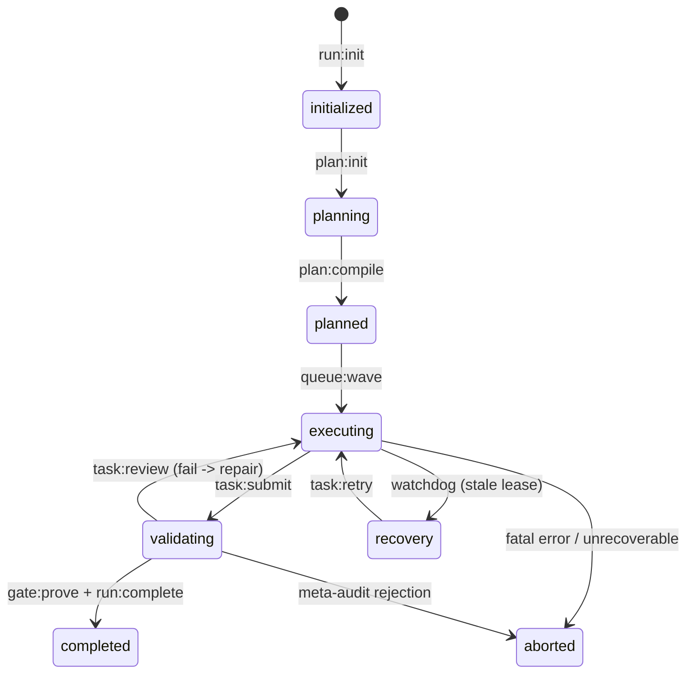

# Deterministic Capsule State Machine & Event Sourcing

[OLT Documentation Hub](../../README.md) > [Architecture Index](../index.md) > [Chapter 01](./index.md) > 01-03 Deterministic State Machine

---

[⏮️ Previous: 01-02 The Hard Zeros & Invariants](01-02-the-hard-zeros-and-invariants.md) | [📂 Chapter Index](index.md) | [📚 All Chapters Index](../index.md) | [⏭️ Next: 01-04 Reflog Safety & Git Staging](01-04-reflog-safety-and-git-staging.md)
---

## 1. Capsule State Space & Monotonicity

The OLT execution runtime is modeled as a **Deterministic Finite State Machine with Event-Sourced Projections**. The system state $S$ at any discrete step $n$ is defined over the state space:

$$S \in \Sigma = \{\text{initialized}, \text{planning}, \text{planned}, \text{executing}, \text{validating}, \text{completed}, \text{aborted}, \text{recovery}\}$$



---

## 2. Formal Transition Matrix

The transition function $\delta: \Sigma \times \mathcal{E} \to \Sigma$ is strictly deterministic and fail-closed:

| Current State $S_i$ | Event Trigger $E$       | Next State $S_{i+1}$           | Preconditions & Invariant Checks                                              | Exit Code on Failure           |
| :------------------ | :---------------------- | :----------------------------- | :---------------------------------------------------------------------------- | :----------------------------- |
| **`initialized`**   | `plan:init`             | **`planning`**                 | $C_1$: Prompt sealed mode `0444`, SHA-256 recorded in manifest.               | Exit 3 (`INVALID_ARGUMENT`)    |
| **`planning`**      | `plan:compile`          | **`planned`**                  | 100% prompt line coverage verified; DAG is cycle-free (Tarjan SCC).           | Exit 3 (`PLAN_NOT_COMPILED`)   |
| **`planned`**       | `queue:wave`            | **`executing`**                | Independent plan validator approved; wave $W_0$ disjoint scopes verified.     | Exit 3 (`PHASE_NOT_READY`)     |
| **`executing`**     | `task:submit`           | **`validating`**               | $C_9$: `git add -A` clean; all assigned files modified within scope $C_3$.    | Exit 3 (`DIRTY_STAGING`)       |
| **`validating`**    | `task:review (pass)`    | **`executing` / `validating`** | Dual-channel pass: AST purity clean ($C_7$) + test binary exit code 0.        | Exit 3 (`VERIFICATION_FAILED`) |
| **`validating`**    | `gate:prove + complete` | **`completed`**                | Completeness critic signed off; all requirements covered by Class 1–4 proofs. | Exit 3 (`GATE_PROVE_FAILED`)   |
| **`executing`**     | `lease_timeout`         | **`recovery`**                 | Watchdog detects heartbeat expiration ($T_{\text{hb}} > 90\text{s}$).         | Exit 4 (`LOCK_TIMEOUT`)        |
| **`recovery`**      | `task:retry`            | **`executing`**                | Zombie process reaped; monotonic lease sequence incremented.                  | Exit 3 (`RETRY_EXHAUSTED`)     |

---

## 3. Idempotent Event Replay Algorithm

State is never directly edited on disk; `state.json` is a materialized view derived from the append-only event log `events.jsonl`.

```text
                              EVENT-SOURCED STATE FOLD
  events.jsonl
 ┌────────────────────────────────────────────────────────────────────────┐
 │ E0: run-initialized    --> S0 = { status: "initialized", tasks: [] }   │
 │ E1: prompt-sealed      --> S1 = { status: "planning", prompt_sha: ...} │
 │ E2: dag-compiled       --> S2 = { status: "planned", waves: [...] }    │
 │ E3: task-claimed       --> S3 = { status: "executing", leased: t1 }    │
 └────────────────────────────────────────────────────────────────────────┘
                                    │
                                    ▼ (Deterministic Replay)
                             state.json (Materialized Projection)
```

### Mathematical State Fold Formulation

Let $E = [e_1, e_2, \dots, e_n]$ be the sequential event log. The state $S_n$ is computed via the fold operation:

$$S_n = \text{foldl}(\delta, S_0, E) = \delta(\dots \delta(\delta(S_0, e_1), e_2) \dots, e_n)$$

If `state.json` is corrupted or deleted, the runtime executes a complete reconstruction from zero by replaying `events.jsonl` through the deterministic mutator engine.

---

[⏮️ Previous: 01-02 The Hard Zeros & Invariants](01-02-the-hard-zeros-and-invariants.md) | [📂 Chapter Index](index.md) | [📚 All Chapters Index](../index.md) | [⏭️ Next: 01-04 Reflog Safety & Git Staging](01-04-reflog-safety-and-git-staging.md)
---
