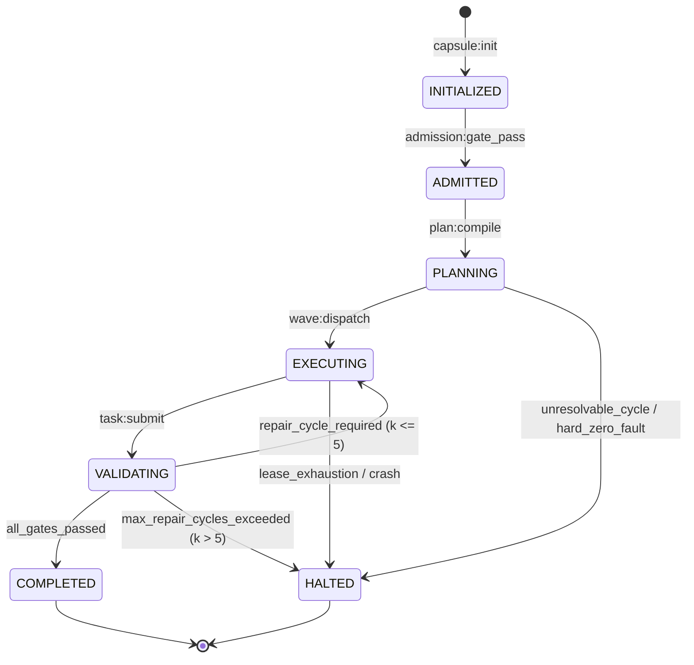
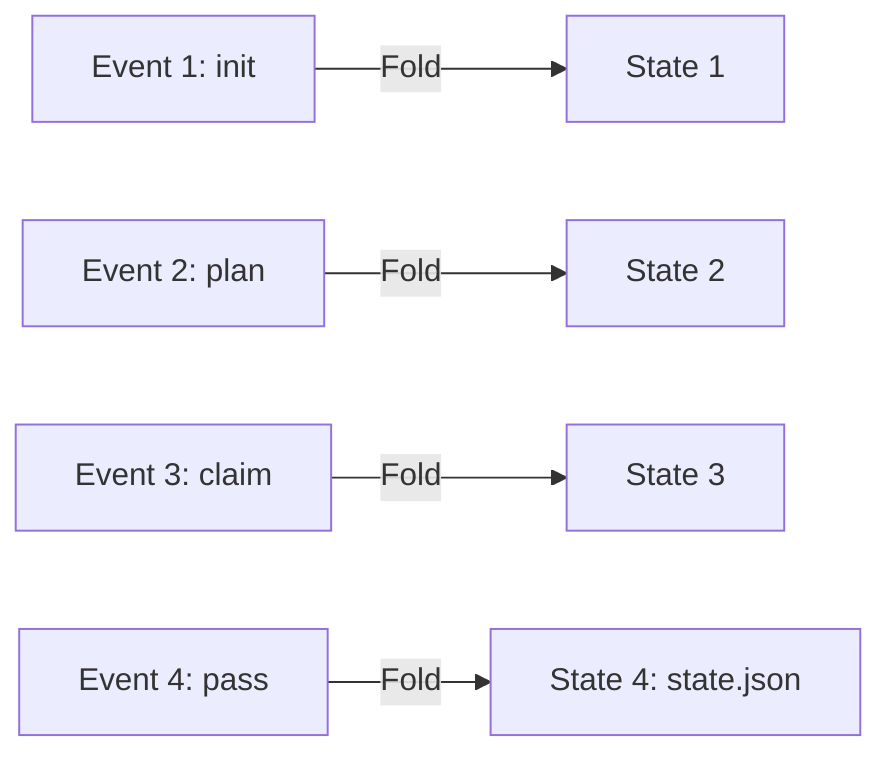

# Deterministic Capsule State Machine

---

[Previous: 01-02 The Hard Zeros & Invariants](01-02-the-hard-zeros-and-invariants.md) | [Chapter Index](index.md) | [All Chapters Index](../index.md) | [Next: 01-04 Reflog Safety & Git Staging](01-04-reflog-safety-and-git-staging.md)

---

## 1. Executive Summary & SSoT Architecture

In standard orchestrator systems, runtime state is maintained in volatile memory or unstructured database tables. When an agent process crashes, restarts, or loses network connectivity, state becomes ambiguous, leading to torn transactions, duplicate worker leases, and orphaned tasks.

The OLT (Orchestrating Long Tasks) engine implements a Deterministic Capsule State Machine. Under this architecture:

1. **The Capsule is the Single Source of Truth (SSoT)**: All runtime metadata, requirements, task graphs, worker leases, and validation receipts reside on disk within an isolated capsule directory: `.olt/capsules/<slug>/`.
2. **Event-Sourced State Reconstruction**: The active state $S_t$ at any timestamp $t$ is computed as a deterministic fold over the append-only, Merkle-chained event ledger:

$$S_t = \mathcal{F}_{\text{project}}\big(S_0, [e_1, e_2, \dots, e_t]\big)$$

```text
+--------------------------------------------------------------------------------------------------+
│                               CAPSULE DIRECTORY ON-DISK STRUCTURE                                │
+--------------------------------------------------------------------------------------------------+
│                                                                                                  │
│   .olt/capsules/<slug>/                                                                          │
│   ├── manifest.json              # Immutable capsule identity & prompt SHA-256 digest             │
│   ├── prompt.md                  # Verbatim ingested prompt (Unix mode 0444 read-only)           │
│   ├── state.json                 # Materialized projection of current lifecycle state             │
│   ├── events.jsonl               # Append-only, Merkle-hashed chronological event ledger         │
│   ├── mailbox/                   # Inter-agent communication queues                               │
│   │   ├── orch-main/             # Tier 1 Orchestrator incoming/outgoing message queue            │
│   │   └── coord-graph/           # Tier 2 Coordinator mailbox queue                               │
│   └── locks/                     # POSIX flock advisory concurrency locks                         │
│       ├── writer.lock            # Exclusive writer lease lock token                              │
│       └── observer.lock          # Concurrent reader inspection lock token                        │
│                                                                                                  │
+--------------------------------------------------------------------------------------------------+
```

---

## 2. Formal Lifecycle State Machine

The capsule progresses through seven discrete, monotonically ordered operational states:

$$\Sigma = \big\{ \text{INITIALIZED}, \; \text{ADMITTED}, \; \text{PLANNING}, \; \text{EXECUTING}, \; \text{VALIDATING}, \; \text{COMPLETED}, \; \text{HALTED} \big\}$$



### State Transition Specifications

```text
+-----------------+----------------------------------+---------------------------------------------+
| State           | Entry Invariant                  | Exit Condition / Event                      |
+-----------------+----------------------------------+---------------------------------------------+
| INITIALIZED     | Prompt written & SHA-256 hashed  | 6 Admission gates passed (admission:pass)   |
+-----------------+----------------------------------+---------------------------------------------+
| ADMITTED        | Zero unmapped obligations        | Topological DAG compiled (plan:compiled)   |
+-----------------+----------------------------------+---------------------------------------------+
| PLANNING        | Obligations mapped to DAG nodes  | Toposort valid & wave 1 ready (wave:ready)  |
+-----------------+----------------------------------+---------------------------------------------+
| EXECUTING       | Worktree isolated & lease active │ All wave tasks submitted (task:submit)      |
+-----------------+----------------------------------+---------------------------------------------+
| VALIDATING      | Dual-channel proofs generated    | Dual-channel pass (verdict:pass)            |
+-----------------+----------------------------------+---------------------------------------------+
| COMPLETED       | 100% DAG verified & staged       | Terminal seal generated (run:complete)      |
+-----------------+----------------------------------+---------------------------------------------+
| HALTED          | Hard Zero violation / fatal error| Operator diagnostic recovery (doctor:heal)  |
+-----------------+----------------------------------+---------------------------------------------+
```

---

## 3. Mathematical Mechanics of Event-Sourced Projection

Every operational mutation is represented as an immutable event tuple $e_i \in \mathcal{E}$:

$$e_i = \Big\langle \text{seq}_i, \; \text{timestamp}_i, \; \text{actor}_i, \; \text{type}_i, \; \text{payload}_i, \; \text{hash}_i \Big\rangle$$

Where the event hash $\text{hash}_i$ is cryptographically chained to its predecessor:

$$\text{hash}_0 = \text{SHA256}(\text{manifest.json})$$

$$\text{hash}_i = \text{SHA256}\big( \text{hash}_{i-1} \mathbin{\Vert} \text{CanonicalJSON}(e_i) \big)$$

### Deterministic State Fold Function

The state projector $\mathcal{P}: \mathcal{S} \times \mathcal{E} \rightarrow \mathcal{S}$ is pure and deterministic:

$$ \mathcal{P}(S, e) = \begin{cases}
S[\text{tasks}[e.\text{task\_id}].\text{status} \leftarrow \text{Leased}] & \text{if } e.\text{type} = \text{"task:claimed"} \\
S[\text{tasks}[e.\text{task\_id}].\text{status} \leftarrow \text{Validated}] & \text{if } e.\text{type} = \text{"validation:passed"} \\
S[\text{phase} \leftarrow \text{Completed}] & \text{if } e.\text{type} = \text{"run:completed"} \\
S & \text{otherwise}
\end{cases}$$

If the materialized `state.json` file is deleted or corrupted due to an abnormal process termination, the OLT engine executes a complete replay of `events.jsonl` from $\text{seq} = 1$ to $\text{seq} = N$, regenerating the byte-exact `state.json` in $\mathcal{O}(N)$ time:

$$\text{ReconstructedState} = \text{FoldLeft}(\mathcal{P}, S_0, \text{events.jsonl})$$



---

## 4. Crash Recovery & Torn-Tail Healing

In the event of a power loss, kernel panic, or killed process during disk I/O, `events.jsonl` may contain an incomplete, partially-written trailing line (a "torn tail").

The OLT Torn-Tail Auto-Healing Algorithm resolves this condition during initialization:

```text
+--------------------------------------------------------------------------------------------------+
│                             TORN-TAIL HEALING ALGORITHM FLOW                                     │
+--------------------------------------------------------------------------------------------------+
│                                                                                                  │
│   1. Read events.jsonl sequentially line by line.                                                │
│   2. Validate JSON syntax and Merkle hash chaining: hash_i == SHA256(hash_{i-1} || e_i).        │
│   3. If line k fails JSON parsing or hash verification:                                         │
│      a. Truncate events.jsonl to byte offset of valid event k-1.                                 │
│      b. Log TORN_TAIL_RECOVERED event to .olt/telemetry.jsonl.                                  │
│      c. Project state from valid events 1 .. k-1.                                                │
│   4. Overwrite state.json with reconstructed state S_{k-1}.                                      │
│                                                                                                  │
+--------------------------------------------------------------------------------------------------+
```

---

## 5. Architectural Invariants & Guarantees

1. **Zero State Inconsistency**: The materialized `state.json` is strictly an indexed projection of `events.jsonl`. In any conflict, `events.jsonl` is the canonical truth.
2. **Monotonic Sequences**: Sequence numbers $\text{seq}_i$ are strictly monotonically increasing ($\text{seq}_i = \text{seq}_{i-1} + 1$). Gaps or duplicates trigger a fatal recovery fault.
3. **Flock-Protected Concurrency**: All reads and writes to capsule files must acquire POSIX advisory locks to prevent multi-process interleaving.

---

[Previous: 01-02 The Hard Zeros & Invariants](01-02-the-hard-zeros-and-invariants.md) | [Chapter Index](index.md) | [All Chapters Index](../index.md) | [Next: 01-04 Reflog Safety & Git Staging](01-04-reflog-safety-and-git-staging.md)

---
$$
