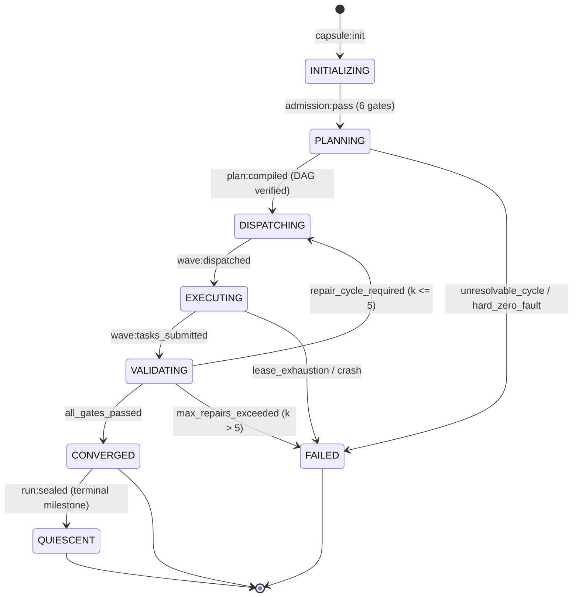
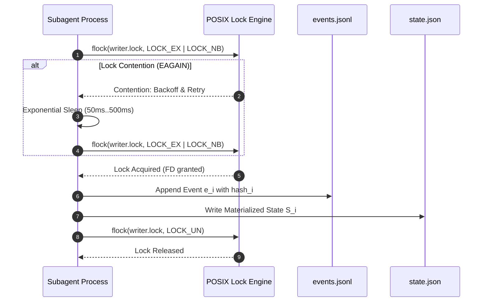

# Deterministic Capsule State Machine

---

[Previous: 01-02 The Hard Zeros & Invariants](01-02-the-hard-zeros-and-invariants.md) | [Chapter Index](index.md) | [All Chapters Index](../index.md) | [Next: 01-04 Reflog Safety & Git Staging](01-04-reflog-safety-and-git-staging.md)

---

## 1. Executive Summary & SSoT Architecture

In multi-agent autonomous engineering platforms, runtime state maintained in volatile process memory or unversioned database rows is inherently fragile. When agent processes crash, restart, or face process-level interrupts, memory-only state becomes ambiguous, yielding split-brain schedules, leaked worker leases, and torn data modifications.

The OLT (Orchestrating Long Tasks) engine eliminates volatile ambiguity through the **Deterministic Capsule State Machine**. Under this architecture:

1. **The Capsule is the Single Source of Truth (SSoT)**: All runtime metadata, ingested requirements, topological task graphs, worker leases, and validation receipts reside directly on disk within an isolated capsule directory: `.olt/capsules/<slug>/`.
2. **Event-Sourced State Reconstruction**: The active runtime state $S_t$ at any sequence index $t$ is computed as a deterministic, pure algebraic fold over the append-only, Merkle-chained event ledger:

$$S_t = \mathcal{F}_{\text{project}}\big(S_0, [e_1, e_2, \dots, e_t]\big)$$

```text
+--------------------------------------------------------------------------------------------------+
│                               CAPSULE DIRECTORY ON-DISK ANATOMY                                  │
+--------------------------------------------------------------------------------------------------+
│                                                                                                  │
│   .olt/capsules/<slug>/                                                                          │
│   ├── manifest.json              # Immutable capsule identity & prompt SHA-256 digest            │
│   ├── prompt.md                  # Verbatim ingested user prompt (mode 0444 read-only)           │
│   ├── state.json                 # Materialized projection of current lifecycle state            │
│   ├── events.jsonl               # Append-only, Merkle-hashed chronological event ledger         │
│   ├── mailbox/                   # Dedicated inter-agent communication channels                  │
│   │   ├── orch-main/             # Tier 1 Orchestrator mailbox stream (inbox/outbox)             │
│   │   ├── coord-graph/           # Tier 2 Coordinator mailbox stream                             │
│   │   └── worker-<id>/           # Tier 3 Implementer mailbox stream                             │
│   └── locks/                     # POSIX flock advisory concurrency locks                        │
│       ├── writer.lock            # Exclusive writer lease lock token                             │
│       └── observer.lock          # Concurrent reader inspection lock token                       │
│                                                                                                  │
+--------------------------------------------------------------------------------------------------+
```

---

## 2. Formal Lifecycle State Machine

The capsule lifecycle transitions through seven discrete, monotonically ordered operational states:

$$\Sigma = \big\{ \text{INITIALIZING}, \; \text{PLANNING}, \; \text{DISPATCHING}, \; \text{EXECUTING}, \; \text{VALIDATING}, \; \text{CONVERGED}, \; \text{QUIESCENT}, \; \text{FAILED} \big\}$$



### State Transition Specifications

```text
+-----------------+----------------------------------+---------------------------------------------+
│ Lifecycle State │ Entry Condition / Invariant      │ Exit Event & Trigger                        │
+-----------------+----------------------------------+---------------------------------------------+
│ INITIALIZING    │ prompt.md sealed (mode 0444)     │ admission:pass (All 6 admission gates true) │
+-----------------+----------------------------------+---------------------------------------------+
│ PLANNING        │ Obligations mapped from prompt   │ plan:compiled (Kahn toposort compiled DAG)  │
+-----------------+----------------------------------+---------------------------------------------+
│ DISPATCHING     │ Wave dependencies resolved       │ wave:dispatched (Workers leased via flock)  │
+-----------------+----------------------------------+---------------------------------------------+
│ EXECUTING       │ Worktrees isolated & active      │ wave:tasks_submitted (All tasks submitted)  │
+-----------------+----------------------------------+---------------------------------------------+
│ VALIDATING      │ AST + Test receipts emitted      │ verdict:pass (Transition to CONVERGED)      │
│                 │                                  │ verdict:repair (Loop to DISPATCHING, k <= 5)│
+-----------------+----------------------------------+---------------------------------------------+
│ CONVERGED       │ 100% DAG verified & staged       │ run:sealed (All reflogs & digests committed)│
+-----------------+----------------------------------+---------------------------------------------+
│ QUIESCENT       │ Terminal seal generated          │ Ready for next generational cycle           │
+-----------------+----------------------------------+---------------------------------------------+
│ FAILED          │ Unrecoverable trap / k > 5       │ doctor:heal manual or automated intervention│
+-----------------+----------------------------------+---------------------------------------------+
```

---

## 3. Semigroup Mechanics of Event Projection

Every operational mutation within a capsule is emitted as an immutable event tuple $e_i \in \mathcal{E}$:

$$e_i = \Big\langle \text{seq}_i, \; t_i, \; a_i, \; \text{type}_i, \; \text{payload}_i, \; h_i \Big\rangle$$

Where:

- $\text{seq}_i \in \mathbb{N}$: Strict monotonic sequence number ($\text{seq}_i = \text{seq}_{i-1} + 1$).
- $t_i \in \mathbb{R}$: ISO 8601 UTC microsecond timestamp.
- $a_i \in \text{Actors}$: Globally unique identifier of the actor emitting the event.
- $\text{type}_i \in \text{EventType}$: Enumerated event type string.
- $\text{payload}_i$: Validated JSON payload conforming to the event schema.
- $h_i \in \text{SHA256}$: Cryptographic Merkle link chaining $e_i$ to $h_{i-1}$.

### Merkle Chaining Formulation

The genesis hash $h_0$ is bound to the immutable `manifest.json`:

$$h_0 = \text{SHA256}(\text{manifest.json})$$

Every subsequent event hash $h_i$ is computed recursively:

$$h_i = \text{SHA256}\big( h_{i-1} \mathbin{\Vert} \text{CanonicalJSON}(e_i) \big)$$

```text
+--------------------------------------------------------------------------------------------------+
│                                  MERKLE EVENT CHAINING TOPOLOGY                                  │
+--------------------------------------------------------------------------------------------------+
│                                                                                                  │
│   ┌─────────────────────┐       ┌─────────────────────┐       ┌─────────────────────┐            │
│   │   manifest.json     │       │     Event 1         │       │     Event 2         │            │
│   │   (Genesis State)   │       │   (plan:compiled)   │       │   (task:claimed)    │            │
│   └──────────┬──────────┘       └──────────┬──────────┘       └──────────┬──────────┘            │
│              │                             │                             │                       │
│              ▼                             ▼                             ▼                       │
│          [ hash_0 ] ═════════════════► [ hash_1 ] ═════════════════► [ hash_2 ]                 │
│                                                                                                  │
+--------------------------------------------------------------------------------------------------+
```

### Deterministic State Semigroup & Fold

Let $\mathcal{S}$ be the set of all possible capsule states, and let $\circ: \mathcal{S} \times \mathcal{E} \rightarrow \mathcal{S}$ be the state projection function. $(\mathcal{S}, \circ)$ forms a deterministic transition semigroup.

The materialized state $S_N$ after $N$ events is computed via a left fold:

$$S_N = \text{FoldLeft}\big(\circ, \; S_0, \; [e_1, e_2, \dots, e_N]\big)$$

```typescript
export function projectCapsuleEvent(state: CapsuleState, event: CapsuleEvent): CapsuleState {
  switch (event.type) {
    case "admission:passed":
      return { ...state, phase: "PLANNING", updatedAt: event.timestamp };

    case "plan:compiled":
      return {
        ...state,
        phase: "DISPATCHING",
        dag: event.payload.dag,
        updatedAt: event.timestamp,
      };

    case "task:claimed": {
      const { taskId, workerId, leaseExpiresAt } = event.payload;
      return {
        ...state,
        tasks: {
          ...state.tasks,
          [taskId]: {
            ...state.tasks[taskId],
            status: "EXECUTING",
            assignedWorker: workerId,
            leaseExpiresAt,
          },
        },
        updatedAt: event.timestamp,
      };
    }

    case "task:validated": {
      const { taskId, evidenceClass } = event.payload;
      return {
        ...state,
        tasks: {
          ...state.tasks,
          [taskId]: {
            ...state.tasks[taskId],
            status: "VALIDATED",
            evidenceClass,
          },
        },
        updatedAt: event.timestamp,
      };
    }

    case "wave:converged":
      return { ...state, phase: "CONVERGED", updatedAt: event.timestamp };

    case "run:sealed":
      return { ...state, phase: "QUIESCENT", updatedAt: event.timestamp };

    default:
      return state;
  }
}
```

---

## 4. Concurrency Architecture & POSIX `flock` Locking

To prevent race conditions and concurrent write hazards across subagents, the OLT capsule employs POSIX advisory locking on dedicated lock files:

1. **Exclusive Writer Lock (`writer.lock`)**: Acquired via `flock(fd, LOCK_EX | LOCK_NB)` before appending any event to `events.jsonl` or mutating `state.json`.
2. **Shared Observer Lock (`observer.lock`)**: Acquired via `flock(fd, LOCK_SH)` by read-only telemetry monitors and dashboard observers.
3. **Fail-Closed Non-Blocking Protocol**: If `LOCK_EX` fails due to lock contention (`EAGAIN` or `EWOULDBLOCK`), the agent enters exponential backoff (initial delay $50\text{ms}$, multiplier $1.5$, max retry $10$).



---

## 5. Crash Recovery & Torn-Tail Auto-Healing

When an abrupt system termination occurs during file I/O, `events.jsonl` may contain a partial, corrupted trailing line. The OLT engine executes the **Torn-Tail Auto-Healing Algorithm** during initialization:

```text
+--------------------------------------------------------------------------------------------------+
│                             TORN-TAIL HEALING ALGORITHM SPECIFICATION                            │
+--------------------------------------------------------------------------------------------------+
│                                                                                                  │
│   Algorithm: AutoHealTornTail(capsulePath)                                                       │
│   Input: Path to capsule directory                                                               │
│   Output: Cleaned events.jsonl and synchronized state.json                                       │
│                                                                                                  │
│   1. Open events.jsonl in read/write mode with exclusive flock(writer.lock).                     │
│   2. Initialize expectedParentHash = SHA256(manifest.json), validBytes = 0.                      │
│   3. For each line in events.jsonl:                                                              │
│      a. Try parse JSON object e.                                                                 │
│      b. Verify: e.seq == expectedSeq AND e.parentHash == expectedParentHash.                     │
│      c. Verify: e.hash == SHA256(e.parentHash || CanonicalJSON(e)).                              │
│      d. If any check fails:                                                                      │
│             TRUNCATE file at validBytes;                                                         │
│             EMIT telemetry alert 'TORN_TAIL_TRUNCATED';                                          │
│             BREAK;                                                                               │
│      e. validBytes += byteLength(line) + 1;                                                      │
│      f. expectedParentHash = e.hash; expectedSeq++;                                              │
│   4. Project state S_clean = FoldLeft(projectCapsuleEvent, S_0, validEvents).                    │
│   5. Atomically overwrite state.json via temporary file rename (atomic POSIX replace).           │
│   6. Release flock(writer.lock).                                                                 │
│                                                                                                  │
+--------------------------------------------------------------------------------------------------+
```

---

## 6. TypeScript Capsule State Interfaces

```typescript
export type CapsuleLifecyclePhase =
  | "INITIALIZING"
  | "PLANNING"
  | "DISPATCHING"
  | "EXECUTING"
  | "VALIDATING"
  | "CONVERGED"
  | "QUIESCENT"
  | "FAILED";

export interface CapsuleManifest {
  readonly slug: string;
  readonly createdAt: string;
  readonly promptSha256: string;
  readonly promptByteLength: number;
  readonly genesisHash: string;
}

export interface CapsuleTaskDescriptor {
  readonly id: string;
  readonly name: string;
  readonly status: "PENDING" | "EXECUTING" | "VALIDATING" | "VALIDATED" | "FAILED";
  readonly assignedWorker?: string;
  readonly leaseExpiresAt?: string;
  readonly evidenceClass?: string;
}

export interface CapsuleState {
  readonly slug: string;
  readonly phase: CapsuleLifecyclePhase;
  readonly currentWave: number;
  readonly tasks: Record<string, CapsuleTaskDescriptor>;
  readonly lastSequenceNumber: number;
  readonly lastEventHash: string;
  readonly updatedAt: string;
}

export interface CapsuleEvent<T = Record<string, unknown>> {
  readonly seq: number;
  readonly timestamp: string;
  readonly actor: string;
  readonly type: string;
  readonly payload: T;
  readonly parentHash: string;
  readonly hash: string;
}
```

---

## 7. Architectural Guarantees & Summary

1. **Zero State Inconsistency**: `events.jsonl` is the ultimate canonical truth; `state.json` is always a pure projection.
2. **Replay Invariance**: Replaying $N$ valid events always yields the exact same materialized state object regardless of host platform.
3. **Atomic State Write**: State files are written via write-to-temp-then-rename to ensure no partial read can observe corrupted JSON.
4. **POSIX flock Safety**: Concurrent processes cannot corrupt the append-only event stream or write unsynchronized states.

---

[Previous: 01-02 The Hard Zeros & Invariants](01-02-the-hard-zeros-and-invariants.md) | [Chapter Index](index.md) | [All Chapters Index](../index.md) | [Next: 01-04 Reflog Safety & Git Staging](01-04-reflog-safety-and-git-staging.md)

---
