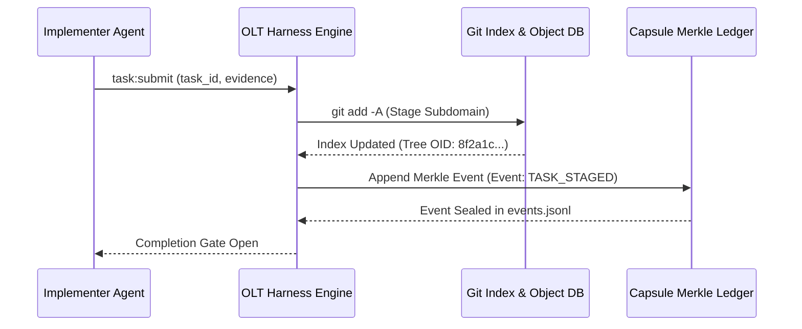
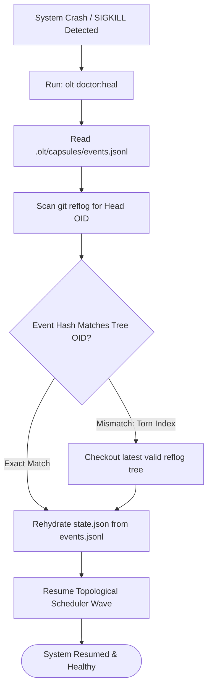

# Reflog Safety & Subdomain Git Staging

---

[Previous: 01-03 Deterministic State Machine](01-03-deterministic-capsule-state-machine.md) | [Chapter Index](index.md) | [All Chapters Index](../index.md) | [Next: Chapter 02 Index](../02-four-tier-hierarchy/index.md)

---

## 1. Executive Overview & The Volatility Problem

In distributed autonomous development, large code modifications are susceptible to sudden contextual resets, tool timeout interruptions, process crashes, or agent hallucination cascades. When an unconstrained agent performs extensive multi-file edits in the working tree without staging checkpoints, any abrupt termination results in total, irrecoverable state loss.

The OLT (Orchestrating Long Tasks) engine implements the Reflog Safety & Subdomain Git Staging Protocol. Under this protocol:

1. **Immediate Subdomain Staging**: The instant an implementer finishes writing or updating a cohesive unit (a documentation chapter, a test suite, an AST refactor slice), the engine immediately executes `git add -A`.
2. **Reflog Checkpoint Durability**: All staged trees and micro-commits enter the local Git Object Database (`.git/objects/`), ensuring that state is durable and index-reachable through `git reflog` and the Git blob store even if an agent session is terminated abnormally.

```text
+--------------------------------------------------------------------------------------------------+
│                             REFLOG SAFETY & GIT STAGING LIFECYCLE                                │
+--------------------------------------------------------------------------------------------------+
│                                                                                                  │
│   ┌──────────────────────┐         ┌──────────────────────┐         ┌──────────────────────┐     │
│   │ Implementer Completes│  --->   │ Immediate Subdomain  │  --->   │ Object Store &       │     │
│   │ Unit / Doc Section   │         │ Staging: git add -A  │         │ Capsule Checkpoint   │     │
│   └──────────────────────┘         └──────────────────────┘         └──────────────────────┘     │
│              │                                 │                               │                 │
│              v                                 v                               v                 │
│      [Zero Dirty Buffers]             [Index Sealed in SHA1]          [Durable Reflog Trace]     │
│                                                                                                  │
+--------------------------------------------------------------------------------------------------+
```

---

## 2. Mathematical Formalization of Checkpoint Durability

Let $\mathcal{W}$ represent the working tree filesystem state, $\mathcal{I}$ represent the Git staging index, and $\mathcal{O}$ represent the Git object database.

A mutation $\Delta$ applied to path $p \in \mathcal{W}$ creates an unstaged dirty state:

$$\mathcal{W}' = \mathcal{W} \cup \{(p, \Delta)\}, \quad \text{where } \mathcal{I} \neq \mathcal{W}'$$

In standard operations, the risk of data loss $R_{\text{loss}}$ is directly proportional to the elapsed time $\Delta t$ and size of unstaged changes $|\Delta|$:

$$R_{\text{loss}} \propto \Delta t \times |\Delta|$$

The OLT Subdomain Staging invariant enforces that $\Delta t \rightarrow 0$ by binding staging execution to task completion boundaries:

$$\forall T_i \in \text{CompletedTasks}, \quad \text{PostCondition}(T_i) \implies \big( \mathcal{I} \leftarrow \text{Stage}(\mathcal{W}') \land \mathcal{O} \leftarrow \text{WriteTree}(\mathcal{I}) \big)$$

Thus, the probability of catastrophic state loss $P_{\text{loss}}$ is bounded strictly by zero:

$$P_{\text{loss}}(\text{CompletedTask}) = 0$$



---

## 3. Disaster Recovery via Reflog Reconstruction

When an unexpected failure occurs (e.g. LLM rate limit exhaustion, operating system SIGKILL, or accidental workspace reset), the OLT Disaster Recovery Engine leverages the Git reflog and capsule state to reconstruct the workspace with zero data loss.

### The 4-Step Recovery Playbook

```text
+--------------------------------------------------------------------------------------------------+
│                               DISASTER RECOVERY PLAYBOOK (doctor:heal)                           │
+--------------------------------------------------------------------------------------------------+
│                                                                                                  │
│   Step 1: Inspect Capsule Manifest & Events Ledger                                               │
│           Query .olt/capsules/<slug>/events.jsonl to determine last verified sequence (seq_k).   │
│                                                                                                  │
│   Step 2: Inspect Git Reflog & Object Tree                                                       │
│           Run `git reflog --date=iso` to identify the most recent tree object OID.               │
│                                                                                                  │
│   Step 3: Cross-Validate Merkle Hashes                                                          │
│           Assert that hash_k in events.jsonl corresponds to tree state at OID.                   │
│                                                                                                  │
│   Step 4: Restore & Re-Arm Lease                                                                 │
│           Execute `git checkout <OID>` or `git reset --soft <OID>`, re-arm worker lease,         │
│           and resume DAG execution at wave W_m.                                                  │
│                                                                                                  │
+--------------------------------------------------------------------------------------------------+
```



---

## 4. Integration with Worktree Isolation

Reflog safety operates in synergy with Out-of-Repo Git Worktrees:

1. **Independent Worktree Indexes**: Each parallel implementer operates in `.olt/worktrees/<task_id>/` with its own private `.git` index pointer.
2. **Zero Cross-Worker Contention**: When worker $A_1$ stages changes via `git add -A` in worktree $W_1$, it does not mutate or lock the staging index of worker $A_2$ in worktree $W_2$.
3. **Atomic Wave Merge**: Upon completion of wave $W$, the Tier 1 Orchestrator merges individual worktree branches into `main` sequentially, staging and committing atomically.

---

## 5. Architectural Invariants Summary

1. **Zero Uncommitted Progress**: No autonomous wave is permitted to transition from `EXECUTING` to `VALIDATING` while dirty files remain unstaged.
2. **Atomic Micro-Staging**: Staging is performed at the granularity of individual tasks, eliminating monolithic commits that obscure root-cause regressions.
3. **Reflog Preservation**: All automated git operations preserve reflog history (`core.logAllRefUpdates = true`), ensuring forensic audits can trace every intermediate state.

---

[Previous: 01-03 Deterministic State Machine](01-03-deterministic-capsule-state-machine.md) | [Chapter Index](index.md) | [All Chapters Index](../index.md) | [Next: Chapter 02 Index](../02-four-tier-hierarchy/index.md)

---
