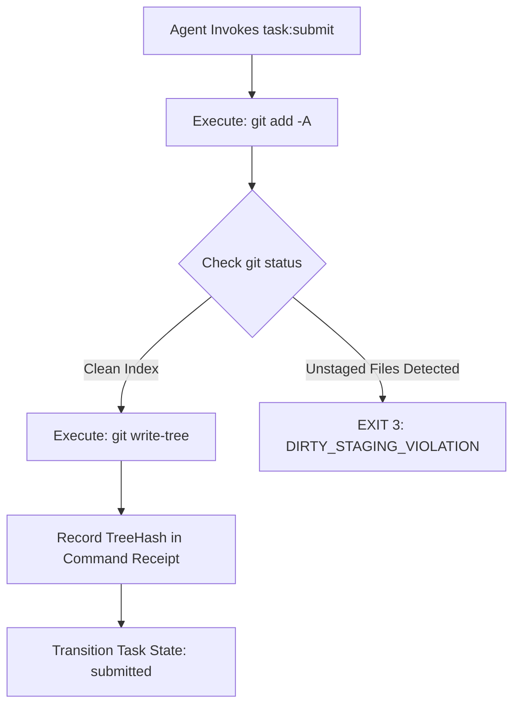

# Reflog Safety & The Subdomain Git Staging Invariant

[OLT Documentation Hub](../../README.md) > [Architecture Index](../index.md) > [Chapter 01](./index.md) > 01-04 Reflog Safety & Git Staging

---

[⏮️ Previous: 01-03 Deterministic State Machine](01-03-deterministic-capsule-state-machine.md) | [📂 Chapter Index](index.md) | [📚 All Chapters Index](../index.md) | [⏭️ Next: Chapter 02: Four-Tier Hierarchy](../02-four-tier-hierarchy/index.md)
---

## 1. The Subdomain Git Staging Invariant ($C_9$)

The primary threat to durability in multi-agent environments is the **uncommitted dirty workspace**. If an agent modifies files on disk but encounters a container crash, host restart, or context exhaustion before committing, all work in the working directory is irrecoverably lost.

OLT enforces the **Subdomain Git Staging Invariant**:
$$\forall \text{ milestone } m \in \text{Workflow}, \quad \text{Execute}(\text{git add -A}) \land \text{Assert}(\text{git status --porcelain} = \emptyset)$$

```text
                        SUBDOMAIN GIT STAGING PIPELINE
 ┌───────────────────┐      git add -A      ┌──────────────────────┐
 │ Working Directory │ ───────────────────► │  Git Staging Index   │
 │ (Modified Files)  │                      │ (SHA Tree Tracked)   │
 └───────────────────┘                      └──────────────────────┘
           │                                            │
   CRASH OCCURS HERE                            CRASH OCCURS HERE
           ▼                                            ▼
 [TOTAL DATA LOSS]                              [100% RECOVERABLE VIA]
                                                [git write-tree & reflog]
```

---

## 2. Reflog Durability & Tree Hashing

When files are staged in Git (`git add -A`), Git creates immutable blob objects in `.git/objects/` and computes the exact root tree SHA-1/SHA-256 hash. Even if a commit object is never formally finalized with `git commit`, the staged objects remain permanently recoverable from Git dangling object storage:

$$\text{TreeHash} = \text{git write-tree}$$



---

## 3. Dirty Workspace Prevention Protocol

1. **Pre-Execution Baseline Check**: Before any task is claimed (`task:claim`), the harness verifies that the working directory matches the exact baseline tree hash of the active lease.
2. **Atomic Write Scopes**: Workers modify files strictly within their granted paths.
3. **Automated Milestone Staging**: Every harness command that completes an operation (`task:submit`, `task:review`, `gate:prove`) triggers an immediate automatic `git add -A`.
4. **Zero Uncommitted Leak**: No agent may yield execution or transfer control with uncommitted modifications.

---

[⏮️ Previous: 01-03 Deterministic State Machine](01-03-deterministic-capsule-state-machine.md) | [📂 Chapter Index](index.md) | [📚 All Chapters Index](../index.md) | [⏭️ Next: Chapter 02: Four-Tier Hierarchy](../02-four-tier-hierarchy/index.md)
---
