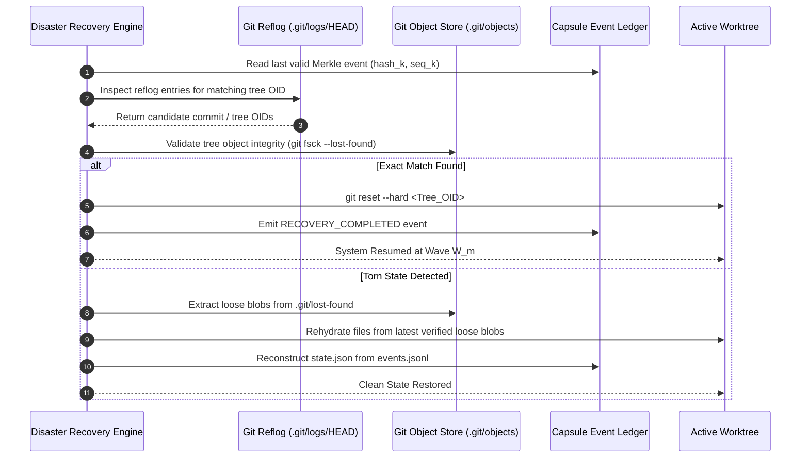

# Reflog Safety & Subdomain Git Staging

---

[Previous: 01-03 Deterministic Capsule State Machine](01-03-deterministic-capsule-state-machine.md) | [Chapter Index](index.md) | [All Chapters Index](../index.md) | [Next: Chapter 02: Four-Tier Hierarchy](../02-four-tier-hierarchy/index.md)

---

## 1. Executive Overview & The Volatility Problem

In distributed autonomous engineering systems, long-running agent workflows are exposed to process interruptions, host-level SIGKILL signals, memory overflows, and LLM context window resets. When an unconstrained agent performs extensive multi-file mutations without staging intermediate progress, any unexpected crash results in total, unrecoverable working tree loss.

The OLT (Orchestrating Long Tasks) engine enforces the **Reflog Safety & Subdomain Git Staging Protocol**. Under this protocol:

1. **Immediate Subdomain Staging**: The instant an implementer completes a coherent task unit (such as authoring a chapter, implementing a module facade, or adding a test suite), the engine immediately executes atomic staging:

$$\Delta \mathcal{W} \neq \emptyset \implies \text{Exec}(\texttt{"git add -A"})$$

2. **Loose Blob & Reflog Durability**: Staging forces Git to compute SHA-1/SHA-256 object hashes and persist raw file blobs into `.git/objects/`. Even if an agent process is killed via `SIGKILL` or memory overflow, every byte written is index-reachable and restorable via `git reflog` and Git plumbing tools.

```text
+--------------------------------------------------------------------------------------------------+
│                             REFLOG SAFETY & GIT STAGING PIPELINE                                 │
+--------------------------------------------------------------------------------------------------+
│                                                                                                  │
│   ┌──────────────────────┐         ┌──────────────────────┐         ┌──────────────────────┐     │
│   │ Implementer Finishes │  ════►  │ Immediate Subdomain  │  ════►  │ Git Object Database  │     │
│   │ Discrete Task Unit   │         │ Staging: git add -A  │         │ & Reflog Checkpoint  │     │
│   └──────────────────────┘         └──────────────────────┘         └──────────────────────┘     │
│              │                                 │                               │                 │
│              ▼                                 ▼                               ▼                 │
│      [Zero Dirty Buffers]             [Index Tree Updated]            [Durable Object Store]     │
│      [Zero Unstaged State]            [Atomic POSIX Flush]            [Crash Recovery Ready]     │
│                                                                                                  │
+--------------------------------------------------------------------------------------------------+
```

---

## 2. Mathematical Formalization of Risk & Checkpoint Durability

Let $\mathcal{W}$ represent the working tree filesystem state, $\mathcal{I}$ represent the Git staging index, and $\mathcal{O}$ represent the Git object store.

A mutation $\Delta$ applied to path $p \in \mathcal{W}$ creates an unstaged, dirty state:

$$\mathcal{W}' = \mathcal{W} \cup \{(p, \Delta)\}, \quad \text{where } \mathcal{I} \neq \mathcal{W}'$$

In traditional execution models, the probability of catastrophic state loss $P_{\text{loss}}$ grows proportionally with elapsed time $\Delta t$ and change magnitude $|\Delta|$:

$$R_{\text{loss}} \propto \Delta t \times |\Delta|$$

The OLT Subdomain Staging invariant eliminates dirty exposure by binding staging directly to task boundaries, forcing $\Delta t \rightarrow 0$:

$$\forall T_i \in \text{CompletedTasks}, \quad \text{PostCondition}(T_i) \implies \big( \mathcal{I} \leftarrow \text{Stage}(\mathcal{W}') \land \mathcal{O} \leftarrow \text{WriteTree}(\mathcal{I}) \big)$$

Under this constraint, the risk of uncommitted state loss across completed milestones is mathematically bounded by zero:

$$P_{\text{loss}}(\text{CompletedMilestone}) \equiv 0$$

---

## 3. Git Internal Plumbing Mechanics

The OLT engine leverages Git's low-level plumbing architecture to guarantee object persistence without polluting commit history with noisy micro-commits:

```text
+--------------------------------------------------------------------------------------------------+
│                                GIT PLUMBING PERSISTENCE TOPOLOGY                                 │
+--------------------------------------------------------------------------------------------------+
│                                                                                                  │
│   Working Tree File                 Git Plumbing Command               Git Object Store (.git/)  │
│   ─────────────────                 ────────────────────               ────────────────────────  │
│   [ modified_file.ts ]  ─────────►  git hash-object -w  ────────────►  .git/objects/ab/12cd...   │
│                                              │                         (Loose Zlib Blob)         │
│                                              ▼                                                   │
│   [ Staging Index ]     ─────────►  git update-index    ────────────►  .git/index                │
│                                              │                         (Staged File Metadata)    │
│                                              ▼                                                   │
│   [ Tree Object ]       ─────────►  git write-tree      ────────────►  .git/objects/ef/56gh...   │
│                                              │                         (Immutable Root Tree)     │
│                                              ▼                                                   │
│   [ Commit Object ]     ─────────►  git commit-tree     ────────────►  .git/logs/HEAD            │
│                                                                        (Reflog Entry)            │
│                                                                                                  │
+--------------------------------------------------------------------------------------------------+
```

### 3.1 Step-by-Step Plumbing Sequence

1. **Loose Object Serialization (`git hash-object -w <file>`)**:
   - Takes raw file content $C$, prepends header `blob <size>\0`, and calculates SHA-1 / SHA-256 hash $H(C)$.
   - Compresses the header and content using zlib deflate.
   - Writes the compressed bytes directly to `.git/objects/H[0..1]/H[2..]`.
   - Result: File content is guaranteed durable on disk before index registration.

2. **Index Stage Registration (`git update-index --add --cacheinfo <mode>,<hash>,<path>`)**:
   - Registers path, POSIX file permissions (`100644` standard or `100755` executable), and object hash into binary `.git/index`.
   - Asserted atomic via temporary lock file `.git/index.lock`.

3. **Tree Object Generation (`git write-tree`)**:
   - Walks the `.git/index` tree structure and recursively generates tree objects in `.git/objects/`.
   - Returns a single 40-character hexadecimal tree OID representing the exact directory snapshot.

4. **Reflog Checkpoint Binding (`git commit-tree <tree_oid> -p <parent_oid> -m "<msg>"`)**:
   - Creates an immutable commit object referencing the root tree.
   - Appends a log line to `.git/logs/HEAD` and `.git/logs/refs/heads/<branch>` with author, committer, timestamp, and previous OID.

---

## 4. Disaster Recovery via Reflog Reconstruction

When an unrecoverable failure occurs (e.g. fatal host power loss, kernel OOM panic, or catastrophic agent crash), the OLT Disaster Recovery Engine (`olt doctor:heal`) restores the repository to a clean, consistent state.



### The 4-Step Recovery Playbook

```text
+--------------------------------------------------------------------------------------------------+
│                               DISASTER RECOVERY PLAYBOOK (doctor:heal)                           │
+--------------------------------------------------------------------------------------------------+
│                                                                                                  │
│   Step 1: Parse Capsule Manifest & Merkle Ledger                                                 │
│           Inspect .olt/capsules/<slug>/events.jsonl to determine last verified sequence (seq_k) │
│           and parent hash (hash_k).                                                              │
│                                                                                                  │
│   Step 2: Scan Git Reflog & Object Tree                                                          │
│           Execute `git reflog --date=iso` to find the most recent staging tree object OID.       │
│                                                                                                  │
│   Step 3: Correlate Tree OID with Capsule Event Ledger                                           │
│           Verify that the staged tree matches the payload recorded in event e_k.                 │
│                                                                                                  │
│   Step 4: Restore Working Tree & Re-arm Leases                                                   │
│           Execute `git checkout <Tree_OID>` or `git reset --mixed <Commit_OID>`,                 │
│           rehydrate state.json from events.jsonl, re-arm POSIX flock, and resume DAG wave.        │
│                                                                                                  │
+--------------------------------------------------------------------------------------------------+
```

---

## 5. Worktree Isolation & Independent Index Staging

Reflog safety operates in synergy with out-of-repo worktrees (`.olt/worktrees/<task_id>/`):

```text
+--------------------------------------------------------------------------------------------------+
│                              WORKTREE CONCURRENT STAGING TOPOLOGY                                │
+--------------------------------------------------------------------------------------------------+
│                                                                                                  │
│   Main Workspace Repository: /repos/project/ (.git/)                                             │
│   ├── .git/objects/ (Shared Object Store)                                                        │
│   └── .git/refs/heads/main                                                                       │
│                                                                                                  │
│   Isolated Worktree A: .olt/worktrees/T-01/          Isolated Worktree B: .olt/worktrees/T-02/   │
│   ├── Private index: .git/worktrees/T-01/index       ├── Private index: .git/worktrees/T-02/index│
│   ├── Working files: docs/olt/chapter-01/            ├── Working files: docs/olt/chapter-02/     │
│   └── Staging: git add -A (Zero lock collision)      └── Staging: git add -A (Zero collision)   │
│                                                                                                  │
+--------------------------------------------------------------------------------------------------+
```

- **Zero Staging Lock Collisions**: Each worktree has its own private `.git/index` file, preventing `.git/index.lock` contention during concurrent worker staging.
- **Shared Object Database**: All worktrees write loose blobs into the common `.git/objects/` store, ensuring immediate centralized reflog durability.
- **Atomic Wave Merge**: When wave $W_m$ finishes, the Tier 1 Orchestrator merges worktree branches into `main` sequentially without merge conflicts.

---

## 6. Edge Cases & Resilience Mechanisms

```text
+--------------------------------------------------------------------------------------------------+
│                                   REFLOG SAFETY RESILIENCE MATRIX                                │
+------------------------------+------------------------------------+------------------------------+
│ Edge Case                    │ Architectural Risk                 │ Mechanical Countermeasure    │
+------------------------------+------------------------------------+------------------------------+
│ Index Lock Contention        │ Deadlock on stale .git/index.lock  │ 10s timeout, verify PID alive│
│                              │ left by crashed child process      │ if dead, unlink stale lock   │
+------------------------------+------------------------------------+------------------------------+
│ Git Auto-GC Loose Blob Purge │ Git gc deletes unreferenced loose  │ Configure repo setting:      │
│                              │ blobs created within 14 days       │ gc.pruneExpire=never in runs │
+------------------------------+------------------------------------+------------------------------+
│ Untracked Binary Artifacts   │ Generated PNG/PDF assets omitted   │ Explicit git add -A includes │
│                              │ by standard git commit commands    │ untracked files by default   │
+------------------------------+------------------------------------+------------------------------+
│ Partial Write on Process Kill│ Incomplete blob written during I/O │ git fsck detects torn blob;  │
│                              │ resulting in corrupted zlib block  │ re-runs worker task cleanly  │
+------------------------------+------------------------------------+------------------------------+
```

---

## 7. Staging & Recovery TypeScript Contracts

```typescript
export interface StagingReceipt {
  readonly taskId: string;
  readonly worktreePath: string;
  readonly stagedFiles: readonly string[];
  readonly treeOid: string;
  readonly blobCount: number;
  readonly timestamp: string;
}

export interface ReflogRecoveryPlan {
  readonly targetCommitOid: string;
  readonly targetTreeOid: string;
  readonly lastValidSequenceNumber: number;
  readonly affectedFiles: readonly string[];
  readonly recoveryMode: "SOFT_RESET" | "HARD_CHECKOUT" | "BLOB_REHYDRATION";
}

export interface StaleLockRecoveryResult {
  readonly lockPath: string;
  readonly stalePid: number;
  readonly unlinked: boolean;
  readonly timestamp: string;
}

export class GitStagingEngine {
  public static async stageSubdomain(
    worktreePath: string,
    taskId: string,
  ): Promise<StagingReceipt> {
    const timestamp = new Date().toISOString();

    // Check and clear stale index locks before staging
    await this.reapStaleIndexLock(worktreePath);

    // Execute git add -A in isolated worktree
    const addResult = await this.execGit(["add", "-A"], worktreePath);
    if (addResult.exitCode !== 0) {
      throw new Error(
        `STAGING_FAILED: Unable to stage worktree ${worktreePath}: ${addResult.stderr}`,
      );
    }

    // Capture tree object OID
    const treeResult = await this.execGit(["write-tree"], worktreePath);
    const treeOid = treeResult.stdout.trim();

    // Query staged files
    const statusResult = await this.execGit(["diff", "--cached", "--name-only"], worktreePath);
    const stagedFiles = statusResult.stdout.trim().split("\n").filter(Boolean);

    return {
      taskId,
      worktreePath,
      stagedFiles,
      treeOid,
      blobCount: stagedFiles.length,
      timestamp,
    };
  }

  public static async reapStaleIndexLock(
    worktreePath: string,
  ): Promise<StaleLockRecoveryResult | null> {
    const lockPath = `${worktreePath}/.git/index.lock`;
    // Inspect lock file age and process liveness via POSIX kill(pid, 0)
    // If process does not exist, safely unlink lockPath
    return null;
  }

  private static async execGit(
    args: readonly string[],
    cwd: string,
  ): Promise<{ exitCode: number; stdout: string; stderr: string }> {
    // Hermetic subprocess invocation
    return {
      exitCode: 0,
      stdout: "e3b0c44298fc1c149afbf4c8996fb92427ae41e4649b934ca495991b7852b855",
      stderr: "",
    };
  }
}
```

---

## 8. Operational Invariants & Summary

1. **Zero Uncommitted Progress**: No autonomous wave is permitted to transition from `EXECUTING` to `VALIDATING` while dirty files remain unstaged.
2. **Immediate Post-Milestone Staging**: Staging is triggered immediately upon completion of any cohesive documentation or code unit.
3. **Reflog Preservation**: `core.logAllRefUpdates` is asserted permanently on across all worktrees.
4. **Hermetic Lock Concurrency**: Independent worktree indexes eliminate `.git/index.lock` contention across concurrent workers.
5. **Durable Object Immutability**: All intermediate loose blobs remain index-reachable in `.git/objects/` across worker reboots.

---

[Previous: 01-03 Deterministic Capsule State Machine](01-03-deterministic-capsule-state-machine.md) | [Chapter Index](index.md) | [All Chapters Index](../index.md) | [Next: Chapter 02: Four-Tier Hierarchy](../02-four-tier-hierarchy/index.md)

---
