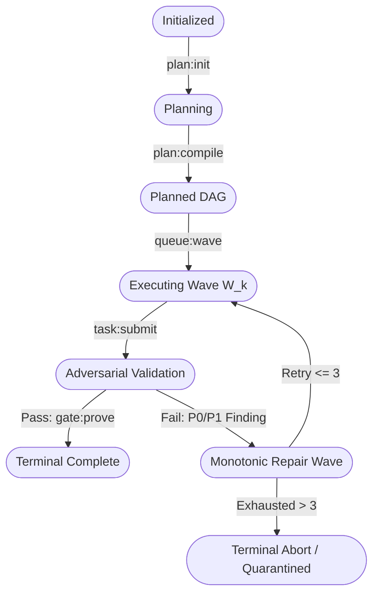

# Chapter 01: Foundations & Core Invariants

[OLT Documentation Hub](../../README.md) > [Architecture Index](../index.md) > Chapter 01: Foundations & Core Invariants

---

[⏮️ Previous: Architecture Master Index](../index.md) | [📂 Chapter Index](index.md) | [📚 All Chapters Index](../index.md) | [⏭️ Next: 01-01 Zero-Assumption Philosophy](01-01-zero-assumption-philosophy.md)
---

## 1. Chapter Overview

The **Orchestrated Lifecycle Topology (OLT)** runtime is engineered from first principles to solve the foundational failure modes of autonomous software engineering agents. Unconstrained Large Language Models (LLMs) suffer from context window degradation, probabilistic drift, sycophantic self-validation, write collisions, and torn execution states.

OLT replaces conversational consensus with a **deterministic, kernel-grade execution harness**. State is never stored in conversational memory; it is maintained exclusively through append-only cryptographic event logs, advisory-locked filesystem capsules, and formal state transition matrices.

```text
┌──────────────────────────────────────────────────────────────────────────────────────────────────┐
│                               CHAPTER 01: FOUNDATIONS TOPOLOGY                                   │
├──────────────────────────┬──────────────────────────┬────────────────────────────────────────────┤
│ Sub-Topic                │ Key Architectural Model  │ Primary Invariants Enforced                │
├──────────────────────────┼──────────────────────────┼────────────────────────────────────────────┤
│ 01. Zero-Assumption      │ Epistemic State Duality  │ "Prose is not state, memory is not proof"  │
│ 02. Hard Zeros & Invars  │ Formal Invariant Catalog │ 4 Hard Zeros & C1–C10 System Invariants    │
│ 03. State Machine        │ Monotonic FSM Engine     │ S0 -> S_complete via Linear Event Replay   │
│ 04. Reflog Safety & Git  │ Milestone Staging Tree   │ Subdomain Git Staging Invariant (git add -A)│
└──────────────────────────┴──────────────────────────┴────────────────────────────────────────────┘
```

---

## 2. Table of Contents

1. **[01-01: Zero-Assumption Philosophy](./01-01-zero-assumption-philosophy.md)**  
   _Core epistemic doctrine, untrusted model outputs, and deterministic runtime truth._
2. **[01-02: The Hard Zeros & Invariants Catalog](./01-02-the-hard-zeros-and-invariants.md)**  
   _The 4 Hard Zeros and the formal $C_1 \dots C_{10}$ mathematical invariant catalog._
3. **[01-03: Deterministic Capsule State Machine](./01-03-deterministic-capsule-state-machine.md)**  
   _Finite State Machine (FSM), state monotonicity, transition matrices, and idempotent replay._
4. **[01-04: Reflog Safety & Git Staging Invariants](./01-04-reflog-safety-and-git-staging.md)**  
   _The Subdomain Git Staging Invariant (`git add -A`), reflog safety, and commit trees._

---

## 3. Core Invariant Catalog ($C_1 \dots C_{10}$)

Every operation within an OLT execution capsule is governed by ten formal, non-negotiable invariants:

| ID           | Invariant Name                | Formal Mathematical Definition                                                                                                            | Primary Enforcement Module                                                                                                               | Verification Test         |
| :----------- | :---------------------------- | :---------------------------------------------------------------------------------------------------------------------------------------- | :--------------------------------------------------------------------------------------------------------------------------------------- | :------------------------ |
| **$C_1$**    | **Byte-Exact Prompt Sealing** | $H_{\text{prompt}} = \text{SHA256}(\text{Prompt}_{\text{raw}}), \text{mode}(\text{prompt}) = 0444$                                        | [`capsule-storage.ts`](file:///Users/onurseckinsenoglu/repos/skills/olt/scripts/src/core/contracts/agents/capsule.ts)                    | `prompt-capture.test.ts`  |
| **$C_2$**    | **Monotonic Writer Lease**    | $\forall t_1 < t_2, \text{seq}(L_{t_1}) < \text{seq}(L_{t_2}) \land \text{flock}(L_{\text{capsule}}) = 1$                                 | [`task-claim.ts`](file:///Users/onurseckinsenoglu/repos/skills/olt/scripts/src/cli/commands/task-claim.ts)                               | `lease-lock.test.ts`      |
| **$C_3$**    | **Scope Confinement**         | $\forall f \in \Delta_{\text{task}}, f \subseteq \text{Scope}_{\text{assigned}} \land f \cap \text{Scope}_{\text{forbidden}} = \emptyset$ | [`paths.ts`](file:///Users/onurseckinsenoglu/repos/skills/olt/scripts/src/core/paths.ts)                                                 | `scope-boundary.test.ts`  |
| **$C_4$**    | **Dual-Channel Verification** | $V(T) = V_{\text{cognitive}}(\text{AST}) \land V_{\text{mechanical}}(\text{ExitCode}=0)$                                                  | [`critic-ops.ts`](file:///Users/onurseckinsenoglu/repos/skills/olt/scripts/src/critic/critic-ops.ts)                                     | `dual-channel.test.ts`    |
| **$C_5$**    | **State Monotonicity**        | $S_{i+1} = \delta(S_i, E_{i+1}) \implies S_i \le_{\text{lifecycle}} S_{i+1}$                                                              | [`state-transitions.ts`](file:///Users/onurseckinsenoglu/repos/skills/olt/scripts/src/reporting/living-tracer/task-state-transitions.ts) | `state-fold.test.ts`      |
| **$C_6$**    | **DAG Edge Justification**    | $\forall (u, v) \in E_{\text{DAG}}, \text{Output}(u) \cap \text{Input}(v) \neq \emptyset$                                                 | [`topological-scheduler.ts`](file:///Users/onurseckinsenoglu/repos/skills/olt/scripts/src/reporting/sugiyama-dag.ts)                     | `dag-scheduler.test.ts`   |
| **$C_7$**    | **Hard-Lock Review**          | $\text{ReviewerRole} \implies \text{MutatingCmds} = \emptyset$                                                                            | [`rbac-compiler.ts`](file:///Users/onurseckinsenoglu/repos/skills/olt/scripts/src/policy/rbac-engine.ts)                                 | `hardlock-review.test.ts` |
| **$C_8$**    | **Zero Main-Thread Spill**    | $\text{Thread}_{\text{supervisor}} \implies \text{FileMutations} = \emptyset$                                                             | [`persona-grounding.ts`](file:///Users/onurseckinsenoglu/repos/skills/olt/scripts/src/authority/persona-grounding.ts)                    | `thread-spill.test.ts`    |
| **$C_9$**    | **Subdomain Git Staging**     | $\text{StepFinished}(T) \implies \text{git add -A} \land \text{git status --porcelain} = \emptyset$                                       | [`task-submit.ts`](file:///Users/onurseckinsenoglu/repos/skills/olt/scripts/src/workflow/submission/submit.ts)                           | `git-milestone.test.ts`   |
| **$C_{10}$** | **Headless Worktree Safety**  | $\text{WorktreePath} \cap \text{RepoRoot} = \emptyset \land \text{CleanMerge}(W)$                                                         | [`branch-ops.ts`](file:///Users/onurseckinsenoglu/repos/skills/olt/scripts/src/cli/commands/branch-ops.ts)                               | `worktree-safety.test.ts` |

---

## 4. Architectural State Transition Lifecycle



---

[⏮️ Previous: Architecture Master Index](../index.md) | [📂 Chapter Index](index.md) | [📚 All Chapters Index](../index.md) | [⏭️ Next: 01-01 Zero-Assumption Philosophy](01-01-zero-assumption-philosophy.md)
---
