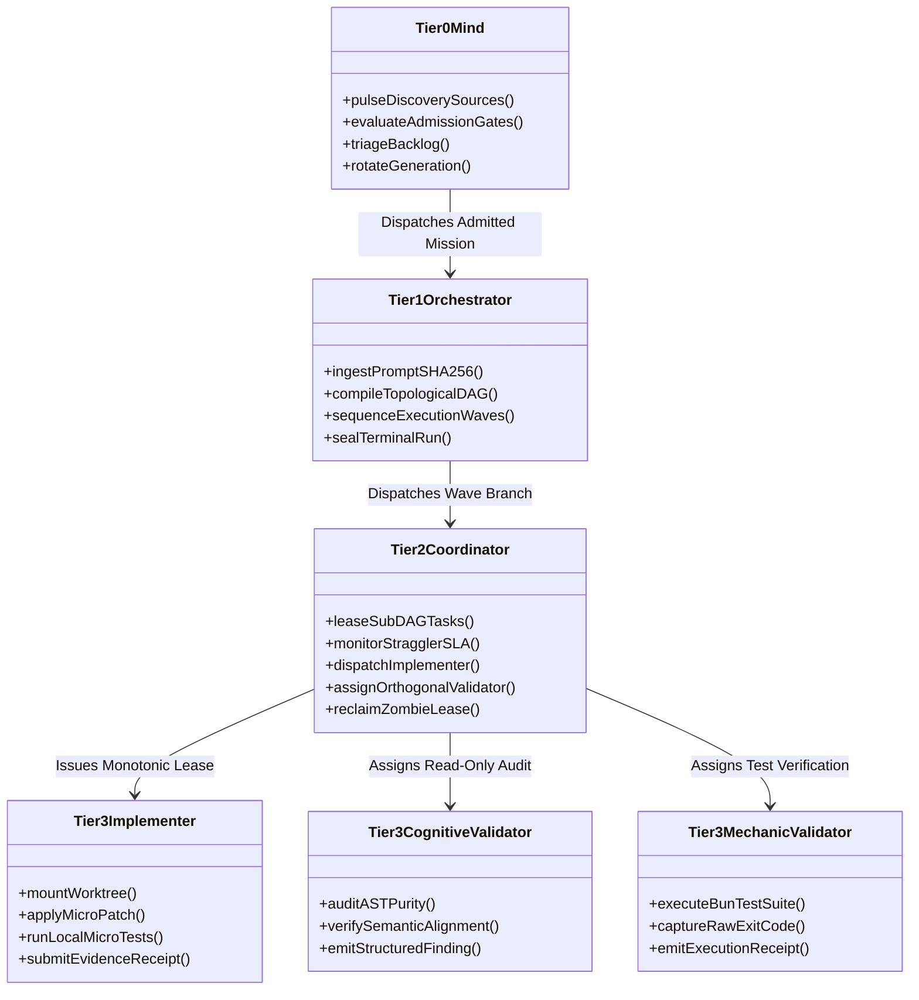
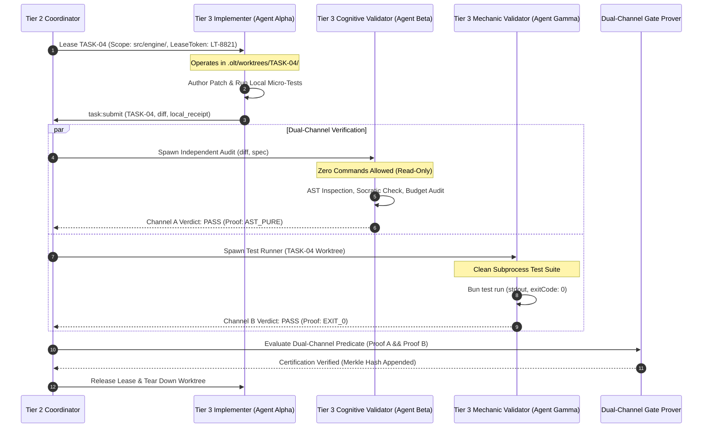

# The Four-Tier Agent Workforce Model

---

[Previous: Chapter 02: Four-Tier Hierarchy](index.md) | [Chapter Index](index.md) | [All Chapters Index](../index.md) | [Next: 02-02 Subagent Naming Grammar](02-02-subagent-naming-grammar.md)

---

## 1. Executive Summary & Epistemic Hierarchy

In complex autonomous software engineering pipelines, flat agent swarms—where all agents share equal responsibilities, unstructured communication channels, and unconstrained write permissions—inevitably suffer from context dilution, uncoordinated task collisions, and chaotic code merges. When an agent simultaneously attempts high-level architectural planning, file editing, test execution, and self-review within a single context window, cognitive saturation rapidly degrades performance.

The OLT (Orchestrating Long Tasks) engine enforces a strict **Four-Tier Workforce Hierarchy**. Under this architecture:

1. **Separation of Strategic Planning and Execution**: High-level supervisory tiers (Tiers 0, 1, and 2) never touch implementation code directly, preserving their context windows for architectural oversight, dependency decomposition, and invariant verification.
2. **Dedicated Execution Lanes**: All code mutations, local micro-tests, and file operations are performed exclusively by specialized Tier 3 Implementers operating within isolated out-of-repo worktrees.
3. **Orthogonal Dual-Channel Validation**: No agent ever validates its own work. An independent Tier 3 Cognitive Validator and an automated Mechanic-Validator are paired orthogonally with each implementer to guarantee unbiased epistemic verification.
4. **Supervisor Zero-File-Edit Rule ($Z_{\text{mutation}} = 0$)**: Tiers 0, 1, and 2 are mechanically prohibited from emitting direct filesystem write operations, enforcing fail-closed role-based access control.

```text
+--------------------------------------------------------------------------------------------------+
│                             THE FOUR-TIER WORKFORCE HIERARCHY TOPOLOGY                           │
+--------------------------------------------------------------------------------------------------+
│                                                                                                  │
│   TIER 0: MIND (PRODUCT OWNER)                                                                   │
│   • Perpetual autonomous discovery across 10 distinct issue & code sources                       │
│   • Evaluates 6 admission gates & manages generational rotation cycles                           │
│   • Authority: Strategic roadmapping, admission decisions | Write Scope: None (0 Code Edits)     │
│                                │                                                                 │
│                                ▼                                                                 │
│   TIER 1: ORCHESTRATOR                                                                           │
│   • Byte-exact prompt ingestion & SHA-256 requirement sealing                                    │
│   • Kahn topological DAG compilation, wave sequencing, & Merkle event log management            │
│   • Authority: Global DAG generation, wave dispatch | Write Scope: None (0 Code Edits)           │
│                                │                                                                 │
│                                ▼                                                                 │
│   TIER 2: DOMAIN COORDINATOR                                                                     │
│   • Domain-specific wave execution, sub-DAG management, & worker dispatching                     │
│   • Enforces 5-minute straggler SLA rules, heartbeat tracking, & dynamic load throttling         │
│   • Authority: Sub-DAG leasing, worker monitoring | Write Scope: None (0 Code Edits)              │
│                                │                                                                 │
│                                ▼                                                                 │
│   TIER 3: SPECIALIZED WORKFORCE (IMPLEMENTERS & VALIDATORS)                                      │
│   ┌────────────────────────────────────────┬────────────────────────────────────────┐            │
│   │  TIER 3 IMPLEMENTER                    │  TIER 3 COGNITIVE & MECHANIC VALIDATOR │            │
│   │  • Claims atomic task lease            │  • Cognitive: Pure AST audit, zero cmd │            │
│   │  • Operates in isolated worktree       │  • Mechanic: Bun test runner, receipts │            │
│   │  • Applies AST-compliant micro-patches │  • Orthogonal dual-channel verdict     │            │
│   └────────────────────────────────────────┴────────────────────────────────────────┘            │
│                                                                                                  │
+--------------------------------------------------------------------------------------------------+
```

---

## 2. Formal Role Specifications & Authority Matrix

Every autonomous agent in the OLT runtime belongs to exactly one tier and carries an explicit authority token that defines its operational envelope. The table below codifies the role taxonomy, tool permissions, and mechanical restrictions:

```text
+------+----------------------+------------------------------+--------------------+---------------------+-------------------------+
| Tier | Role Title           | Core Architectural Focus     | Tool Authority     | File Mutation Scope | Trap on Violation       |
+------+----------------------+------------------------------+--------------------+---------------------+-------------------------+
| 0    | Mind (Product Owner) | Discovery, admission, triage | Mailbox, Doctor    | STRICTLY NONE       | SUPERVISOR_WRITE_FAULT  |
| 1    | Orchestrator         | DAG planning, wave schedule  | Mailbox, Subagents | STRICTLY NONE       | SUPERVISOR_WRITE_FAULT  |
| 2    | Domain Coordinator   | Wave dispatch, SLA watchdog  | Mailbox, Subagents | STRICTLY NONE       | SUPERVISOR_WRITE_FAULT  |
| 3    | Implementer          | Code authoring, micro-tests  | FS Edit, AST Lint  | Leased Scope Only   | SCOPE_ESCAPE_FAULT      |
| 3    | Cognitive Validator  | AST audit, Socratic pushback | Read-Only, Mailbox | STRICTLY NONE       | VALIDATOR_COMMAND_FAULT |
| 3    | Mechanic-Validator   | Bun test runner, gate proofs | Shell Execution    | Read-Only Proofs    | MUTATION_GATE_FAULT     |
+------+----------------------+------------------------------+--------------------+---------------------+-------------------------+
```

### 2.1 Tier 0: Mind (Product Owner)

Tier 0 operates as the strategic brain and autonomous product manager of the capsule. It maintains an infinite cadence, scanning 10 discovery sources (git commit logs, issue trackers, TODO comments, test regression reports, telemetry feeds, AST lint warnings, security advisories, runtime performance profiles, schema drift detections, and dependency audits).

Tier 0 passes candidate issues through 6 strict admission gates:

1. Epistemic clarity gate
2. Reproducibility gate
3. Architectural alignment gate
4. Dependency feasibility gate
5. Token budget gate
6. Safety and security invariant gate

Tier 0 never interacts with shell commands or source file modifications. Its sole output is an admitted, sealed roadmap item dispatched to Tier 1.

### 2.2 Tier 1: Orchestrator

Tier 1 ingests the admitted requirements from Tier 0, computes a byte-exact SHA-256 hash of the prompt and requirements specification, and compiles the project roadmap into a Directed Acyclic Graph (DAG) using Kahn's topological sorting algorithm. Tier 1 decomposes the global DAG into discrete execution waves, establishes domain boundaries, and spawns Tier 2 Domain Coordinators for each independent wave branch.

### 2.3 Tier 2: Domain Coordinator

Tier 2 coordinates domain-specific waves (e.g., core engine, user interface, telemetry, compiler pipeline). It is responsible for:

- Enforcing the **5-Minute Straggler SLA Rule**: Any worker inactive for $>300$ seconds is immediately reclaimed and quarantined.
- Managing concurrent task leases using monotonic lease tokens.
- Dispatching Tier 3 Implementers and independently assigning orthogonal Tier 3 Validators.
- Aggregating dual-channel verification receipts before certifying wave completion to Tier 1.

### 2.4 Tier 3: Specialized Workforce

Tier 3 consists of focused execution agents operating under strict physical and logical confinement:

- **Implementer**: Leases a single task $T_i$, mounts an isolated git worktree at `.olt/worktrees/T_i/`, authors atomic code changes within its granted file scope $S_i$, and generates local test verifications.
- **Cognitive Validator**: Independently spawned to review the implementer's patch. Operates in a strict read-only sandbox with zero command execution privileges ($C(\text{Val}) = 0$), performing Socratic and AST-level inspections.
- **Mechanic-Validator**: Executes the automated test suite using Bun within a clean test worktree, capturing stdout/stderr receipts, exit codes, and timing logs.



---

## 3. Separation of Authority & Mathematical Permission Model

Let $\mathcal{A}$ denote the universe of autonomous agents, $\mathcal{R}$ denote the set of role tiers, and $\mathcal{F}_{\text{repo}}$ denote the set of all files within the repository.

We define the tier assignment function $\tau: \mathcal{A} \rightarrow \{0, 1, 2, 3\}$ and the permission lattice:

$$\mathcal{L} = \langle \mathcal{P}, \sqsubseteq, \top, \bot \rangle$$

Where $\mathcal{P} = \{\text{Plan}, \text{Ingest}, \text{CompileDAG}, \text{LeaseTask}, \text{WriteCode}, \text{ExecuteShell}, \text{AuditAST}\}$.

### 3.1 The Supervisor Zero-File-Edit Invariant ($Z_{\text{mutation}} = 0$)

The supervisory tiers ($\tau(a) < 3$) are mathematically barred from the write authority set $\mathcal{W}(\mathcal{F}_{\text{repo}})$:

$$\forall a \in \mathcal{A}, \quad \tau(a) < 3 \implies \mathcal{W}_a(\mathcal{F}_{\text{repo}}) \equiv \emptyset$$

Any attempt by a supervisor to issue a write, replace, or delete command targeting $\mathcal{F}_{\text{repo}}$ causes an immediate fail-closed exception:

$$ \text{AssertZeroMutation}(a, f) = \begin{cases}
\text{OK} & \text{if } \tau(a) = 3 \land f \in \mathcal{S}_{\text{granted}}(a) \\
\text{TRAP}(\text{SUPERVISOR\_WRITE\_FAULT}) & \text{if } \tau(a) < 3 \\
\text{TRAP}(\text{SCOPE\_ESCAPE\_FAULT}) & \text{if } \tau(a) = 3 \land f \notin \mathcal{S}_{\text{granted}}(a)
\end{cases}$$

### 3.2 1:1 Worktree Filesystem Isolation

To prevent concurrent file mutation collisions and race conditions, each Tier 3 Implementer is isolated within an independent git worktree:

$$\forall i, j \in \mathcal{T}_{\text{active}}, \quad i \neq j \implies \text{WorktreePath}(i) \cap \text{WorktreePath}(j) \equiv \emptyset$$

Where $\text{WorktreePath}(T_i) = \text{repo\_root}/.olt/\text{worktrees}/T_i$.

### 3.3 Cognitive Context Load Bounds

In standard multi-agent systems, supervisory agents accumulate massive token payloads from raw code diffs, leading to attention degradation. In OLT, supervisory tiers process only Cowan-sanitized task metadata tokens:

$$\text{Context}_{\text{supervisor}}(T_i) \le 500 \text{ Cowan Tokens}$$

$$\text{Context}_{\text{total}}(\text{Wave}_k) = \sum_{T_i \in \text{Wave}_k} \text{MetaTokens}(T_i) + \mathcal{O}(|V_k| + |E_k|)$$

This guarantees that supervisory context consumption scales with DAG topology size rather than repository source code volume.

---

## 4. Orthogonal Validator Pairing Invariant

To eliminate self-review bias and hallucinated test passes, OLT establishes the **Orthogonal Validator Pairing Invariant**:

$$\forall T_i \in \mathcal{T}, \quad \text{Implementer}(T_i) \neq \text{Validator}_{\text{cog}}(T_i) \land \text{Implementer}(T_i) \neq \text{Validator}_{\text{mech}}(T_i)$$

Furthermore, the Cognitive Validator operates under absolute command isolation:

$$\text{Commands}(\text{Validator}_{\text{cog}}) \equiv \emptyset \land \text{WritePermissions}(\mathcal{F}_{\text{repo}}) \equiv \emptyset$$



---

## 5. TypeScript Role Contracts and RBAC Interlocks

The role contracts and authority matrices are implemented in TypeScript under [`session/types.ts`](file:///Users/onurseckinsenoglu/repos/skills/olt/scripts/src/authority/session/types.ts):

```typescript
/**
 * Four-Tier Workforce Role Archetypes in OLT
 */
export type TierLevel = 0 | 1 | 2 | 3;

export type RoleArchetype =
  | "mind"
  | "orchestrator"
  | "coordinator"
  | "implementer"
  | "cognitive_validator"
  | "mechanic_validator";

export interface AgentAuthorityToken {
  readonly agentId: string;
  readonly tier: TierLevel;
  readonly role: RoleArchetype;
  readonly grantedScope: readonly string[];
  readonly writeAllowed: boolean;
  readonly commandExecutionAllowed: boolean;
  readonly leaseToken?: string;
  readonly issuedAt: number;
  readonly expiresAt: number;
}

export interface WorktreeLeasePacket {
  readonly taskId: string;
  readonly agentId: string;
  readonly leaseToken: string;
  readonly worktreePath: string;
  readonly grantedFiles: readonly string[];
  readonly monotonicSequence: number;
  readonly stragglerTimeoutMs: number;
}

export interface DualChannelVerificationResult {
  readonly taskId: string;
  readonly implementerId: string;
  readonly cognitiveValidatorId: string;
  readonly mechanicValidatorId: string;
  readonly channelACognitiveProof: {
    readonly astPure: boolean;
    readonly sizingBudgetCompliant: boolean;
    readonly socraticPass: boolean;
    readonly findingCount: number;
  };
  readonly channelBMechanicProof: {
    readonly exitCode: number;
    readonly executionDurationMs: number;
    readonly totalTestsPassed: number;
    readonly rawOutputSha256: string;
  };
  readonly certified: boolean;
}

/**
 * Enforces Fail-Closed Role-Based Access Control
 */
export class RoleEnforcementGuard {
  public static validateWritePermission(
    token: AgentAuthorityToken,
    targetFilePath: string
  ): void {
    if (token.tier < 3 || !token.writeAllowed) {
      throw new Error(
        `SUPERVISOR_WRITE_FAULT: Agent ${token.agentId} (Tier ${token.tier}) is prohibited from modifying ${targetFilePath}`
      );
    }

    const isWithinScope = token.grantedScope.some((allowedPrefix) =>
      targetFilePath.startsWith(allowedPrefix)
    );

    if (!isWithinScope) {
      throw new Error(
        `SCOPE_ESCAPE_FAULT: Agent ${token.agentId} attempted write outside granted scope: ${targetFilePath}`
      );
    }
  }

  public static validateValidatorPrivilege(token: AgentAuthorityToken): void {
    if (token.role === "cognitive_validator" && token.commandExecutionAllowed) {
      throw new Error(
        `VALIDATOR_COMMAND_FAULT: Cognitive Validator ${token.agentId} cannot execute shell commands.`
      );
    }
  }
}
```

---

## 6. Failure Modes & Anti-Blunder Matrix

```text
+--------------------------------+------------------------------------------+-------------------------------------------------------------+
| Failure Mode                   | Root Cause                               | Mechanical Defense & Recovery                               |
+--------------------------------+------------------------------------------+-------------------------------------------------------------+
| SUPERVISOR_WRITE_FAULT         | Tier 0, 1, or 2 agent attempts file edit | Fail-closed write interception; immediate command rejection.|
| SCOPE_ESCAPE_FAULT             | Implementer modifies ungranted file path | Git worktree path boundary filter; transaction rollback.    |
| SELF_REVIEW_VIOLATION_TRAP     | Worker assigned as its own validator     | Registry constraint check rejects identical agent IDs.      |
| VALIDATOR_COMMAND_FAULT        | Cognitive validator attempts shell exec  | Tool proxy sandbox strips execution primitives at spawn.    |
| CONTEXT_POISONING_SPILL        | Raw diff dumped into supervisor context  | Cowan token sanitization filter reduces diff to metadata.   |
| WORKTREE_DIRTY_LEAK            | Uncommitted files left after task lease  | Atomic git clean -fdx & worktree removal upon termination.  |
| STRAGGLER_TIMEOUT_TRAP         | Worker inactive for > 300 seconds        | Tier 2 coordinator revokes lease token; re-leases to pool.  |
+--------------------------------+------------------------------------------+-------------------------------------------------------------+
```

### Anti-Blunder Architecture Principles

1. **Never Allow Supervisors to "Quick-Fix" Code**: Even a 1-line typo fix by an Orchestrator poisons its context window and destroys the audit chain. All edits must go through Tier 3.
2. **Never Pool Validator and Implementer Mailboxes**: Keep communication decoupled through structured task submission packets and structured findings.
3. **Never Share Worktrees Across Concurrent Tasks**: Every concurrent task must receive its own isolated worktree path to prevent uncommitted file collisions.

---

## 7. Architectural Invariants Summary

- **Invariant $\mathcal{C}_2$ (Monotonic Writer Lease)**: Exactly one implementer holds an active write lease per task at any instant.
- **Invariant $\mathcal{C}_4$ (Dual-Channel Verification)**: No task is marked completed without independent mechanical exit code `0` and cognitive AST purity proofs.
- **Invariant $\mathcal{C}_7$ (Cognitive Validator Hard-Lock)**: Validators are permanently barred from issuing shell commands or modifying files.
- **Invariant $\mathcal{C}_{10}$ (Out-of-Repo Worktree Isolation)**: Implementers execute inside discrete worktrees, protecting the main working tree from uncommitted artifacts.

---

[Previous: Chapter 02: Four-Tier Hierarchy](index.md) | [Chapter Index](index.md) | [All Chapters Index](../index.md) | [Next: 02-02 Subagent Naming Grammar](02-02-subagent-naming-grammar.md)

---
$$
