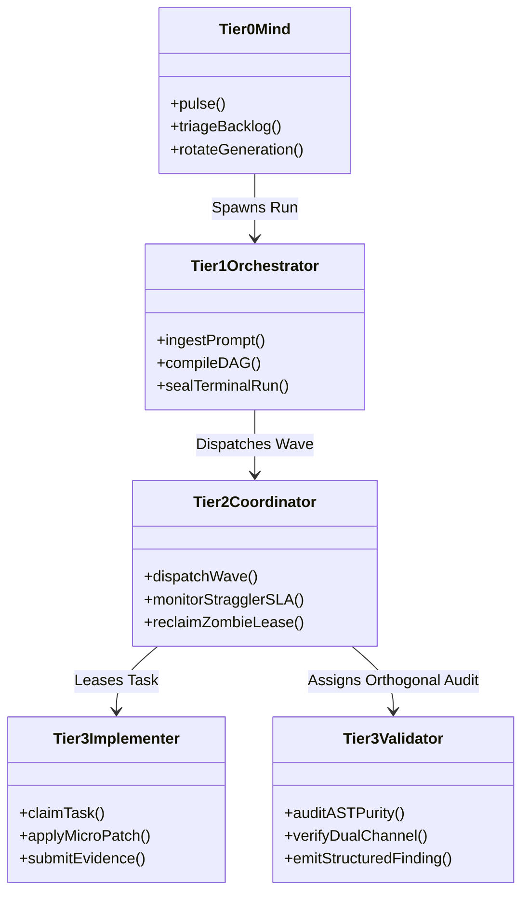
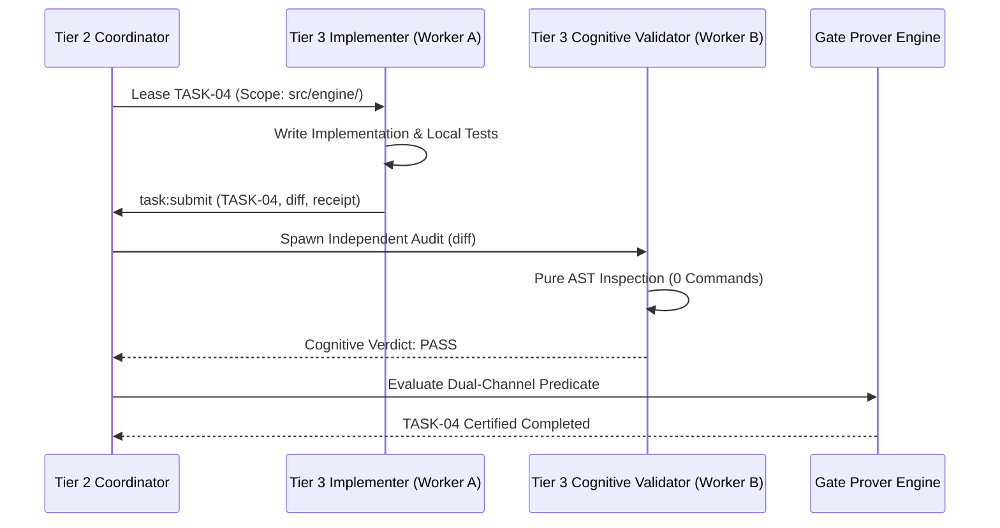

# The Four-Tier Agent Workforce Model

---

[Previous: Chapter 02 Index](index.md) | [Chapter Index](index.md) | [All Chapters Index](../index.md) | [Next: 02-02 Subagent Naming Grammar](02-02-subagent-naming-grammar.md)

---

## 1. Executive Summary & Epistemic Hierarchy

In complex autonomous software engineering pipelines, flat agent swarms where all agents share equal responsibilities inevitably suffer from context dilution, uncoordinated task collisions, and chaotic code merges.

The OLT (Orchestrating Long Tasks) engine enforces a strict Four-Tier Workforce Hierarchy. Under this architecture:

- **Separation of Strategic Planning and Execution**: High-level supervisors (Tiers 0, 1, 2) never touch implementation code directly, preserving their context windows for architectural oversight.
- **Dedicated Execution Lanes**: All code mutations, testing, and validations are performed exclusively by specialized Tier 3 Implementers and Validators operating within isolated worktrees.
- **Orthogonal Dual-Channel Validation**: No agent ever validates its own work; an independent Tier 3 Validator is paired orthogonally with each implementer.

```text
+--------------------------------------------------------------------------------------------------+
│                                 THE FOUR-TIER WORKFORCE HIERARCHY                                │
+--------------------------------------------------------------------------------------------------+
│                                                                                                  │
│   TIER 0: MIND (PRODUCT OWNER)                                                                   │
│   • Perpetual autonomous discovery across 10 sources                                             │
│   • Evaluates 6 admission gates & manages generational rotation                                  │
│   • ZERO file edit authority (Context preserved for roadmap strategy)                            │
│                                │                                                                 │
│                                ▼                                                                 │
│   TIER 1: ORCHESTRATOR                                                                           │
│   • Prompt ingestion & SHA-256 sealing                                                           │
│   • Kahn topological DAG compilation & wave sequencing                                           │
│   • Manages global Merkle event stream & terminal run sealing                                    │
│                                │                                                                 │
│                                ▼                                                                 │
│   TIER 2: DOMAIN COORDINATOR                                                                     │
│   • Domain-specific wave execution & task leasing                                                │
│   • Enforces 5-minute straggler SLA rules & dynamic load throttling                              │
│   • Dispatches and coordinates Tier 3 workforce                                                  │
│                                │                                                                 │
│                                ▼                                                                 │
│   TIER 3: SPECIALIZED WORKFORCE (IMPLEMENTERS & VALIDATORS)                                      │
│   • Implementers: Write code within isolated worktrees (.olt/worktrees/T_i/)                     │
│   • Validators: Orthogonal AST purity audits & mechanical test verification                      │
│                                                                                                  │
+--------------------------------------------------------------------------------------------------+
```

---

## 2. Formal Role Specifications & Authority Matrix

```text
+------+----------------------+------------------------------+--------------------+----------------+
| Tier | Role Title           | Core Responsibilities        | Tool Authority     | File Mutation  |
+------+----------------------+------------------------------+--------------------+----------------+
| 0    | Mind (Product Owner) | Discovery, admission, triage | Mailbox, Doctor    | STRICTLY NONE  |
| 1    | Orchestrator         | DAG planning, wave schedule  | Mailbox, Subagents | STRICTLY NONE  |
| 2    | Domain Coordinator   | Wave dispatch, SLA watchdog  | Mailbox, Subagents | STRICTLY NONE  |
| 3    | Tier 3 Implementer   | Code authoring, micro-tests  | FS Edit, AST Linter| Leased Scope   |
| 3    | Cognitive Validator  | AST audit, Socratic pushback | Read-Only, Mailbox | STRICTLY NONE  |
| 3    | Mechanic-Validator   | Bun test runner, gate proofs | Shell Execution    | Read-Only Proof|
+------+----------------------+------------------------------+--------------------+----------------+
```



---

## 3. Mathematical Workforce Capacity Modeling

Let $W$ denote the total work volume (in atomic task units) and $S$ denote the critical path span (longest dependency path in the DAG).

According to the Brent Work-Span Theorem, the required coordinator capacity $P$ to execute wave $k$ with width bounds $\mathcal{W}(G_k)$ is:

$$P = \min\left( P_{\max}, \; \left\lceil \frac{W_k}{S_k} \right\rceil \right)$$

Where $P_{\max}$ is the host concurrency throttle bound ($\le 8$ parallel agents).

The total cognitive load on supervisory tiers is bounded by $\mathcal{O}(1)$ with respect to task code size, since supervisors only process task metadata tokens:

$$\text{Context}_{\text{supervisor}}(T_i) \le 500 \text{ Cowan Tokens}$$

---

## 4. Orthogonal Validator Pairing Invariant

To guarantee that self-review bias is eliminated, OLT enforces the Orthogonal Validator Pairing Invariant:

$$\forall T_i \in \mathcal{T}, \quad \text{Worker}(T_i) \neq \text{Validator}(T_i)$$

$$\text{Role}(\text{Validator}) \implies \text{WritePermissions}(\mathcal{F}_{\text{repo}}) \equiv \emptyset \land \text{Commands}(\text{Validator}) \equiv \emptyset$$



---

## 5. Architectural Invariants Summary

1. **Supervisor Zero-File-Edit Rule**: Tiers 0, 1, and 2 are mechanically barred from editing source code.
2. **Orthogonal Validation**: Implementers never validate their own code; validators are independently spawned.
3. **Bounded Blast Radius**: Subagent failures are isolated to individual worktree directories, leaving the root clean.

---

[Previous: Chapter 02 Index](index.md) | [Chapter Index](index.md) | [All Chapters Index](../index.md) | [Next: 02-02 Subagent Naming Grammar](02-02-subagent-naming-grammar.md)

---
