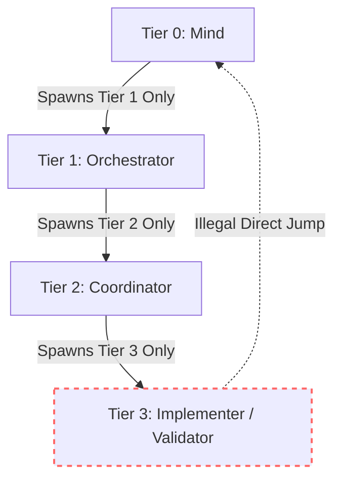

# The Four-Tier Agent Model

[OLT Documentation Hub](../../README.md) > [Architecture Index](../index.md) > [Chapter 02](./index.md) > 02-01 Four-Tier Agent Model

---

[⏮️ Previous: Chapter 02: Four-Tier Hierarchy Overview](index.md) | [📂 Chapter Index](index.md) | [📚 All Chapters Index](../index.md) | [⏭️ Next: 02-02 Subagent Naming Grammar](02-02-subagent-naming-grammar.md)
---

## 1. Motivation & Cognitive Containment

When an LLM attempts to simultaneously track project-level roadmaps, topological graph dependencies, wave dispatching, and low-level code syntax, context degradation occurs rapidly. The Four-Tier Model isolates distinct cognitive horizons into discrete execution tiers.

```text
                      THE COGNITIVE CONTAINMENT SPECTRUM
┌─────────────────────────────────────────────────────────────────────────────┐
│ TIER 0: STRATEGIC HORIZON (Infinite Cadence, 10 Scanners, Roadmap DAGs)     │
├─────────────────────────────────────────────────────────────────────────────┤
│ TIER 1: LIFECYCLE HORIZON (DAG Compilation, Topological Wave Synchronization│
├─────────────────────────────────────────────────────────────────────────────┤
│ TIER 2: TACTICAL HORIZON (Worker Pool Management, Straggler SLA, Watchdog) │
├─────────────────────────────────────────────────────────────────────────────┤
│ TIER 3: ATOMIC EXECUTION HORIZON (AST Mutations, Unit Tests, Binary Proofs) │
└─────────────────────────────────────────────────────────────────────────────┘
```

---

## 2. Role Specifications & Authority Contracts

### Tier 0: Mind (Autonomous Product Owner)

- **Lifecycle**: Infinite autonomous pulse loop governed by [`pulse.sh`](file:///Users/onurseckinsenoglu/repos/skills/olt/scripts/pulse.sh).
- **Mandate**: Scans the codebase across 10 discovery sources, filters items through 6 admission gates ($G_1 \dots G_6$), and maintains the multi-generational roadmap.
- **Boundary**: Strict `CLOSING_FORBIDDEN_FOR_MIND` invariant. Never touches source files or unit tests.

### Tier 1: Wave Orchestrator (DAG Compiler & Governor)

- **Lifecycle**: Single-run scope from `run:init` to `run:complete`.
- **Mandate**: Ingests user prompts, enforces 100% prompt line coverage, compiles DAGs via Kahn's algorithm, and manages disjoint wave barriers ($W_0, W_1, \dots$).
- **Boundary**: Dispatches execution to Tier 2 Coordinators; performs zero direct task execution.

### Tier 2: Coordinator (Wave Execution Supervisor)

- **Lifecycle**: Scoped to an active topological wave $W_k$.
- **Mandate**: Claims tasks for workers, monitors heartbeats ($T_{\text{hb}} = 30\text{s}$), enforces the 5-minute straggler SLA, routes repair tickets, and coordinates wave completion.
- **Boundary**: Cannot modify code; acts as the tactical traffic controller.

### Tier 3: Implementers & Validators (Atomic Execution Workers)

- **Implementer**: Leased to exactly one task ($A_i \leftrightarrow T_j$); executes scoped code mutations within granted paths.
- **Cognitive Validator**: Zero mutating commands policy; reviews code diffs via pure AST inspection and proof receipt evaluation.
- **Mechanic Validator**: Executes hermetic build/test suites and validates exit codes.

---

## 3. Strict Vertical Delegation Rules



1. **Monotonic Spawning Hierarchy**: Tier $k$ can spawn only Tier $k+1$. Spawning across tier boundaries (e.g. Tier 0 spawning Tier 3) is rejected by [`eval-invariants.ts`](file:///Users/onurseckinsenoglu/repos/skills/olt/scripts/src/authority/persona/eval-invariants.ts) with `UNAUTHORIZED_SPAWN_ATTEMPT`.
2. **The Zero-File-Edit Rule**: Any file mutation attempt by Tiers 0, 1, or 2 triggers an immediate fatal `ROLE_CONFINEMENT_VIOLATION`.

---

[⏮️ Previous: Chapter 02: Four-Tier Hierarchy Overview](index.md) | [📂 Chapter Index](index.md) | [📚 All Chapters Index](../index.md) | [⏭️ Next: 02-02 Subagent Naming Grammar](02-02-subagent-naming-grammar.md)
---
