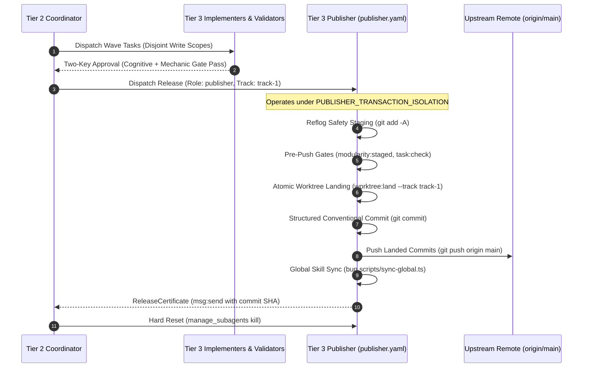

# The Four-Tier Agent Workforce Model

---

[Previous: Chapter 02: Four-Tier Hierarchy](index.md) | [Chapter Index](index.md) | [All Chapters Index](../index.md) | [Next: 02-02 Subagent Naming Grammar](02-02-subagent-naming-grammar.md)

---

## 1. Executive Summary & Epistemic Hierarchy

Flat agent swarms—where all agents share equal responsibilities, unstructured communication channels, and unconstrained write permissions—inevitably suffer from context dilution, task collisions, and catastrophic code churn. When an agent attempts high-level planning, file editing, test execution, and self-review within a single context window, cognitive saturation rapidly degrades performance.

The OLT (Orchestrating Long Tasks) engine enforces a strict **Four-Tier Workforce Hierarchy**:

1. **Strategic & Operational Planning Decoupled from Code**: Supervisory tiers (Tiers 0, 1, 2) never edit code, preserving context windows for strategic roadmapping, dependency graphs, and invariant verification.
2. **Dedicated Execution & Release Lanes**: All file mutations and micro-tests are performed exclusively by leased Tier 3 Implementers in isolated worktrees, while releases are finalized by a dedicated Tier 3 Publisher.
3. **Cognitive Validator Command Hard-Lock**: Cognitive Validators operate with zero command execution privileges ($C(\text{Val}) = 0$), performing Socratic AST inspection.
4. **Supervisor Zero-File-Write Hardening ($Z_{\text{mutation}} = 0$)**: Tiers 0, 1, and 2 are mechanically barred from filesystem writes, enforcing fail-closed role-based access control.

```text
┌─────────────────────────────────────────────────────────────────────────────┐
│                    THE FOUR-TIER WORKFORCE TOPOLOGY                         │
├─────────────────────────────────────────────────────────────────────────────┤
│  [ Tier 0: Strategic Autonomous Governance ]                                │
│    • mind (Autonomous PO/PM, 3-Step Self-Evolution, Zero-Delta Silence)    │
│    • mind-auditor (Liveness Companion) | skill-auditor (Fleet Forensics)    │
│    • Write Scope: Strictly None (0 Code Edits, 0 Terminal Tests)            │
│                          │                                                  │
│                          ▼                                                  │
│  [ Tier 1: Tactical Meta-Orchestration ]                                    │
│    • orchestrator (Multi-Round Loop Runner, Convergence Governance)         │
│    • Write Scope: Strictly None (Dispatches Only Tier 2 Coordinators)       │
│                          │                                                  │
│                          ▼                                                  │
│  [ Tier 2: Operational Wave Coordination & Planning ]                       │
│    • coordinator (Wave Dispatch, 1-Shot Briefings, Hard Reset Discipline)   │
│    • planner (Task Decomposition & Scope Allocation)                        │
│    • Write Scope: Strictly None (0 Code Edits, 0 Git Plumbing)              │
│                          │                                                  │
│                          ▼                                                  │
│  [ Tier 3: Execution, Verification & Release Workforce ]                   │
│    • implementer (Leased Code Author, 1-Hop Micro-Cycles, File Tests)       │
│    • validator & domain validators (Cognitive Reviewers, 0 Commands)        │
│    • ui-headless-validator (Playwright, Hitboxes, 4-Viewport Captures)     │
│    • ui-optical-validator (Headful Visual Inspection, 8 Optical Dimensions) │
│    • completeness-critic (Whole-Run Prompt Fidelity)                        │
│    • plan-validator (DAG Topology Auditor)                                  │
│    • publisher (Atomic Worktree Landings, Pre-Push Gates, Remote Push)      │
│    • sub-implementer, sub-validator, sub-investigator (Branch Children)     │
└─────────────────────────────────────────────────────────────────────────────┘
```

---

## 2. The 20-Role Canonical Taxonomy Matrix

OLT enforces a canonical, non-overlapping 20-role taxonomy across all 4 tiers, completely purging retired roles under the Zero Backwards-Compatibility Purity invariant:

| Tier  | Role Name                 | Architectural Focus                        | Write Scope       | Command Privileges                         |
| :---- | :------------------------ | :----------------------------------------- | :---------------- | :----------------------------------------- |
| **0** | `mind`                    | Strategic roadmap, PO/PM, 3-step evolution | **Strictly None** | Harness commands, git query (0 tests)      |
| **0** | `mind-auditor`            | Companion liveness, anti-stagnation        | **Strictly None** | Mailbox IPC, query tools (0 tests)         |
| **0** | `skill-auditor`           | Fleet forensics, 7 heuristics, meta-audit  | **Strictly None** | Audit tools, queue injection (0 tests)     |
| **1** | `orchestrator`            | Multi-round loop runner, DAG sequencing    | **Strictly None** | Harness lifecycle, wave dispatch (0 tests) |
| **2** | `coordinator`             | Dynamic wave dispatch, 1-shot briefs       | **Strictly None** | Harness dispatch, task:brief (0 tests)     |
| **2** | `planner`                 | Task decomposition, write scope bounds     | **Strictly None** | plan:_, msg:_ (0 code edits)               |
| **3** | `implementer`             | Code authoring, file-scoped testing        | Leased Scope      | bun test <file>, AST linter                |
| **3** | `validator`               | Cognitive Socratic review, AST audit       | **Strictly None** | **0 Commands** (Hard-Lock)                 |
| **3** | `completeness-critic`     | Prompt fidelity vs original bytes          | **Strictly None** | **0 Commands** (Hard-Lock)                 |
| **3** | `publisher`               | Atomic wave landing, pre-push, push        | Git Index/Land    | worktree:land, task:check, doctor          |
| **3** | `ui-headless-validator`   | Playwright tests, DOM hitboxes             | Evidence Only     | bun test:playwright (screenshot capture)   |
| **3** | `ui-optical-validator`    | Headful visual review (4 viewports)        | **Strictly None** | **0 Commands** (view_file only)            |
| **3** | `plan-validator`          | DAG topology audit, acyclicity             | **Strictly None** | **0 Commands** (Hard-Lock)                 |
| **3** | `validator-code-quality`  | Code quality, zero any/suppressions        | **Strictly None** | **0 Commands** (Hard-Lock)                 |
| **3** | `validator-product`       | Feature completeness & requirements        | **Strictly None** | **0 Commands** (Hard-Lock)                 |
| **3** | `validator-security`      | OWASP, injection, sanitization             | **Strictly None** | **0 Commands** (Hard-Lock)                 |
| **3** | `validator-system-design` | System boundaries, modularity limits       | **Strictly None** | **0 Commands** (Hard-Lock)                 |
| **3** | `validator-ui-design`     | Design systems, optical harmony            | **Strictly None** | **0 Commands** (Hard-Lock)                 |
| **3** | `sub-implementer`         | Focused branch leaf execution              | Child Leased      | Parent-scoped test tools                   |
| **3** | `sub-validator`           | Command evidence collection                | Evidence Only     | Read/probe execution (no verdicts)         |
| **3** | `sub-investigator`        | Read-only root-cause diagnosis             | **Strictly None** | view_file, grep_search (0 writes)          |

_Independent Genesis Roles_: `owner` (genesis authority conferral), `independent-planner`, and `independent-planner-audit`.  
_Permanently Purged_: `worker`, `critic`, and duplicate UI roles; repair is handled in-lease by the same implementer, and static/type checks are anchored in `task:check`.

---

## 3. Supervisor Zero-File-Write Hardening ($Z_{\text{mutation}} = 0$)

The supervisory tiers ($\tau(a) < 3$) are mathematically barred from the write authority set $\mathcal{W}(\mathcal{F}_{\text{repo}})$:

$$\forall a \in \mathcal{A}, \quad \tau(a) < 3 \implies \mathcal{W}_a(\mathcal{F}_{\text{repo}}) \equiv \emptyset$$

All supervisory manifests (`mind.yaml`, `orchestrator.yaml`, `coordinator.yaml`) hold `enable_write_tools: false` and `can_edit: false`. Supervisory agents must never directly modify files, author code, or execute test suites. Any write attempt immediately triggers a fail-closed trap:

$$ \text{AssertZeroMutation}(a, f) = \begin{cases}
\text{OK} & \text{if } \tau(a) = 3 \land f \in \mathcal{S}_{\text{granted}}(a) \\
\text{TRAP}(\text{SUPERVISOR\_WRITE\_FAULT}) & \text{if } \tau(a) < 3 \\
\text{TRAP}(\text{SCOPE\_ESCAPE\_FAULT}) & \text{if } \tau(a) = 3 \land f \notin \mathcal{S}_{\text{granted}}(a)
\end{cases}$$

---

## 4. Tier 3 Dedicated Publisher (`publisher.yaml`)

To eliminate supervisory overloading—where Coordinators and Orchestrators leaked context and burned tokens on git plumbing, diff diagnosis, pre-push hook failures, and merge conflict resolution—OLT formalizes a dedicated release subagent: **`publisher`** ([`publisher.yaml`](../../../../olt/agents/publisher.yaml)).



### Publisher Authority & Invariants:
- **Manifest**: [`olt/agents/publisher.yaml`](../../../../olt/agents/publisher.yaml), Tier 3, `enable_write_tools: true` (for git index/commit transactions only), `enable_subagent_tools: false`.
- **Authorized Commands**: `worktree:land`, `worktree:clean`, `worktree:status`, `task:check`, `doctor`, `whoami`, `msg:send`, `msg:recv`.
- **Prohibitions**: Strictly forbidden from editing application source files outside release transactions, claiming implementation tasks, or rendering validation verdicts.
- **Invariants**: `PUBLISHER_TRANSACTION_ISOLATION`, `ZERO_SOURCE_EDITS`, `ATOMIC_RELEASE_ONLY`, `MANDATORY_DOCTOR_VERIFY_BEFORE_TURN_COMPLETION`.

---

## 5. Dual-Channel Verification & Cognitive Validator Hard-Lock

To eliminate self-review bias and hallucinated test passes, every implementation undergoes dual-channel verification:

$$\forall T_i \in \mathcal{T}, \quad \text{Implementer}(T_i) \neq \text{Validator}_{\text{cog}}(T_i)$$

```text
┌──────────────────────────────────────┬──────────────────────────────────────┐
│ CHANNEL A: COGNITIVE VALIDATION      │ CHANNEL B: MECHANICAL GATE PROOF     │
├──────────────────────────────────────┼──────────────────────────────────────┤
│ • Role: Tier 3 Cognitive Validator   │ • Role: Deterministic CLI / Runner   │
│ • Commands: 0 Commands (Hard-Lock)   │ • Tool: task:check (tsc, AST audits) │
│ • Analysis: AST purity, zero any,    │ • Unit Tests: Implementer file-run   │
│   zero suppressions, Socratic audit  │ • UI Surfaces: ui-headless-validator │
│ • Proof: Structured Finding Record   │ • Proof: Cryptographic Exit Receipt  │
└──────────────────────────────────────┴──────────────────────────────────────┘
```

Cognitive Validators operate under absolute command isolation:
$$\text{Commands}(\text{Validator}_{\text{cog}}) \equiv \emptyset \land \mathcal{W}(\mathcal{F}_{\text{repo}}) \equiv \emptyset$$

Mandatory gate evidence is resolved via detached evidence (`task:review --evidence <cmd-id>`) or automatic fallback to passing implementer command receipts, preventing validator command execution lockouts.

---

## 6. TypeScript Contracts and Failure Recovery

Role contracts are implemented under [`session/types.ts`](../../../../olt/scripts/src/authority/session/types.ts) and [`capability-matrix.ts`](../../../../olt/scripts/src/roles/capability-matrix.ts):

```typescript
export type TierLevel = 0 | 1 | 2 | 3;
export type RoleArchetype = "mind" | "orchestrator" | "coordinator" | "implementer" | "validator" | "publisher";

export class RoleEnforcementGuard {
  public static validateWritePermission(token: AgentAuthorityToken, targetFilePath: string): void {
    if (token.tier < 3 || !token.writeAllowed) {
      throw new Error(`SUPERVISOR_WRITE_FAULT: Agent ${token.agentId} (Tier ${token.tier}) cannot modify files`);
    }
    if (!token.grantedScope.some((p) => targetFilePath.startsWith(p))) {
      throw new Error(`SCOPE_ESCAPE_FAULT: Agent ${token.agentId} attempted write outside scope: ${targetFilePath}`);
    }
  }

  public static validateValidatorPrivilege(token: AgentAuthorityToken): void {
    if (token.role.includes("validator") && token.commandExecutionAllowed) {
      throw new Error(`VALIDATOR_COMMAND_FAULT: Cognitive Validator ${token.agentId} cannot execute shell commands`);
    }
  }
}
```

### Anti-Blunder Failure Matrix:

| Failure Code | Root Cause | Defense & Recovery |
| :--- | :--- | :--- |
| `SUPERVISOR_WRITE_FAULT` | Tier 0/1/2 agent attempts file edit | Fail-closed write interception; immediate rejection. |
| `SCOPE_ESCAPE_FAULT` | Implementer modifies unleased file | Worktree boundary filter; rollback transaction. |
| `VALIDATOR_COMMAND_FAULT`| Validator attempts terminal command | Command Hard-Lock traps call; enforces Socratic read. |
| `SUPERVISOR_PLUMBING_LEAK`| Supervisor runs git commit/push | Hard-routed to dedicated Tier 3 `publisher`. |
| `STRAGGLER_TIMEOUT_TRAP` | Worker inactive for >300 seconds | Coordinator revokes monotonic lease; re-leases to pool. |

---

## 7. Architectural Invariants Summary

- **Invariant $\mathcal{C}_1$ (Four-Tier Stratification)**: Unidirectional top-down delegation; cross-tier bypassing is mechanically barred.
- **Invariant $\mathcal{C}_2$ (Monotonic Writer Lease)**: Exactly one implementer holds an active write lease per task at any instant.
- **Invariant $\mathcal{C}_4$ (Dual-Channel Verification)**: Independent cognitive AST purity proofs and mechanical test receipts required for task certification.
- **Invariant $\mathcal{C}_7$ (Cognitive Validator Hard-Lock)**: Validators are barred from issuing commands or modifying repository files.
- **Invariant $\mathcal{C}_8$ (Supervisor Zero-File-Write)**: Tiers 0, 1, and 2 hold zero filesystem mutation authority ($Z_{\text{mutation}} = 0$).
- **Invariant $\mathcal{C}_{12}$ (Publisher Isolation)**: Upstream merges, landings, and releases are owned by Tier 3 Publisher.

---

[Previous: Chapter 02: Four-Tier Hierarchy](index.md) | [Chapter Index](index.md) | [All Chapters Index](../index.md) | [Next: 02-02 Subagent Naming Grammar](02-02-subagent-naming-grammar.md)
$$
