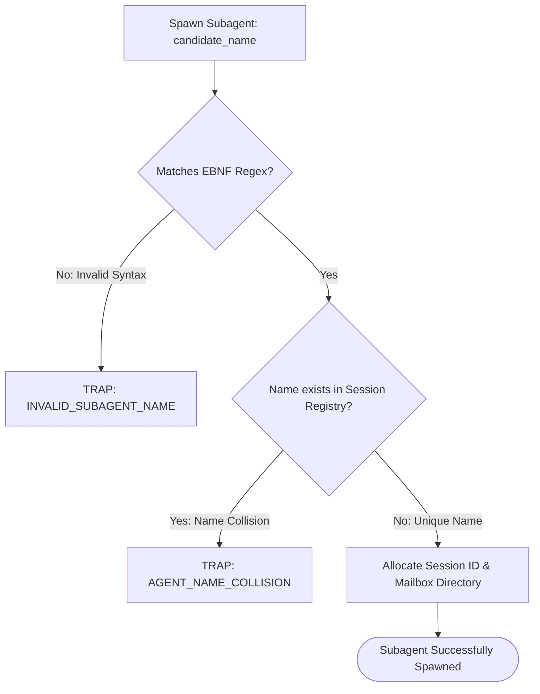
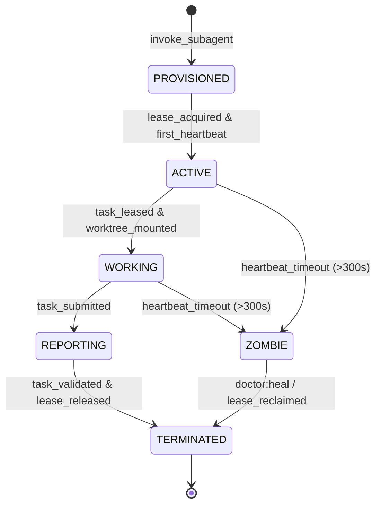

# Subagent Naming Grammar & Lifecycle Management

---

[Previous: 02-01 The Four-Tier Agent Model](02-01-the-four-tier-agent-model.md) | [Chapter Index](index.md) | [All Chapters Index](../index.md) | [Next: 02-03 Host Parity & Adapters](02-03-host-parity-and-adapters.md)

---

## 1. Executive Summary & Epistemic Naming Discipline

In distributed multi-agent systems where dozens of subagents are spawned, leased, and rotated concurrently, unstructured agent naming causes catastrophic telemetry collisions:

- Log parsers cannot distinguish between a supervisory orchestrator and an ephemeral worker.
- Message routing delivers task instructions to wrong agent mailboxes.
- Zombie processes and orphaned worktrees become untraceable back to their originating tasks.

The OLT (Orchestrating Long Tasks) engine establishes the **Subagent Naming Grammar & Lifecycle Protocol**. Under this specification:

1. **Strict EBNF Grammar**: Every subagent name must conform to an unambiguous, machine-parseable formal grammar encoding role, domain scope, and task identifier.
2. **Deterministic Mailbox Addressing**: Agent names map 1:1 to filesystem mailbox directories under `.olt/capsules/<slug>/mailbox/<agent_id>/`.
3. **Collision-Free Lifecycle Tracking**: A central Session Registry guarantees that duplicate names are rejected at spawn time.

```text
+--------------------------------------------------------------------------------------------------+
│                             SUBAGENT NAMING STRUCTURE & EXAMPLES                                 │
+--------------------------------------------------------------------------------------------------+
│                                                                                                  │
│   NAME PATTERN:  <role>_<scope>_<task_id>                                                        │
│                                                                                                  │
│   Examples:                                                                                      │
│   • coordinator_core_wave-1       ──► Tier 2 Coordinator for Core Domain Wave 1                  │
│   • implementer_engine_task-04    ──► Tier 3 Implementer executing Task 04 in Engine scope       │
│   • validator_ast-lint_task-04    ──► Tier 3 Validator auditing AST purity for Task 04           │
│   • mechanic_test-runner_task-04  ──► Tier 3 Mechanic-Validator executing Bun test suite         │
│                                                                                                  │
+--------------------------------------------------------------------------------------------------+
```

---

## 2. Formal EBNF Grammar Specification

The subagent identifier grammar is formally defined in Extended Backus-Naur Form (EBNF):

```ebnf
AgentIdentifier     ::= Role "_" DomainScope "_" TaskSequence ;
Role                ::= "mind" | "orchestrator" | "coordinator" | "implementer" | "validator" | "mechanic" ;
DomainScope         ::= AlphaLower { "-" AlphaLower } ;
TaskSequence        ::= ( "wave-" Digit { Digit } ) | ( "task-" Digit { Digit } ) | ( "gen-" Digit { Digit } ) ;
AlphaLower          ::= "a" | "b" | "c" | ... | "z" ;
Digit               ::= "0" | "1" | "2" | ... | "9" ;
```

### Regular Expression Validator

The TypeScript runtime validates subagent names against the canonical regex:

```regex
^(mind|orchestrator|coordinator|implementer|validator|mechanic)_[a-z0-9-]+_(wave-[0-9]+|task-[0-9]+|gen-[0-9]+)$
```



---

## 3. Subagent Lifecycle State Machine



---

## 4. Session Registry & Anti-Collision Engine

The session registry ([`session-registry.ts`](file:///Users/onurseckinsenoglu/repos/skills/olt/scripts/src/authority/session/session-registry.ts)) maintains active agent sessions:

```typescript
export interface AgentSessionRecord {
  readonly agentId: string;
  readonly role: "mind" | "orchestrator" | "coordinator" | "implementer" | "validator" | "mechanic";
  readonly scope: string;
  readonly taskId: string;
  readonly spawnedAt: string;
  readonly lastHeartbeat: string;
  readonly status: "ACTIVE" | "ZOMBIE" | "TERMINATED";
}
```

---

## 5. Architectural Invariants Summary

1. **Unambiguous Identifiers**: All agent IDs encode role, domain, and task sequence.
2. **Zero Name Collision**: Spawning an agent with an active ID fails closed.
3. **Deterministic Cleanup**: Session records are archived to `events.jsonl` upon termination.

---

[Previous: 02-01 The Four-Tier Agent Model](02-01-the-four-tier-agent-model.md) | [Chapter Index](index.md) | [All Chapters Index](../index.md) | [Next: 02-03 Host Parity & Adapters](02-03-host-parity-and-adapters.md)

---
