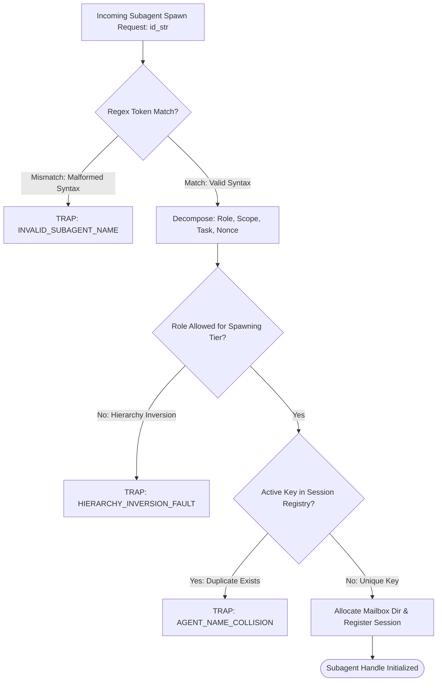
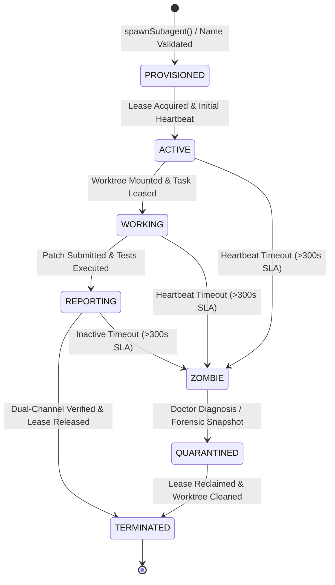

# Subagent Naming Grammar & Lifecycle Management

---

[Previous: 02-01 The Four-Tier Agent Model](02-01-the-four-tier-agent-model.md) | [Chapter Index](index.md) | [All Chapters Index](../index.md) | [Next: 02-03 Host Parity & Adapters](02-03-host-parity-and-adapters.md)

---

## 1. Executive Summary & Epistemic Naming Discipline

In distributed multi-agent execution runtimes where dozens of ephemeral subagents are spawned, leased, and rotated concurrently, unstructured or arbitrary agent naming is an existential vulnerability:

- **Telemetry Collision**: Log parsers and event ledgers cannot distinguish between a high-level supervisory coordinator and an ephemeral task worker.
- **Message Misrouting**: Unstructured identifiers lead to mailbox cross-talk, where task completion receipts or failure payloads are delivered to the wrong agent queues.
- **Zombie Process Opacity**: When an execution thread hangs, operators and automated watchdog scripts cannot trace orphaned worktrees or dangling file locks back to their originating tasks.
- **Security Boundary Bleed**: Lacking deterministic role tokens, runtime sandboxes cannot mechanically enforce tier-based permission lattices.

The OLT (Orchestrating Long Tasks) engine resolves this through the **Formal Subagent Naming Grammar & Lifecycle Protocol**. Under this specification:

1. **Strict EBNF Grammar**: Every subagent identifier must strictly parse against a deterministic Extended Backus-Naur Form grammar that explicitly encodes role archetype, domain scope, task sequence, and a collision-resistant nonce.
2. **Deterministic Mailbox Addressing**: Agent names map 1:1 to filesystem-backed mailbox queues under `.olt/capsules/<slug>/mailbox/<agent_id>/`.
3. **Fail-Closed Session Registry**: The central Session Registry enforces unique active registration at spawn time, rejecting syntax violations and duplicate keys fail-closed.
4. **Monotonic Lifecycle State Machine**: Subagents advance through strict, unidirectional lifecycle states governed by cryptographic leases and periodic heartbeats.

```text
+--------------------------------------------------------------------------------------------------+
│                             SUBAGENT NAMING STRUCTURE & TOKEN ANATOMY                            │
+--------------------------------------------------------------------------------------------------+
│                                                                                                  │
│   CANONICAL GRAMMAR PATTERN:  <role>_<scope>_<sequence>[-<nonce>]                                │
│                                                                                                  │
│   ┌──────────────┐   ┌──────────────┐   ┌────────────────────────┐   ┌────────────────────────┐  │
│   │     ROLE     │ _ │    SCOPE     │ _ │     TASK SEQUENCE      │ - │     NONCE (OPTIONAL)   │  │
│   └──────────────┘   └──────────────┘   └────────────────────────┘   └────────────────────────┘  │
│          │                  │                        │                           │               │
│          ▼                  ▼                        ▼                           ▼               │
│     Tier Archetype    Domain Boundary         DAG Task / Wave ID          Hex Epoch / Nonce      │
│     (e.g., implementer)(e.g., engine-core)   (e.g., task-04, wave-2)     (e.g., 8f2b1a)          │
│                                                                                                  │
│   Concrete Examples:                                                                             │
│   • coordinator_core-engine_wave-01            ──► Tier 2 Coordinator for Core Engine Wave 1     │
│   • implementer_ast-parser_task-04-a9f1        ──► Tier 3 Implementer authoring Task 04          │
│   • validator_ast-lint_task-04-c3e2            ──► Tier 3 Cognitive Validator auditing Task 04   │
│   • mechanic_test-runner_task-04-e5d0          ──► Tier 3 Mechanic-Validator executing tests     │
│                                                                                                  │
+--------------------------------------------------------------------------------------------------+
```

---

## 2. Formal EBNF Grammar Specification

The subagent naming syntax is formally specified in Extended Backus-Naur Form (EBNF):

```ebnf
SubagentIdentifier  ::= Role "_" DomainScope "_" TaskSequence [ "-" Nonce ] ;

Role                ::= "mind"
                      | "orchestrator"
                      | "coordinator"
                      | "implementer"
                      | "validator"
                      | "mechanic" ;

DomainScope         ::= AlphaLower { ( AlphaLower | Digit | "-" ) } ;

TaskSequence        ::= WaveSequence | TaskUnitSequence | GenSequence ;

WaveSequence        ::= "wave-" Digit { Digit } ;
TaskUnitSequence    ::= "task-" Digit { Digit } ;
GenSequence         ::= "gen-" Digit { Digit } ;

Nonce               ::= HexChar HexChar HexChar HexChar [ HexChar HexChar ] ;

AlphaLower          ::= "a" | "b" | "c" | "d" | "e" | "f" | "g" | "h" | "i" | "j"
                      | "k" | "l" | "m" | "n" | "o" | "p" | "q" | "r" | "s" | "t"
                      | "u" | "v" | "w" | "x" | "y" | "z" ;

Digit               ::= "0" | "1" | "2" | "3" | "4" | "5" | "6" | "7" | "8" | "9" ;

HexChar             ::= Digit | "a" | "b" | "c" | "d" | "e" | "f" ;
```

### 2.1 Canonical Regular Expression

Every agent spawn request is verified against the canonical compiled regular expression before session allocation:

```regex
^(mind|orchestrator|coordinator|implementer|validator|mechanic)_[a-z0-9-]+_(wave-[0-9]+|task-[0-9]+|gen-[0-9]+)(-[0-9a-f]{4,6})?$
```



### 2.2 Mathematical Nonce Collision Bounds

When concurrent task workers are spawned across identical domains, nonces eliminate identifier collision risk. Let $k$ denote the number of concurrent agents spawned in a given domain scope within the same epoch window, and let $N = 16^6 = 16,777,216$ denote the size of the 6-hex-digit nonce sample space.

The probability of at least one collision $P(\text{collision})$ is bounded by the Poisson approximation:

$$P(\text{collision}) \approx 1 - \exp\left( -\frac{k(k - 1)}{2N} \right)$$

For the maximum concurrency throttle limit $k = 16$:

$$P(\text{collision}) \approx 1 - \exp\left( -\frac{16 \times 15}{2 \times 16,777,216} \right) = 1 - \exp(-7.15 \times 10^{-6}) \approx 7.15 \times 10^{-6}$$

This guarantees negligible collision risk during high-throughput parallel execution waves.

---

## 3. Deterministic Mailbox Directory Mapping & Filesystem Isolation

OLT maps each agent identifier directly to an isolated directory structure within the capsule filesystem. This guarantees clean inter-agent messaging with zero reliance on centralized in-memory brokers that could lose state during crashes.

```text
.olt/capsules/<capsule-slug>/mailbox/
├── coordinator_core-engine_wave-01/
│   ├── inbox/              <── Incoming packets from Orchestrator / Implementers
│   ├── outbox/             <── Outgoing wave dispatch instructions
│   ├── receipts/           <── Dual-channel verification receipts
│   └── heartbeat.json      <── Monotonic heartbeat timestamp
│
├── implementer_ast-parser_task-04-a9f1/
│   ├── inbox/              <── Task lease packet & scope permissions
│   ├── outbox/             <── Patch submission & micro-test results
│   ├── worktree.lock       <── Mount descriptor for .olt/worktrees/task-04/
│   └── heartbeat.json      <── Monotonic heartbeat timestamp
│
└── validator_ast-lint_task-04-c3e2/
    ├── inbox/              <── Read-only audit assignment packet
    ├── outbox/             <── Structured findings & cognitive verdict
    └── heartbeat.json      <── Monotonic heartbeat timestamp
```

### 3.1 Mathematical Routing & Atomic Delivery

Let $M$ denote a message packet and $\mathcal{A}_{\text{active}}$ denote the set of registered subagents. The delivery function $\mathcal{D}: M \times \mathcal{A}_{\text{active}} \rightarrow \text{FS\_Result}$ is defined as:

$$\mathcal{D}(m, a) = \text{AtomicWrite}\left(\text{Path}(a, \text{"inbox"}), \quad m_{\text{payload}}, \quad \text{SHA256}(m)\right)$$

Delivery is implemented via temporary write and atomic rename operations:

$$\text{AtomicWrite}(P, D, H) \equiv \left[ \text{Write}\left(P + \text{".tmp"}, D\right) \implies \text{Rename}\left(P + \text{".tmp"}, P + "/" + H + \text{".json"}\right) \right]$$

This mathematical guarantee eliminates partial packet reads and race conditions across concurrent agent threads.

---

## 4. Subagent Lifecycle State Machine & Session Registry

Every subagent transitions through a strict, deterministic finite state machine (FSM). State transitions are monotonic and sealed in the Merkle event log.



### 4.1 Lifecycle States & Transition Predicates

Let $t_{\text{now}}$ be the current epoch timestamp, $t_{\text{hb}}$ be the last recorded heartbeat timestamp, and $\Delta t_{\text{SLA}} = 300\text{ seconds}$ be the straggler threshold.

$$ \text{State}(a) = \begin{cases}
\text{ZOMBIE} & \text{if } (t_{\text{now}} - t_{\text{hb}}) > \Delta t_{\text{SLA}} \land \text{State}(a) \in \{\text{ACTIVE}, \text{WORKING}, \text{REPORTING}\} \\
\text{TERMINATED} & \text{if } \text{TaskCompleted}(a) \land \text{DualChannelPassed}(a) \\
\text{WORKING} & \text{if } \text{WorktreeMounted}(a) \land \text{LeaseActive}(a) \\
\text{ACTIVE} & \text{if } (t_{\text{now}} - t_{\text{hb}}) \le \Delta t_{\text{SLA}} \land \neg\text{WorktreeMounted}(a)
\end{cases}$$

---

## 5. TypeScript AST Grammar Parser & Mailbox Contracts

The grammar parser and session registry are implemented in TypeScript under [`session/index.ts`](file:///Users/onurseckinsenoglu/repos/skills/olt/scripts/src/authority/session/index.ts):

```typescript
export type SubagentRole =
  | "mind"
  | "orchestrator"
  | "coordinator"
  | "implementer"
  | "validator"
  | "mechanic";

export type AgentLifecycleState =
  | "PROVISIONED"
  | "ACTIVE"
  | "WORKING"
  | "REPORTING"
  | "ZOMBIE"
  | "QUARANTINED"
  | "TERMINATED";

export interface ParsedSubagentIdentifier {
  readonly rawIdentifier: string;
  readonly role: SubagentRole;
  readonly domainScope: string;
  readonly taskSequence: string;
  readonly sequenceType: "wave" | "task" | "gen";
  readonly sequenceNumber: number;
  readonly nonce?: string;
}

export interface AgentSessionRecord {
  readonly agentId: string;
  readonly parsed: ParsedSubagentIdentifier;
  readonly conversationId: string;
  readonly state: AgentLifecycleState;
  readonly mailboxPath: string;
  readonly worktreePath?: string;
  readonly leasedTaskId?: string;
  readonly spawnedAtTimestamp: number;
  readonly lastHeartbeatTimestamp: number;
}

export interface MailboxMessagePacket<T = unknown> {
  readonly messageId: string;
  readonly senderId: string;
  readonly recipientId: string;
  readonly messageType: "TASK_LEASE" | "TASK_SUBMISSION" | "AUDIT_FINDING" | "HEARTBEAT" | "REVOCATION";
  readonly payload: T;
  readonly sentAtTimestamp: number;
  readonly payloadSha256: string;
}

export class SubagentNameParser {
  private static readonly CANONICAL_REGEX =
    /^(mind|orchestrator|coordinator|implementer|validator|mechanic)_([a-z0-9-]+)_(wave-[0-9]+|task-[0-9]+|gen-[0-9]+)(?:-([0-9a-f]{4,6}))?$/;

  public static parse(rawIdentifier: string): ParsedSubagentIdentifier {
    const match = this.CANONICAL_REGEX.exec(rawIdentifier);
    if (!match) {
      throw new Error(
        `TRAP_INVALID_SYNTAX: Subagent identifier '${rawIdentifier}' violates EBNF naming grammar.`
      );
    }

    const [, roleStr, domainScope, seqStr, nonce] = match;
    const [seqPrefix, seqNumStr] = seqStr.split("-");

    return {
      rawIdentifier,
      role: roleStr as SubagentRole,
      domainScope,
      taskSequence: seqStr,
      sequenceType: seqPrefix as "wave" | "task" | "gen",
      sequenceNumber: parseInt(seqNumStr, 10),
      nonce: nonce || undefined,
    };
  }

  public static format(
    role: SubagentRole,
    domainScope: string,
    sequenceType: "wave" | "task" | "gen",
    sequenceNumber: number,
    nonce?: string
  ): string {
    const base = `${role}_${domainScope}_${sequenceType}-${sequenceNumber}`;
    return nonce ? `${base}-${nonce}` : base;
  }
}

export class SessionRegistryEngine {
  private readonly sessions = new Map<string, AgentSessionRecord>();

  public registerSession(record: AgentSessionRecord): void {
    if (this.sessions.has(record.agentId)) {
      const existing = this.sessions.get(record.agentId)!;
      if (existing.state !== "TERMINATED") {
        throw new Error(
          `TRAP_AGENT_NAME_COLLISION: Active session already registered for ${record.agentId}`
        );
      }
    }
    this.sessions.set(record.agentId, record);
  }

  public recordHeartbeat(agentId: string, timestamp: number): void {
    const session = this.sessions.get(agentId);
    if (!session) {
      throw new Error(`TRAP_UNREGISTERED_AGENT: No session found for ${agentId}`);
    }
    this.sessions.set(agentId, {
      ...session,
      lastHeartbeatTimestamp: timestamp,
    });
  }

  public reapZombieSessions(currentTime: number, timeoutMs = 300_000): AgentSessionRecord[] {
    const zombies: AgentSessionRecord[] = [];
    for (const [id, session] of this.sessions.entries()) {
      if (
        session.state !== "TERMINATED" &&
        session.state !== "QUARANTINED" &&
        currentTime - session.lastHeartbeatTimestamp > timeoutMs
      ) {
        const updated: AgentSessionRecord = { ...session, state: "ZOMBIE" };
        this.sessions.set(id, updated);
        zombies.push(updated);
      }
    }
    return zombies;
  }
}
```

---

## 6. Failure Taxonomy & Anti-Blunder Matrix

```text
+---------------------------------+------------------------------------------+-------------------------------------------------------------+
| Failure Code                    | Trigger Condition                        | Mechanical Mitigation & System Response                     |
+---------------------------------+------------------------------------------+-------------------------------------------------------------+
| TRAP_INVALID_SYNTAX             | Name does not match canonical EBNF regex | Spawn rejected fail-closed; error logged to Merkle stream.  |
| TRAP_AGENT_NAME_COLLISION       | Candidate name matches active session    | Spawn rejected; appends pseudorandom hex nonce & retries.   |
| TRAP_HIERARCHY_INVERSION_FAULT  | Tier 3 agent attempts to spawn Tier 2    | RBAC interlock checks spawning authority token; aborts call.|
| TRAP_SCOPE_MISMATCH             | Task ID belongs to different domain scope| Validator checks DAG domain mapping; rejects registration.  |
| TRAP_ZOMBIE_HEARTBEAT_EXPIRED   | No heartbeat received for > 300s         | Watchdog moves state to ZOMBIE; revokes task lease.         |
| TRAP_MAILBOX_DIR_CORRUPT        | Mailbox inbox/outbox directory missing   | Session registry reconstructs mailbox filesystem tree.      |
+---------------------------------+------------------------------------------+-------------------------------------------------------------+
```

### Anti-Blunder Rules for Subagent Lifecycle

1. **Never Re-Use Active Session Identifiers**: If a task requires re-execution after a failure, generate a fresh subagent name with an incremented sequence or distinct nonce (e.g., `implementer_engine_task-04-b1c2`).
2. **Never Allow Unregistered Spawns**: Host platforms must never spawn background agent processes without writing an atomic registration entry in `AgentSessionRecord`.
3. **Never Skip Heartbeat Updates**: Active workers must pulse their `heartbeat.json` file at intervals $\le 30$ seconds during heavy computation or tool execution.
4. **Never Retain Orphaned Worktrees**: When an agent session reaches `TERMINATED` or `QUARANTINED`, the runtime must execute an atomic cleanup of its temporary workspace.

---

## 7. Architectural Invariants Summary

- **Invariant $\mathcal{C}_5$ (Monotonic Lifecycle Ordering)**: Subagent state transitions are strictly unidirectional; an agent cannot revert from `TERMINATED` or `ZOMBIE` back to `ACTIVE`.
- **Invariant $\mathcal{C}_{11}$ (Strict 1:1 Anti-Batching)**: Each subagent is bound to exactly one atomic task sequence identifier; multi-task batching under a single identifier is prohibited.
- **Invariant $\mathcal{C}_{14}$ (5-Minute Straggler SLA Revocation)**: Any subagent whose heartbeat delta exceeds 300 seconds is unconditionally declared a zombie, and its task lease is reclaimed.

---

[Previous: 02-01 The Four-Tier Agent Model](02-01-the-four-tier-agent-model.md) | [Chapter Index](index.md) | [All Chapters Index](../index.md) | [Next: 02-03 Host Parity & Adapters](02-03-host-parity-and-adapters.md)

---
$$
