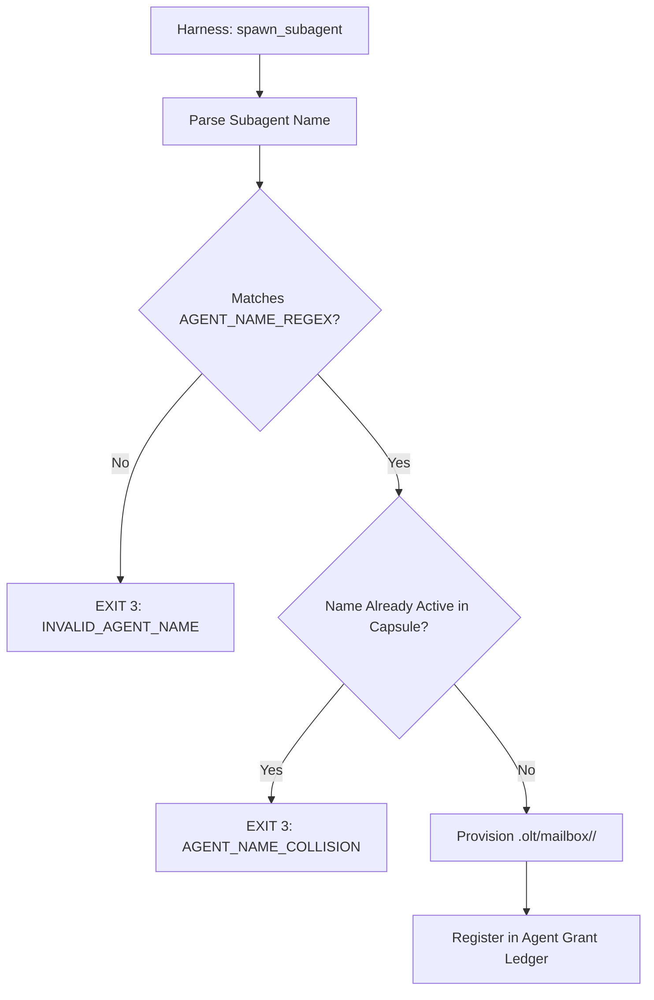

# Subagent Naming Grammar & Namespace Anti-Collision

[OLT Documentation Hub](../../README.md) > [Architecture Index](../index.md) > [Chapter 02](./index.md) > 02-02 Subagent Naming Grammar

---

[⏮️ Previous: 02-01 The Four-Tier Agent Model](02-01-the-four-tier-agent-model.md) | [📂 Chapter Index](index.md) | [📚 All Chapters Index](../index.md) | [⏭️ Next: 02-03 Host Parity & Adapters](02-03-host-parity-and-adapters.md)
---

## 1. Motivation: Namespace Pollution & Ambiguity

In unstructured multi-agent deployments, agents spawn subagents with arbitrary, generic, or colliding names (e.g. `worker_1`, `temp_agent`, `test_helper`). This causes severe failure modes:

1. **Lease Hijacking**: Two parallel workers claim the same task ID.
2. **Mailbox Directory Collisions**: Mailboxes in `.olt/capsules/<slug>/mailbox/<agent_id>/` overwrite each other.
3. **Forensic Audit Collapse**: Post-mortem logs cannot attribute specific file edits to distinct execution lanes.

---

## 2. Formal EBNF Naming Grammar

OLT mandates a strict, deterministic naming grammar for every subagent spawned in the system:

```ebnf
SubagentIdentifier  ::= Role "_" Scope "_" TaskIdentifier
Role                ::= "mind" | "orchestrator" | "coordinator"
                      | "implementer" | "validator" | "mechanic_validator"
                      | "plan_validator" | "meta_auditor" | "critic"
Scope               ::= AlphaNumericLower ( "-" AlphaNumericLower )*
TaskIdentifier      ::= "task-" Integer | "wave-" Integer | "gen-" Integer | "audit-" Integer
AlphaNumericLower   ::= [a-z0-9]+
Integer             ::= [0-9]+
```

```text
                        CANONICAL IDENTIFIER STRUCTURE
  implementer_auth_task-102
  └────┬────┘ └─┬──┘ └───┬────┘
       │        │        └────── Target Task / Wave ID
       │        └─────────────── Functional Scope / Subsystem
       └──────────────────────── Base Role Archetype
```

---

## 3. Identifier Validation & Enforcement

Every agent creation call is verified against the canonical regex in [`naming.ts`](file:///Users/onurseckinsenoglu/repos/skills/olt/scripts/src/agents/naming.ts):

```typescript
export const AGENT_NAME_REGEX = /^[a-z0-9]+(?:_[a-z0-9-]+)+$/;
```



### Valid vs. Prohibited Identifiers

| Identifier Candidate        | Validation Status | Rationale                                               |
| :-------------------------- | :---------------- | :------------------------------------------------------ |
| `implementer_auth_task-101` | **VALID**         | Conforms to `<role>_<scope>_<task_id>`.                 |
| `validator_api_task-102`    | **VALID**         | Distinct role, clear subsystem scope, explicit task ID. |
| `worker_1`                  | **PROHIBITED**    | Generic placeholder, missing scope and task binding.    |
| `temp_agent`                | **PROHIBITED**    | No structural role taxonomy.                            |
| `implementer_auth`          | **PROHIBITED**    | Missing explicit task/wave sequence binding.            |

---

[⏮️ Previous: 02-01 The Four-Tier Agent Model](02-01-the-four-tier-agent-model.md) | [📂 Chapter Index](index.md) | [📚 All Chapters Index](../index.md) | [⏭️ Next: 02-03 Host Parity & Adapters](02-03-host-parity-and-adapters.md)
---
