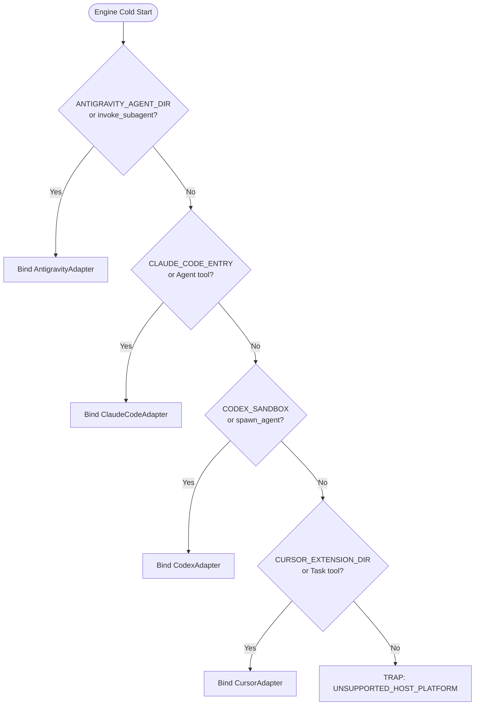

# Host Parity & Universal Adapter Interfaces

---

[Previous: 02-02 Subagent Naming Grammar](02-02-subagent-naming-grammar.md) | [Chapter Index](index.md) | [All Chapters Index](../index.md) | [Next: 02-04 Modular File & Directory Budgets](02-04-modular-file-and-directory-budgets.md)

---

## 1. Executive Summary & The Host Portability Challenge

Autonomous software engineering agents operate across multiple AI development platforms. Leading host environments—Antigravity, Claude Code, Codex, and Cursor—introduce distinct tool invocation signatures, subagent spawning mechanisms, IPC messaging paradigms, and shell sandboxes:

- **Antigravity**: Native subagent tool `invoke_subagent`, MCP tools, message bus IPC, background task manager.
- **Claude Code**: Tool primitives `Agent`, `Bash`, `FileEdit`, `Glob`, `Grep`, slash-command interfaces.
- **Codex**: OpenAI multi-agent harness primitives, `spawn_agent`, direct IPC mailboxes.
- **Cursor**: Extension hooks, `Task` tool, headless terminal multiplexers.

If the core OLT scheduling and execution engine were tightly coupled to any single platform's API conventions, portability would collapse, and multi-agent workflows would require brittle rewrites for each environment.

The OLT engine resolves this via the **Universal Host Adapter Architecture (`IHostAdapter`)**:

1. **Host-Agnostic Core Engine**: All topological scheduling, lease coordination, Merkle event logging, and AST linting algorithms are decoupled from host-specific APIs.
2. **Deterministic Parity Invariant**: Every lifecycle operation, subagent invocation, and tool call produces mathematically identical behavioral proofs across all 4 canonical hosts.
3. **Four Canonical Hosts Standardization**: Standardizes exclusively on 4 platforms (`antigravity`, `claude_code`, `codex`, `cursor`). Generic fallback models and speculative aliases are strictly banned.
4. **CLI and IDE Parity**: CLI environments and IDE extensions share 100% identical configuration.

```text
┌─────────────────────────────────────────────────────────────────────────────┐
│                    UNIVERSAL HOST ADAPTER BUS ARCHITECTURE                  │
├─────────────────────────────────────────────────────────────────────────────┤
│                               OLT CORE ENGINE                               │
│       [Topological Scheduler] [Monotonic Lease] [Merkle Event Ledger]       │
│                                      │                                      │
│                                      ▼                                      │
│               UNIVERSAL HOST ADAPTER INTERFACE (IHostAdapter)               │
│       • spawnSubagent(opts)       • sendMessage(recipient, msg)             │
│       • executeCommand(cmd)       • probeCapabilities()                     │
│                                      │                                      │
│         ┌──────────────────┬─────────┴────────┬──────────────────┐          │
│         ▼                  ▼                  ▼                  ▼          │
│   ┌─────────────┐    ┌─────────────┐    ┌─────────────┐    ┌─────────────┐  │
│   │ Antigravity │    │ Claude Code │    │    Codex    │    │   Cursor    │  │
│   │   Adapter   │    │   Adapter   │    │   Adapter   │    │   Adapter   │  │
│   │(invoke_sub) │    │(Agent/Bash) │    │(spawn_agent)│    │ (Task/term) │  │
│   └─────────────┘    └─────────────┘    └─────────────┘    └─────────────┘  │
└─────────────────────────────────────────────────────────────────────────────┘
```

---

## 2. Canonical Hosts, Models, Thinking Levels & Schedulers

Every agent deployment must explicitly bind to one of the 4 canonical host platforms:

| Host Platform     | Supervisory Tier (Tiers 0, 1, 2) | Execution Tier (Tier 3 Implementer, Validator, Critic) | Thinking Level          | Scheduler Cadence    | Consistency Contract       |
| :---------------- | :------------------------------- | :----------------------------------------------------- | :---------------------- | :------------------- | :------------------------- |
| **`antigravity`** | `gemini-3.7-flash`               | `gemini-3.7-flash`                                     | High (Sup) / Med (Exec) | 5m (`*/5 * * * *`)   | CLI & IDE identical config |
| **`claude_code`** | `claude-5-opus`                  | `claude-5-sonnet`                                      | High (Sup) / Med (Exec) | 15m (`*/15 * * * *`) | CLI & IDE identical config |
| **`codex`**       | `gpt-5.6-sol`                    | `gpt-5.6-terra`                                        | High (Sup) / Med (Exec) | 15m (`*/15 * * * *`) | CLI & IDE identical config |
| **`cursor`**      | Cursor latest stable             | Cursor latest stable                                   | High (Sup) / Med (Exec) | 5m (`*/5 * * * *`)   | CLI & IDE identical config |

### Host Directives:

1. **Zero Generic Fallback Invariant**: Falling back to generic, unversioned, or heuristic default models is strictly prohibited.
2. **CLI / IDE Configuration Parity**: CLI environments and IDE extensions maintain identical model strings, thinking budgets, and scheduler intervals without drift.
3. **Thinking Governance**: Supervisory tiers operate with High Thinking for deep strategic reasoning; execution tiers operate with Medium Thinking for fast, cost-efficient code and validation cycles.

---

## 3. Mathematical Parity Invariant & Capability Normalization

Let $\mathcal{H} = \{H_{\text{antigravity}}, H_{\text{claude\_code}}, H_{\text{codex}}, H_{\text{cursor}}\}$ denote the set of 4 canonical host environments, and let $\mathcal{M}$ denote an arbitrary long-task mission composed of DAG tasks $\mathcal{T}$.

We define the **Host Parity Invariant**:

$$\forall H_a, H_b \in \mathcal{H}, \quad \text{Exec}(\mathcal{M}, H_a) \cong \text{Exec}(\mathcal{M}, H_b)$$

```text
┌───────────────────────────┬───────────────────────────┬───────────────────────────┐
│ Normalized Capability     │ Platform Implementation   │ Parity Guarantee          │
├───────────────────────────┼───────────────────────────┼───────────────────────────┤
│ Subagent Spawning         │ Native host subagent tool │ Bounded concurrency P     │
│ Inter-Agent Messaging     │ Flock-locked mailbox IPC  │ Exact delivery order      │
│ Command Sandboxing        │ Direct argv execution     │ Byte-identical logs       │
│ Monotonic Leases          │ File-locked token records │ Mutual write exclusion    │
└───────────────────────────┴───────────────────────────┴───────────────────────────┘
```

---

## 4. Universal Host Adapter Interface Contract

The adapter interface is defined in TypeScript under [`host/types.ts`](../../../../olt/scripts/src/authority/host/types.ts):

```typescript
export interface SubagentSpawnOptions {
  readonly role: string;
  readonly domainScope: string;
  readonly taskId: string;
  readonly writeScope: readonly string[];
  readonly briefPayload: string;
  readonly modelOverride?: string;
}

export interface SubagentSpawnResult {
  readonly agentId: string;
  readonly status: "SPAWNED" | "FAILED";
  readonly conversationId?: string;
  readonly mailboxPath: string;
}

export interface CommandExecutionOptions {
  readonly command: string;
  readonly args: readonly string[];
  readonly cwd?: string;
  readonly timeoutMs?: number;
}

export interface CommandExecutionResult {
  readonly exitCode: number;
  readonly stdout: string;
  readonly stderr: string;
  readonly durationMs: number;
}

export interface IHostAdapter {
  readonly hostId: "antigravity" | "claude_code" | "codex" | "cursor";
  detectEnvironment(): Promise<boolean>;
  spawnSubagent(options: SubagentSpawnOptions): Promise<SubagentSpawnResult>;
  sendMessage(recipientId: string, message: string): Promise<boolean>;
  executeCommand(options: CommandExecutionOptions): Promise<CommandExecutionResult>;
}
```

---

## 5. Dynamic Detection Cascade & Bootstrapping

At engine startup, the runtime resolves the ambient host via a deterministic probe cascade:



---

## 6. Failure Taxonomy & Anti-Blunder Matrix

| Failure Code                 | Trigger Condition                                       | Mechanical Mitigation                                               |
| :--------------------------- | :------------------------------------------------------ | :------------------------------------------------------------------ |
| `UNSUPPORTED_HOST_PLATFORM`  | Host does not match any of the 4 canonical environments | Fail-closed bootstrap abortion; requires supported host.            |
| `GENERIC_FALLBACK_VIOLATION` | Attempt to use generic, unversioned, or alias model     | Intercepted by RBAC engine; enforce canonical model table.          |
| `SPAWN_CAPABILITY_FAULT`     | Host subagent spawning tool fails                       | Quarantine task lease; report failure via mailbox IPC.              |
| `MAILBOX_DELIVERY_TIMEOUT`   | Agent unresponsive to mailbox message for >300s         | Straggler SLA triggers worker revocation and rescheduling.          |
| `HOST_PARITY_DRIFT_FAULT`    | Command execution results diverge across environments   | Direct argv arrays normalize execution without shell interpolation. |

---

## 7. Architectural Invariants Summary

- **Invariant $\mathcal{C}_6$ (Canonical Four-Host Standardization)**: Runtime strictly binds to `antigravity`, `claude_code`, `codex`, or `cursor`.
- **Invariant $\mathcal{C}_7$ (CLI / IDE Configuration Parity)**: Model strings, thinking effort levels, and scheduler intervals remain 100% identical between CLI and IDE environments.
- **Invariant $\mathcal{C}_{10}$ (Worktree Isolation)**: Host adapters map subagent workspaces into isolated git worktrees.

---

[Previous: 02-02 Subagent Naming Grammar](02-02-subagent-naming-grammar.md) | [Chapter Index](index.md) | [All Chapters Index](../index.md) | [Next: 02-04 Modular File & Directory Budgets](02-04-modular-file-and-directory-budgets.md)
