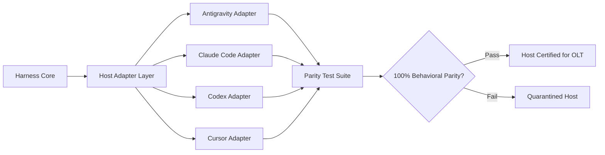

# Host Parity & Platform Adapters

[OLT Documentation Hub](../../README.md) > [Architecture Index](../index.md) > [Chapter 02](./index.md) > 02-03 Host Parity & Adapters

---

[⏮️ Previous: 02-02 Subagent Naming Grammar](02-02-subagent-naming-grammar.md) | [📂 Chapter Index](index.md) | [📚 All Chapters Index](../index.md) | [⏭️ Next: 02-04 Modular Budgets](02-04-modular-file-and-directory-budgets.md)
---

## 1. Abstract Capabilities vs. Host Mechanisms

OLT is architected to be completely **host-agnostic**. The core runtime relies on abstract primitives (spawning subagents, POSIX filesystem operations, executing commands, passing structured messages) rather than vendor-specific APIs.

```text
┌─────────────────────────────────────────────────────────────────────────────┐
│                          OLT ABSTRACT AGENT ENGINE                          │
├─────────────────────────────────────────────────────────────────────────────┤
│      spawn()       │      exec()       │      read()       │    write()     │
├────────────────────┼───────────────────┼───────────────────┼────────────────┤
│  Antigravity Host  │ Claude Code Host  │    Codex Host     │  Cursor Host   │
│  invoke_subagent   │ Agent Task API    │ Subprocess Worker │ Sub-agent Mode │
│  run_command       │ Bash tool         │ Shell executor    │ Terminal Tool  │
│  view_file         │ View tool         │ File reader       │ ReadFile Tool  │
│  replace_content   │ Edit tool         │ File mutator      │ EditFile Tool  │
└────────────────────┴───────────────────┴───────────────────┴────────────────┘
```

---

## 2. The 4 Canonical Host Profiles

OLT formally defines adapters and capability profiles for four tier-1 host environments:

### 1. `antigravity` (Google Cloud Antigravity)

- **Mechanism**: Native `invoke_subagent`, `define_subagent`, and `manage_subagents` APIs.
- **Communication**: Inter-agent `send_message` protocol.
- **Concurrency Bound**: Maximum 40 parallel subagents per coordinator.

### 2. `claude_code` (Anthropic Claude Code)

- **Mechanism**: Headless subagent task spawning via command line orchestration.
- **Communication**: POSIX flock mailbox files in capsule storage.
- **Concurrency Bound**: Maximum 16 parallel execution lanes.

### 3. `codex` (OpenAI Codex CLI)

- **Mechanism**: Asynchronous background subshell workers.
- **Communication**: Merkle event streams and filesystem signal sentinels.
- **Concurrency Bound**: Maximum 24 parallel worker threads.

### 4. `cursor` (Cursor Agent Platform)

- **Mechanism**: Native editor subagents with scoped workspace trees.
- **Communication**: Memory-mapped mailbox streams and lockfiles.
- **Concurrency Bound**: Maximum 10 parallel execution contexts.

---

## 3. Host Capability Matrix & Parity Assurance



| Capability Domain       | Abstract Primitive    | Antigravity       | Claude Code   | Codex           | Cursor        |
| :---------------------- | :-------------------- | :---------------- | :------------ | :-------------- | :------------ |
| **Worker Spawning**     | `spawnWorker(spec)`   | `invoke_subagent` | `task_spawn`  | `subshell_fork` | `agent_fork`  |
| **Command Execution**   | `executeCmd(cmd)`     | `run_command`     | `Bash`        | `exec`          | `terminal`    |
| **Advisory Locking**    | `acquireLock(path)`   | POSIX `flock`     | POSIX `flock` | POSIX `flock`   | POSIX `flock` |
| **Evidence Validation** | `validateProof(type)` | AST Engine        | AST Engine    | AST Engine      | AST Engine    |

---

[⏮️ Previous: 02-02 Subagent Naming Grammar](02-02-subagent-naming-grammar.md) | [📂 Chapter Index](index.md) | [📚 All Chapters Index](../index.md) | [⏭️ Next: 02-04 Modular Budgets](02-04-modular-file-and-directory-budgets.md)
---
