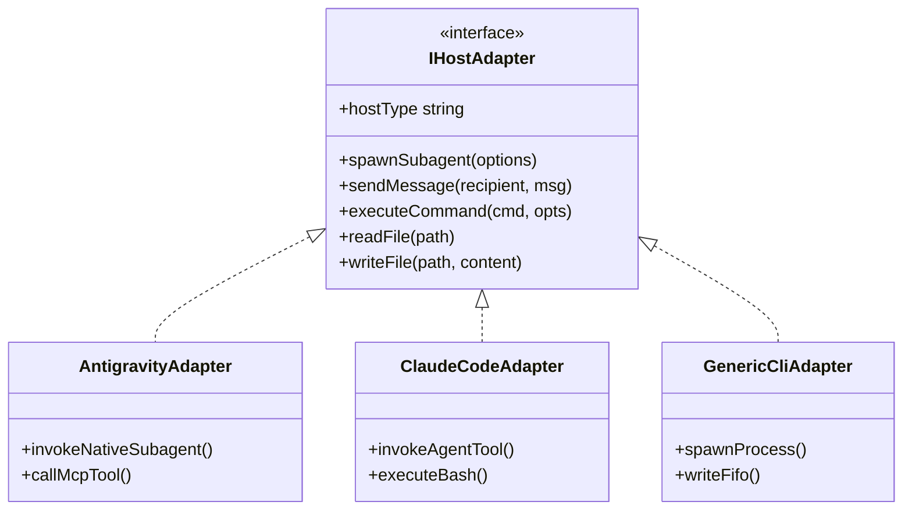

# Host Parity & Universal Adapter Interfaces

---

[Previous: 02-02 Subagent Naming Grammar](02-02-subagent-naming-grammar.md) | [Chapter Index](index.md) | [All Chapters Index](../index.md) | [Next: 02-04 Modular File & Sizing Budgets](02-04-modular-file-and-directory-budgets.md)

---

## 1. Executive Summary & Cross-Platform Execution

Autonomous software engineering agents must execute across diverse AI host platforms (e.g. Antigravity, Claude Code, Goose, Windsurf, Cursor, Cline). However, each platform exposes different tool naming conventions, subagent spawning semantics, and messaging formats:

- Claude Code uses `Agent` and `Bash` primitives.
- Antigravity uses `invoke_subagent`, `run_command`, and native MCP server tools.
- Goose uses dynamic shell expansions and extensions.

The OLT (Orchestrating Long Tasks) engine implements the **Universal Host Adapter Architecture (`IHostAdapter`)**. Under this model:

1. **Host-Agnostic Core Engine**: All scheduling, leasing, Merkle chaining, and AST linting logic is written strictly against a generic TypeScript interface.
2. **Dynamic Platform Detection**: At boot time, the engine probes ambient environment variables and tool signatures to detect the active host and bind the appropriate adapter.
3. **100% Behavioral Parity**: Regardless of host runtime, OLT guarantees identical execution semantics, file operations, and verification proofs.

```text
+--------------------------------------------------------------------------------------------------+
│                             UNIVERSAL HOST ADAPTER TOPOLOGY                                      │
+--------------------------------------------------------------------------------------------------+
│                                                                                                  │
│   OLT CORE ENGINE (Topological Scheduler, Merkle Ledger, AST Linter, RBAC Interlock)           │
│                                │                                                                 │
│                                ▼                                                                 │
│   UNIVERSAL HOST ADAPTER INTERFACE (IHostAdapter)                                                │
│   • spawnSubagent(role, name, prompt)                                                            │
│   • sendMessage(recipient, message)                                                             │
│   • executeCommand(cmd, cwd, env)                                                                │
│   • readStorageFile(path) / writeStorageFile(path, content)                                      │
│                                │                                                                 │
│         ┌──────────────────────┼──────────────────────┬──────────────────────┐                   │
│         ▼                      ▼                      ▼                      ▼                   │
│   ┌──────────────┐       ┌──────────────┐       ┌──────────────┐       ┌──────────────┐          │
│   │ Antigravity  │       │ Claude Code  │       │ Goose        │       │ Windsurf /   │          │
│   │ Adapter      │       │ Adapter      │       │ Adapter      │       │ Cursor       │          │
│   └──────────────┘       └──────────────┘       └──────────────┘       └──────────────┘          │
│                                                                                                  │
+--------------------------------------------------------------------------------------------------+
```

---

## 2. The `IHostAdapter` Interface Contract

The TypeScript interface contract is defined in [`host-adapter.ts`](file:///Users/onurseckinsenoglu/repos/skills/olt/scripts/src/authority/session/session-registry.ts):

```typescript
export interface IHostAdapter {
  readonly hostType: "antigravity" | "claude_code" | "goose" | "windsurf" | "cursor" | "generic";

  spawnSubagent(options: {
    readonly role: string;
    readonly name: string;
    readonly prompt: string;
    readonly model?: "inherit" | "flash" | "pro";
  }): Promise<{ readonly conversationId: string }>;

  sendMessage(recipientId: string, message: string): Promise<void>;

  executeCommand(
    command: string,
    options?: {
      readonly cwd?: string;
      readonly timeoutMs?: number;
    },
  ): Promise<{ readonly exitCode: number; readonly stdout: string; readonly stderr: string }>;

  readFile(path: string): Promise<string>;
  writeFile(path: string, content: string): Promise<void>;
}
```



---

## 3. Dynamic Detection Cascade

```text
+--------------------------------------------------------------------------------------------------+
│                             DYNAMIC HOST DETECTION CASCADE                                       │
+--------------------------------------------------------------------------------------------------+
│                                                                                                  │
│   1. Check for `ANTIGRAVITY_APP_DIR` or native MCP tools ──► Bind AntigravityAdapter             │
│   2. Check for `CLAUDE_CODE_ENTRY` or `__claude__`      ──► Bind ClaudeCodeAdapter              │
│   3. Check for `GOOSE_PROVIDER`                          ──► Bind GooseAdapter                   │
│   4. Fallback to Headless Local CLI Adapter             ──► Bind GenericCliAdapter              │
│                                                                                                  │
+--------------------------------------------------------------------------------------------------+
```

---

## 4. Architectural Invariants Summary

1. **Zero Host Lock-In**: Core engine algorithms contain zero vendor-specific API calls.
2. **Deterministic Parity**: The test suite validates identical behavior across all adapters.
3. **Fail-Closed Fallback**: Inability to detect host capabilities falls back to safe CLI mode.

---

[Previous: 02-02 Subagent Naming Grammar](02-02-subagent-naming-grammar.md) | [Chapter Index](index.md) | [All Chapters Index](../index.md) | [Next: 02-04 Modular File & Sizing Budgets](02-04-modular-file-and-directory-budgets.md)

---
