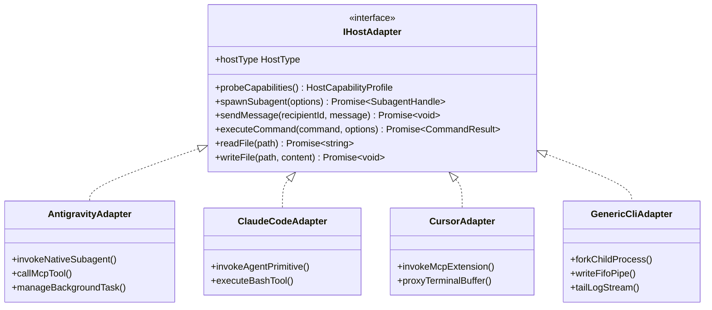
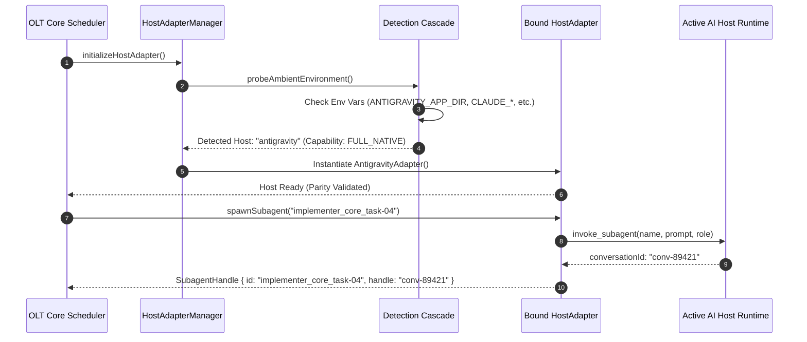

# Host Parity & Universal Adapter Interfaces

---

[Previous: 02-02 Subagent Naming Grammar](02-02-subagent-naming-grammar.md) | [Chapter Index](index.md) | [All Chapters Index](../index.md) | [Next: 02-04 Modular File & Directory Budgets](02-04-modular-file-and-directory-budgets.md)

---

## 1. Executive Summary & The Host Portability Challenge

Autonomous software engineering agents must operate reliably across a rapidly fragmenting ecosystem of AI development environments and CLI host platforms. Leading host environments—such as Antigravity, Claude Code, Codex CLI, Cursor, Goose, Windsurf, and headless CI/CD terminals—each introduce proprietary tool invocation signatures, divergent subagent spawning semantics, distinct IPC messaging paradigms, and inconsistent shell execution sandboxes:

- **Antigravity**: Native subagent tool `invoke_subagent`, MCP server tool integration, message bus IPC, background task manager.
- **Claude Code**: Tool primitives `Agent`, `Bash`, `FileEdit`, `Glob`, `Grep`, slash-command interfaces.
- **Goose / Windsurf / Cursor**: MCP tool wrappers, extension hooks, headless process multiplexers.
- **Generic Headless CLI**: Standard Unix POSIX pipes, `fork`/`exec` subprocesses, and FIFO mailboxes.

If the core OLT scheduling and execution engine were tightly coupled to any single platform's API conventions, portability would collapse, and multi-agent workflows would require brittle rewrites for each environment.

The OLT (Orchestrating Long Tasks) engine resolves this via the **Universal Host Adapter Architecture (`IHostAdapter`)**. Under this model:

1. **Host-Agnostic Core Engine**: All topological scheduling, lease coordination, Merkle event logging, and AST linting algorithms are decoupled from host-specific APIs.
2. **Deterministic Parity Invariant**: Every lifecycle operation, subagent invocation, and tool call produces mathematically identical behavioral proofs across all supported hosts.
3. **Dynamic Detection Cascade**: At boot time, the engine probes ambient environment signatures, tool schemas, and diagnostic APIs to dynamically instantiate the correct adapter with zero manual configuration.
4. **Resilient Fallback & Tool Proxying**: When advanced host capabilities (e.g., native background subagent spawning) are missing, the adapter transparently proxies operations through POSIX subprocesses or FIFO mailboxes.

```text
+--------------------------------------------------------------------------------------------------+
│                             UNIVERSAL HOST ADAPTER BUS ARCHITECTURE                              │
+--------------------------------------------------------------------------------------------------+
│                                                                                                  │
│   ┌────────────────────────────────────────────────────────────────────────────────────────┐     │
│   │                                    OLT CORE ENGINE                                     │     │
│   │   [Topological Scheduler]  [Merkle Ledger]  [Monotonic Lease Engine]  [AST Linter]     │     │
│   └───────────────────────────────────────────┬────────────────────────────────────────────┘     │
│                                               │                                                  │
│                                               ▼                                                  │
│   ┌────────────────────────────────────────────────────────────────────────────────────────┐     │
│   │                         UNIVERSAL HOST ADAPTER INTERFACE (IHostAdapter)                 │     │
│   │   • spawnSubagent(opts)       • sendMessage(recipient, msg)   • executeCommand(cmd)   │     │
│   │   • readFile(path)            • writeFile(path, content)       • probeCapabilities()   │     │
│   └───────────────────────────────────────────┬────────────────────────────────────────────┘     │
│                                               │                                                  │
│         ┌──────────────────────┬──────────────┴───────┬──────────────────────┐                   │
│         ▼                      ▼                      ▼                      ▼                   │
│   ┌──────────────┐       ┌──────────────┐       ┌──────────────┐       ┌──────────────┐          │
│   │ Antigravity  │       │ Claude Code  │       │ Goose /      │       │ Headless     │          │
│   │ Adapter      │       │ Adapter      │       │ Cursor / IDE │       │ Generic CLI  │          │
│   │ (invoke_sub) │       │ (Agent/Bash) │       │ (MCP Proxy)  │       │ (POSIX Pipe) │          │
│   └──────────────┘       └──────────────┘       └──────────────┘       └──────────────┘          │
│                                                                                                  │
+--------------------------------------------------------------------------------------------------+
```

---

## 2. Mathematical Parity Invariant & Capability Normalization

Let $\mathcal{H} = \{H_{\text{antigravity}}, H_{\text{claude\_code}}, H_{\text{goose}}, H_{\text{cursor}}, H_{\text{cli}}\}$ denote the set of supported host environments, and let $\mathcal{M}$ denote an arbitrary long-task mission composed of DAG tasks $\mathcal{T}$.

We define the **Deterministic Host Parity Invariant**:

$$\forall H_a, H_b \in \mathcal{H}, \quad \text{Exec}(\mathcal{M}, H_a) \equiv_{\text{Merkle}} \text{Exec}(\mathcal{M}, H_b)$$

Where $\equiv_{\text{Merkle}}$ denotes equivalence of the resulting cryptographic SHA-256 Merkle event chain and file mutations on disk.

### 2.1 Capability Profile Lattice

Each host platform exposes a capability profile $\mathcal{P}(H) = \langle c_{\text{spawn}}, c_{\text{ipc}}, c_{\text{mcp}}, c_{\text{bg}}, c_{\text{stream}} \rangle$:

$$\mathcal{P}_{\text{core}} = \langle \text{SubprocessExec}, \; \text{FilesystemIO}, \; \text{AtomicLocks} \rangle$$

If a host lacks a native capability $c_k \notin \mathcal{P}(H)$, the adapter must provide a lossless synthetic emulation:

$$ \text{Synthesize}(c_k) = \begin{cases}
\text{FIFO Mailbox Queue} & \text{if } c_{\text{ipc}} = \text{None} \\
\text{Fork/Exec Daemon Pool} & \text{if } c_{\text{spawn}} = \text{None} \\
\text{File-Polling Watchdog} & \text{if } c_{\text{stream}} = \text{None}
\end{cases}$$



---

## 3. Platform Adapter Matrix & Tool Normalization

```text
+-----------------------+----------------------+----------------------+----------------------+----------------------+
| Capability Dimension  | Antigravity Runtime  | Claude Code Runtime  | Cursor / Windsurf    | Generic Headless CLI |
+-----------------------+----------------------+----------------------+----------------------+----------------------+
| Subagent Spawning     | invoke_subagent tool | Agent tool primitive | MCP Agent Bridge     | fork / exec daemon   |
| IPC Messaging         | send_message API     | Mailbox JSON queue   | Mailbox JSON queue   | Unix FIFO / Pipe     |
| Command Execution     | run_command tool     | Bash tool            | Terminal MCP Proxy   | child_process.spawn  |
| Background Tasks      | manage_task tool     | Nohup background PID | Background Process   | POSIX Process Group  |
| File I/O Primitive    | write_to_file / edit | FileEdit / Replace   | FS Workspace API     | node:fs / bun:fs     |
| Ambient Detection Sig | ANTIGRAVITY_APP_DIR  | CLAUDE_CODE_ENTRY    | CURSOR_WORKSPACE_DIR | Fallback Default     |
+-----------------------+----------------------+----------------------+----------------------+----------------------+
```

### 3.1 Cross-Platform Lifecycle Negotiation Flow



---

## 4. Universal Host Adapter TypeScript Contracts

The `IHostAdapter` interface and concrete normalization types are defined in TypeScript under [`host-bindings.ts`](file:///Users/onurseckinsenoglu/repos/skills/olt/scripts/src/authority/host-bindings.ts):

```typescript
export type HostType =
  | "antigravity"
  | "claude_code"
  | "goose"
  | "windsurf"
  | "cursor"
  | "generic_cli";

export interface HostCapabilityProfile {
  readonly hostType: HostType;
  readonly supportsNativeSubagents: boolean;
  readonly supportsDirectMcp: boolean;
  readonly supportsBackgroundProcesses: boolean;
  readonly supportsStreamCancellation: boolean;
  readonly maxConcurrentWorkers: number;
}

export interface SpawnSubagentOptions {
  readonly role: string;
  readonly name: string;
  readonly prompt: string;
  readonly modelPreference?: "fast" | "reasoning" | "default";
  readonly initialContextScope?: readonly string[];
}

export interface SubagentHandle {
  readonly agentId: string;
  readonly conversationId: string;
  readonly hostType: HostType;
  readonly spawnedAt: number;
}

export interface CommandExecutionResult {
  readonly exitCode: number;
  readonly stdout: string;
  readonly stderr: string;
  readonly durationMs: number;
  readonly timedOut: boolean;
}

export interface IHostAdapter {
  readonly hostType: HostType;

  probeCapabilities(): Promise<HostCapabilityProfile>;

  spawnSubagent(options: SpawnSubagentOptions): Promise<SubagentHandle>;

  sendMessage(recipientId: string, messagePayload: string): Promise<void>;

  executeCommand(
    command: string,
    options?: {
      readonly cwd?: string;
      readonly timeoutMs?: number;
      readonly env?: Record<string, string>;
    }
  ): Promise<CommandExecutionResult>;

  readFile(filePath: string): Promise<string>;

  writeFile(filePath: string, content: string): Promise<void>;

  terminateSubagent(handle: SubagentHandle): Promise<void>;
}
```

### 4.1 Dynamic Detection Cascade Engine

```typescript
export class HostDetectionEngine {
  public static async detectAndBind(): Promise<IHostAdapter> {
    // 1. Check for Antigravity Host Signature
    if (
      process.env["ANTIGRAVITY_APP_DIR"] ||
      process.env["GEMINI_CLI_CONVERSATION_ID"]
    ) {
      return new AntigravityAdapter();
    }

    // 2. Check for Claude Code Host Signature
    if (
      process.env["CLAUDE_CODE_ENTRY"] ||
      process.env["CLAUDE_AGENT_SESSION"]
    ) {
      return new ClaudeCodeAdapter();
    }

    // 3. Check for Cursor / Windsurf IDE Hooks
    if (process.env["CURSOR_WORKSPACE_DIR"] || process.env["WINDSURF_PORT"]) {
      return new CursorAdapter();
    }

    // 4. Default Fallback to Headless POSIX Generic CLI
    return new GenericCliAdapter();
  }
}
```

---

## 5. Resilient Tool Proxying & Stream Sandboxing

When running on host environments that do not natively support subagent conversational primitives or asynchronous background execution, the Universal Adapter Bus activates the **Tool Proxying Subsystem**:

1. **Subprocess Emulation**: Subagents are executed as isolated child Node/Bun processes communicating via JSON-RPC lines over stdin/stdout pipes.
2. **Mailbox File-System Emulation**: Inter-agent messages are written as atomic JSON receipts in the capsule mailbox directory, watched via filesystem `fs.watch` and monotonic polling.
3. **Execution Stream Isolation**: Shell executions are wrapped in timeout-guarded execution envelopes to prevent runaway processes from hanging the scheduler:

```typescript
export class SandboxedProcessRunner {
  public static async runGuarded(
    cmd: string,
    cwd: string,
    timeoutMs = 300_000
  ): Promise<CommandExecutionResult> {
    const start = performance.now();
    const proc = Bun.spawn(["/bin/zsh", "-c", cmd], {
      cwd,
      stdout: "pipe",
      stderr: "pipe",
    });

    const timeoutPromise = new Promise<{ timedOut: true }>((resolve) =>
      setTimeout(() => resolve({ timedOut: true }), timeoutMs)
    );

    const executionPromise = (async () => {
      const stdout = await new Response(proc.stdout).text();
      const stderr = await new Response(proc.stderr).text();
      const exitCode = await proc.exited;
      return { timedOut: false, stdout, stderr, exitCode };
    })();

    const result = await Promise.race([executionPromise, timeoutPromise]);

    if (result.timedOut) {
      proc.kill(9);
      return {
        exitCode: 124,
        stdout: "",
        stderr: "EXECUTION_TIMEOUT: Command exceeded SLA limit.",
        durationMs: performance.now() - start,
        timedOut: true,
      };
    }

    return {
      exitCode: result.exitCode,
      stdout: result.stdout,
      stderr: result.stderr,
      durationMs: performance.now() - start,
      timedOut: false,
    };
  }
}
```

---

## 6. Failure Taxonomy & Anti-Blunder Matrix

```text
+---------------------------------+------------------------------------------+-------------------------------------------------------------+
| Failure Code                    | Trigger Condition                        | Mechanical Mitigation & System Response                     |
+---------------------------------+------------------------------------------+-------------------------------------------------------------+
| UNSUPPORTED_HOST_TOOL_TRAP      | Host lacks native tool primitive         | Adapter activates synthetic proxy emulation fallback.       |
| SUBAGENT_SPAWN_REJECTED         | Host subagent capacity limit reached     | Adapter queues spawn request in local FIFO backpressure pool|
| STREAM_DESYNCHRONIZATION        | stdout/stderr stream truncated           | Adapter buffers chunks with SHA-256 integrity checksums.    |
| HOST_DETECTION_AMBIGUITY        | Multiple conflicting host env vars set   | Detection cascade applies strict precedence order: AG > CC. |
| TIMEOUT_ESCAPE_TRAP             | Subprocess fails to terminate after kill | Force SIGKILL (signal 9) and purge associated process group |
| WORKSPACE_HOOK_DISCONNECT       | IDE extension closes active connection   | Reconnects socket; writes unsent messages to disk spool.   |
+---------------------------------+------------------------------------------+-------------------------------------------------------------+
```

### Anti-Blunder Rules for Host Adapters

1. **Never Hardcode Vendor-Specific Logic in Core Engine**: Keep all platform-specific checks strictly encapsulated inside concrete `IHostAdapter` implementations.
2. **Never Rely on Host-Specific Memory Caches**: Always persist state transitions and message queues to disk (`.olt/`) to survive host crashes or restarts.
3. **Always Validate Subprocess Exit Codes**: Never interpret empty output as success; require explicit exit code `0` and non-empty execution telemetry.

---

## 7. Architectural Invariants Summary

- **Invariant $\mathcal{C}_8$ (Zero Main-Thread Spill)**: Implementer and validator workloads are strictly sandboxed inside adapter-managed execution contexts.
- **Invariant $\mathcal{C}_{15}$ (Merkle Chain Durability)**: Cross-platform parity guarantees that the resulting Merkle event hash stream is identical regardless of host platform.

---

[Previous: 02-02 Subagent Naming Grammar](02-02-subagent-naming-grammar.md) | [Chapter Index](index.md) | [All Chapters Index](../index.md) | [Next: 02-04 Modular File & Directory Budgets](02-04-modular-file-and-directory-budgets.md)

---
$$
