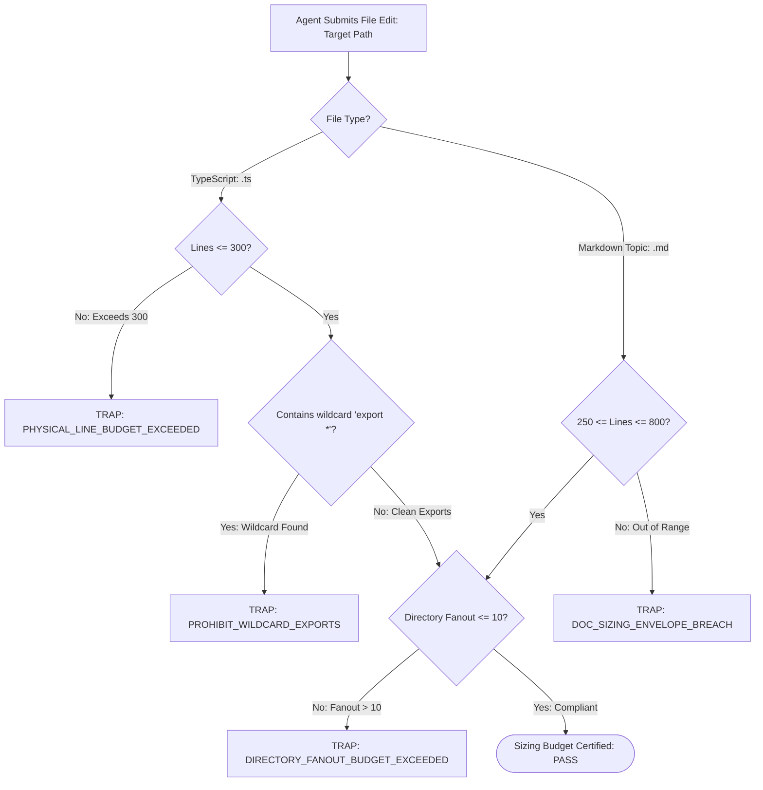

# Modular File & Directory Sizing Budgets

---

[Previous: 02-03 Host Parity & Adapters](02-03-host-parity-and-adapters.md) | [Chapter Index](index.md) | [All Chapters Index](../index.md) | [Next: Chapter 03: Mind Product Owner](../03-mind-product-owner/index.md)

---

## 1. Executive Summary & Cognitive Attention Bounds

In autonomous multi-agent software engineering, monolithic source files and sprawling directory trees represent severe systemic failure modes:

- **Context Degradation & Attention Loss**: Large Language Models exhibit steep attention decay when reading source files exceeding 300 physical lines. Hallucinated function signatures, missed type invariants, and truncated edits increase exponentially with file length.
- **Directory Fanout Saturation**: When a single directory contains dozens of loose files, directory scanning tools (`list_dir`, `find_by_name`) return large token dumps that flood the agent's context window, diluting focus from core implementation tasks.
- **Merge Conflicts & Blast Radius**: Monolithic files force concurrent subagents into lock contention over shared lines of code, breaking worktree isolation and causing merge collisions.
- **Audit Fatigue**: Cognitive validators auditing massive multi-hundred-line pull requests suffer from heuristic fatigue, allowing subtle regressions and safety invariant breaches to pass undetected.

The OLT (Orchestrating Long Tasks) engine establishes non-negotiable **Modular File & Directory Sizing Budgets**. Under this standard:

1. **TypeScript Source Code Budget**: Strictly capped at $\le 300$ physical lines per file.
2. **Documentation Topic Budget**: Bounded strictly within the $250 \le L \le 800$ line sizing envelope (with chapter indexes bounded between $100 \le L \le 250$ lines).
3. **Directory Fanout Budget**: Strictly capped at $\le 10$ child entries per directory level.
4. **Explicit Named-Export Facades**: Every directory module must expose its public API exclusively through an `index.ts` barrel containing explicit named exports; wildcard exports (`export * from ...`) are strictly prohibited by the AST linter.

```text
+--------------------------------------------------------------------------------------------------+
│                             MODULAR SIZING BUDGET ENVELOPE TOPOLOGY                              │
+--------------------------------------------------------------------------------------------------+
│                                                                                                  │
│   ┌────────────────────────────────────────────────────────────────────────────────────────┐     │
│   │                              PHYSICAL SIZING BUDGET ENVELOPE                           │     │
│   │                                                                                        │     │
│   │   • TypeScript Source Code Files:       L <= 300 Lines (Strict AST & Linter Bound)     │     │
│   │   • Documentation Topic Chapters:       250 <= L <= 800 Lines (Comprehensive Depth)    │     │
│   │   • Chapter Index Documents:            100 <= L <= 250 Lines (Navigation & Overview)  │     │
│   │   • Directory Entry Fanout:             N <= 10 Children per Directory Level           │     │
│   │   • Module Barrel Export Policy:        Explicit Named Exports ONLY (Zero export *)    │     │
│   └───────────────────────────────────────────┬────────────────────────────────────────────┘     │
│                                               │                                                  │
│                                               ▼                                                  │
│   ┌────────────────────────────────────────────────────────────────────────────────────────┐     │
│   │                        MECHANICAL AST & PRE-COMMIT VERIFICATION                        │     │
│   │                                                                                        │     │
│   │       ┌──────────────────┐        ┌──────────────────┐        ┌──────────────────┐     │     │
│   │       │  Physical Line   │  ───►  │ Directory Fanout │  ───►  │  Explicit Export │     │     │
│   │       │  Counter (<=300) │        │  Counter (<=10)  │        │   AST Validator  │     │     │
│   │       └──────────────────┘        └──────────────────┘        └──────────────────┘     │     │
│   └────────────────────────────────────────────────────────────────────────────────────────┘     │
│                                                                                                  │
+--------------------------------------------------------------------------------------------------+
```

---

## 2. Mathematical Modeling of Cognitive Load $\mathcal{K}(F)$ & Attention Decay

Let $F$ denote a source code file, $L(F)$ denote its physical line count, $\mathcal{C}(F)$ denote its McCabe cyclomatic complexity, and $\mathcal{D}(F)$ denote the directory depth and fanout factor.

We define the **Cognitive Load Function** $\mathcal{K}(F)$:

$$\mathcal{K}(F) = \alpha \cdot L(F) + \beta \cdot \mathcal{C}(F) + \gamma \cdot \text{Fanout}(\text{Dir}(F)) + \delta \cdot \mathcal{H}_{\text{tokens}}(F)$$

Where $\alpha, \beta, \gamma, \delta > 0$ are empirically calibrated complexity coefficients and $\mathcal{H}_{\text{tokens}}(F)$ is the Shannon entropy of the token vocabulary:

$$\mathcal{H}_{\text{tokens}}(F) = -\sum_{i=1}^{V} p(t_i) \log_2 p(t_i)$$

### 2.1 The Exponential Attention Retention Curve

Empirical research in LLM context processing demonstrates that effective attention retention $A(L)$ decays exponentially with file length $L$:

$$A(L) = A_0 \cdot \exp\left(-\lambda \cdot \max(0, L - L_{\text{threshold}})\right)$$

Where $L_{\text{threshold}} = 200$ lines and $\lambda = 0.0065$.

```text
+-------------------+--------------------+---------------------------------------------------------+
| File Length (L)   | Attention Retention| Observed Agent Reasoning Behavior                       |
+-------------------+--------------------+---------------------------------------------------------+
| 100 - 250 lines   | 98% - 100%         | Perfect type inference, zero AST hallucination          |
| 300 lines (LIMIT) | 92% - 95%          | Reliable compliance with all architectural invariants   |
| 500 lines         | 65% - 70%          | Frequent import hallucinations, missed edge cases       |
| 800+ lines        | 35% - 45%          | Catastrophic truncation, silent deletion of code blocks |
+-------------------+--------------------+---------------------------------------------------------+
```

### 2.2 Coupling and Cohesion Metrics

When evaluating a module decomposition, OLT enforces a maximum external coupling ratio $\mathcal{C}_R$:

$$\mathcal{C}_R(M) = \frac{|\text{Edges}_{\text{inter}}(M)|}{|\text{Edges}_{\text{intra}}(M)|} \le 0.40$$

Ensuring that intra-module cohesion dominates inter-module coupling prevents circular dependency cycles across modular barrels.

---

## 3. Physical Sizing Budget Catalog & Verification Rules

```text
+------------------------------+--------------------+--------------------+-------------------------------------------------+
| Artifact Classification      | Minimum Bound      | Maximum Bound      | Enforcement Tooling                             |
+------------------------------+--------------------+--------------------+-------------------------------------------------+
| TypeScript Source File (.ts) | None (Pure atomic) | 300 physical lines | AST Compiler Linter (ast-budget-linter.ts)      |
| Documentation Topic (.md)    | 250 physical lines | 800 physical lines | Markdown Header & Line Validator (doc-linter.ts)|
| Chapter Index Document (.md) | 100 physical lines | 250 physical lines | Markdown Sizing Interlock                       |
| Directory Node (Children)    | 1 child            | 10 direct children | Filesystem Structural Scanner                   |
| Barrel Module (index.ts)     | 1 named export     | 30 named exports   | AST Import/Export Pure Syntax Guard             |
+------------------------------+--------------------+--------------------+-------------------------------------------------+
```



---

## 4. Mechanical AST Linter Enforcement Pipeline

The sizing budget engine executes via the TypeScript Compiler API during pre-commit checks and Tier 3 validation gates. The implementation is defined in TypeScript under [`guards/root-hygiene.ts`](file:///Users/onurseckinsenoglu/repos/skills/olt/scripts/src/authority/guards/root-hygiene.ts):

```typescript
import * as ts from "typescript";
import * as fs from "node:fs";
import * as path from "node:path";

export interface BudgetValidationReport {
  readonly filePath: string;
  readonly physicalLineCount: number;
  readonly directoryFanout: number;
  readonly hasWildcardExports: boolean;
  readonly cyclomaticComplexity: number;
  readonly passed: boolean;
  readonly errors: readonly string[];
}

export class ASTBudgetLinter {
  private static readonly MAX_SOURCE_LINES = 300;
  private static readonly MAX_DIR_ENTRIES = 10;
  private static readonly MAX_CYCLOMATIC_COMPLEXITY = 15;

  public static auditSourceFile(filePath: string): BudgetValidationReport {
    const content = fs.readFileSync(filePath, "utf-8");
    const lines = content.split(/\r?\n/);
    const lineCount = lines.length;
    const errors: string[] = [];

    // 1. Enforce Physical Line Budget
    if (lineCount > this.MAX_SOURCE_LINES) {
      errors.push(
        `PHYSICAL_LINE_BUDGET_EXCEEDED: ${filePath} has ${lineCount} lines (limit: ${this.MAX_SOURCE_LINES})`,
      );
    }

    // 2. Enforce Directory Fanout Budget
    const dir = path.dirname(filePath);
    const dirEntries = fs.readdirSync(dir);
    if (dirEntries.length > this.MAX_DIR_ENTRIES) {
      errors.push(
        `DIRECTORY_FANOUT_BUDGET_EXCEEDED: ${dir} contains ${dirEntries.length} entries (limit: ${this.MAX_DIR_ENTRIES})`,
      );
    }

    // 3. Inspect AST for Wildcard Exports & Cyclomatic Complexity
    const sourceFile = ts.createSourceFile(filePath, content, ts.ScriptTarget.Latest, true);

    let hasWildcardExports = false;
    let maxComplexity = 1;

    const inspectNode = (node: ts.Node): void => {
      if (ts.isExportDeclaration(node)) {
        if (!node.exportClause && node.moduleSpecifier) {
          hasWildcardExports = true;
          errors.push(
            `PROHIBIT_WILDCARD_EXPORTS: Wildcard export '${node.getText()}' is prohibited in ${filePath}`,
          );
        }
      }

      if (
        ts.isIfStatement(node) ||
        ts.isConditionalExpression(node) ||
        ts.isForStatement(node) ||
        ts.isWhileStatement(node) ||
        ts.isCaseClause(node)
      ) {
        maxComplexity++;
      }

      ts.forEachChild(node, inspectNode);
    };

    inspectNode(sourceFile);

    if (maxComplexity > this.MAX_CYCLOMATIC_COMPLEXITY) {
      errors.push(
        `CYCLOMATIC_COMPLEXITY_EXCEEDED: ${filePath} complexity is ${maxComplexity} (limit: ${this.MAX_CYCLOMATIC_COMPLEXITY})`,
      );
    }

    return {
      filePath,
      physicalLineCount: lineCount,
      directoryFanout: dirEntries.length,
      hasWildcardExports,
      cyclomaticComplexity: maxComplexity,
      passed: errors.length === 0,
      errors,
    };
  }
}
```

---

## 5. Decomposition Strategies & Barrel Facade Patterns

When a source file or directory exceeds sizing constraints, agents must decompose the unit into cohesive submodules following deterministic patterns:

```text
BEFORE REFACTORING (Monolithic Fault):
src/engine/scheduler.ts (650 lines) ──► FAILS: PHYSICAL_LINE_BUDGET_EXCEEDED

AFTER DECOMPOSITION (Modular Compliance):
src/engine/scheduler/
├── index.ts              (25 lines)  <── Explicit named exports facade
├── dag-compiler.ts       (180 lines) <── Kahn topological sort logic
├── cycle-breaker.ts      (140 lines) <── Tarjan SCC cycle resolution
├── wave-sequencer.ts     (190 lines) <── Dynamic wave boundary clustering
└── types.ts              (60 lines)  <── Shared TypeScript interfaces
```

### 5.1 Barrel Facades: Explicit Named Exports vs. Wildcard Anti-Pattern

```typescript
// PROHIBITED: Wildcard re-export creates namespace collisions and lazy imports
export * from "./dag-compiler"; // AST FAULT: PROHIBIT_WILDCARD_EXPORTS
export * from "./cycle-breaker"; // AST FAULT: PROHIBIT_WILDCARD_EXPORTS

// MANDATED: Explicit named export facade (src/engine/scheduler/index.ts)
export { compileTopologicalDAG, validateAcyclicity } from "./dag-compiler";
export { breakTarjanCycles, isolateStronglyConnectedComponents } from "./cycle-breaker";
export { sequenceExecutionWaves, calculateCriticalPathSpan } from "./wave-sequencer";
export type { ExecutionWave, DAGNode, DAGEdge } from "./types";
```

### 5.2 State Machine Decomposition Pattern

For complex state machines that exceed the line budget:

1. **Transitions Table**: Extract the raw state transition lookup matrix and edge rules to `transitions.ts`.
2. **Guards & Predicates**: Move validation predicates, preconditions, and invariant asserts to `guards.ts`.
3. **Dispatcher Engine**: Keep only the pure dispatcher lifecycle logic inside `state-machine.ts` ($\le 150$ lines).

---

## 6. Failure Taxonomy & Anti-Blunder Matrix

```text
+------------------------------------+------------------------------------------+-------------------------------------------------------------+
| Failure Code                       | Trigger Condition                        | Mechanical Mitigation & System Response                     |
+------------------------------------+------------------------------------------+-------------------------------------------------------------+
| PHYSICAL_LINE_BUDGET_EXCEEDED      | .ts file exceeds 300 physical lines      | AST linter rejects patch; triggers automatic refactor task. |
| DIRECTORY_FANOUT_BUDGET_EXCEEDED   | Directory contains > 10 direct items     | Requires sub-packaging into domain subdirectories.          |
| PROHIBIT_WILDCARD_EXPORTS          | File uses `export * from ...`            | Intercepted by AST guard; requires explicit named exports.  |
| DOC_SIZING_ENVELOPE_BREACH         | Topic file < 250 or > 800 lines          | Markdown linter halts build; requires content balancing.    |
| CIRCULAR_DEPENDENCY_FAULT          | Module barrel creates import loop        | Madge / AST circular dependency checker fails build.        |
| SHALLOW_STUB_VIOLATION             | File contains < 50 lines with no exports | Rejects stub; mandates complete, self-contained unit.       |
| TRUNCATION_CHEAT_FAULT             | Developer strips whitespace/comments     | Formatter re-expands AST; checks true uncompressed lines.  |
+------------------------------------+------------------------------------------+-------------------------------------------------------------+
```

### Anti-Blunder Rules for Codebase Modularity

1. **Never Compress Code to Cheat Line Budgets**: Removing whitespace, collapsing multi-line functions into one-liners, or deleting comments to satisfy $\le 300$ lines triggers an immediate epistemic quality rejection.
2. **Never Create "Dump-All" Utilities**: Files named `utils.ts`, `helpers.ts`, or `common.ts` invariably turn into bloated monoliths. Create domain-specific files such as `hash-utils.ts` or `date-formatter.ts`.
3. **Never Allow Deep Directory Nesting**: Maintain a maximum directory depth of 4 levels (`src/domain/module/submodule/`) to prevent navigational degradation.
4. **Never Bypass Barrel Facades**: External callers must import strictly from the module's `index.ts` barrel rather than reaching into internal submodule files.

---

## 7. Architectural Invariants Summary

- **Invariant $\mathcal{C}_{13}$ (Static AST Purity Enforcement)**: Every TypeScript source file in the repository passes AST line budget, fanout, and explicit export checks with zero lint warnings.
- **Invariant $\mathcal{C}_{12}$ (Cowan Context Budget Sanitization)**: Keeping files strictly under 300 lines guarantees that any file fits entirely into a single agent prompt without exceeding Cowan attention limits.

---

[Previous: 02-03 Host Parity & Adapters](02-03-host-parity-and-adapters.md) | [Chapter Index](index.md) | [All Chapters Index](../index.md) | [Next: Chapter 03: Mind Product Owner](../03-mind-product-owner/index.md)

---
