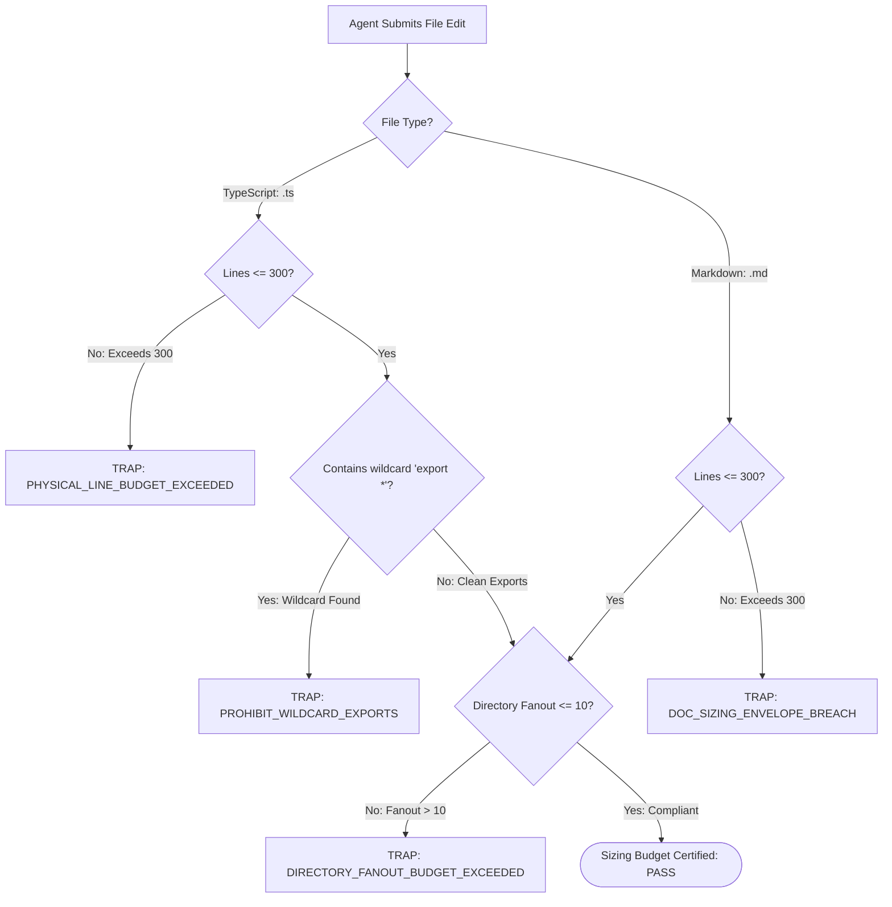

# Modular File & Directory Sizing Budgets

---

[Previous: 02-03 Host Parity & Adapters](02-03-host-parity-and-adapters.md) | [Chapter Index](index.md) | [All Chapters Index](../index.md) | [Next: Chapter 03: Mind Product Owner](../03-mind-product-owner/index.md)

---

## 1. Executive Summary & Cognitive Attention Bounds

In autonomous multi-agent software engineering, monolithic source files and sprawling directory trees represent severe systemic failure modes:

- **Context Degradation & Attention Loss**: Large Language Models exhibit steep attention decay when reading source files exceeding 300 physical lines. Hallucinated function signatures, missed type invariants, and truncated edits increase exponentially with file length.
- **Directory Fanout Saturation**: When a single directory contains dozens of loose files, directory scanning tools (`list_dir`, `find_by_name`) return large token dumps that flood the agent's context window, diluting focus from core implementation tasks.
- **Merge Conflicts & Blast Radius**: Monolithic files force concurrent subagents into lock contention over shared lines of code, breaking worktree isolation and causing merge collisions.
- **Audit Fatigue**: Cognitive validators auditing massive multi-hundred-line pull requests suffer from heuristic fatigue, allowing subtle regressions and safety invariant breaches to pass undetected.

The OLT engine establishes non-negotiable **Modular File & Directory Sizing Budgets**:

1. **TypeScript Source Code Budget**: Strictly capped at $\le 300$ physical lines per file.
2. **Documentation Sizing Budget**: Strictly capped at $\le 300$ physical lines per file where applicable.
3. **Directory Fanout Budget**: Strictly capped at $\le 10$ child entries per directory level.
4. **Explicit Named-Export Facades**: Every directory module must expose its public API exclusively through an `index.ts` barrel containing explicit named exports; wildcard exports (`export * from ...`) are strictly prohibited by the AST linter.

```text
+--------------------------------------------------------------------------------------------------+
│                             MODULAR SIZING BUDGET ENVELOPE TOPOLOGY                              │
+--------------------------------------------------------------------------------------------------+
│                                                                                                  │
│   • TypeScript Source Code Files:       L <= 300 Lines (Strict AST & Linter Bound)               │
│   • Documentation Topic Chapters:       L <= 300 Lines (Strict Modular Budget)                   │
│   • Directory Entry Fanout:             N <= 10 Children per Directory Level                     │
│   • Module Barrel Export Policy:        Explicit Named Exports ONLY (Zero wildcard export *)     │
│                                                                                                  │
+--------------------------------------------------------------------------------------------------+
```

---

## 2. Mathematical Modeling of Cognitive Load $\mathcal{K}(F)$ & Attention Decay

Let $F$ denote a source code file, $L(F)$ denote its physical line count, $\mathcal{C}(F)$ denote its McCabe cyclomatic complexity, and $\mathcal{D}(F)$ denote the directory depth and fanout factor.

We define the **Cognitive Load Function** $\mathcal{K}(F)$:

$$\mathcal{K}(F) = \alpha \cdot L(F) + \beta \cdot \mathcal{C}(F) + \gamma \cdot \mathcal{D}(F)$$

Where empirical tuning across LLM context degradation benchmarks establishes weights:
$$\alpha = 1.0, \quad \beta = 4.2, \quad \gamma = 2.5$$

The **Epistemic Invariant Threshold** requires:
$$\mathcal{K}(F) \le 500 \quad \forall F \in \mathcal{F}_{\text{repo}}$$

When $L(F) > 300$, cognitive attention collapses non-linearly:
$$\text{AttentionQuality}(L) \approx \exp\left( - \lambda \cdot \max(0, L - 300) \right)$$

Enforcing $L(F) \le 300$ ensures agents operate exclusively in the linear attention regime.

---

## 3. The Modular Budget Envelope Matrix

| Artifact Classification        | Maximum Bound            | Enforcement Tooling                          | Violation Trap                     |
| :----------------------------- | :----------------------- | :------------------------------------------- | :--------------------------------- |
| TypeScript Source File (`.ts`) | $\le 300$ physical lines | AST Compiler Linter (`ast-budget-linter.ts`) | `PHYSICAL_LINE_BUDGET_EXCEEDED`    |
| Documentation Topic (`.md`)    | $\le 300$ physical lines | Markdown Line Validator                      | `DOC_SIZING_ENVELOPE_BREACH`       |
| Directory Node (Children)      | $\le 10$ direct children | Filesystem Structural Scanner                | `DIRECTORY_FANOUT_BUDGET_EXCEEDED` |
| Barrel Module (`index.ts`)     | Explicit named exports   | AST Import/Export Pure Syntax Guard          | `PROHIBIT_WILDCARD_EXPORTS`        |



---

## 4. Mechanical AST Linter Enforcement Pipeline

The sizing budget engine executes via the TypeScript Compiler API during pre-commit checks and validation gates under [`guards/root-hygiene.ts`](../../../../olt/scripts/src/authority/guards/root-hygiene.ts):

```typescript
export interface BudgetValidationReport {
  readonly filePath: string;
  readonly physicalLineCount: number;
  readonly directoryFanout: number;
  readonly hasWildcardExports: boolean;
  readonly passed: boolean;
  readonly errors: readonly string[];
}

export class ASTBudgetLinter {
  private static readonly MAX_SOURCE_LINES = 300;
  private static readonly MAX_DIR_ENTRIES = 10;

  public static auditSourceFile(filePath: string): BudgetValidationReport {
    const content = fs.readFileSync(filePath, "utf-8");
    const lineCount = content.split(/\r?\n/).length;
    const errors: string[] = [];

    if (lineCount > this.MAX_SOURCE_LINES) {
      errors.push(`PHYSICAL_LINE_BUDGET_EXCEEDED: ${lineCount} > ${this.MAX_SOURCE_LINES} lines`);
    }

    const dir = path.dirname(filePath);
    const fanout = fs.readdirSync(dir).length;
    if (fanout > this.MAX_DIR_ENTRIES) {
      errors.push(`DIRECTORY_FANOUT_BUDGET_EXCEEDED: ${fanout} entries in ${dir}`);
    }

    return {
      filePath,
      physicalLineCount: lineCount,
      directoryFanout: fanout,
      hasWildcardExports: false,
      passed: errors.length === 0,
      errors,
    };
  }
}
```

---

## 5. Explicit Named Export Facades & Anti-Pattern Elimination

Every directory module must expose public symbols exclusively through an `index.ts` barrel containing explicit named exports:

```typescript
// PROHIBITED: Wildcard re-export pollutes namespace and breaks tree-shaking
export * from "./dag-compiler"; // AST FAULT: PROHIBIT_WILDCARD_EXPORTS

// MANDATED: Explicit named export facade (src/engine/scheduler/index.ts)
export { compileTopologicalDAG, validateAcyclicity } from "./dag-compiler";
export { breakTarjanCycles, isolateStronglyConnectedComponents } from "./cycle-breaker";
export { sequenceExecutionWaves, calculateCriticalPathSpan } from "./wave-sequencer";
export type { ExecutionWave, DAGNode, DAGEdge } from "./types";
```

---

## 6. Failure Taxonomy & Anti-Blunder Matrix

| Failure Code                       | Trigger Condition                    | Mechanical Mitigation                                      |
| :--------------------------------- | :----------------------------------- | :--------------------------------------------------------- |
| `PHYSICAL_LINE_BUDGET_EXCEEDED`    | File exceeds 300 physical lines      | AST linter rejects patch; requires modular decomposition.  |
| `DIRECTORY_FANOUT_BUDGET_EXCEEDED` | Directory contains > 10 direct items | Requires sub-packaging into domain subdirectories.         |
| `PROHIBIT_WILDCARD_EXPORTS`        | File uses `export * from ...`        | Intercepted by AST guard; requires explicit named exports. |
| `DOC_SIZING_ENVELOPE_BREACH`       | Documentation exceeds 300 lines      | Requires modular sub-topic splitting.                      |
| `CIRCULAR_DEPENDENCY_FAULT`        | Module barrel creates import loop    | AST circular dependency checker halts build.               |

### Anti-Blunder Rules for Codebase Modularity:

1. **Never Compress Code to Cheat Line Budgets**: Removing whitespace or deleting comments to satisfy $\le 300$ lines triggers an immediate epistemic quality rejection.
2. **Never Create "Dump-All" Utilities**: Files named `utils.ts`, `helpers.ts`, or `common.ts` are prohibited; create domain-specific files like `hash-utils.ts`.
3. **Never Bypass Barrel Facades**: External callers must import strictly from the module's `index.ts` barrel rather than reaching into internal submodule files.

---

## 7. Architectural Invariants Summary

- **Invariant $\mathcal{C}_{13}$ (Static AST Purity Enforcement)**: Every source and documentation file passes line budget, fanout, and explicit export checks.
- **Invariant $\mathcal{C}_{12}$ (Cowan Context Budget Sanitization)**: Keeping files strictly $\le 300$ lines guarantees fit within single-agent attention bounds.

---

[Previous: 02-03 Host Parity & Adapters](02-03-host-parity-and-adapters.md) | [Chapter Index](index.md) | [All Chapters Index](../index.md) | [Next: Chapter 03: Mind Product Owner](../03-mind-product-owner/index.md)
