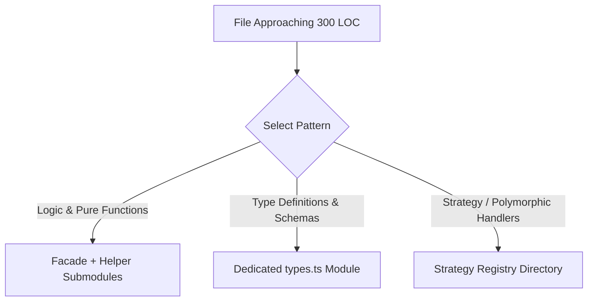

# Modular File & Directory Budgets

[OLT Documentation Hub](../../README.md) > [Architecture Index](../index.md) > [Chapter 02](./index.md) > 02-04 Modular Budgets

---

[⏮️ Previous: 02-03 Host Parity & Adapters](02-03-host-parity-and-adapters.md) | [📂 Chapter Index](index.md) | [📚 All Chapters Index](../index.md) | [⏭️ Next: Chapter 03: Mind Product Owner & Cadence](../03-mind-product-owner/index.md)
---

## 1. Cognitive Containment & The 300 LOC Rule

A major vulnerability in LLM-driven software engineering is **file bloat**. When a file exceeds 300–500 lines of code:

1. LLM attention mechanisms suffer from middle-context dropout.
2. Edit diff parsers make frequent off-by-one replacement errors.
3. Multiple agents attempting concurrent edits on the same large file inevitably collide.

OLT enforces strict **Modular File & Directory Budgets**:

$$\text{LinesOfCode}(\text{file}) \le 300 \quad \land \quad \text{FilesCount}(\text{directory}) \le 10$$

```text
                           MODULAR DECOMPOSITION TOPOLOGY
  BEFORE: Monolithic auth.ts (1,200 LOC) - High Failure Rate
  ┌────────────────────────────────────────────────────────────────────────┐
  │ auth.ts (Tokens, Password Hashing, DB Queries, Session Store, Routes) │
  └────────────────────────────────────────────────────────────────────────┘
                                    │
                                    ▼ (Decomposed via OLT Modular Pattern)
  AFTER: Modular Directory (<= 300 LOC per file, <= 10 files per dir)
  ┌────────────────────────────────────────────────────────────────────────┐
  │ src/auth/                                                              │
  │  ├── token-signer.ts        (140 LOC)                                  │
  │  ├── password-hasher.ts     (95 LOC)                                   │
  │  ├── session-store.ts       (210 LOC)                                  │
  │  ├── auth-routes.ts         (180 LOC)                                  │
  │  └── types.ts               (60 LOC)                                   │
  └────────────────────────────────────────────────────────────────────────┘
```

---

## 2. Structural Decomposition Patterns

When a module approaches the 300 LOC ceiling, OLT enforces three standard decomposition patterns:



1. **Facade & Helper Extraction**: The entry point maintains the public API and delegates internal transformations to modular helper files.
2. **Domain Type Segregation**: All interfaces, type aliases, and JSON schemas are extracted into a co-located `types.ts`.
3. **Directory Subdivision**: When a directory exceeds 10 files, sub-features must be partitioned into nested subdirectories with explicit boundary contracts.

---

## 3. Automated Linter Enforcement

The OLT AST Doctor checks file and directory limits as part of [`ast-linter.ts`](file:///Users/onurseckinsenoglu/repos/skills/olt/scripts/src/linter/ast-enforcer.ts):

```typescript
export function verifyModularBudgets(ast: ASTSourceFile): LintViolation[] {
  const lineCount = ast.getEndLineNumber();
  if (lineCount > 300) {
    return [
      {
        rule: "MODULAR_FILE_BUDGET_EXCEEDED",
        severity: "error",
        message: `File exceeds strict 300 LOC budget (${lineCount} lines). Decompose immediately.`,
      },
    ];
  }
  return [];
}
```

---

[⏮️ Previous: 02-03 Host Parity & Adapters](02-03-host-parity-and-adapters.md) | [📂 Chapter Index](index.md) | [📚 All Chapters Index](../index.md) | [⏭️ Next: Chapter 03: Mind Product Owner & Cadence](../03-mind-product-owner/index.md)
---
