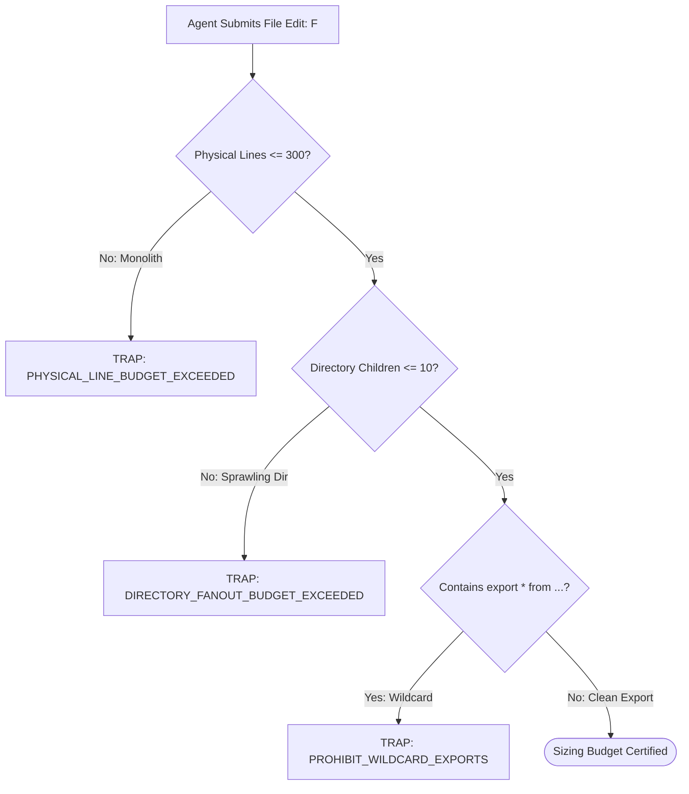

# Modular File & Directory Sizing Budgets

---

[Previous: 02-03 Host Parity & Adapters](02-03-host-parity-and-adapters.md) | [Chapter Index](index.md) | [All Chapters Index](../index.md) | [Next: Chapter 03 Index](../03-mind-product-owner/index.md)

---

## 1. Executive Summary & Cognitive Load Bounds

In autonomous multi-agent development, monolithic files and sprawling directory trees degrade agent reasoning:

- LLMs struggle to maintain precise attention over files exceeding 500 lines, leading to syntax errors and hallucinated imports.
- Deep directory nesting obscures module boundaries and encourages circular dependencies.
- Large diffs overwhelm cognitive validators during adversarial code audits.

The OLT (Orchestrating Long Tasks) engine enforces strict **Modular File & Directory Sizing Budgets**. Under this standard:

1. **TypeScript Source Files**: Capped strictly at $\le 300$ physical lines.
2. **Documentation Topics**: Bounded strictly within the optimal $250 \le L \le 800$ line sizing envelope.
3. **Directory Fanout**: Capped at $\le 10$ child entries per directory module.
4. **Explicit Named-Export Facades**: Every directory module exposes its public API through an `index.ts` barrel containing explicit named exports.

```text
+--------------------------------------------------------------------------------------------------+
│                             MODULAR SIZING BUDGET ENVELOPE                                       │
+--------------------------------------------------------------------------------------------------+
│                                                                                                  │
│   TypeScript Source Files     ──► L <= 300 Lines (Strict AST & Linter Limit)                     │
│   Documentation Topics        ──► 250 <= L <= 800 Lines (Target Diátaxis Envelope)               │
│   Directory Module Fanout     ──► Children <= 10 Entries per Directory Level                     │
│   Module Export Facades       ──► Explicit named exports only (Prohibit wildcard export *)       │
│                                                                                                  │
+--------------------------------------------------------------------------------------------------+
```

---

## 2. Mathematical Formalization of Cognitive Load $\mathcal{K}(u)$

Let $F$ denote a source file with physical line count $L(F)$ and cyclomatic complexity $C(F)$.

The cognitive comprehension cost $\mathcal{K}(F)$ for an agent context is modeled as:

$$\mathcal{K}(F) = \alpha \cdot L(F) + \beta \cdot C(F) + \gamma \cdot \text{Fanout}(F)$$

Where $\alpha, \beta, \gamma > 0$ are empirically calibrated weights.

To ensure $\mathcal{K}(F) \le \mathcal{K}_{\max}$ (the maximum reliable attention threshold):

$$L(F) \le 300 \quad \text{and} \quad \text{Fanout}(F) \le 10$$



---

## 3. Module Decomposition & Barrel Facades

When a module exceeds sizing bounds, it must be decomposed into dedicated submodules and unified via an explicit export facade:

```typescript
// Good: Explicit named export facade (index.ts)
export { compileTopologicalDAG } from "./dag-compiler";
export { breakTarjanCycles } from "./cycle-breaker";
export { layoutSugiyamaLayers } from "./sugiyama-layout";

// Prohibited: Wildcard export
export * from "./dag-compiler"; // AST Linter Fault: PROHIBIT_WILDCARD_EXPORTS
```

---

## 4. Architectural Invariants Summary

1. **Mechanical Enforcement**: Pre-commit hooks and AST linters reject files violating line budgets.
2. **Zero Shallow Stubs**: Documentation files under 100 lines are merged into cohesive topics.
3. **Predictable Architecture**: High modularity guarantees fast compilation and hermetic unit testing.

---

[Previous: 02-03 Host Parity & Adapters](02-03-host-parity-and-adapters.md) | [Chapter Index](index.md) | [All Chapters Index](../index.md) | [Next: Chapter 03 Index](../03-mind-product-owner/index.md)

---
