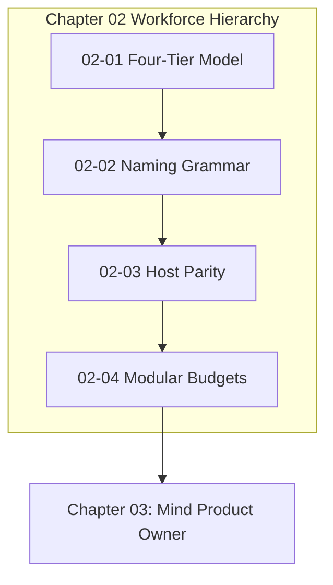

# Chapter 02: Four-Tier Workforce Hierarchy

---

[Previous: Chapter 01 Index](../01-foundations/index.md) | [Chapter Index](index.md) | [All Chapters Index](../index.md) | [Next: 02-01 The Four-Tier Agent Model](02-01-the-four-tier-agent-model.md)

---

## 1. Chapter Overview & Workforce Architecture

Welcome to Chapter 02 of the OLT Architecture Book. This chapter establishes the structural, organizational, and linguistic conventions governing the autonomous multi-agent workforce in the OLT (Orchestrating Long Tasks) engine.

Monolithic, flat agent swarms suffer from uncoordinated context collisions, ambiguous role boundaries, and supervisor context poisoning. Chapter 02 establishes the Four-Tier Agent Model (Tiers 0–3), codifies the EBNF Subagent Naming Grammar, defines the Universal Host Adapter Interface for cross-platform execution parity, and formalizes modular file and directory sizing budgets.

```text
+--------------------------------------------------------------------------------------------------+
│                             CHAPTER 02: WORKFORCE HIERARCHY TOPOLOGY                             │
+--------------------------------------------------------------------------------------------------+
│                                                                                                  │
│    ┌───────────────────────────┐                    ┌───────────────────────────┐                │
│    │ 02-01: The Four-Tier      │                    │ 02-02: Subagent Naming    │                │
│    │ Agent Workforce Model     │ ══════════════════►│ Grammar & Collision Guard │                │
│    └─────────────┬─────────────┘                    └─────────────┬─────────────┘                │
│                  │                                                │                              │
│                  ▼                                                ▼                              │
│    ┌───────────────────────────┐                    ┌───────────────────────────┐                │
│    │ 02-03: Host Parity &      │                    │ 02-04: Modular File &     │                │
│    │ Universal Adapters        │ ══════════════════►│ Directory Sizing Budgets  │                │
│    └───────────────────────────┘                    └───────────────────────────┘                │
│                                                                                                  │
+--------------------------------------------------------------------------------------------------+
```

---

## 2. Chapter Table of Contents & Learning Path

```text
+--------------------------------------------------+--------------+--------------------------------+
│ Document                                         │ Classification│ Core Architectural Focus       │
+--------------------------------------------------+--------------+--------------------------------+
│ 02-01 The Four-Tier Agent Model                  │ Architecture │ Tier 0-3 roles & boundaries    │
│ 02-02 Subagent Naming Grammar                    │ Specification│ EBNF grammar & regex rules     │
│ 02-03 Host Parity & Adapters                     │ Integration  │ Universal IHostAdapter contract│
│ 02-04 Modular File & Directory Budgets           │ Guidelines   │ Sizing budgets & cognitive load│
+--------------------------------------------------+--------------+--------------------------------+
```

### [02-01: The Four-Tier Agent Model](02-01-the-four-tier-agent-model.md)

Deconstructs the hierarchical division of labor: Tier 0 (Mind Product Owner), Tier 1 (Orchestrator), Tier 2 (Domain Coordinators), and Tier 3 (Specialized Workforce). Details the supervisor zero-file-edit rule and orthogonal validator pairing.

### [02-02: Subagent Naming Grammar & Lifecycle](02-02-subagent-naming-grammar.md)

Provides the formal EBNF grammar for subagent identifiers (`<role>_<scope>_<task_id>`). Explains collision-avoidance mechanisms, conversation ID tracking, and lifecycle teardown.

### [02-03: Host Parity & Universal Adapter Interfaces](02-03-host-parity-and-adapters.md)

Details the universal `IHostAdapter` contract allowing OLT to execute with 100% parity across Antigravity, Claude Code, Goose, Windsurf, Cursor, and Cline runtimes.

### [02-04: Modular File & Directory Budgets](02-04-modular-file-and-directory-budgets.md)

Explains physical file budget rules ($\le 300$ lines for code, 250–800 lines for docs, $\le 10$ entries per directory), cognitive load mathematics $\mathcal{K}(u)$, and explicit named-export facades.

---

## 3. Core Hierarchy Reference Table

$$ \begin{array}{|l|l|l|l|}
\hline
\textbf{Tier} & \textbf{Role Archetype} & \textbf{Permitted Authorities} & \textbf{Prohibited Operations} \\ \hline
\text{Tier 0} & \text{Mind (Product Owner)} & \text{Continuous discovery, admission, rotation} & \text{Code edits, test execution} \\ \hline
\text{Tier 1} & \text{Orchestrator} & \text{Prompt ingestion, DAG compilation, waves} & \text{Code edits, task leasing} \\ \hline
\text{Tier 2} & \text{Domain Coordinator} & \text{Sub-DAG management, worker dispatch, SLA} & \text{Direct source file mutations} \\ \hline
\text{Tier 3} & \text{Implementer / Validator} & \text{AST edits, test runs within worktree} & \text{Multi-task claims, global edits} \\ \hline
\end{array}$$



---

## 4. Summary & Transition

The workforce hierarchy codified in Chapter 02 ensures that multi-agent swarms operate with clean boundaries, precise naming, cross-platform portability, and strict context budgets.

Proceed to [02-01: The Four-Tier Agent Model](02-01-the-four-tier-agent-model.md) or advance directly to [Chapter 03: Mind Product Owner](../03-mind-product-owner/index.md).

---

[Previous: Chapter 01 Index](../01-foundations/index.md) | [Chapter Index](index.md) | [All Chapters Index](../index.md) | [Next: 02-01 The Four-Tier Agent Model](02-01-the-four-tier-agent-model.md)

---
$$
