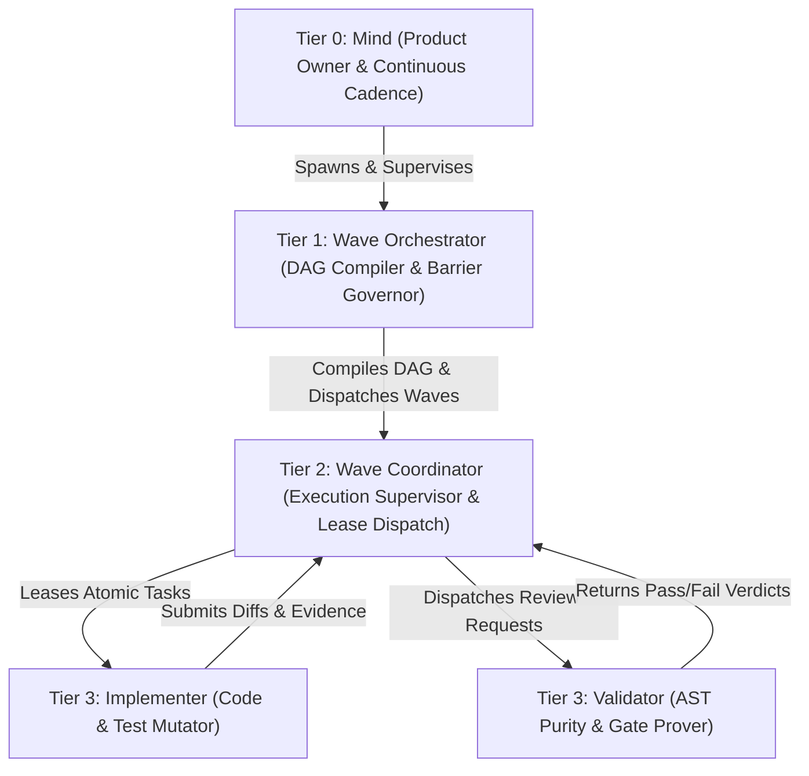

# Chapter 02: Four-Tier Hierarchy & Host Parity

[OLT Documentation Hub](../../README.md) > [Architecture Index](../index.md) > Chapter 02: Four-Tier Hierarchy & Host Parity

---

[⏮️ Previous: Chapter 01: Foundations & Core Invariants](../01-foundations/index.md) | [📂 Chapter Index](index.md) | [📚 All Chapters Index](../index.md) | [⏭️ Next: 02-01 The Four-Tier Agent Model](02-01-the-four-tier-agent-model.md)
---

## 1. Chapter Overview

Scalable multi-agent engineering requires a strict division of labor and cognitive containment. Without structural boundaries, agents suffer from supervisory drift—where orchestrators attempt to write low-level code, corrupting their high-level graph oversight and overflowing context windows.

OLT establishes a **Four-Tier Workforce Topology (T0–T3)** combined with **Cross-Host Parity Adapters** and **Modular File Budgets**, ensuring clear separation of concerns, zero cross-tier authority leaks, and uniform execution across diverse agent platforms.

```text
┌──────────────────────────────────────────────────────────────────────────────────────────────────┐
│                             CHAPTER 02: FOUR-TIER HIERARCHY TOPOLOGY                             │
├──────────────────────────┬──────────────────────────┬────────────────────────────────────────────┤
│ Sub-Topic                │ Key Architectural Model  │ Primary Invariants Enforced                │
├──────────────────────────┼──────────────────────────┼────────────────────────────────────────────┤
│ 01. Four-Tier Model      │ Hierarchical Delegation  │ Zero-File-Edit Rule for Supervisors        │
│ 02. Naming Grammar       │ EBNF Subagent Taxonomy   │ `<role>_<scope>_<task_id>` Anti-Collision │
│ 03. Host Parity          │ Abstract Capability Maps │ Uniform Execution across 4 Host Platforms  │
│ 04. Modular File Budgets │ Cognitive Containment    │ <=300 LOC/file, <=10 files/directory       │
└──────────────────────────┴──────────────────────────┴────────────────────────────────────────────┘
```

---

## 2. Table of Contents

1. **[02-01: The Four-Tier Agent Model](./02-01-the-four-tier-agent-model.md)**  
   _Tier 0 Mind, Tier 1 Orchestrator, Tier 2 Coordinator, Tier 3 Implementers & Validators._
2. **[02-02: Subagent Naming Grammar](./02-02-subagent-naming-grammar.md)**  
   _Formal EBNF naming grammar, conversation ID bindings, and anti-collision namespaces._
3. **[02-03: Host Parity & Adapters](./02-03-host-parity-and-adapters.md)**  
   _Abstract capabilities vs host mechanisms across `antigravity`, `claude_code`, `codex`, `cursor`._
4. **[02-04: Modular File & Directory Budgets](./02-04-modular-file-and-directory-budgets.md)**  
   _Cognitive containment theory, strict modular file budgets ($\le 300$ LOC), and AST metrics._

---

## 3. The Four-Tier Structural Summary



| Tier       | Role Title                  | Authority & Scope                                                             | File Mutation Permission | Primary CLI Domains          |
| :--------- | :-------------------------- | :---------------------------------------------------------------------------- | :----------------------- | :--------------------------- |
| **Tier 0** | **Mind**                    | Strategic discovery, candidate triage, 6 admission gates, roadmap governance. | **FORBIDDEN (0 edits)**  | `mind:*`, `doctor:*`         |
| **Tier 1** | **Orchestrator**            | Run lifecycle, prompt sealing, DAG compilation, wave barriers.                | **FORBIDDEN (0 edits)**  | `run:*`, `plan:*`, `queue:*` |
| **Tier 2** | **Coordinator**             | Wave dispatch, worker lease tracking, straggler SLA, repair routing.          | **FORBIDDEN (0 edits)**  | `task:claim`, `task:retry`   |
| **Tier 3** | **Implementer / Validator** | Pure atomic execution, code edits within granted scope, AST analysis.         | **PERMITTED (Scoped)**   | `task:submit`, `task:review` |

---

[⏮️ Previous: Chapter 01: Foundations & Core Invariants](../01-foundations/index.md) | [📂 Chapter Index](index.md) | [📚 All Chapters Index](../index.md) | [⏭️ Next: 02-01 The Four-Tier Agent Model](02-01-the-four-tier-agent-model.md)
---
