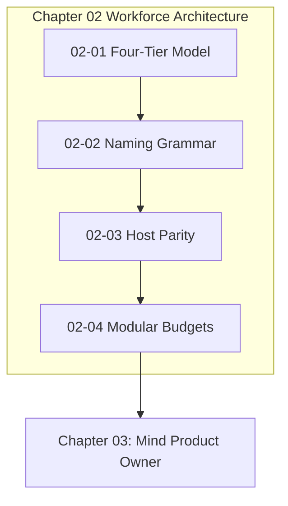

# Chapter 02: Four-Tier Hierarchy

---

[Previous: Chapter 01: Foundations](../01-foundations/index.md) | [Chapter Index](index.md) | [All Chapters Index](../index.md) | [Next: 02-01 The Four-Tier Agent Model](02-01-the-four-tier-agent-model.md)

---

## 1. Chapter Overview & Workforce Architecture

Monolithic, unstratified agent swarms suffer from uncoordinated context collisions, ambiguous role boundaries, and supervisor context poisoning. Chapter 02 establishes the Four-Tier Agent Model (Tiers 0–3), codifies the EBNF Subagent Naming Grammar, defines the Universal Host Adapter Interface for cross-platform execution parity, and formalizes modular file and directory sizing budgets.

```text
+--------------------------------------------------------------------------------------------------+
│                             CHAPTER 02: WORKFORCE HIERARCHY TOPOLOGY                             │
+--------------------------------------------------------------------------------------------------+
│                                                                                                  │
│    ┌───────────────────────────┐                    ┌───────────────────────────┐                │
│    │ 02-01: The Four-Tier      │                    │ 02-02: Subagent Naming    │                │
│    │ Agent Workforce Model     │ ══════════════════►│ Grammar & Collision Guard │                │
│    └─────────────┬─────────────┘                    └─────────────┬─────────────┘                │
│                  │                                                │                              │
│                  ▼                                                ▼                              │
│    ┌───────────────────────────┐                    ┌───────────────────────────┐                │
│    │ 02-03: Host Parity &      │                    │ 02-04: Modular File &     │                │
│    │ Universal Adapters        │ ══════════════════►│ Directory Sizing Budgets  │                │
│    └───────────────────────────┘                    └───────────────────────────┘                │
│                                                                                                  │
+--------------------------------------------------------------------------------------------------+
```

---

## 2. The Four Pillars of Chapter 02

The workforce management layer of OLT is founded upon four architectural pillars:

1. **Stratified Role Hierarchy (02-01)**: High-level supervisors plan and sequence tasks while specialized Tier 3 implementers, validators, and publishers execute within isolated worktrees. Supervisors are mechanically barred from editing source code or running tests ($Z_{\text{mutation}} = 0$).
2. **Deterministic Naming Grammar (02-02)**: Formal EBNF naming grammar (`<role>_<scope>_<sequence>[-<nonce>]`) eliminates telemetry collisions and binds agents 1:1 to isolated mailbox queues under `.olt/mailboxes/<agent_id>/`.
3. **Cross-Platform Host Parity (02-03)**: The Universal Host Adapter normalizes subagent spawning, command execution, and IPC messaging across Antigravity, Claude Code, Codex, and Cursor environments.
4. **Strict Modular Sizing Budgets (02-04)**: Mechanical AST linters enforce physical line budgets ($\le 300$ lines for source files and documentation, $\le 10$ items per directory) to prevent LLM attention degradation and maintain epistemic rigor.

---

## 3. Chapter Table of Contents & Learning Path

| Document                                                                           | Classification | Core Architectural Focus                                                            |
| :--------------------------------------------------------------------------------- | :------------- | :---------------------------------------------------------------------------------- |
| [02-01 The Four-Tier Agent Model](02-01-the-four-tier-agent-model.md)              | Architecture   | 20-Role Canonical Taxonomy, Tier 3 Publisher, supervisor zero-file-write hardening. |
| [02-02 Subagent Naming Grammar](02-02-subagent-naming-grammar.md)                  | Specification  | Formal EBNF grammar, mailbox routing, session lifecycle.                            |
| [02-03 Host Parity & Adapters](02-03-host-parity-and-adapters.md)                  | Integration    | Universal IHostAdapter, detection cascade, tool proxying across 4 canonical hosts.  |
| [02-04 Modular File & Sizing Budgets](02-04-modular-file-and-directory-budgets.md) | Guidelines     | $\le 300$ physical lines, $\le 10$ fanout, AST linters, named facades.              |

---

## 4. Core Hierarchy Reference Table & Mathematical Authority

| Tier       | Role Archetype                           | Permitted Authorities                                 | Prohibited Operations                                                          |
| :--------- | :--------------------------------------- | :---------------------------------------------------- | :----------------------------------------------------------------------------- |
| **Tier 0** | `mind`, `mind-auditor`, `skill-auditor`  | Autonomous discovery, PO/PM roadmap, fleet forensics  | Direct code edits, unit test execution, shell runs ($Z_{\text{mutation}} = 0$) |
| **Tier 1** | `orchestrator`                           | Multi-round loop, DAG sequencing, convergence         | Code edits, unit test runs, direct Tier 3 worker dispatch                      |
| **Tier 2** | `coordinator`, `planner`                 | Wave dispatch, 1-shot exact-anchor briefs, DAG plan   | Direct code mutations, repo-wide test suites, git landings                     |
| **Tier 3** | `implementer`, `publisher`, `validators` | Leased AST edits, file tests, atomic release landings | Scope escapes, cross-task mutations, supervisor bypass                         |



---

## 5. Cross-Chapter Integration Matrix

- **Upstream Foundation**: Builds on Chapter 01 invariants, specifically the Four Hard Zeros ($Z_4$), Invariants $\mathcal{C}_2$ (Monotonic Writer Lease), $\mathcal{C}_7$ (Cognitive Validator Hard-Lock), $\mathcal{C}_8$ (Supervisor Zero-File-Write), and $\mathcal{C}_{12}$ (Publisher Isolation).
- **Downstream Operations**: Provides the workforce foundation for [Chapter 03: Mind Product Owner](../03-mind-product-owner/index.md) (Tier 0 mechanics) and [Chapter 04: Continuous Preplanning Factory](../04-continuous-preplanning-factory/index.md) (Tier 1 DAG compilation).

---

## 6. Summary & Transition

The workforce hierarchy codified in Chapter 02 ensures that multi-agent swarms operate with clean separation of powers, deterministic naming, cross-platform portability, and strict context budgets.

Proceed to [02-01: The Four-Tier Agent Model](02-01-the-four-tier-agent-model.md) to begin reading the workforce specifications.

---

[Previous: Chapter 01: Foundations](../01-foundations/index.md) | [Chapter Index](index.md) | [All Chapters Index](../index.md) | [Next: 02-01 The Four-Tier Agent Model](02-01-the-four-tier-agent-model.md)
