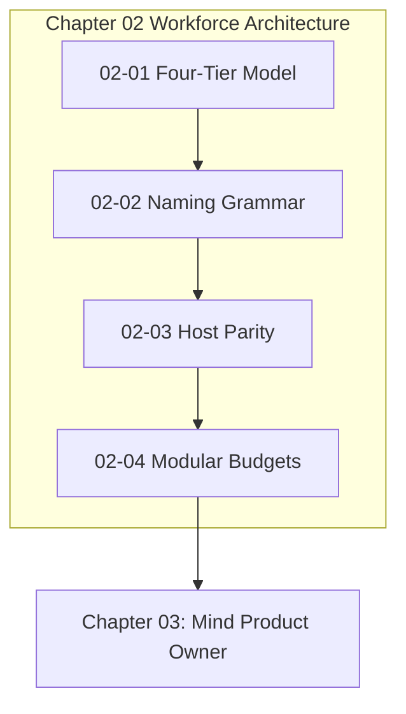

# Chapter 02: Four-Tier Hierarchy

---

[Previous: Chapter 01: Foundations](../01-foundations/index.md) | [Chapter Index](index.md) | [All Chapters Index](../index.md) | [Next: 02-01 The Four-Tier Agent Model](02-01-the-four-tier-agent-model.md)

---

## 1. Chapter Overview & Workforce Architecture

Welcome to Chapter 02 of the OLT Architecture Book. This chapter establishes the structural, organizational, and linguistic conventions governing the autonomous multi-agent workforce in the OLT (Orchestrating Long Tasks) engine.

Monolithic, unstratified agent swarms suffer from uncoordinated context collisions, ambiguous role boundaries, and supervisor context poisoning. Chapter 02 establishes the Four-Tier Agent Model (Tiers 0–3), codifies the EBNF Subagent Naming Grammar, defines the Universal Host Adapter Interface for cross-platform execution parity, and formalizes modular file and directory sizing budgets.

```text
+--------------------------------------------------------------------------------------------------+
│                             CHAPTER 02: WORKFORCE HIERARCHY TOPOLOGY                             │
+--------------------------------------------------------------------------------------------------+
│                                                                                                  │
│    ┌───────────────────────────┐                    ┌───────────────────────────┐                │
│    │ 02-01: The Four-Tier      │                    │ 02-02: Subagent Naming    │                │
│    │ Agent Workforce Model     │ ══════════════════►│ Grammar & Collision Guard │                │
│    └─────────────┬─────────────┘                    └─────────────┬─────────────┘                │
│                  │                                                │                              │
│                  ▼                                                ▼                              │
│    ┌───────────────────────────┐                    ┌───────────────────────────┐                │
│    │ 02-03: Host Parity &      │                    │ 02-04: Modular File &     │                │
│    │ Universal Adapters        │ ══════════════════►│ Directory Sizing Budgets  │                │
│    └───────────────────────────┘                    └───────────────────────────┘                │
│                                                                                                  │
+--------------------------------------------------------------------------------------------------+
```

---

## 2. The Four Pillars of Chapter 02

The workforce management layer of OLT is founded upon four architectural pillars:

1. **Stratified Role Hierarchy (02-01)**: High-level supervisors plan and sequence tasks while specialized Tier 3 implementers and validators execute code edits inside isolated worktrees. Supervisors are mechanically barred from editing source code ($Z_{\text{mutation}} = 0$).
2. **Deterministic Naming Grammar (02-02)**: Formal EBNF naming grammar (`<role>_<scope>_<sequence>[-<nonce>]`) eliminates telemetry collisions and binds agents 1:1 to isolated mailbox queues under `.olt/capsules/<slug>/mailbox/<agent_id>/`.
3. **Cross-Platform Host Parity (02-03)**: The Universal Host Adapter (`IHostAdapter`) normalizes subagent spawning, command execution, and IPC messaging across Antigravity, Claude Code, Cursor, Windsurf, Goose, and generic CLI environments.
4. **Strict Modular Sizing Budgets (02-04)**: Mechanical AST linters enforce physical line budgets ($\le 300$ lines for code, $250 \le L \le 800$ lines for docs, $\le 10$ items per directory) to prevent LLM attention degradation and maintain epistemic rigor.

---

## 3. Chapter Table of Contents & Learning Path

```text
+------------------------------------+----------------+-------------------------------------------------------------+
| Document                           | Classification | Core Architectural Focus                                    |
+------------------------------------+----------------+-------------------------------------------------------------+
| 02-01 The Four-Tier Agent Model    | Architecture   | Tier 0-3 roles, supervisor zero-file-edit, 1:1 worktree.     |
| 02-02 Subagent Naming Grammar      | Specification  | Formal EBNF grammar, mailbox routing, session lifecycle.    |
| 02-03 Host Parity & Adapters       | Integration    | Universal IHostAdapter, detection cascade, tool proxying.   |
| 02-04 Modular File & Sizing Budgets| Guidelines     | <=300 code lines, <=10 fanout, AST linter, barrel facades.  |
+------------------------------------+----------------+-------------------------------------------------------------+
```

### [02-01: The Four-Tier Agent Model](02-01-the-four-tier-agent-model.md)

Deconstructs the hierarchical division of labor: Tier 0 (Mind Product Owner), Tier 1 (Orchestrator), Tier 2 (Domain Coordinators), and Tier 3 (Specialized Workforce). Details the supervisor zero-file-edit rule ($Z_{\text{mutation}} = 0$), 1:1 out-of-repo worktree isolation, and orthogonal validator pairing.

### [02-02: Subagent Naming Grammar & Lifecycle Management](02-02-subagent-naming-grammar.md)

Provides the formal EBNF grammar for subagent identifiers (`<role>_<scope>_<sequence>[-<nonce>]`). Explains collision-avoidance mechanisms, deterministic mailbox addressing (`.olt/capsules/<slug>/mailbox/<agent_id>/`), and the monotonic lifecycle state machine.

### [02-03: Host Parity & Universal Adapter Interfaces](02-03-host-parity-and-adapters.md)

Details the universal `IHostAdapter` contract allowing OLT to execute with 100% behavioral parity across Antigravity, Claude Code, Goose, Windsurf, Cursor, and headless generic CLI environments.

### [02-04: Modular File & Directory Sizing Budgets](02-04-modular-file-and-directory-budgets.md)

Explains physical file budget rules ($\le 300$ lines for TypeScript source files, 250–800 lines for docs, $\le 10$ entries per directory level), cognitive load mathematics $\mathcal{K}(F)$, and explicit named-export facades in `index.ts`.

---

## 4. Core Hierarchy Reference Table & Mathematical Authority

$$ \begin{array}{|l|l|l|l|}
\hline
\textbf{Tier} & \textbf{Role Archetype} & \textbf{Permitted Authorities} & \textbf{Prohibited Operations} \\ \hline
\text{Tier 0} & \text{Mind (Product Owner)} & \text{Continuous discovery, admission, triage} & \text{Code edits, test execution, shell} \\ \hline
\text{Tier 1} & \text{Orchestrator} & \text{Prompt ingestion, DAG compilation, waves} & \text{Code edits, task leasing} \\ \hline
\text{Tier 2} & \text{Domain Coordinator} & \text{Sub-DAG management, worker dispatch, SLA} & \text{Direct source file mutations} \\ \hline
\text{Tier 3} & \text{Implementer / Validator} & \text{AST edits, test runs in worktree} & \text{Multi-task claims, global edits} \\ \hline
\end{array}$$



---

## 5. Cross-Chapter Integration Matrix

- **Upstream Foundation**: Builds on Chapter 01 invariants, specifically the Four Hard Zeros ($Z_4$) and Invariants $\mathcal{C}_2$ (Monotonic Writer Lease) and $\mathcal{C}_{10}$ (Worktree Isolation).
- **Downstream Operations**: Provides the workforce foundation for [Chapter 03: Mind Product Owner](../03-mind-product-owner/index.md) (Tier 0 mechanics) and [Chapter 04: Continuous Preplanning Factory](../04-continuous-preplanning-factory/index.md) (Tier 1 DAG compilation).

---

## 6. Summary & Transition

The workforce hierarchy codified in Chapter 02 ensures that multi-agent swarms operate with clean separation of powers, deterministic naming, cross-platform portability, and strict context budgets.

Proceed to [02-01: The Four-Tier Agent Model](02-01-the-four-tier-agent-model.md) to begin reading the workforce specifications.

---

[Previous: Chapter 01: Foundations](../01-foundations/index.md) | [Chapter Index](index.md) | [All Chapters Index](../index.md) | [Next: 02-01 The Four-Tier Agent Model](02-01-the-four-tier-agent-model.md)

---
$$
