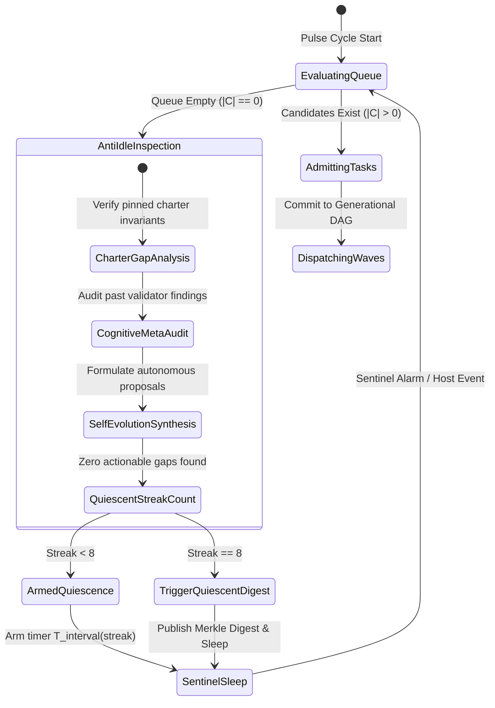
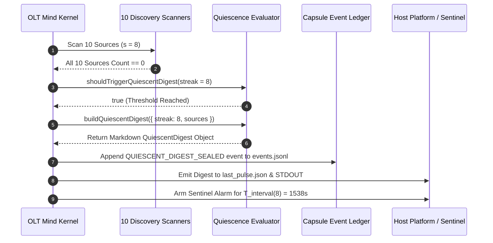

# 03-01: Infinite Autonomous Cadence — Mutual Exclusion, Quota Freezing & The Zero-Kill Invariant

> **Status**: Authoritative Architecture Specification  
> **Topic**: Tier-0 Perpetual Autonomous Loop, POSIX Advisory Mutual Exclusion, Suspended Dual-Time Clock, and Zero-Kill Quota Resilience  
> **Audience**: Autonomous Systems Architects, Concurrency Engineers, Operating Systems Specialists, Daemon Runtime Developers

---

[Previous: Chapter 03: Mind Product Owner & Cadence Overview](index.md) | [Chapter Index](index.md) | [All Chapters Index](../index.md) | [Next: 03-02 Ten Discovery Sources & Triage](03-02-ten-discovery-sources-and-triage.md)
---

## 1. Executive Summary & The Perpetual Daemon Model

In conventional software development, build agents and automated scripts run as transient batch jobs: invoked by a Webhook or cron trigger, executing a fixed sequence of instructions, and terminating upon either success (`exit 0`) or failure (`exit 1`). When applying this model to Large Language Model (LLM) agents, a catastrophic failure mode emerges: **ephemeral context amnesia and process starvation**. When an agent terminates, its working memory, intermediate telemetry, discovery cursors, and in-flight repair iterations are destroyed.

```text
+===================================================================================================+
|                                    EPHEMERAL VS PERPETUAL DAEMON                                  |
+===================================================================================================+
|  CONVENTIONAL BATCH AGENT:                                                                        |
|  [Cron Trigger] ──► [Load Context] ──► [Run 1 Task] ──► [SIGTERM / Exit] ──► (State Amnesia)     |
|                                                                                                   |
|  OLT PERPETUAL MIND DAEMON:                                                                       |
|  ┌─────────────────────────────────────────────────────────────────────────────────────────────┐  |
|  │  PULSE CADENCE (pulse.sh)                                                                    │  |
|  │  ├── 1. Non-blocking POSIX Advisory Lock (FD 9 flock on .locks/mind.pulse)                  │  |
|  │  ├── 2. Continuous 10-Source Discovery & 6-Gate Admission                                   │  |
|  │  ├── 3. Pillar 16 Quota Freeze: Suspended Dual-Time Clock (Zero-Kill in RAM)                │  |
|  │  ├── 4. Adaptive Exponential Backoff: T_interval = min(T_max, round(T_base * 1.5^streak))  │  |
|  │  └── 5. 8th-Streak Quiescence Transition & Merkle Sealed Digest                             │  |
|  └──────────────────────────────────────────┬──────────────────────────────────────────────────┘  |
|                                             │ Perpetual Anti-Idle Loop                            |
|                                             ▼                                                     |
|                      [ CLOSING_FORBIDDEN_FOR_MIND Invariant Armed ]                               |
+===================================================================================================+
```

The **Orchestrated Lifecycle Topology (OLT)** treats the **Tier-0 Mind Supervisor** as a **perpetual operating system daemon**. Governed by the `CLOSING_FORBIDDEN_FOR_MIND` invariant, the Mind Engine is architecturally forbidden from terminating when the backlog empties. Instead, it enters an anti-idle pulse cadence managed by `pulse.sh`, using kernel-level POSIX file locks, adaptive sentinel timers, and non-destructive quota suspension.

---

## 2. The `CLOSING_FORBIDDEN_FOR_MIND` Invariant

In standard single-task execution capsules (`mode: "feature"`), completing all tasks in the Directed Acyclic Graph (DAG) triggers `run:complete` and seals the capsule. In contrast, a Mind capsule (`mode: "mind"`) enforces the non-terminal invariant:

$$\forall t \in [0, \infty), \quad \text{Status}(\mathcal{S}_{\text{mind}}, t) \ne \texttt{COMPLETED} \quad \land \quad \text{Exit}(\text{MindDaemon}) \notin \{\texttt{TERMINATED\_CLEAN}\}$$

### 2.1 Formal Anti-Idle State Transitions

When the candidate pool $\mathcal{C}_t$ is depleted ($\mathcal{C}_t = \emptyset$) and all active objective runs $\mathcal{O}_t$ have reached terminal states, the Mind supervisor does not shut down. It initiates the **Autonomous Anti-Idle Protocol**:



### 2.2 Rejection of Premature Round Closure

If an external caller or subagent attempts to execute `mind:round-close` without providing a verified successor generation or terminal reason, the OLT kernel rejects the operation with a fatal invariant exception:

```text
[HARNESS_ERROR: CLOSING_FORBIDDEN_FOR_MIND]
Cannot close Mind round 'round-42' without declaring successor generation or terminal charter reason.
Mind supervision is perpetual. Use 'mind:rotate' for generational transition.
```

---

## 3. Mutual Exclusion & The `pulse.sh` Engine

To prevent multiple host cron triggers, CI webhooks, or background agents from running concurrent supervisory loops on the same repository, OLT employs an advisory kernel lock on a dedicated file descriptor.

```text
┌──────────────────────────────────────────────────────────────────────────────────────────────────┐
│                                POSIX FLOCK MUTUAL EXCLUSION TOPOLOGY                             │
├──────────────────────────────────────────────────────────────────────────────────────────────────┤
│                                                                                                  │
│  Process A (Cron 00:00)              Process B (Event Wake 00:00.02)                             │
│  ┌───────────────────────────────┐   ┌───────────────────────────────┐                           │
│  │ exec 9> .locks/mind.pulse     │   │ exec 9> .locks/mind.pulse     │                           │
│  │ flock -n 9                    │   │ flock -n 9                    │                           │
│  │ -> LOCK ACQUIRED (FD 9)       │   │ -> LOCK BUSY (EWOULDBLOCK)    │                           │
│  └──────────────┬────────────────┘   └──────────────┬────────────────┘                           │
│                 │                                   │                                            │
│                 ▼                                   ▼                                            │
│  ┌───────────────────────────────┐   ┌───────────────────────────────┐                           │
│  │ Execute mind:wake & observe   │   │ Exit 75 Immediately           │                           │
│  │ Dispatch brief to HOST_CMD    │   │ (skipped_locked, not success) │                           │
│  └──────────────┬────────────────┘   └───────────────────────────────┘                           │
│                 │                                                                                │
│                 ▼                                                                                │
│  ┌───────────────────────────────┐                                                               │
│  │ Close FD 9 (Kernel Unlock)    │                                                               │
│  │ Trap: remove temp brief file  │                                                               │
│  └───────────────────────────────┘                                                               │
│                                                                                                  │
└──────────────────────────────────────────────────────────────────────────────────────────────────┘
```

### 3.1 Kernel Locking Mechanics & Fallback Hierarchy

The entrypoint [pulse.sh](../../../../olt/scripts/pulse.sh) opens file descriptor `9` pointing to `.olt/capsules/<mind-slug>/.locks/mind.pulse`. It applies a non-blocking exclusive lock (`LOCK_EX | LOCK_NB`):

```bash
#!/usr/bin/env bash
# File: olt/scripts/pulse.sh
set -uo pipefail

EXIT_RAN=0                 # ran, held a lock, reached a host
EXIT_FAILED=70             # could not complete
EXIT_RAN_UNLOCKED=71       # ran with NO lock primitive available
EXIT_RAN_UNDISPATCHED=72   # ran but reached no host, so it did nothing
EXIT_SKIPPED_LOCKED=75     # a peer holds the pulse lock

# 1. Open File Descriptor 9 on the Lock File, then acquire a non-blocking
#    exclusive lock across OS variants. Contention is NOT success: it exits 75.
exec 9>"$LOCK_FILE"
if command -v flock >/dev/null 2>&1; then
  LOCK_MECHANISM=flock
  flock -n 9 || { report skipped_locked none; exit "$EXIT_SKIPPED_LOCKED"; }
elif command -v perl >/dev/null 2>&1; then
  LOCK_MECHANISM=perl
  perl -MFcntl=:flock -e '...' || { report skipped_locked none; exit "$EXIT_SKIPPED_LOCKED"; }
elif command -v python3 >/dev/null 2>&1; then
  LOCK_MECHANISM=python3
  python3 -c '...' || { report skipped_locked none; exit "$EXIT_SKIPPED_LOCKED"; }
else
  LOCK_MECHANISM=none
  echo "pulse.sh WARNING: no lock primitive available ..." >&2
fi

# 2. Establish a ledger-backed ancestry session, without which mind:wake
#    refuses the caller. Read by the bun child through its ppid.
cat > "$REPO_ROOT/.olt/.sessions/$$.json" <<JSON
{"agent_id":"$PULSE_AGENT_ID","role":"$PULSE_ROLE", ...}
JSON

# 3. Wake the Mind Engine into an ephemeral brief.
"$BUN" "$HARNESS" mind:wake --run "$CAPSULE" > "$BRIEF_FILE" \
  || { report failed none; exit "$EXIT_FAILED"; }

# 4. Dispatch the brief to the host supervisor. A pulse that reaches no host
#    consumed a cycle and accomplished nothing; it must not report success.
if [ -n "$HOST_CMD" ]; then
  eval "$HOST_CMD \"$BRIEF_FILE\"" && DISPATCH=delivered || {
    report failed failed; exit "$EXIT_FAILED"; }
else
  echo "pulse.sh WARNING: no host command configured ..." >&2
fi

[ "$DISPATCH" = none ]        && { report ran_undispatched none; exit "$EXIT_RAN_UNDISPATCHED"; }
[ "$LOCK_MECHANISM" = none ]  && { report ran_unlocked "$DISPATCH"; exit "$EXIT_RAN_UNLOCKED"; }
report ran "$DISPATCH"; exit "$EXIT_RAN"
```

Every invocation also writes one machine-readable line to stderr:

```text
pulse_status=<outcome> pulse_lock_mechanism=<flock|perl|python3|none> pulse_host_dispatch=<none|delivered|failed>
```

### 3.2 Outcome-Bearing Exit Semantics

`pulse.sh` is a single-shot unit of work. Its exit code is its outcome, and no two outcomes share one:

| Code | Outcome            | Meaning                                                        | Pages an operator? |
| :--- | :----------------- | :------------------------------------------------------------- | :----------------- |
| 0    | `ran`              | Pulse executed under an exclusive lock and reached a host      | No                 |
| 70   | `failed`           | `mind:wake` or the host dispatch failed                        | Yes                |
| 71   | `ran_unlocked`     | Pulse executed with no lock primitive available; degraded      | No, but visible    |
| 72   | `ran_undispatched` | Pulse executed but reached no host, so it accomplished nothing | No, but visible    |
| 75   | `skipped_locked`   | A genuine peer holds the pulse lock; the correct thing to do   | No                 |

Two of these exist because their absence hid real outages:

1. **Contention used to exit 0.** A pulse that could not run reported success, so nothing could
   distinguish "pulse ran" from "pulse skipped" from "pulse never fired". Skipping because a peer
   holds the lock is normal and must not page anyone, but it must not read as work either.
2. **A pulse with no host dispatch used to exit 0.** `HOST_CMD` resolves from
   `${2:-${PULSE_HOST_CMD:-${HOST_CMD:-}}}`; when all three are unset the brief is produced and
   discarded. The harness never calls a language model, so a brief that reaches no host agent is
   inert. That is now `ran_undispatched`, with a warning naming the variable to set.

The lock fallback chain is load-bearing, not defensive decoration: `flock(1)` is absent on macOS, so
production there runs on the `perl` branch. The `perl` and `python3` branches take the lock on the
open file description that the shell holds on FD 9, so the lock survives the helper's exit and is
released only when the shell closes FD 9. If none of the three exists the pulse still runs — liveness
outranks mutual exclusion — but it says so loudly on stderr and exits 71 rather than pretending.

### 3.3 The Pulse Driver

`pulse.sh` has no loop, no sleep and no self-rescheduling: it takes a lock, runs one `mind:wake`, and
exits. It was designed to be invoked repeatedly by an external scheduler — a host `schedule` cron, a
systemd timer, or a supervised loop. When that external caller disappears, nothing announces it: the
armed `next_wake_at` in `last_pulse.json` is a promise with no keeper, and the anti-stagnation
detector that would notice the halt is itself downstream of the pulse it watches.

`olt/scripts/pulse-driver.ts` closes that gap. It is a supervised foreground process, the shape that
survives on this machine, and it is deadline-driven rather than cron-driven: each iteration reads
`next_wake_at` from `last_pulse.json` and honours the adaptive backoff the Mind computed for itself,
instead of overriding it with a fixed interval.

```bash
bun olt/scripts/pulse-driver.ts --run .olt/capsules/mind-gen-1 --foreground
bun olt/scripts/pulse-driver.ts --run .olt/capsules/mind-gen-1 --status
```

- `--foreground` is mandatory. The driver never forks itself; a supervisor that outlives the calling
  session starts it detached, so the process that must survive is never the driver's own child.
- A `mind.driver` lock file rejects a second driver on a live pid, and reclaims the lock from a dead one.
- A floor interval (`--min-interval`, default 60s) stops a permanently overdue capsule from being
  hammered; a wait slice (`--max-slice`, default 60s) keeps the loop responsive to a re-armed deadline.
- The health record at `<run>/runtime/pulse-driver-health.json` stores only facts observed at write
  time, and is refused unless the writing process is the process it describes. It carries no `state`
  field, because a stored state is a claim that outlives the fact it described. `--status` derives
  `LIVE | DEGRADED | FAILING | STALE | DEAD` at read time from a liveness probe against the recorded
  pid and the age of the heartbeat, so a record left behind by a dead driver can never read `LIVE`.

## 4. Quota Dynamics & Pillar 16 Zero-Kill Invariant

When interacting with external LLM inference providers, agent runtimes are subject to hard API rate limits (`HTTP 429: Too Many Requests`) and sliding-window token budget exhaustion. Conventional frameworks handle rate limits by killing the agent process (`SIGKILL`), throwing an unhandled exception, or failing the active task.

OLT establishes **Pillar 16: Quota Freeze & Zero-Kill Resilience**.

```text
+===================================================================================================+
|                                PILLAR 16: QUOTA FREEZE & ZERO-KILL                                 |
+===================================================================================================+
|                                                                                                   |
|  [HEALTHY CADENCE] ──► Telemetry Monitors: Quota < 10% or HTTP 429 ──► [INITIATE QUOTA FREEZE]     |
|                                                                                │                  |
|                                                                                ▼                  |
|  ┌─────────────────────────────────────────────────────────────────────────────────────────────┐  |
|  │  1. HALT CRONS: Disable external pulse invocations.                                         │  |
|  │  2. PAUSE LEASE CLOCKS: Mark suspended_at = T_freeze on all active leases.                  │  |
|  │  3. ZERO-KILL INVARIANT: Subagent processes remain alive in RAM (0 SIGKILL).                │  |
|  │  4. DAG SNAPSHOT: Serialize .olt/quota-dag-snapshot.json with suspended task coordinates.   │  |
|  │  5. SENTINEL ALARM: Arm OS timer for Rate-Limit Reset Timestamp T_reset.                    │  |
|  └─────────────────────────────────────────────┬───────────────────────────────────────────────┘  |
|                                                │                                                  |
|                                                ▼                                                  |
|  [FROZEN IDLE] ◄───────────────────────────────┘                                                  |
|  (Zero Token Consumption • Context & AST State Preserved in Process Memory)                       |
|        │                                                                                          |
|        ▼ (Sentinel Alarm Fires at T_reset)                                                        |
|  [AUTO-WAKE VERIFICATION] ──► Probe API Gateway (Token Quota > 20%)                               |
|        │                                                                                          |
|        ▼                                                                                          |
|  ┌─────────────────────────────────────────────────────────────────────────────────────────────┐  |
|  │  RESUME TRANSLATION: Translate all active lease deadlines:                                  │  |
|  │  t_expire' = t_expire + Delta t_frozen                                                      │  |
|  │  Remove suspended_at flag & resume task wave dispatch without context loss.                 │  |
|  └─────────────────────────────────────────────────────────────────────────────────────────────┘  |
+===================================================================================================+
```

### 4.1 The Suspended Dual-Time Monotonic Clock

To ensure task leasing correctness across rate-limit pauses, OLT introduces the **Suspended Dual-Time Monotonic Clock**.

Let a worker lease $L_i$ granted at timestamp $t_{\text{start}}$ have an authorized duration $\text{TTL}_0$. Under nominal execution, the remaining lease duration is:

$$\tau_{\text{remain}}(t) = \text{TTL}_0 - (t - t_{\text{start}})$$

When a quota freeze occurs at wall-clock timestamp $t_{\text{freeze}}$, the clock enters the suspended state:

$$ \text{ClockState}(t) = \begin{cases}
\texttt{ACTIVE}, & t < t_{\text{freeze}} \\
\texttt{SUSPENDED}, & t_{\text{freeze}} \le t < t_{\text{resume}} \\
\texttt{ACTIVE}, & t \ge t_{\text{resume}}
\end{cases}$$

The total frozen interval is defined as:

$$\Delta t_{\text{frozen}} = t_{\text{resume}} - t_{\text{freeze}}$$

Upon auto-wake at $t_{\text{resume}}$, the lease expiration timestamp $t_{\text{expire}}'$ is translated forward:

$$t_{\text{expire}}' = t_{\text{expire}} + \Delta t_{\text{frozen}}$$

$$\tau_{\text{remain}}(t_{\text{resume}}) = \tau_{\text{remain}}(t_{\text{freeze}})$$

#### Mathematical Guarantee
No active worker lease expires as a consequence of upstream API rate limits. The epistemic context within the model's scratchpad and local process state remains 100% intact.

```typescript
// Architectural Implementation: Suspended Clock Translation
export function translateSuspendedLeases(
  state: Record<string, unknown>,
  frozenDurationMs: number
): void {
  const activeLeases = (state.activeLeases ?? {}) as Record<string, { expiresAt: string; suspended_at?: string }>;

  for (const [taskId, lease] of Object.entries(activeLeases)) {
    if (lease.suspended_at) {
      const originalExpiryMs = Date.parse(lease.expiresAt);
      lease.expiresAt = new Date(originalExpiryMs + frozenDurationMs).toISOString();
      delete lease.suspended_at;
    }
  }
}
```

---

## 5. Sentinel Wake Timers & Adaptive Exponential Backoff

When the repository is healthy and no tasks require execution, polling at rapid frequencies wastes CPU cycles and clogs filesystem logs. The Mind Engine computes dynamic sleep intervals using an **Adaptive Exponential Backoff Curve**.

### 5.1 The Interval Multiplier Formula

Let $s \in \mathbb{N}_0$ be the consecutive quiescent streak count (the number of consecutive pulse cycles where all 10 discovery sources found zero actionable items). The next sleep interval $T_{\text{interval}}(s)$ is given by:

$$T_{\text{interval}}(s) = \min\left( T_{\text{max}}, \, \text{round}\left( T_{\text{base}} \times \gamma^s \right) \right)$$

Where:
* $T_{\text{base}}$ is the base pulse interval (default: $60{,}000\,\text{ms} = 1\,\text{minute}$).
* $T_{\text{max}}$ is the maximum sleep cap (default: $3{,}600{,}000\,\text{ms} = 1\,\text{hour}$).
* $\gamma = 1.5$ is the Quiescence Multiplier ([QUIESCENCE_INTERVAL_MULTIPLIER](../../../../olt/scripts/src/mind/archival/quiesce/types.ts#L20)).

```text
┌──────────────────────────────────────────────────────────────────────────────────────────────────┐
│                            ADAPTIVE INTERVAL BACKOFF PROGRESSION (T_base = 60s)                  │
├────────┬─────────────────┬──────────────────┬────────────────────────────────────────────────────┤
│ Streak │ Multiplier (1.5^s)│ Sleep Interval   │ Operational Activity                               │
├────────┼─────────────────┼──────────────────┼────────────────────────────────────────────────────┤
│ s = 0  │ 1.000x          │ 60s (1.0 min)    │ Active work in progress or immediate re-scan       │
│ s = 1  │ 1.500x          │ 90s (1.5 min)    │ First clean observation cycle                      │
│ s = 2  │ 2.250x          │ 135s (2.25 min)  │ Second clean cycle                                 │
│ s = 3  │ 3.375x          │ 203s (3.38 min)  │ Low-frequency background monitoring                │
│ s = 4  │ 5.063x          │ 304s (5.06 min)  │ Extended monitoring                                │
│ s = 5  │ 7.594x          │ 456s (7.59 min)  │ Deep quiescence check                              │
│ s = 6  │ 11.391x         │ 683s (11.39 min) │ Deep quiescence check                              │
│ s = 7  │ 17.086x         │ 1025s (17.09 min)│ Pre-digest validation cycle                        │
│ s = 8  │ 25.629x         │ 1538s (25.63 min)│ 8th-STREAK QUIESCENT DIGEST SEALED & PUBLISHED     │
│ s >= 11│ --              │ 3600s (60 min)   │ Maximum Interval Cap (T_max reached)               │
└────────┴─────────────────┴──────────────────┴────────────────────────────────────────────────────┘
```

### 5.2 Streak Reset Invariant

If at any pulse cycle $t$, any of the 10 discovery sources yields $\text{count} > 0$, or a new candidate is admitted to $\mathcal{C}_t$:

$$s_{t+1} = 0 \implies T_{\text{interval}}(0) = T_{\text{base}}$$

The system immediately collapses backoff and returns to maximum observation responsiveness.

---

## 6. The 8th-Streak Quiescence State Transition

When the quiescence streak reaches exactly $s = 8$ ([QUIESCENT_DIGEST_STREAK_THRESHOLD](../../../../olt/scripts/src/mind/archival/quiesce/types.ts#L21)), the Mind supervisor transitions to the `QuiescentDigest` state.



### 6.1 Quiescent Repository Digest Schema

The digest is synthesized into an immutable record verifying repository health across all 10 sources:

```markdown
### Quiescent Repository Digest (Streak 8)
- **Run**: `mind-gen-1`
- **Generated**: 2026-08-29T02:53:08.000Z
- **Verdict**: The repository has been clean for 8 consecutive quiescent pulses. All ten discovery sources reported count 0.

#### Verified Discovery Sources (10 of 10 Clean)
1. **code no longer matching intent** (`intent-drift`): count = 0 (command `bun harness.ts health --check intent-drift --all`, `harness_observed`)
2. **dead / unreachable / unenforced code** (`unused-code`): count = 0 (command `bun harness.ts health --check unused-code,dead-code,unenforced`, `harness_observed`)
3. **literal fallbacks** (`literal-fallbacks`): count = 0 (command `bun harness.ts health --check literal-fallbacks`, `harness_observed`)
4. **open findings from real validators** (`open-findings`): count = 0 (command `bun harness.ts finding:get --run <r> --all`, `agent_reported`)
5. **escalated tasks awaiting a human** (`escalated-tasks`): count = 0 (command `bun harness.ts run:status`, `harness_observed`)
6. **gates whose recorded exit ≠ 0** (`failing-gates`): count = 0 (command `bun harness.ts evidence:get`, `harness_observed`)
7. **capsule integrity damage** (`capsule-integrity`): count = 0 (command `bun harness.ts doctor --run <r>`, `harness_observed`)
8. **install / runtime drift** (`install-drift`): count = 0 (command `bun harness.ts installation-status`, `harness_observed`)
9. **unsealed capsules with live leases** (`unsealed-capsules`): count = 0 (command `bun harness.ts run:status`, `harness_observed`)
10. **owner backlog in charter documents** (`charter-backlog`): count = 0 (command `bun harness.ts health`, `harness_observed`)
```

---

## 7. Operational Failure Modes & Edge Case Recovery

```text
┌────────────┬──────────────────────────────────┬────────────────────────────────────────────────────────┐
│ Error Code │ Empirical Edge Case              │ Kernel Recovery Protocol                               │
├────────────┼──────────────────────────────────┼────────────────────────────────────────────────────────┤
│ ERR-CAD-01 │ Stale Lock Inode on Host Crash   │ POSIX flock is bound to process FD; released by OS.    │
│ ERR-CAD-02 │ System Clock Skew During Sleep   │ Monotonic timer comparisons use delta translation.     │
│ ERR-CAD-03 │ Rate Limit on Sentinel Wakeup    │ Re-arms sentinel alarm with 2x jittered backoff.       │
│ ERR-CAD-04 │ Brief File Collision             │ Unique filename includes PID + double random integer.  │
│ ERR-CAD-05 │ Unparseable Charter on Wakeup    │ Enters quarantine state; emits operator alert.         │
└────────────┴──────────────────────────────────┴────────────────────────────────────────────────────────┘
```

---

*Proceed to the next section: [03-02: Ten Discovery Sources & Real-Time Triage](./03-02-ten-discovery-sources-and-triage.md).*

---
[Previous: Chapter 03: Mind Product Owner & Cadence Overview](index.md) | [Chapter Index](index.md) | [All Chapters Index](../index.md) | [Next: 03-02 Ten Discovery Sources & Triage](03-02-ten-discovery-sources-and-triage.md)
---
$$
