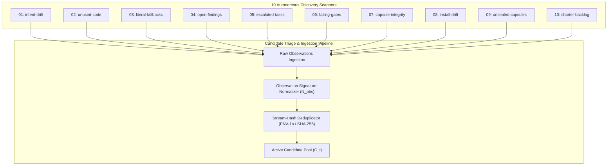
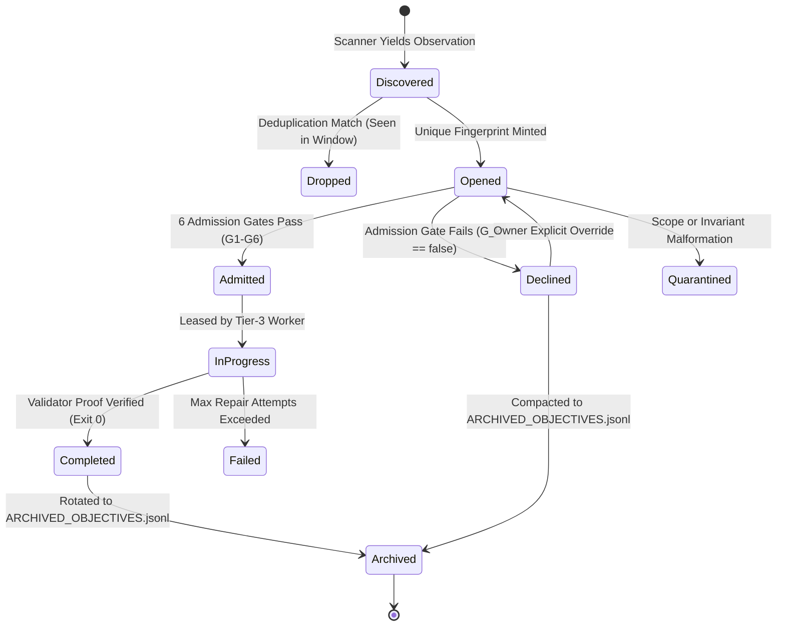

# 03-02: The Ten Autonomous Discovery Sources & Real-Time Triage Engine

> **Status**: Authoritative Architecture Specification  
> **Topic**: Continuous Sensing Scanners, Stream-Hash Deduplication, Observation Signature Normalization, and Candidate Lifecycle Algebra  
> **Audience**: Autonomous Systems Architects, Static Analysis Engineers, Data Pipeline Specialists, Triage Runtime Authors

---

[Previous: 03-01 Infinite Autonomous Cadence](03-01-infinite-autonomous-cadence.md) | [Chapter Index](index.md) | [All Chapters Index](../index.md) | [Next: 03-03 Six Admission Gates](03-03-six-admission-gates.md)
---

## 1. Executive Summary & Proactive Discovery Theory

Conventional software development agents are purely **reactive**: they remain inert until an engineer provides an explicit prompt describing a problem. This reactive model fails in autonomous operations because software decay occurs silently. Type annotations drift, unexported helper functions become dead code, mock assertions substitute real verifications, test fixtures silently break, and capsules accumulate torn event tails without human notice.

```text
+====================================================================================================+
|                                REACTIVE VS PROACTIVE AGENT PARADIGMS                               |
+====================================================================================================+
|  REACTIVE AGENT MODEL:                                                                             |
|  [Silent Workspace Decay] ──► [Human Discovers Bug Weeks Later] ──► [Manual Prompt Entry]          |
|                                                                                                    |
|  OLT PROACTIVE 10-SOURCE CONTINUOUS DISCOVERY:                                                     |
|  ┌──────────────────────────────────────────────────────────────────────────────────────────────┐  |
|  │                       10 CONTINUOUS DISCOVERY SCANNERS (mind:observe)                        │  |
|  │  1. Intent Drift       2. Unused Code       3. Literal Fallbacks   4. Open Validator Findings│  |
|  │  5. Escalations        6. Failing Gates     7. Capsule Integrity   8. Install/Runtime Drift  │  |
|  │  9. Unsealed Capsules 10. Charter Backlog                                                    │  |
|  └──────────────────────────────────────────────┬───────────────────────────────────────────────┘  |
|                                                 │ Raw Diagnostic Stream                            |
|                                                 ▼                                                  |
|  ┌──────────────────────────────────────────────────────────────────────────────────────────────┐  |
|  │                  STREAM-HASH DEDUPLICATION & OBSERVATION NORMALIZATION (N_obs)               │  |
|  │  • Strip timestamps, hex addresses, PIDs, line numbers • FNV-1a & SHA-256 Fingerprinting    │  |
|  │  • Jaccard Token Distance Filtering • Sliding-Window Buffer (P_collision <= n^2 / 2^49)     │  |
|  └──────────────────────────────────────────────┬───────────────────────────────────────────────┘  |
|                                                 │ Normalized Candidate Pool                        |
|                                                 ▼                                                  |
|                             [ 6-Gate Formal Admission Evaluation ]                                 |
+====================================================================================================+
```

The **OLT Mind Discovery Engine** transforms the agent runtime into a **continuous proactive sensor network**. During every pulse cycle, the Mind invokes ten autonomous scanners, normalizes raw diagnostic outputs, computes cryptographic stream fingerprints, filters redundant occurrences, and populates the candidate pool $\mathcal{C}_t$.

---

## 2. The 10 Autonomous Discovery Scanners

Every discovery source is formally specified in the Mind contract ([MIND_DISCOVERY_SOURCES](file:///Users/onurseckinsenoglu/repos/skills/olt/scripts/src/mind/memory/sources/types.ts#L47-L178)) with a dedicated registry command, empirical evidence command, revalidation gate, and evidence classification.

```text
┌──────────────────────────────────────────────────────────────────────────────────────────────────┐
│                                10 AUTONOMOUS DISCOVERY SCANNERS                                  │
├────┬──────────────────────┬──────────────────────────────┬──────────────────┬────────────────────┤
│ #  │ Source Identifier    │ Target Domain                │ Evidence Class   │ Discovery Category │
├────┼──────────────────────┼──────────────────────────────┼──────────────────┼────────────────────┤
│ 01 │ `intent-drift`       │ Semantic Intent Violations   │ harness_observed │ ARCHITECTURAL      │
│ 02 │ `unused-code`        │ Dead / Unreachable Exports   │ harness_observed │ CODE_QUALITY       │
│ 03 │ `literal-fallbacks`  │ Mock / Hardcoded Defaults    │ harness_observed │ CODE_QUALITY       │
│ 04 │ `open-findings`      │ Unresolved Validator Reviews │ agent_reported   │ FEEDBACK_INTAKE    │
│ 05 │ `escalated-tasks`    │ Human Owner Intervention     │ harness_observed │ FEEDBACK_INTAKE    │
│ 06 │ `failing-gates`      │ Non-Zero Exit Code Receipts  │ harness_observed │ TEST_COVERAGE      │
│ 07 │ `capsule-integrity`  │ Merkle Chain & State Tamper  │ harness_observed │ ARCHITECTURAL      │
│ 08 │ `install-drift`      │ CLI Runtime vs Release Drift │ harness_observed │ ARCHITECTURAL      │
│ 09 │ `unsealed-capsules`  │ Orphan Leases & Stale Runs   │ harness_observed │ HARDENING          │
│ 10 │ `charter-backlog`    │ Unfulfilled Charter Goals    │ harness_observed │ DORMANT_CRITERIA   │
└────┴──────────────────────┴──────────────────────────────┴──────────────────┴────────────────────┘
```



### 2.1 Detailed Scanner Specifications

#### Source 01: Semantic Intent Drift (`intent-drift`)

- **Objective**: Senses when codebase AST structure or requirement implementations no longer match the goals declared in `prompt.md` or pinned specifications.
- **Empirical Command**: `bun harness.ts health --check intent-drift --all`
- **Revalidation Gate**: `bun harness.ts health --check intent-drift`
- **Failure Trigger**: Detection of unfulfilled requirement assertions or deleted functional paths.

#### Source 02: Dead & Unenforced Code (`unused-code`)

- **Objective**: Scans TypeScript AST trees for unused exported symbols, orphaned submodules, unreachable functions, and dead dependencies.
- **Empirical Command**: `bun harness.ts health --check unused-code,dead-code,unenforced`
- **Revalidation Gate**: `bun harness.ts health --check unused-code,dead-code`
- **Failure Trigger**: Any export without inbound references across active entrypoints.

#### Source 03: Literal Fallbacks & Mock Stubs (`literal-fallbacks`)

- **Objective**: Identifies speculative shortcut implementations where an agent substituted actual logic with hardcoded literals, empty fallback strings, or tautological early returns.
- **Empirical Command**: `bun harness.ts health --check literal-fallbacks`
- **Revalidation Gate**: `bun harness.ts health --check literal-fallbacks`
- **Failure Trigger**: Presence of AST patterns matching `mock_tautology` or `literal_or_fallback`.

#### Source 04: Open Validator Findings (`open-findings`)

- **Objective**: Ingests unresolved defect findings recorded by Tier-3 Mechanic Validators, UI Validators, or Completeness Critics during prior task waves.
- **Empirical Command**: `bun harness.ts finding:get --run <r> --all`
- **Revalidation Gate**: `bun harness.ts finding:get --run <r>`
- **Failure Trigger**: Any finding record with `status: "open"` and severity $\ge \text{P2}$.

#### Source 05: Escalated Tasks Awaiting Owner (`escalated-tasks`)

- **Objective**: Identifies tasks where automatic repair failed $N > 3$ times, requiring owner clarification or high-privilege policy decisions.
- **Empirical Command**: `bun harness.ts run:status`
- **Revalidation Gate**: `bun harness.ts run:status`
- **Failure Trigger**: Tasks marked with status `escalated` in `state.json`.

#### Source 06: Non-Zero Failing Gates (`failing-gates`)

- **Objective**: Senses test suite regressions, broken typechecks, or linters across the workspace where recorded command execution receipts yielded exit code $\ne 0$.
- **Empirical Command**: `bun harness.ts evidence:get`
- **Revalidation Gate**: `bun harness.ts evidence:get`
- **Failure Trigger**: Exit code receipt $e \ne 0$ in `.olt/capsules/<r>/commands/`.

#### Source 07: Capsule Integrity Damage (`capsule-integrity`)

- **Objective**: Validates the cryptographic integrity of capsule manifests, SHA-256 event chains, and projection state consistency.
- **Empirical Command**: `bun harness.ts doctor --run <r>`
- **Revalidation Gate**: `bun harness.ts doctor --run <r>`
- **Failure Trigger**: Broken hash pointer $h_k \ne \text{SHA-256}(h_{k-1} \parallel e_k)$ or unparseable JSON.

#### Source 08: Installation & Runtime Drift (`install-drift`)

- **Objective**: Detects divergence between the executing binary harness, global symlinks, and the repository source version.
- **Empirical Command**: `bun harness.ts installation-status --home <home> --source <src>`
- **Revalidation Gate**: `bun harness.ts installation-status`
- **Failure Trigger**: Mismatched git commit hashes between installed and working tree copies.

#### Source 09: Unsealed Capsules & Orphan Leases (`unsealed-capsules`)

- **Objective**: Scans sibling capsules for abandoned runs with expired or unreleased worker leases.
- **Empirical Command**: `bun harness.ts run:status`
- **Revalidation Gate**: `bun harness.ts run:status`
- **Failure Trigger**: Capsules with `status: "executing"` whose leases expired $> 600\,\text{s}$ ago.

#### Source 10: Charter Backlog & Dormant Criteria (`charter-backlog`)

- **Objective**: Reads unaddressed goals, architectural requirements, and open questions from the pinned charter document.
- **Empirical Command**: `bun harness.ts health`
- **Revalidation Gate**: `bun harness.ts health`
- **Failure Trigger**: Charter goals in `prompt.md` not yet mapped to completed tasks.

---

## 3. The Candidate Item Lifecycle

A candidate item progresses through a strict, deterministic lifecycle pipeline:

```text
┌──────────────────────────────────────────────────────────────────────────────────────────────────┐
│                                    CANDIDATE LIFECYCLE PIPELINE                                  │
├──────────────────────────────────────────────────────────────────────────────────────────────────┤
│                                                                                                  │
│  [Discovery Scanners]                                                                            │
│          │                                                                                       │
│          ▼ Raw Diagnostic Output                                                                 │
│  [Normalization Engine] ────► Observation Signature: N_obs(text)                                 │
│          │                                                                                       │
│          ▼ Normalized Text                                                                       │
│  [Deduplication Gate] ──────► SHA-256 Fingerprint: F(statement, goals, scope)                    │
│          │                    Is Duplicate? ──► [Drop & Aggregate Timestamp]                     │
│          ▼ Unique Item                                                                           │
│  [Candidate Pool (opened)]                                                                       │
│          │                                                                                       │
│          ▼ mind:admit                                                                            │
│  [6 Admission Gates (G1-G6)]                                                                     │
│          ├──► G1-G6 Pass ───► [Status: admitted] ──► [Dispatched to Wave Execution]              │
│          └──► Any Gate Fail ─► [Status: declined] ──► [Recorded in Archive with Repair Argv]     │
│                                                                                                  │
└──────────────────────────────────────────────────────────────────────────────────────────────────┘
```

### 3.1 Formal Candidate State Machine



---

## 4. Stream-Hash Deduplication Mathematics & Fingerprinting

Raw diagnostics emitted by compilers and test runners contain non-deterministic noise: timestamps, memory addresses, process IDs, and transient line numbers. Naive hashing causes identical underlying defects to be treated as unique, polluting the backlog.

### 4.1 Observation Signature Normalization ($\mathcal{N}_{\text{obs}}$)

OLT applies the deterministic normalization transformation $\mathcal{N}_{\text{obs}}: \Sigma^* \to \Sigma^*$ ([normalizeObservationSignature](file:///Users/onurseckinsenoglu/repos/skills/olt/scripts/src/mind/defects/core/discriminator.ts#L4-L16)):

$$\mathcal{N}_{\text{obs}}(\text{raw}) = \text{RegexChain}(\text{Lowercase}(\text{Trim}(\text{raw})))$$

Where the sequential regular expression replacements enforce canonical tokenization:

1. **Timestamps**: `\d{4}-\d{2}-\d{2}T\d{2}:\d{2}:\d{2}(?:\.\d+)?Z?` $\longrightarrow$ `"<time>"`
2. **Hex Digits / Hashes**: `\b[0-9a-fA-F]{16,64}\b` $\longrightarrow$ `"<hash>"`
3. **Memory Addresses**: `0x[0-9a-fA-F]+` $\longrightarrow$ `"<addr>"`
4. **Process IDs**: `pid\s*[:=]?\s*\d+` $\longrightarrow$ `"pid=<pid>"`
5. **Line Coordinates**: `line\s*[:=]?\s*\d+` $\longrightarrow$ `"line=<num>"`
6. **Capsule Paths**: `(?:\/[^\/\s]+)*\/\.capsules\/[^\s\/]+` $\longrightarrow$ `"<capsule_path>"`
7. **Whitespace Compaction**: `\s+` $\longrightarrow$ `"\textvisiblespace"`

### 4.2 Defect Content Hashing (FNV-1a vs SHA-256)

For high-throughput in-memory streams ($> 10{,}000\,\text{records/sec}$), OLT provides 32-bit FNV-1a non-cryptographic hashing. For durable capsule ledger commits, 256-bit cryptographic SHA-256 is enforced.

$$\text{Content} = \text{Category} \parallel \texttt{"::"} \parallel \text{Type} \parallel \texttt{"::"} \parallel \mathcal{N}_{\text{obs}}(\text{Observation})$$

#### FNV-1a 32-bit Algorithm:

$$\text{hash}_0 = \texttt{0x811c9dc5}$$

$$\text{hash}_{i+1} = (\text{hash}_i \oplus \text{byte}_i) \times \texttt{0x01000193} \pmod{2^{32}}$$

#### SHA-256 Fingerprint Formula:

$$\mathcal{F}_{\text{defect}} = \text{SHA-256}(\text{Content})$$

```text
  Raw Diagnostic String:
  "Error: PID 94821 at 0x7fff5bfc: Connection refused at 2026-08-29T02:53:08Z on line 42"
                           │
                           ▼ Normalization: N_obs()
  Normalized Signature:
  "error: pid=<pid> at <addr>: connection refused at <time> on line=<num>"
                           │
                           ▼ Content String Formulation
  "code_defect::network_err::error: pid=<pid> at <addr>: connection refused at <time> on line=<num>"
                           │
                           ▼ SHA-256 Cryptographic Hash
  Raw Hash:       8f3d1b9a4c2e...77e1
                           │
                           ▼ Discriminator Token
  Discriminator:  "code_defect::network_err::all::8f3d1b9a4c2e77e1"
```

---

## 5. Proposal Fingerprinting & Duplicate Suppression Theory

To prevent redundant proposals from entering the backlog across pulse cycles, the Mind calculates an exact normalized 48-bit proposal fingerprint ([calculateProposalFingerprint](file:///Users/onurseckinsenoglu/repos/skills/olt/scripts/src/mind/proposals/proposal/storage.ts#L27-L45)):

$$\mathcal{F}(s, \mathbf{g}, \mathbf{\Omega}) = \text{Trunc}_{12}\left( \text{SHA-256}\left( \mathcal{N}(s) \parallel \text{SortJoin}(\mathcal{N}(\mathbf{g})) \parallel \text{SortJoin}(\mathcal{N}(\mathbf{\Omega})) \right) \right)$$

Where:

- $s$ is the proposal statement string.
- $\mathbf{g} = \{g_1, \dots, g_m\}$ is the set of associated charter goal identifiers.
- $\mathbf{\Omega} = \{\omega_1, \dots, \omega_k\}$ is the declared write scope (file paths).
- $\mathcal{N}(x) = \text{replace}(\text{lowercase}(\text{trim}(x)), \, \texttt{"\textbackslash s+"}, \, \texttt{"\textvisiblespace"})$.
- $\text{SortJoin}(\mathbf{X})$ sorts strings lexicographically and joins with delimiter `","`.
- $\text{Trunc}_{12}(H)$ takes the first 12 hexadecimal characters (48 bits of entropy).

### 5.1 Collision Probability Bounds

#### Theorem 1 (Duplicate Suppression Soundness)

_Let $\mathcal{P}$ be the active proposal set with cardinality $|\mathcal{P}| = n$. The probability $\mathbb{P}(\text{Collision})$ of a false-positive hash collision between two semantically distinct proposals under a 48-bit truncated uniform hash is bounded by:_

$$\mathbb{P}(\text{Collision}) \le \frac{n^2}{2 \times 2^{48}} = \frac{n^2}{2^{49}}$$

#### Empirical Proof:

For an active enterprise backlog of $n = 10{,}000$ concurrent proposals:

$$\mathbb{P}(\text{Collision}) \le \frac{(10^4)^2}{2^{49}} = \frac{10^8}{5.629 \times 10^{14}} \approx 1.776 \times 10^{-7}$$

The probability of an erroneous duplicate rejection is less than $1 \text{ in } 5.6 \text{ million}$, guaranteeing mathematical safety.

---

## 6. Jaccard Similarity Metric for Fuzzy Triage

When scanner statements vary slightly in syntax (e.g., `"Unused export 'foo'"` vs `"Export 'foo' is never used"`), OLT employs **Jaccard Token Distance** over filtered keyword sets:

$$J(A, B) = \frac{|A \cap B|}{|A \cup B|} = \frac{|A \cap B|}{|A| + |B| - |A \cap B|}$$

Where:

- $A = \text{Keywords}(\text{Statement}_A) \setminus \text{Stopwords}$
- $B = \text{Keywords}(\text{Statement}_B) \setminus \text{Stopwords}$
- Stopwords = $\{\texttt{"the"}, \texttt{"and"}, \texttt{"for"}, \texttt{"with"}, \texttt{"this"}, \texttt{"that"}, \texttt{"from"}, \texttt{"was"}, \texttt{"were"}, \texttt{"are"}\}$

```typescript
// Architectural Implementation: Jaccard Similarity
export function calculateDefectSimilarity(textA: string, textB: string): number {
  const setA = new Set(extractDefectKeywords(textA));
  const setB = new Set(extractDefectKeywords(textB));
  if (setA.size === 0 && setB.size === 0) return 1.0;
  if (setA.size === 0 || setB.size === 0) return 0.0;

  let intersection = 0;
  for (const item of setA) {
    if (setB.has(item)) intersection += 1;
  }
  const union = setA.size + setB.size - intersection;
  return union > 0 ? intersection / union : 0.0;
}
```

If $J(A, B) \ge 0.85$ and $\mathbf{\Omega}_A \cap \mathbf{\Omega}_B \ne \emptyset$, the triage engine classifies candidate $B$ as a duplicate of $A$ and aggregates its observation counter without creating an additional task node.

---

## 7. Stream Deduplication & Aggregator Pipeline

For high-volume event logs (`events.jsonl`), OLT processes records via an asynchronous transform stream ([createDefectDedupTransformStream](file:///Users/onurseckinsenoglu/repos/skills/olt/scripts/src/mind/defects/dedup/dedup-stream.ts#L163-L194)):

```typescript
export function createDefectDedupTransformStream(
  options: LiveDeduplicationOptions = {},
): TransformStream<DefectRecordInput, AggregatedDefect> {
  const windowMs = options.windowMs ?? 60_000;
  const recent = new Map<string, AggregatedDefect>();

  return new TransformStream<DefectRecordInput, AggregatedDefect>({
    transform(chunk, controller) {
      const key = chunk.dedup_key || computeDefectDiscriminator(chunk);
      const existing = recent.get(key);
      const incomingTs = chunk.timestamp || new Date().toISOString();

      if (existing && withinDeduplicationWindow(existing.last_seen_at, incomingTs, windowMs)) {
        const updated = aggregateDefectEntries(existing, chunk, options);
        recent.set(key, updated);
        controller.enqueue(updated);
      } else {
        if (options.maxEntries && recent.size >= options.maxEntries) {
          const oldestKey = recent.keys().next().value;
          if (oldestKey !== undefined) recent.delete(oldestKey);
        }
        const newEntry = toAggregatedDefect(chunk);
        recent.set(key, newEntry);
        controller.enqueue(newEntry);
      }
    },
  });
}
```

---

_Proceed to the next section: [03-03: Six Admission Gates](./03-03-six-admission-gates.md)._

---

[Previous: 03-01 Infinite Autonomous Cadence](03-01-infinite-autonomous-cadence.md) | [Chapter Index](index.md) | [All Chapters Index](../index.md) | [Next: 03-03 Six Admission Gates](03-03-six-admission-gates.md)
---
