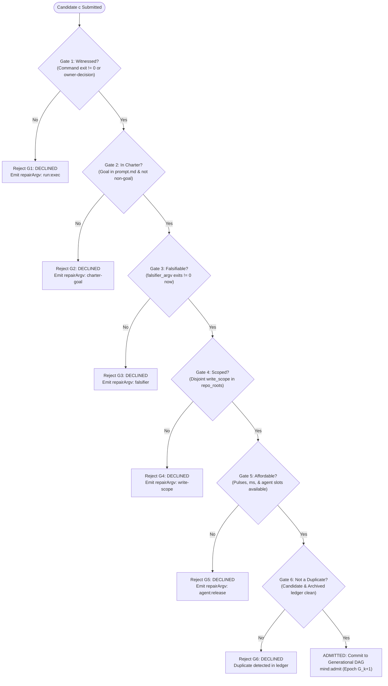

# 03-03: The Six Admission Gates ($G_1 \dots G_6$) — Deterministic Predicates & Decision Theory

> **Status**: Authoritative Architecture Specification  
> **Topic**: Mechanical Admission Theory, Falsification Predicates, Disjoint Write Scopes, and Autonomous Governance Gates  
> **Audience**: Autonomous Systems Architects, Formal Methods Engineers, Verification Specialists, Runtime Platform Authors

---

[Previous: 03-02 Ten Discovery Sources & Triage](03-02-ten-discovery-sources-and-triage.md) | [Chapter Index](index.md) | [All Chapters Index](../index.md) | [Next: 03-04 Generational Rotation & Quiescence](03-04-generational-rotation-and-quiescence.md)
---

## 1. Executive Summary & The Problem of Speculative Task Inflation

In unconstrained autonomous agent architectures, task creation is left to probabilistic language models. When an agent is prompted to "improve the system," it generates dozens of speculative, vague, or duplicate tasks (e.g., _"Refactor authentication for performance"_, _"Clean up types"_). In production, this causes **Speculative Task Inflation**:

1. **Graph Pollution**: The task graph is inundated with untestable, unverified work items.
2. **Scope Collisions**: Multiple speculative tasks claim overlapping file scopes, corrupting Git working trees.
3. **Budget Exhaustion**: Expensive inference calls are wasted compiling and executing tasks that have no falsifiable acceptance criteria.
4. **Infinite Regressions**: The agent attempts to fix a non-existent defect, introduces actual regressions, and spawns further repair tasks in an infinite divergence loop.

```text
+====================================================================================================+
|                                SPECULATIVE INFLATION VS ADMISSION GATES                            |
+====================================================================================================+
|  UNCONSTRAINED AGENT RUNTIME:                                                                      |
|  [Vague Hallucination] ──► [Speculative Task Created] ──► [Write Scope Collision] ──► [REGRESSION] |
|                                                                                                    |
|  OLT 6-GATE MECHANICAL ADMISSION:                                                                  |
|  ┌──────────────────────────────────────────────────────────────────────────────────────────────┐  |
|  │                              CANDIDATE WORK ITEM PROPOSAL (C_j)                              │  |
|  └──────────────────────────────────────────────┬───────────────────────────────────────────────┘  |
|                                                 │ Evaluated in Strict Order G1 -> G6               |
|                                                 ▼                                                  |
|  ┌──────────────────────────────────────────────────────────────────────────────────────────────┐  |
|  │  [G1: Witnessed]    ──► Empirical command record with exit != 0 or owner decision            │  |
|  │  [G2: In Charter]   ──► Goal inclusion in pinned charter & zero matches with non-goals       │  |
|  │  [G3: Falsifiable]  ──► Agent provides sandboxed command that fails NOW before edit          │  |
|  │  [G4: Scoped]       ──► Disjoint write scope inside repo_roots (0 collision with leases)     │  |
|  │  [G5: Affordable]   ──► Daily pulse budget, wall-clock ms, & active agent slots available    │  |
|  │  [G6: Non-Duplicate]──► Zero match with active, open, or permanently declined history       │  |
|  └──────────────────────────────────────────────┬───────────────────────────────────────────────┘  |
|                                                 │ ALL 6 GATES EVALUATE TRUE (Boolean AND)          |
|                                                 ▼                                                  |
|                      [ ATOMIC ADMISSION & 2-PHASE GENERATIONAL DAG COMMIT ]                        |
+====================================================================================================+
```

The **OLT Mechanical Admission Engine** replaces probabilistic task creation with **Six Formal Admission Gates ($G_1 \dots G_6$)**. A candidate work item is admitted into the active generational DAG if and only if it satisfies all six deterministic host predicates. If any gate evaluates to `false`, the candidate is immediately declined, assigned a deterministic repair command (`repairArgv`), and recorded in the audit ledger.

---

## 2. Formal Specification of Admission Gates ($G_1 \dots G_6$)

The admission decision function $\mathcal{A}(c, \mathcal{K})$ for candidate $c$ in execution context $\mathcal{K}$ is defined as the boolean conjunction:

$$\mathcal{A}(c, \mathcal{K}) = \bigwedge_{i=1}^6 G_i(c, \mathcal{K}) = G_1(c, \mathcal{K}) \land G_2(c, \mathcal{K}) \land G_3(c, \mathcal{K}) \land G_4(c, \mathcal{K}) \land G_5(c, \mathcal{K}) \land G_6(c, \mathcal{K})$$

```text
┌──────────────────────────────────────────────────────────────────────────────────────────────────┐
│                                 THE SIX FORMAL ADMISSION GATES                                   │
├──────┬──────────────────────┬─────────────────────────────────┬──────────────────────────────────┤
│ Gate │ Gate Name            │ Primary Predicate Function      │ Rejection Trigger                │
├──────┼──────────────────────┼─────────────────────────────────┼──────────────────────────────────┤
│ G1   │ **Witnessed**        │ `evaluateGate1Witnessed()`      │ Missing/zero-exit witness cmd    │
│ G2   │ **In Charter**       │ `evaluateGate2InCharter()`      │ Unknown goal or non-goal match   │
│ G3   │ **Falsifiable**      │ `evaluateGate3Falsifiable()`    │ Falsifier command exits 0        │
│ G4   │ **Scoped**           │ `evaluateGate4Scoped()`         │ Scope collision or out of roots  │
│ G5   │ **Affordable**       │ `evaluateGate5Affordable()`     │ Exhausted daily budget / slots   │
│ G6   │ **Not a Duplicate**  │ `evaluateGate6NotADuplicate()`  │ Active duplicate or declined     │
└──────┴──────────────────────┴─────────────────────────────────┴──────────────────────────────────┘
```



---

## 3. Detailed Mathematical & Algorithmic Gate Definitions

### 3.1 Gate 1: Witnessed ($G_1$)

- **Formal Definition**: A defect candidate must cite a recorded command execution whose output proves the failure, or represent an explicit owner authority decision.
- **Source Module**: [evaluateGate1Witnessed()](file:///Users/onurseckinsenoglu/repos/skills/olt/scripts/src/mind/proposals/gates/predicates.ts#L99-L200)

$$ G_1(c, \mathcal{K}) = \begin{cases}
\texttt{true}, & \text{if } c.\text{kind} = \texttt{"proposal"} \land c.\text{witness\_id} = \texttt{"owner-decision"} \\
\texttt{true}, & \text{if } c.\text{kind} = \texttt{"defect"} \land \exists \text{Rec}(w) \text{ s.t. } \text{Exit}(w) \ne 0 \land \text{ContainsDefect}(\text{Out}(w), c.\text{stmt}) \\
\texttt{false}, & \text{otherwise}
\end{cases}$$

#### Failure Semantics:
* If $c.\text{witness\_id}$ is missing: Rejects with `"defect candidate has no witness command record"`.
* If witness command exited with code `0`: Rejects with `"recorded exit was 0; a defect witness must exit non-zero"`.
* If witness stdout/stderr does not contain the defect tokens: Rejects with `"output does not contain the cited defect"`.

---

### 3.2 Gate 2: In Charter ($G_2$)

* **Formal Definition**: The candidate must explicitly align with at least one goal defined in the pinned charter $\mathbf{G}_{\text{charter}}$, and must not match any declared non-goal $\mathbf{N}_{\text{charter}}$.
* **Source Module**: [evaluateGate2InCharter()](file:///Users/onurseckinsenoglu/repos/skills/olt/scripts/src/mind/proposals/gates/evaluator.ts#L5-L70)

$$G_2(c, \mathcal{K}) \iff \Big( \mathbf{g}(c) \ne \emptyset \Big) \land \Big( \mathbf{g}(c) \subseteq \mathbf{G}_{\text{charter}} \Big) \land \Big( \forall n \in \mathbf{N}_{\text{charter}}, \, n \notin \text{Lowercase}(c.\text{statement}) \land n \notin \text{Scope}(c) \Big)$$

#### Failure Semantics:
* If goal list is empty: Rejects with `"candidate cites no charter goals"`.
* If citing an unknown goal (e.g., `G99`): Rejects with `"charter goal 'G99' does not exist in pinned charter"`.
* If statement or write scope matches non-goal string: Rejects with `"candidate matches charter non-goal '<non-goal>'"`.

---

### 3.3 Gate 3: Falsifiable Acceptance Criteria ($G_3$)

* **Formal Definition**: For defect candidates, the agent must declare an executable falsifier command $\mathbf{A}_{\text{falsifier}}$. The OLT harness executes this command in a sandboxed host subshell prior to code mutation. The command **must fail (exit non-zero)** in the current repository state.
* **Source Module**: [evaluateGate3Falsifiable()](file:///Users/onurseckinsenoglu/repos/skills/olt/scripts/src/mind/proposals/gates/evaluator.ts#L77-L128)

$$G_3(c, \mathcal{K}) = \begin{cases}
\texttt{true}, & \text{if } c.\text{kind} = \texttt{"proposal"} \\
\texttt{true}, & \text{if } c.\text{kind} = \texttt{"defect"} \land \text{ExitCode}\Big(\text{SandboxExec}(c.\mathbf{A}_{\text{falsifier}}, \text{timeout}=30\text{s})\Big) \ne 0 \\
\texttt{false}, & \text{otherwise}
\end{cases}$$

#### The Anti-Tautology Invariant:
If the falsifier command exits with `0` before any file edits are made, the claimed defect does not exist in reality. The harness rejects the candidate immediately, preventing hallucinations.

---

### 3.4 Gate 4: Bounded & Disjoint Write Scope ($G_4$)

* **Formal Definition**: The declared write scope $\mathbf{\Omega}(c)$ must be non-empty, strictly bounded within the charter's `repo_roots`, disjoint from all currently leased tasks, and disjoint from other admitted candidates in the wave.
* **Source Module**: [evaluateGate4Scoped()](file:///Users/onurseckinsenoglu/repos/skills/olt/scripts/src/mind/proposals/gates/evaluator.ts#L135-L235)

$$G_4(c, \mathcal{K}) \iff \Big( \mathbf{\Omega}(c) \ne \emptyset \Big) \land \Big( \mathbf{\Omega}(c) \subseteq \text{RepoRoots} \Big) \land \Big( \mathbf{\Omega}(c) \cap \bigcup_{l \in \mathcal{L}_{\text{active}}} \mathbf{\Omega}(l) = \emptyset \Big) \land \Big( \mathbf{\Omega}(c) \cap \bigcup_{o \in \mathcal{C}_{\text{admitted}}} \mathbf{\Omega}(o) = \emptyset \Big)$$

#### Scope Conflict Matrix:
Paths conflict if $P_A = P_B$, $P_A$ is a subdirectory prefix of $P_B$, or $P_B$ is a subdirectory prefix of $P_A$:

$$\text{ScopeConflict}(P_A, P_B) \iff (P_A = P_B) \lor \text{StartsWith}(P_A, P_B + \texttt{"/"}) \lor \text{StartsWith}(P_B, P_A + \texttt{"/"})$$

---

### 3.5 Gate 5: Cognitive Token Budget & Concurrency ($G_5$)

* **Formal Definition**: The repository must have available operational budget for the current calendar day, and active worker concurrency must not exceed the maximum allowed agent pool.
* **Source Module**: [evaluateGate5Affordable()](file:///Users/onurseckinsenoglu/repos/skills/olt/scripts/src/mind/proposals/gates/table.ts#L12-L105)

$$G_5(c, \mathcal{K}) \iff \Big( \text{PulsesToday} < \text{MaxPulsesPerDay} \Big) \land \Big( \text{WallClockMsToday} < \text{MaxWallClockPerDay} \Big) \land \Big( N_{\text{active\_agents}} < M_{\text{max\_agents}} \Big)$$

```text
Default Mind Operational Budget Ledger (DEFAULT_MIND_BUDGET):
• pulses_per_day:           100 pulses / day
• wall_clock_ms_per_day:    7,200,000 ms (2.0 hours / day)
• max_agents_in_flight:     40 concurrent workers (Brent bound)
• max_rounds_per_objective: 10 rounds
• pulse_deadline_ms:        300,000 ms (5.0 minutes)
```

---

### 3.6 Gate 6: Duplicate & Decline Ledger Verification ($G_6$)

* **Formal Definition**: The candidate must not duplicate any active proposal, open candidate, live task, or permanently declined candidate across current capsule state and historical archival ledgers (`ARCHIVED_OBJECTIVES.jsonl`).
* **Source Module**: [evaluateGate6NotADuplicate()](file:///Users/onurseckinsenoglu/repos/skills/olt/scripts/src/mind/proposals/gates/table.ts#L112-L265)

$$G_6(c, \mathcal{K}) \iff \Big( c.\text{fingerprint} \notin \text{Fingerprints}(\mathcal{C}_{\text{active}} \cup \mathcal{C}_{\text{archived}}) \Big) \land \Big( \forall d \in \mathcal{C}_{\text{declined}}, \, c.\text{stmt} \ne d.\text{stmt} \lor \mathbf{\Omega}(c) \cap \mathbf{\Omega}(d) = \emptyset \Big)$$

#### Permanent Immunity Against Hallucination Loops:
When an operator or gate declines a candidate, the decision is sealed in `ARCHIVED_OBJECTIVES.jsonl`. In subsequent pulse cycles, even if discovery scanners re-emit the identical observation, Gate 6 intercepts and drops it with `reason: "candidate is a duplicate of permanently declined candidate '<id>'"`.

---

## 4. Admission Decision Logs & Data Schemas

The admission engine produces strongly-typed decision verdicts committed to `events.jsonl`:

```typescript
// Architectural Contract: Admission Gate Verdicts
export interface AdmissionGateVerdict {
  readonly gateId: "gate-1-witnessed" | "gate-2-in-charter" | "gate-3-falsifiable" | "gate-4-scoped" | "gate-5-affordable" | "gate-6-not-a-duplicate";
  readonly gateNumber: number; // 1..6
  readonly name: string;
  readonly passed: boolean;
  readonly reason?: string;
  readonly repairArgv?: string;
  readonly metadata?: Record<string, unknown>;
}

export interface AdmissionEvaluationResult {
  readonly admitted: boolean;
  readonly candidateId: string;
  readonly failingGate?: AdmissionGateVerdict;
  readonly verdicts: readonly AdmissionGateVerdict[];
  readonly falsifierExitObserved?: number | null;
}
```

### 4.1 Sample Admission Decision Event in `events.jsonl`

```json
{
  "schema": "harness.event",
  "version": 1,
  "run_id": "mind-gen-1",
  "sequence": 142,
  "revision": 88,
  "timestamp": "2026-08-29T02:53:08.000Z",
  "actor": "mind_supervisor",
  "kind": "candidate_admitted",
  "payload": {
    "candidate_id": "cand-defect-typecheck-781",
    "admitted": true,
    "statement": "Fix typecheck signature mismatch in token.ts",
    "write_scope": ["olt/scripts/src/auth/token.ts"],
    "charter_goals": ["G1"],
    "falsifier_argv": ["bun", "test", "tests/unit/auth/token.test.ts"],
    "falsifier_exit_observed": 1,
    "verdicts": [
      { "gateNumber": 1, "gateId": "gate-1-witnessed", "passed": true },
      { "gateNumber": 2, "gateId": "gate-2-in-charter", "passed": true },
      { "gateNumber": 3, "gateId": "gate-3-falsifiable", "passed": true, "metadata": { "exitCode": 1 } },
      { "gateNumber": 4, "gateId": "gate-4-scoped", "passed": true, "metadata": { "writeScope": ["olt/scripts/src/auth/token.ts"] } },
      { "gateNumber": 5, "gateId": "gate-5-affordable", "passed": true },
      { "gateNumber": 6, "gateId": "gate-6-not-a-duplicate", "passed": true }
    ]
  },
  "hash": "7a3f9e12c5b4d68e0a1f3c5e7b9a2d4f6c8e0a1b2c3d4e5f6a7b8c9d0e1f2a3b"
}
```

---

## 5. Summary Takeaways & Engineering Guarantees

1. **Deterministic Filter**: No candidate enters the execution DAG through subjective prose or unverified claims.
2. **Pre-Execution Falsification**: Defect candidates must prove non-zero exit codes in the sandbox before code edits are authorized.
3. **Disjoint Concurrency**: Write scopes are strictly partitioned, enabling safe lockstep parallelism without Git merge conflicts.
4. **Historical Immunity**: Declined tasks are archived into permanent ledgers, eliminating circular retry loops.

---

*Proceed to the next section: [03-04: Generational Rotation & Quiescence](./03-04-generational-rotation-and-quiescence.md).*

---
[Previous: 03-02 Ten Discovery Sources & Triage](03-02-ten-discovery-sources-and-triage.md) | [Chapter Index](index.md) | [All Chapters Index](../index.md) | [Next: 03-04 Generational Rotation & Quiescence](03-04-generational-rotation-and-quiescence.md)
---
$$
