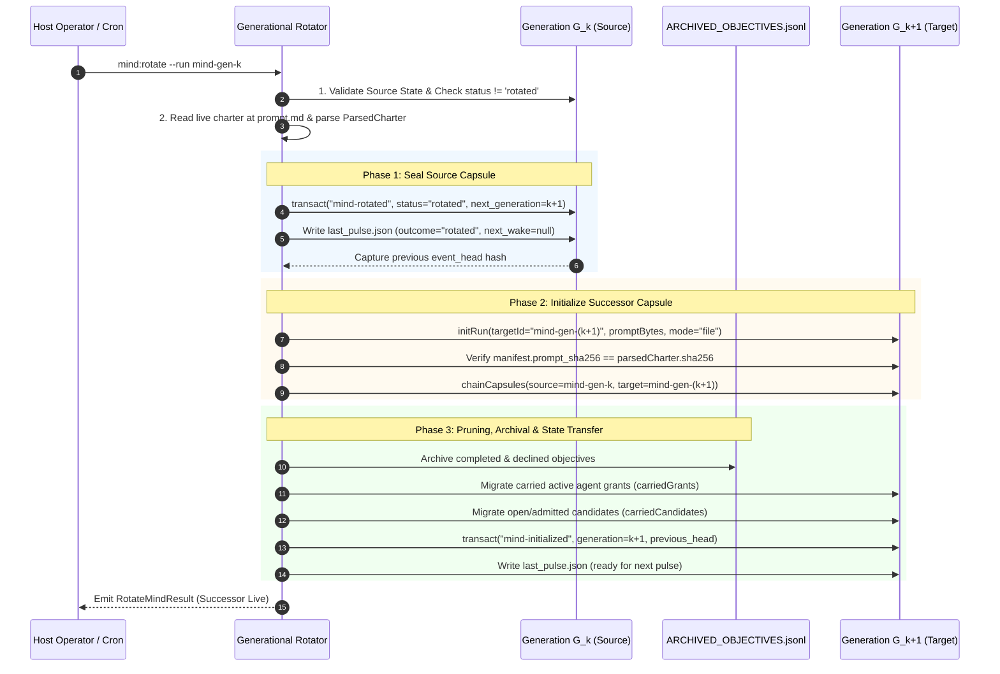

# 03-04: Generational Rotation & Quiescence — Zero-Downtime State Handoff, Checkpoint Compaction & Merkle Sealing

> **Status**: Authoritative Architecture Specification  
> **Topic**: Generational Capsule Rotation, Zero-Downtime Migration, Ledger Compaction, and 8th-Streak Quiescent Repository Digests  
> **Audience**: Autonomous Systems Architects, Storage Engine Specialists, Distributed Ledger Engineers, Reliability Architects

---

[Previous: 03-03 Six Admission Gates](03-03-six-admission-gates.md) | [Chapter Index](index.md) | [All Chapters Index](../index.md) | [Next: Chapter 04: Continuous Preplanning Factory](../04-continuous-preplanning-factory/index.md)
---

## 1. Executive Summary & Generational Rotation Theory

In long-running autonomous agent deployments, continuous operation creates two fundamental engineering bottlenecks:

1. **Event Log & State Bloat**: As hundreds of discovery cycles, gate evaluations, and task executions are recorded, `events.jsonl` and `state.json` grow unbounded. Replaying the event stream from genesis becomes computationally expensive.
2. **Charter & Policy Evolution**: When human operators update repository goals, alter budget limits, or modify non-goals in `prompt.md`, an active capsule bound to an older pinned charter cannot mutate its initial SHA-256 prompt hash without violating Invariant $C_1$ (Byte-Exact Prompt Immutability).

```text
+====================================================================================================+
|                                GENERATIONAL ROTATION & COMPACTION                                  |
+====================================================================================================+
|  GENERATION N (mind-gen-1):                                                                        |
|  [Manifest v1] ──► [Events 1..4500] ──► [State v1 (15MB)] ──► [Charter Update / Size Limit]        |
|                                                                          │                         |
|                                                                          ▼                         |
|  ┌──────────────────────────────────────────────────────────────────────────────────────────────┐  |
|  │                        3-PHASE ZERO-DOWNTIME GENERATIONAL HANDOFF                            │  |
|  │  1. SEAL SOURCE: Set status="rotated", link next_generation, record event_head, seal pulse.  │  |
|  │  2. INITIALIZE SUCCESSOR: Snapshot live charter (prompt.md), verify SHA-256, chainCapsules. │  |
|  │  3. STATE PRUNING & COMPACTION: Archive completed objectives to ARCHIVED_OBJECTIVES.jsonl.   │  |
|  │     Migrate active RBAC agent grants, open candidates, & carried budget state to gen-2.      │  |
|  └──────────────────────────────────────────────┬───────────────────────────────────────────────┘  |
|                                                 │ Clean Successor Capsule Initialized              |
|                                                 ▼                                                  |
|  GENERATION N+1 (mind-gen-2):                                                                      |
|  [Manifest v2 (Prompt v2)] ──► [Events 1..1 (Genesis)] ──► [Compacted State v2 (50KB)]             |
+====================================================================================================+
```

The **OLT Generational Rotation Protocol** solves this through **Zero-Downtime Generational Rotation** ($G_k \to G_{k+1}$). Rather than mutating state in place, the Mind Engine atomically seals the source capsule `mind-gen-k`, compacts historical completion ledgers into permanent archival storage, migrates active worker leases and open candidates, binds the fresh charter snapshot, and spawns successor capsule `mind-gen-k+1` without dropping active locks or interrupting subagents.

---

## 2. Generational Lineage Architecture ($G_0 \to G_1 \to \dots \to G_k$)

The generational history of a repository is maintained as a **Directed Acyclic Graph of Capsules** linked by forward-secure cryptographic Merkle pointers.

```text
┌──────────────────────────────────────────────────────────────────────────────────────────────────┐
│                                 GENERATIONAL MERKLE LINEAGE CHAIN                                 │
├──────────────────────────────────────────────────────────────────────────────────────────────────┤
│                                                                                                  │
│  [Generation G1: mind-gen-1]                                                                     │
│  • Pinned Charter SHA-256: 4f8a...12                                                             │
│  • Event Sequence: 1 .. 840                                                                      │
│  • Head Hash: H_1 = 7a3f...9b                                                                    │
│  • Status: ROTATED (Sealed at 2026-08-29T00:00:00Z)                                              │
│          │                                                                                       │
│          ▼ chainCapsules({ source: mind-gen-1, target: mind-gen-2, round: 2 })                   │
│                                                                                                  │
│  [Generation G2: mind-gen-2]                                                                     │
│  • Previous Generation Pointer: { run_id: "mind-gen-1", event_head: "7a3f...9b" }                │
│  • Pinned Charter SHA-256: e92c...44 (Updated Goals)                                             │
│  • Event Sequence: 1 .. 1250                                                                     │
│  • Head Hash: H_2 = c8d1...05                                                                    │
│  • Status: ROTATED (Sealed at 2026-08-29T02:00:00Z)                                              │
│          │                                                                                       │
│          ▼ chainCapsules({ source: mind-gen-2, target: mind-gen-3, round: 3 })                   │
│                                                                                                  │
│  [Generation G3: mind-gen-3 (ACTIVE)]                                                            │
│  • Previous Generation Pointer: { run_id: "mind-gen-2", event_head: "c8d1...05" }                │
│  • Pinned Charter SHA-256: e92c...44                                                             │
│  • Event Sequence: 1 .. Current                                                                  │
│  • Status: OPEN (Actively Supervised via pulse.sh)                                               │
│                                                                                                  │
└──────────────────────────────────────────────────────────────────────────────────────────────────┘
```

### 2.1 Formal Generational State Handoff Tuple

Let generation $k$ be defined by the tuple $\mathcal{G}_k = \langle k, \mathcal{M}_k, \mathcal{S}_k, \mathcal{H}_k \rangle$. The generational transition operator $\mathcal{T}_{\text{rotate}}: \mathcal{G}_k \times \text{Charter}_{\text{live}} \to \mathcal{G}_{k+1}$ satisfies:

$$\mathcal{G}_{k+1}.\text{previous\_generation} = \langle \mathcal{G}_k.\text{run\_id}, \, \mathcal{G}_k.\mathcal{H}_{\text{head}}, \, \text{SealedAt} \rangle$$

$$\text{SHA-256}(\mathcal{G}_{k+1}.\texttt{prompt.md}) = \text{SHA-256}(\text{Read}(\text{Charter}_{\text{live}}))$$

$$\text{State}(\mathcal{G}_{k+1}) = \text{PruneAndCompact}\Big(\text{State}(\mathcal{G}_k)\Big)$$

---

## 3. The 3-Phase Zero-Downtime Rotation Protocol

The complete rotation procedure is executed by [rotateMindGeneration()](../../../../olt/scripts/src/mind/archival/rotate/rotator.ts#L17-L225) and [finishRotation()](../../../../olt/scripts/src/mind/archival/rotate/finisher.ts#L33-L204).



### 3.1 Phase 1: Source Generation Sealing

1. **Status Lock**: Inside an atomic transaction (`transact`), the source state sets `state.mind.status = "rotated"` and records the successor identifier.
2. **Pulse Termination**: `last_pulse.json` in the source directory is written with `outcome: "rotated"` and `next_wake_at: null`.
3. **Event Head Capture**: The cryptographic event head $H_k$ is captured from `events.jsonl`.

### 3.2 Phase 2: Successor Generation Initialization

1. **Fresh Manifest Sealing**: `initRun` initializes `.olt/capsules/mind-gen-(k+1)` with the raw bytes of the live charter.
2. **Digest Verification**: The harness asserts that `manifest.prompt_sha256` strictly matches `parsedCharter.sha256`.
3. **Capsule Chaining**: [chainCapsules()](../../../../olt/scripts/src/orchestrator/capsule-chainer.ts) records directional lineage references between the source and target capsules.

### 3.3 Phase 3: Generational Pruning & State Migration

1. **Ledger Archival**: Completed tasks, closed objectives, and permanently declined candidates are extracted and appended to `.olt/ARCHIVED_OBJECTIVES.jsonl`.
2. **RBAC Grant Transfer**: Active agent capability grants (`carriedGrants`) are migrated into the successor ledger.
3. **Candidate Pool Transfer**: Open and admitted candidates (`carriedCandidates`) are copied to the successor's candidate pool.
4. **State Initialization Transaction**: `transact` initializes `state.mind` in the successor with generation counter $G_{k+1} = G_k + 1$ and sets the previous generation pointer.

---

## 4. Quiescent State Detection & The 8th-Streak Digest Engine

When all 10 discovery sources report zero actionable defects or proposals across consecutive pulses, the repository enters **Quiescent Cadence**.

### 4.1 The Quiescence Predicate

$$\text{IsQuiescent}(t) \iff \forall i \in \{1 \dots 10\}, \quad \text{Count}(\text{Source}_i, t) = 0$$

$$ \text{Streak}_t = \begin{cases}
\text{Streak}_{t-1} + 1, & \text{if } \text{IsQuiescent}(t) \\
0, & \text{otherwise}
\end{cases}$$

```text
┌──────────────────────────────────────────────────────────────────────────────────────────────────┐
│                                8TH-STREAK QUIESCENCE VERIFICATION                                │
├──────┬──────────────────────────────────────────┬───────┬──────────────────┬─────────────────────┤
│ Source│ Description                              │ Count │ Witness Command  │ Evidence Class      │
├──────┼──────────────────────────────────────────┼───────┼──────────────────┼─────────────────────┤
│ 01   │ Intent Drift Verification                │ 0     │ `health`         │ harness_observed    │
│ 02   │ Dead / Unreachable / Unenforced Code     │ 0     │ `health`         │ harness_observed    │
│ 03   │ Literal Fallbacks & Mock Stubs           │ 0     │ `health`         │ harness_observed    │
│ 04   │ Open Validator Findings                  │ 0     │ `finding:get`    │ agent_reported      │
│ 05   │ Escalated Tasks Awaiting Human           │ 0     │ `run:status`     │ harness_observed    │
│ 06   │ Non-Zero Failing Gate Runs               │ 0     │ `evidence:get`   │ harness_observed    │
│ 07   │ Capsule Integrity Damage                 │ 0     │ `doctor`         │ harness_observed    │
│ 08   │ Install / Runtime Drift                  │ 0     │ `install-status` │ harness_observed    │
│ 09   │ Unsealed Capsules with Live Leases       │ 0     │ `run:status`     │ harness_observed    │
│ 10   │ Owner Charter Backlog Fulfillment        │ 0     │ `health`         │ harness_observed    │
└──────┴──────────────────────────────────────────┴───────┴──────────────────┴─────────────────────┘
```

### 4.2 The 8th-Streak Quiescent Digest Synthesis

When the streak reaches $s = 8$ ([QUIESCENT_DIGEST_STREAK_THRESHOLD](../../../../olt/scripts/src/mind/archival/quiesce/types.ts#L21)), [buildQuiescentDigest()](../../../../olt/scripts/src/mind/archival/quiesce/evaluator.ts#L100-L125) synthesizes a verified repository digest:

```typescript
export function buildQuiescentDigest(params: {
  readonly streak: number;
  readonly sources: readonly QuiescentSourceObservation[];
  readonly runId?: string;
  readonly generatedAt?: string;
}): QuiescentDigest {
  const runId = params.runId ?? "mind";
  const generatedAt = params.generatedAt ?? new Date().toISOString();
  const message = `The repository has been clean for ${params.streak} consecutive quiescent pulses; all ten discovery sources were scanned and found clean with zero items.`;
  const markdown = formatQuiescentDigestMarkdown({
    streak: params.streak,
    runId,
    generatedAt,
    sources: params.sources,
  });

  return {
    streak: params.streak,
    generatedAt,
    runId,
    message,
    sourcesChecked: params.sources,
    markdown,
  };
}
```

---

## 5. Checkpoint Compaction & Ledger Archival

To preserve cryptographic integrity while preventing storage bloat, historical objectives are compacted using the archival format.

### 5.1 The Archived Objective Schema (`ARCHIVED_OBJECTIVES.jsonl`)

```typescript
export interface ArchivedObjectiveRecord {
  readonly id: string;
  readonly generation: number;
  readonly type: "defect" | "proposal" | "task";
  readonly statement: string;
  readonly result: "completed" | "declined" | "aborted";
  readonly write_scope: readonly string[];
  readonly archived_at: string;
  readonly details?: Record<string, unknown>;
}
```

```json
{"id":"cand-defect-typecheck-781","generation":1,"type":"defect","statement":"Fix typecheck signature mismatch in token.ts","result":"completed","write_scope":["olt/scripts/src/auth/token.ts"],"archived_at":"2026-08-29T02:00:00.000Z","details":{"commit_sha":"d4e1f89","witness_command_id":"cmd-tsc-94"}}
{"id":"cand-prop-refactor-auth","generation":1,"type":"proposal","statement":"Refactor legacy auth helpers to arrow functions","result":"declined","write_scope":["olt/scripts/src/auth/legacy.ts"],"archived_at":"2026-08-29T02:00:00.000Z","details":{"decline_reason":"candidate matches charter non-goal 'unnecessary aesthetic refactoring'"}}
```

### 5.2 Compaction Benefits
1. **Constant-Time Capsule Startup**: Successor capsules load state in $O(1)$ time ($\sim 50\,\text{KB}$ state projection) rather than parsing historical gigabyte logs.
2. **Permanent Hallucination Shield**: Gate 6 queries `ARCHIVED_OBJECTIVES.jsonl` via indexed stream scans to permanently reject re-occurring duplicate proposals.
3. **Reflog Durability**: The full cryptographic history remains auditable via Merkle generational pointers back to genesis $G_0$.

---

## 6. Summary Takeaways & Architectural Invariants

1. **Continuous Lineage ($G_0 \to G_k$)**: Generational rotation guarantees infinite Mind longevity without state corruption or prompt amnesia.
2. **Zero-Downtime Migration**: Active agent grants, open candidates, and advisory locks are seamlessly handed off to successor capsules.
3. **Quiescence Proof**: The 8th-streak digest provides cryptographic proof of repository health across all 10 discovery domains.
4. **Permanent Archival**: Historical tasks and permanently declined items are compacted into immutable JSONL ledgers, preventing regression loops.

---

*End of Chapter 03. Return to [Chapter 03 Index](./index.md) or explore [OLT Architecture Overview](../index.md).*

---
[Previous: 03-03 Six Admission Gates](03-03-six-admission-gates.md) | [Chapter Index](index.md) | [All Chapters Index](../index.md) | [Next: Chapter 04: Continuous Preplanning Factory](../04-continuous-preplanning-factory/index.md)
---
$$
