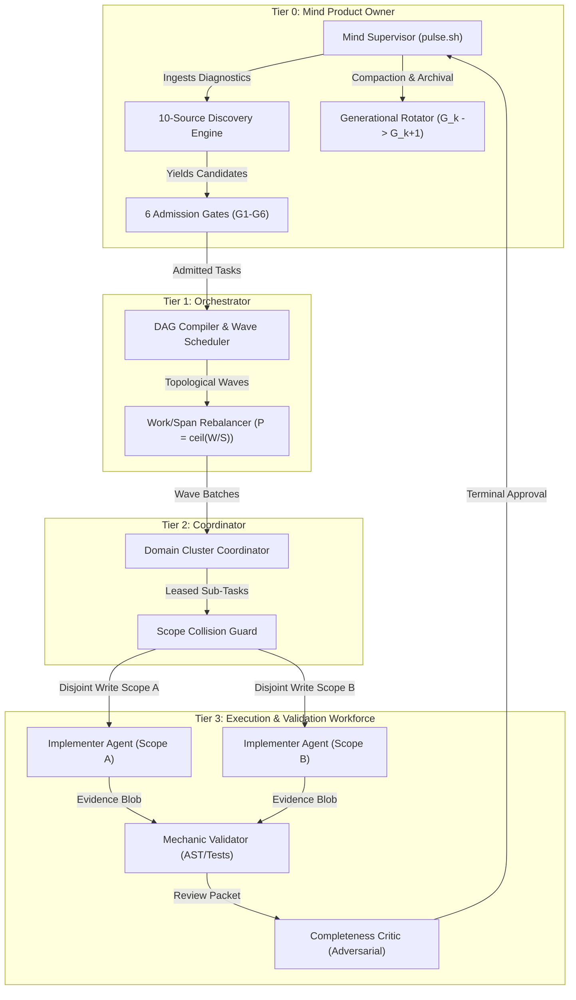
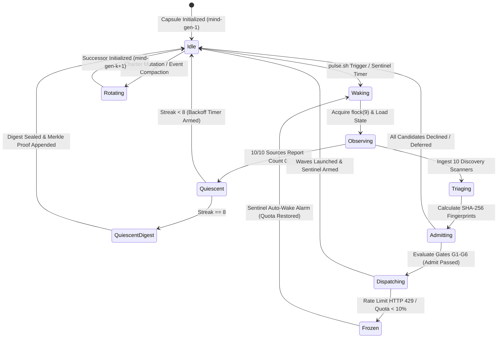

# Chapter 03: Mind Product Owner & Autonomous Cadence — Tier-0 Macro-Cognition, Continuous Ingestion & Generational Lineage

[OLT Documentation Hub](../../README.md) > [Architecture Index](../index.md) > Chapter 03: Mind Product Owner & Autonomous Cadence

> **Status**: Authoritative Architecture Specification  
> **Topic**: Tier-0 Mind Supervisory Engine, Autonomous Product Ownership, Continuous Cadence, Admission Gate Theory, and Generational Rotation  
> **Audience**: Autonomous Systems Architects, Distributed Agent Runtime Specialists, Compiler Engineers, Formal Verification Leads

---

[⏮️ Previous: Chapter 02: Four-Tier Hierarchy](../02-four-tier-hierarchy/index.md) | [📂 Chapter Index](index.md) | [📚 All Chapters Index](../index.md) | [⏭️ Next: 03-01 Infinite Autonomous Cadence](03-01-infinite-autonomous-cadence.md)
---

## 1. Executive Summary & The Product Owner Philosophy

In traditional multi-agent orchestration paradigms, an autonomous agent's execution is framed as a **finite, ephemeral sub-routine**: a prompt is provided by a human operator, compiled into an execution graph, dispatched to stateless workers, and abruptly terminated once the terminal task is marked complete. In real-world enterprise software engineering, this finite execution paradigm collapses. Real software systems operate under continuous environmental drift: dependencies decay, type systems develop latent gaps, compiler errors surface under churn, architectural intent diverges from implementation, and security vulnerabilities emerge over time.

```text
+====================================================================================================+
|                                CONVENTIONAL EPHEMERAL WORKFLOW FAILURE                             |
+====================================================================================================+
|  Human Prompt ──► [Static DAG] ──► [Worker Run] ──► [Exit 0] ──► [TERMINATION & CONTEXT AMNESIA]   |
|                                                                    ▲                               |
|                                                                    │ (Latent Bugs, Unscanned Drift)|
+====================================================================================================+
|                                OLT TIER-0 INFINITE MIND CADENCE                                    |
+====================================================================================================+
|  ┌──────────────────────────────────────────────────────────────────────────────────────────────┐  |
|  │                        TIER 0: MIND PRODUCT OWNER (PERPETUAL DAEMON)                         │  |
|  │  • Continuous 10-Source Discovery • Real-Time Triage • 6-Gate Formal Admission Transact      │  |
|  │  • Generational Merkle Lineage (G_0 -> G_1 -> ... -> G_k) • Pillar 16 Zero-Kill Quota Freeze │  |
|  └──────────────────────────────────────────────┬───────────────────────────────────────────────┘  |
|                                                 │ Wave Partitioning (P = ceil(W/S))                |
|                                                 ▼                                                  |
|  ┌──────────────────────────────────────────────────────────────────────────────────────────────┐  |
|  │                         TIER 1/2/3 WORKFORCE & VERIFICATION ENGINES                          │  |
|  │  • Orchestrators • Coordinators • Isolated Implementers • Hard-Lock Cognitive Critics       │  |
|  └──────────────────────────────────────────────────────────────────────────────────────────────┘  |
+====================================================================================================+
```

The **Orchestrated Lifecycle Topology (OLT)** introduces the **Tier-0 Mind Product Owner Engine**: an infinite, autonomous, macro-cognitive supervisory daemon. Operating as a perpetual background loop governed by POSIX advisory locking and non-blocking scheduling, the Mind acts as the autonomous custodian of the software repository. Rather than terminating upon task completion, the Mind continuously senses workspace health across ten discrete discovery channels, evaluates candidate work items against six strict mathematical admission gates, maintains generational Merkle lineage across rotation epochs, and dynamically provisions subagent swarms.

### 1.1 Core Tenets of Mind Autonomous Governance

1. **The Invariant of Perpetual Cadence (`CLOSING_FORBIDDEN_FOR_MIND`)**: The Mind supervisor is forbidden from terminating due to an empty task queue. In the absence of urgent defects, the engine seamlessly transitions to self-evolution, charter verification, cognitive meta-auditing, or sentinel-armed quiescence.
2. **Deterministic Mechanical Admission ($G_1 \dots G_6$)**: No speculative work item, human request, or discovered defect may enter the execution graph without passing through six formal deterministic admission predicates. Untrusted prose is rejected.
3. **Pillar 16 Quota Freeze & Zero-Kill Resilience**: When API token budgets are constrained or rate limits (`HTTP 429`) occur, active workers are never killed. The Mind freezes the monotonic lease clock, suspends execution in RAM, and arms an OS sentinel wake alarm.
4. **Generational Capsule Lineage ($G_0 \to G_1 \dots \to G_k$)**: As task history and state logs accumulate, the Mind compacts its execution context through zero-downtime generational rotation, creating cryptographically verified successor capsules without dropping active locks or active worker context.

---

## 2. Autonomous Governance & Hierarchical Topology

OLT enforces a strict **4-Tier Workforce Hierarchy** that physically segregates strategic product governance from tactical file mutation.

```text
┌──────────────────────────────────────────────────────────────────────────────────────────────────┐
│                                   4-TIER WORKFORCE ARCHITECTURE                                  │
├──────────────────────────────────────────────────────────────────────────────────────────────────┤
│                                                                                                  │
│  TIER 0: MIND PRODUCT OWNER (Macro-Cognition & Governance)                                       │
│  - Archetype: `mind`, `mind-auditor`                                                             │
│  - Authority: Repository-wide backlog, generational rotation, charter alignment, budget ledger.  │
│  - Restriction: ZERO direct file edits. All tasks are delegated to lower tiers.                  │
│                                                                                                  │
│  TIER 1: ORCHESTRATOR (Wave Scheduling & Work/Span Optimization)                                 │
│  - Archetype: `orchestrator`                                                                     │
│  - Authority: DAG compilation, topological sorting, transitive reduction, critical-path span.    │
│  - Optimization: Enforces Brent's bound P = ceil(W / S) <= 40 workers.                           │
│                                                                                                  │
│  TIER 2: COORDINATOR (Domain Cluster Isolation & Resource Boundaries)                            │
│  - Archetype: `coordinator`                                                                      │
│  - Authority: Write-scope overlap detection, lease token minting, wave barrier synchronization.  │
│                                                                                                  │
│  TIER 3: IMPLEMENTERS & COGNITIVE VALIDATORS (Adversarial File Scopes)                           │
│  - Archetype: `implementer`, `validator`, `mechanic-validator`, `completeness-critic`            │
│  - Authority: 1:1 file mutation scopes, POSIX flock leases, Class 1-4 proof submission.          │
│  - Restriction: Cognitive Validators operate under Command Hard-Lock (0 mutating commands).      │
│                                                                                                  │
└──────────────────────────────────────────────────────────────────────────────────────────────────┘
```



---

## 3. Mathematical Foundations of Mind Macro-Cognition

The Mind Product Owner operates as a discrete-time dynamical system with formal state transitions, generational Merkle proofs, and work/span resource allocations.

### 3.1 The Mind Autonomous State Tuple

Let the global Mind state at discrete pulse cycle $t$ and generational epoch $k$ be defined as the 7-tuple:

$$\mathcal{S}_{\text{mind}}(k, t) = \langle G_k, \, \mathcal{C}_t, \, \mathcal{P}_t, \, \mathcal{O}_t, \, \mathcal{B}_t, \, \mathcal{H}_t, \, \mathcal{K}_t \rangle$$

Where:

- $G_k \in \mathbb{N}^+$ represents the immutable generational epoch counter ($G_1, G_2, \dots, G_k$).
- $\mathcal{C}_t = \{c_1, c_2, \dots, c_m\}$ is the candidate pool of discovered defects and proposals.
- $\mathcal{P}_t = \{p_1, p_2, \dots, p_n\}$ is the set of admitted and active proposals undergoing refinement.
- $\mathcal{O}_t = \{o_1, o_2, \dots, o_j\}$ is the set of active objective runs dispatched to Tier-1 orchestrators.
- $\mathcal{B}_t = \langle \text{pulses\_today}, \text{wall\_clock\_ms}, \text{active\_agents}, \text{budget\_limits} \rangle$ represents the real-time cognitive and operational budget ledger.
- $\mathcal{H}_t \in \{0, 1\}^{256}$ is the cryptographic head hash of the append-only event stream `events.jsonl`.
- $\mathcal{K}_t \in \{\texttt{idle}, \texttt{waking}, \texttt{observing}, \texttt{triaging}, \texttt{admitting}, \texttt{dispatching}, \texttt{quiescent}, \texttt{frozen}, \texttt{rotating}\}$ denotes the operational phase.

### 3.2 Formal State Transition Matrix

The lifecycle of the Mind Product Owner is governed by the following state transition matrix:

| Source State ($\mathcal{K}_t$) | Action / Trigger ($\alpha$)  | Target State ($\mathcal{K}_{t+1}$) | Guard Condition ($\text{Guard}(\mathcal{S})$)               | Post-Condition Assertion ($\text{Assert}(\mathcal{S})$) |
| :----------------------------- | :--------------------------- | :--------------------------------- | :---------------------------------------------------------- | :------------------------------------------------------ |
| `idle` / `quiescent`           | `pulse.sh` execution         | `waking`                           | `flock -n 9 (.locks/mind.pulse)` succeeds                   | Execution brief allocated, PID registered               |
| `waking`                       | `mind:wake`                  | `observing`                        | Manifest valid, `state.mind` active                         | Pinned charter SHA-256 verified                         |
| `observing`                    | `mind:observe`               | `triaging`                         | 10 discovery scanners execute                               | Observations appended to ledger                         |
| `triaging`                     | `mind:candidate`             | `admitting`                        | Fingerprint deduplication passes                            | Candidate pool populated ($\mathcal{C}_t$)              |
| `admitting`                    | `mind:admit`                 | `dispatching`                      | $\bigwedge_{i=1}^6 G_i(c_j) = \text{true}$ (Gates 1–6 Pass) | Atomic state commit, epoch bump                         |
| `dispatching`                  | `mind:pulse`                 | `idle`                             | Waves scheduled ($P \le M_{\text{agents}}$)                 | Sentinel wake timer armed ($T_{\text{interval}}$)       |
| `observing`                    | Zero items across 10 sources | `quiescent`                        | $\forall s \in \{1..10\}, \text{count}(s) = 0$              | Quiescent streak incremented ($s \leftarrow s + 1$)     |
| `dispatching`                  | Quota $< 10\%$ / HTTP 429    | `frozen`                           | Telemetry threshold breached                                | Pillar 16 Quota Freeze: lease clocks paused             |
| `frozen`                       | Sentinel alarm fires         | `waking`                           | Token quota restored $> 20\%$                               | Leases translated by $\Delta t_{\text{frozen}}$         |
| `idle`                         | Run size / charter update    | `rotating`                         | Generation limit or charter churn                           | Zero-downtime rotation: $G_{k+1} \leftarrow G_k + 1$    |



---

## 4. Capsule Storage Architecture & File Contracts

The Mind Product Owner persists its entire cognitive and operational state inside dedicated capsule directories located under `.olt/capsules/<mind-run-id>/`.

```text
.olt/capsules/mind-gen-1/
├── manifest.json                # Immutable capsule manifest (mode 0444, prompt_sha256)
├── prompt.md                    # Byte-exact pinned charter document (mode 0444)
├── state.json                   # Materialized projection state (mind, budget, candidates)
├── events.jsonl                 # Forward-secure SHA-256 Merkle event stream
├── last_pulse.json              # Fast lookup of last pulse outcome and next wake timestamp
├── .locks/
│   ├── mind.pulse               # POSIX advisory lock file (flock on file descriptor 9)
│   └── state.lock               # Atomic transaction lock for state mutations
├── evidence/                    # Ephemeral pulse execution briefs and witness logs
│   └── mind-brief-<pid>-<rand>  # Real-time execution brief for host consumption
├── observations/                # Raw observation logs from 10 discovery scanners
└── quarantine/                  # Corrupt or malformed candidate payloads
```

### 4.1 Pinned Charter Schema (`prompt.md`)

The Mind's governing charter is stored directly as `prompt.md` and hashed in `manifest.json`. The charter defines formal goals, non-goals, repo roots, and budget constraints:

```markdown
# Mind Supervisory Charter

## Charter Goals

- [G1]: Continuous typecheck and static AST integrity maintenance
- [G2]: Zero dead or unenforced exports across runtime scripts
- [G3]: Bounded concurrency scaling (P <= 40) under Brent work/span bounds
- [G4]: Cryptographic event chain verification and reflog durability

## Charter Non-Goals

- NG1: Destructive Git history rewriting (git push --force, git reset --hard)
- NG2: Unbounded multi-file task bundling (Invariant of 1:1 Anti-Batching)
- NG3: Speculative mock test generation without Class-1 compiler evidence

## Repository Roots

- olt/scripts/src
- docs/olt
```

---

## 5. Table of Contents & Chapter Organization

This chapter provides the comprehensive theoretical, algorithmic, and operational specification for the OLT Mind Product Owner across four detailed sections:

```text
┌──────────────────────────────────────────────────────────────────────────────────────────────────┐
│                                CHAPTER 03: SUB-SECTION ARCHITECTURE                              │
├──────────────────────────────────────────────────────────────────────────────────────────────────┤
│                                                                                                  │
│  03-01: Infinite Autonomous Cadence                                                              │
│  - The CLOSING_FORBIDDEN_FOR_MIND invariant and perpetual anti-idle loops.                       │
│  - pulse.sh mutual exclusion loop, file descriptor 9 flock, and cross-platform fallbacks.        │
│  - Pillar 16 Quota Freeze, Zero-Kill resilience, and the suspended dual-time clock.              │
│  - Sentinel wake timers, 1.5x exponential backoff curves, and 8th-streak quiescence.             │
│                                                                                                  │
│  03-02: Ten Discovery Sources & Real-Time Triage                                                 │
│  - The 10 autonomous discovery scanners: Intent drift, dead code, literal fallbacks,             │
│    open findings, escalations, failing gates, capsule integrity, install drift, unsealed         │
│    capsules, and charter backlog.                                                                │
│  - Candidate item lifecycle: discovery -> normalization -> triage -> deduplication.             │
│  - Stream-hash deduplication mathematics, observation normalization N_obs, FNV-1a vs SHA-256.    │
│  - Jaccard similarity metrics and collision probability bounds.                                  │
│                                                                                                  │
│  03-03: Six Admission Gates (G1 - G6)                                                            │
│  - Gate 1 (Witnessed): Non-zero exit witness commands vs explicit owner authority.               │
│  - Gate 2 (In Charter): Goal inclusion matching and non-goal rejection.                          │
│  - Gate 3 (Falsifiable): Sandboxed pre-execution of failing test/lint commands.                  │
│  - Gate 4 (Scoped): Disjoint write-scope verification against live leases and open candidates.   │
│  - Gate 5 (Affordable): Daily pulse limits, wall-clock ms limits, and worker concurrency bounds. │
│  - Gate 6 (Not a Duplicate): Candidate and archived objective ledger lookup.                     │
│  - Repair command generation (repairArgv) and deterministic admission logging.                   │
│                                                                                                  │
│  03-04: Generational Rotation & Quiescence                                                       │
│  - Generational lifecycle: mind-gen-1 -> mind-gen-2 -> ... -> mind-gen-k.                         │
│  - Zero-downtime 3-phase handoff: source sealing, successor init, capsule chaining.             │
│  - Active agent grant migration and carried candidate preservation.                              │
│  - Quiescent repository state digests, 10/10 clean verification, and Merkle root sealing.        │
│  - Checkpoint compaction and long-term ledger archival (ARCHIVED_OBJECTIVES.jsonl).              │
│                                                                                                  │
└──────────────────────────────────────────────────────────────────────────────────────────────────┘
```

---

## 6. Failure Modes, Safety Invariants, and Falsification Criteria

The Mind Product Owner enforces strict formal failure defenses to guarantee repository safety:

```text
┌────────────┬──────────────────────────────────┬────────────────────────────────────────────────────────┐
│ Failure ID │ Empirical Failure Mode           │ System Defense & Recovery Invariant                    │
├────────────┼──────────────────────────────────┼────────────────────────────────────────────────────────┤
│ FM-301     │ Concurrent Pulse Collision       │ POSIX flock on FD 9 exits 0 immediately; yields lock.  │
│ FM-302     │ Rate Limit / Token Exhaustion    │ Pillar 16 Quota Freeze: lease clocks pause; zero-kill. │
│ FM-303     │ Speculative Task Inflation       │ 6 Admission Gates (G1-G6) require empirical proof.     │
│ FM-304     │ Multi-Issue Task Bundling        │ 1:1 Anti-Batching Invariant rejects bundled tasks.      │
│ FM-305     │ Generational State Loss on Crash │ 2-Phase atomic commit with POSIX temp rename + fsync.  │
│ FM-306     │ Duplicate Task Loop Regressions  │ SHA-256 fingerprinting + archived ledger lookup (G6).  │
│ FM-307     │ Scope Collision with Active Task │ Scope Conflict Matrix rejects overlapping write_scope. │
└────────────┴──────────────────────────────────┴────────────────────────────────────────────────────────┘
```

### 6.1 Mathematical Invariant Enforcement

$$\forall c \in \mathcal{C}_{\text{admitted}}, \quad \left( \bigwedge_{i=1}^6 G_i(c) = \text{true} \right) \land \left( \Omega(c) \cap \bigcup_{l \in \mathcal{L}_{\text{active}}} \Omega(l) = \emptyset \right)$$

---

## 7. Authoritative References & Code Traceability

The complete implementation of Chapter 03's architecture is verified across the following repository source files:

| Subsystem / Architectural Component   | Authoritative Source File Link                                                                                      | Key Exported Symbols                                                              |
| :------------------------------------ | :------------------------------------------------------------------------------------------------------------------ | :-------------------------------------------------------------------------------- |
| **Mind Pulse Entrypoint & Lock**      | [pulse.sh](file:///Users/onurseckinsenoglu/repos/skills/olt/scripts/pulse.sh)                                       | `flock -n 9`, `mind:wake`                                                         |
| **Mind CLI Dispatch & Supervisor**    | [mind.ts](file:///Users/onurseckinsenoglu/repos/skills/olt/scripts/src/cli/registry/mind.ts)                        | `mind:init`, `mind:wake`, `mind:observe`, `mind:admit`, `mind:pulse`              |
| **Admission Gates Predicates**        | [predicates.ts](file:///Users/onurseckinsenoglu/repos/skills/olt/scripts/src/mind/proposals/gates/predicates.ts)    | `evaluateGate1Witnessed()`, `executeFalsifier()`, `isPathInRepoRoots()`           |
| **Admission Gates Evaluator**         | [evaluator.ts](file:///Users/onurseckinsenoglu/repos/skills/olt/scripts/src/mind/proposals/gates/evaluator.ts)      | `evaluateGate2InCharter()`, `evaluateGate3Falsifiable()`, `evaluateGate4Scoped()` |
| **Admission Gates Table & Budget**    | [table.ts](file:///Users/onurseckinsenoglu/repos/skills/olt/scripts/src/mind/proposals/gates/table.ts)              | `evaluateGate5Affordable()`, `evaluateGate6NotADuplicate()`                       |
| **Discovery Sources Catalog**         | [types.ts](file:///Users/onurseckinsenoglu/repos/skills/olt/scripts/src/mind/memory/sources/types.ts)               | `MIND_DISCOVERY_SOURCES`, `getSourceDefinition()`, `MindSourceId`                 |
| **Discovery Scanner Engine**          | [scanner.ts](file:///Users/onurseckinsenoglu/repos/skills/olt/scripts/src/mind/memory/sources/scanner.ts)           | `validateQuiescentSources()`, `resolveCommandRecord()`                            |
| **Proposal Storage & Fingerprinting** | [storage.ts](file:///Users/onurseckinsenoglu/repos/skills/olt/scripts/src/mind/proposals/proposal/storage.ts)       | `calculateProposalFingerprint()`, `isDuplicateProposal()`                         |
| **Defect Deduplication & Stream**     | [dedup-stream.ts](file:///Users/onurseckinsenoglu/repos/skills/olt/scripts/src/mind/defects/dedup/dedup-stream.ts)  | `deduplicateDefectLog()`, `streamDeduplicateDefects()`                            |
| **Defect Discriminator & Hash**       | [discriminator.ts](file:///Users/onurseckinsenoglu/repos/skills/olt/scripts/src/mind/defects/core/discriminator.ts) | `computeDefectDiscriminator()`, `normalizeObservationSignature()`                 |
| **Generational Rotator Engine**       | [rotator.ts](file:///Users/onurseckinsenoglu/repos/skills/olt/scripts/src/mind/archival/rotate/rotator.ts)          | `rotateMindGeneration()`, `finishRotation()`                                      |
| **Quiescence Evaluator & Streak**     | [evaluator.ts](file:///Users/onurseckinsenoglu/repos/skills/olt/scripts/src/mind/archival/quiesce/evaluator.ts)     | `calculateQuiescentInterval()`, `buildQuiescentDigest()`                          |
| **Charter Parser & Verifier**         | [index.ts](file:///Users/onurseckinsenoglu/repos/skills/olt/scripts/src/mind/lifecycle/charter/index.ts)            | `parseCharter()`, `DEFAULT_MIND_BUDGET`                                           |

---

_Proceed to the next section: [03-01: Infinite Autonomous Cadence](./03-01-infinite-autonomous-cadence.md)._

---

[⏮️ Previous: Chapter 02: Four-Tier Hierarchy](../02-four-tier-hierarchy/index.md) | [📂 Chapter Index](index.md) | [📚 All Chapters Index](../index.md) | [⏭️ Next: 03-01 Infinite Autonomous Cadence](03-01-infinite-autonomous-cadence.md)
---
