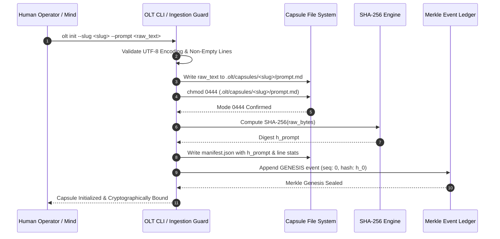

# Prompt Ingestion & SHA-256 Binding

---

[Previous: Chapter 04: Continuous Preplanning Factory](index.md) | [Chapter Index](index.md) | [All Chapters Index](../index.md) | [Next: 04-02 100% Line Coverage & Atomic Decomposition](04-02-one-hundred-percent-line-coverage.md)

---

## 1. Executive Summary & Epistemic Intent Ingestion

In long-horizon autonomous software engineering workflows, requirement drift and intent degradation represent critical vulnerability vectors. When autonomous agent swarms process human specifications across iterative cognitive cycles, conversational contexts are frequently truncated, summarized, rephrased, or selectively dropped. This stochastic context erosion leads directly to the omission of subtle edge-case requirements, unverified architectural constraints, and silent scope creep.

The OLT (Orchestrating Long Tasks) engine resolves this vulnerability by treating the initial user specification as an immutable, epistemic ground truth. Through the **Prompt Ingestion & SHA-256 Sealing Protocol**, OLT enforces four architectural guarantees at the moment of task inception:

1. **Verbatim Ingestion & Zero-Loss Normalization**: The raw user prompt $P$ is ingested bit-for-bit, normalized across canonical Unicode line terminators, and written to `.olt/capsules/<slug>/prompt.md`. No agent, planner, or supervisor is permitted to summarize, compress, or alter this text.
2. **POSIX Mode `0444` Read-Only Lockdown**: Immediately following the initial write, the host filesystem permissions for `prompt.md` are locked to Unix octal mode `0444` (`-r--r--r--`). Any subsequent write, append, or truncation attempt by an execution worker triggers an immediate operating system fault.
3. **Cryptographic SHA-256 Digest Anchoring**: The cryptographic hash $h_{\text{prompt}} = \text{SHA256}(P)$ is computed and immutably sealed in both the capsule manifest (`manifest.json`) and the Merkle ledger genesis block ($h_0$ in `events.jsonl`).
4. **Preflight Tamper Interlock**: Prior to compiling any task graph, dispatching any execution wave, or evaluating completion proofs, the scheduler re-computes $\text{SHA256}(\text{ReadFile}(\texttt{"prompt.md"}))$ and verifies exact equivalence against $h_{\text{prompt}}$. Any discrepancy halts the execution frame fail-closed.

```text
+--------------------------------------------------------------------------------------------------+
│                             PROMPT INGESTION & SEALING PIPELINE                                  │
+--------------------------------------------------------------------------------------------------+
│                                                                                                  │
│   +─────────────────────────+                                                                    │
│   │ Raw User Prompt Input   │  (UTF-8 Encoded Character Stream / CLI Flag / File Spec)           │
│   +────────────┬────────────+                                                                    │
│                │                                                                                 │
│                ▼                                                                                 │
│   +─────────────────────────+                                                                    │
│   │ Unicode Line Splitter   │  Evaluates: \r\n | [\n\r\v\f\x1c-\x1e\x85\u2028\u2029]             │
│   │ & Canonical Normalizer  │  Strips trailing terminal delimiter without mutating content       │
│   +────────────┬────────────+                                                                    │
│                │                                                                                 │
│                ▼                                                                                 │
│   +─────────────────────────+                                                                    │
│   │ Atomic Capsule Writer   │  Persists to .olt/capsules/<slug>/prompt.md                        │
│   │ & chmod 0444 Lock       │  Locks file descriptor to read-only (POSIX mode 0444)              │
│   +────────────┬────────────+                                                                    │
│                │                                                                                 │
│                ▼                                                                                 │
│   +─────────────────────────+                                                                    │
│   │ SHA-256 Digest Engine   │  Computes h_prompt = SHA256(UTF8_Bytes(P))                         │
│   +────────────┬────────────+                                                                    │
│                │                                                                                 │
│                ├───────────────────────────────────────┬─────────────────────────────────────┐   │
│                ▼                                       ▼                                     ▼   │
│   +─────────────────────────+             +─────────────────────────+           +────────────┴─┐ │
│   │ Capsule Manifest Seal   │             │ Merkle Ledger Genesis   │           │ Preplanning  │ │
│   │ .olt/.../manifest.json  │             │ events.jsonl Block h_0  │           │ Requirement  │ │
│   │ (Draft 2020-12 Schema)  │             │ (Cryptographic Anchor)  │           │ Line Parser  │ │
│   +─────────────────────────+             +─────────────────────────+           +──────────────+ │
│                                                                                                  │
+--------------------------------------------------------------------------------------------------+
```

---

## 2. Mathematical Formalization of Prompt Ingestion & Hashing

Let $\mathcal{U}$ represent the universe of UTF-8 encoded character strings. An ingested prompt $P \in \mathcal{U}$ is represented as a sequence of bytes $B = \langle b_1, b_2, \dots, b_N \rangle \in \{0, 1\}^*$ where $N = |P|_{\text{bytes}}$.

### A. Canonical Line Segmentation Function

Prompt line decomposition must be fully deterministic across POSIX, Windows, and legacy mainframe environments. Let $\mathcal{T}_{\text{regex}}$ denote the canonical Unicode newline terminator pattern:

$$\mathcal{T}_{\text{regex}} \equiv \texttt{\textbackslash r\textbackslash n} \mid [\texttt{\textbackslash n\textbackslash r\textbackslash v\textbackslash f\textbackslash x1c-\textbackslash x1e\textbackslash x85\textbackslash u2028\textbackslash u2029}]$$

The canonical line segmentation operator $\mathcal{S}_{\text{lines}}: \mathcal{U} \to \mathcal{L}$ partitions $P$ into an ordered sequence of line strings $L = \langle l_1, l_2, \dots, l_M \rangle$:

$$L = \mathcal{S}_{\text{lines}}(P) = \text{Split}(P, \mathcal{T}_{\text{regex}})$$

$$\text{If } \text{Matches}(\text{End}(P), \mathcal{T}_{\text{regex}}) \implies L \leftarrow \langle l_1, l_2, \dots, l_{M-1} \rangle$$

The non-blank semantic index set $\mathcal{I}_{\text{semantic}} \subseteq \{1, 2, \dots, M\}$ is defined as:

$$\mathcal{I}_{\text{semantic}}(P) = \big\{ i \in \{1, \dots, M\} \;\big|\; \text{Trim}(l_i) \neq \emptyset \big\}$$

An empty prompt condition is trapped as a fatal precondition violation:

$$ \text{AssertNonEmpty}(P) = \begin{cases}
\text{VALID} & \text{if } |\mathcal{I}_{\text{semantic}}(P)| \ge 1 \\
\text{TRAP}(\texttt{INVALID\_ARGUMENT}) & \text{if } |\mathcal{I}_{\text{semantic}}(P)| = 0
\end{cases}$$

### B. Cryptographic Hash Sealing

The prompt cryptographic digest $h_{\text{prompt}}$ is computed via the standard NIST FIPS 180-4 SHA-256 function over the exact byte stream $B$:

$$h_{\text{prompt}} = \text{SHA-256}(B) = \text{SHA-256}\Big(\text{Encode}_{\text{UTF-8}}(P)\Big) \in \{0, 1\}^{256}$$

The sealed manifest tuple $\mathcal{M}$ is constructed as an immutable metadata record:

$$\mathcal{M} = \Big\langle \text{slug}, \; t_{\text{created}}, \; h_{\text{prompt}}, \; |P|_{\text{bytes}}, \; |L|, \; |\mathcal{I}_{\text{semantic}}|, \; \text{version: "2020-12"} \Big\rangle$$

The Merkle event ledger anchors this manifest into the genesis block $E_0$:

$$h_0 = \text{SHA-256}\Big(\text{CanonicalJSON}(E_0) \;\|\; h_{\text{prompt}}\Big)$$

$$E_0 = \Big\langle \text{seq: } 0, \; \text{kind: "prompt-sealed"}, \; \text{hash: } h_0, \; \text{prev\_hash: } 0^{64}, \; \text{manifest: } \mathcal{M} \Big\rangle$$

### C. Preflight Tamper Verification Predicate

Before any wave scheduling ($\text{wave}:m$) or state transaction occurs at timestamp $t$, the engine evaluates the preflight verification predicate $\Psi_{\text{tamper}}(t)$:

$$\Psi_{\text{tamper}}(t) = \Big( \text{SHA-256}\big(\text{ReadFile}(\texttt{".olt/capsules/<slug>/prompt.md"})\big) == \mathcal{M}.h_{\text{prompt}} \Big) \land \big( \text{FileMode}(\texttt{"prompt.md"}) == 0444_8 \big)$$

$$\text{Preflight}(t) = \begin{cases}
\text{CONTINUE} & \text{if } \Psi_{\text{tamper}}(t) = 1 \\
\text{HALT}(\texttt{PROMPT\_CORRUPTION\_DETECTED}) & \text{if } \Psi_{\text{tamper}}(t) = 0
\end{cases}$$

---

## 3. Ingestion Lifecycle & Sealing Mechanics

The ingestion workflow coordinates the user input boundary, local storage engine, and cryptographic audit log through an atomic state transition sequence.



### Ingestion Step Breakdown

1. **UTF-8 Strict Decoding**: Ingestion accepts either raw string input or a byte buffer. It decodes bytes using `TextDecoder("utf-8", { fatal: true, ignoreBOM: true })`. If the input contains invalid surrogate pairs or non-UTF-8 octets, ingestion terminates immediately.
2. **Atomic Write & Permission Enforcement**: The content is staged to a temporary file before being renamed atomically to `prompt.md`. POSIX permissions are immediately set to `0o444` (`S_IRUSR | S_IRGRP | S_IROTH`).
3. **Manifest Construction**: The engine builds `manifest.json` adhering to the Draft 2020-12 JSON Schema specification, capturing byte counts, line counts, and the computed hex digest.
4. **Genesis Merkle Event**: The hash is injected into `events.jsonl` as the root event ($E_0$), establishing the genesis anchor for all subsequent hash-chained operational receipts.

---

## 4. Concrete TypeScript Ingestion Interfaces & Schemas

The following contracts define the TypeScript structures used within the OLT requirements and store subsystems ([`prompt-source.ts`](file:///Users/onurseckinsenoglu/repos/skills/olt/scripts/src/requirements/prompt-source.ts), [`prompt-lines.ts`](file:///Users/onurseckinsenoglu/repos/skills/olt/scripts/src/requirements/prompt-lines.ts)):

```typescript
import { createHash } from "node:crypto";

/**
 * Normalized prompt source containing computed SHA-256 digest and line array.
 */
export interface PromptSource {
  readonly digest: string;
  readonly lines: readonly string[];
  readonly byteLength: number;
  readonly semanticLineIndices: readonly number[];
}

/**
 * Capsule manifest specification stored in manifest.json.
 */
export interface CapsuleManifest {
  readonly $schema: "https://json-schema.org/draft/2020-12/schema";
  readonly slug: string;
  readonly createdAt: string;
  readonly prompt: {
    readonly path: "prompt.md";
    readonly sha256: string;
    readonly byteLength: number;
    readonly lineCount: number;
    readonly semanticLineCount: number;
  };
  readonly schemaVersion: "2020-12";
  readonly status: "SEALED" | "CORRUPTED";
}

/**
 * Unicode line terminator regular expression covering POSIX, Windows, and Unicode paragraph delimiters.
 */
const TERMINATOR_SOURCE = String.raw`\r\n|[\n\r\v\f\x1c-\x1e\x85\u2028\u2029]`;
const TERMINATOR = new RegExp(TERMINATOR_SOURCE, "u");
const TRAILING_TERMINATOR = new RegExp(`(?:${TERMINATOR_SOURCE})$`, "u");

/**
 * Splits raw prompt text into canonical lines, trimming trailing terminator.
 */
export function promptLines(prompt: string): string[] {
  if (prompt.length === 0) return [];
  const lines = prompt.split(TERMINATOR);
  if (TRAILING_TERMINATOR.test(prompt)) lines.pop();
  return lines;
}

/**
 * Ingests, normalizes, and computes the cryptographic identity of a prompt input.
 */
export function promptSource(value: unknown): PromptSource | null {
  if (typeof value !== "string" && !(value instanceof Uint8Array)) return null;
  const bytes = typeof value === "string" ? new TextEncoder().encode(value) : value;
  let text: string;
  try {
    text = new TextDecoder("utf-8", { fatal: true, ignoreBOM: true }).decode(bytes);
  } catch {
    return null;
  }

  const lines = promptLines(text);
  const semanticIndices: number[] = [];
  for (let i = 0; i < lines.length; i++) {
    if (lines[i]!.trim().length > 0) {
      semanticIndices.push(i + 1);
    }
  }

  return {
    digest: createHash("sha256").update(bytes).digest("hex"),
    lines,
    byteLength: bytes.byteLength,
    semanticLineIndices: semanticIndices,
  };
}
```

### Manifest Schema Artifact (`manifest.json`)

The persisted capsule manifest conforms to the following JSON structure:

```json
{
  "$schema": "https://json-schema.org/draft/2020-12/schema",
  "slug": "auth-session-refactor",
  "createdAt": "2026-08-29T04:15:00.000Z",
  "prompt": {
    "path": "prompt.md",
    "sha256": "3e23e8160039594a33894f6564e1b1348bbd7a0088d42c4acb73eeaed59c009d",
    "byteLength": 3842,
    "lineCount": 94,
    "semanticLineCount": 78
  },
  "schemaVersion": "2020-12",
  "status": "SEALED"
}
```

---

## 5. Failure Modes, Tamper Traps, & Recovery Mechanics

The prompt ingestion subsystem incorporates defensive fail-closed traps to guarantee that unverified or corrupted inputs never pollute downstream planning stages.

```text
+--------------------------------------------------------------------------------------------------+
│                             INGESTION FAILURE & RECOVERY MATRIX                                  │
+-------------------------------+-------------------------+----------------------------------------+
│ Error Condition               │ Harness Error Code      │ Deterministic Engine Remediation       │
+-------------------------------+-------------------------+----------------------------------------+
│ Ingestion byte stream is not  │ INVALID_ARGUMENT        │ Reject input immediately; log non-     │
│ valid UTF-8 or contains BOM   │                         │ conformant byte offsets.               │
+-------------------------------+-------------------------+----------------------------------------+
│ Prompt contains zero          │ INVALID_ARGUMENT        │ Refuse capsule initialization; prompt  │
│ non-blank semantic lines      │                         │ must contain >= 1 actionable line.     │
+-------------------------------+-------------------------+----------------------------------------+
│ SHA-256 digest of prompt.md   │ INTEGRITY               │ Abort execution wave; emit forensic    │
│ does not match manifest.json  │                         │ diff between disk and genesis record.  │
+-------------------------------+-------------------------+----------------------------------------+
│ File permissions of prompt.md │ INTEGRITY               │ Lock violation trap; restore mode 0444 │
│ modified from mode 0444       │                         │ and re-verify SHA-256 hash.            │
+-------------------------------+-------------------------+----------------------------------------+
│ Genesis block h_0 in events   │ CORRUPTED_STATE         │ Halt daemon; require manual operator   │
│ missing or has invalid hash   │                         │ intervention or capsule re-genesis.    │
+-------------------------------+-------------------------+----------------------------------------+
```

### Detailed Failure Trajectory & Forensic Inspection

When a tamper trap fires during preflight audit, the engine generates an adversarial diagnostic packet:

```bash
# Example diagnostic command executed by OLT watchdog
$ olt doctor --run .olt/capsules/auth-session-refactor

[ERROR: INTEGRITY] Prompt tamper detected in capsule 'auth-session-refactor'
  Expected SHA-256: 3e23e8160039594a33894f6564e1b1348bbd7a0088d42c4acb73eeaed59c009d
  Actual SHA-256:   d4735e3a265e16eee03f59718b9b5d03019c07d8b6c51f90da3a666eec13ab35
  Filesystem Mode:  0644 (Expected: 0444)
  Resolution: Revert prompt.md to genesis state or re-initialize capsule with updated intent.
```

---

## 6. Architectural Invariants Summary

The prompt ingestion architecture enforces four immutable invariants:

1. **Ground Truth Immutability**: `prompt.md` is strictly read-only (`0444`) and cannot be mutated by any agent tier throughout the capsule lifecycle.
2. **Cryptographic Binding**: All downstream task definitions, requirements documents, and test receipts must explicitly reference the prompt SHA-256 digest $h_{\text{prompt}}$.
3. **Exhaustive Line Indexing**: Every non-blank line in $P$ receives a 1-based index that serves as the universal coordinate for requirement decomposition and traceability audits.
4. **Deterministic Reproducibility**: Given an identical byte stream $B$, any OLT-compliant engine generates identical line splits, identical SHA-256 digests, and identical genesis records across all platforms.

---

[Previous: Chapter 04: Continuous Preplanning Factory](index.md) | [Chapter Index](index.md) | [All Chapters Index](../index.md) | [Next: 04-02 100% Line Coverage & Atomic Decomposition](04-02-one-hundred-percent-line-coverage.md)

---
$$
