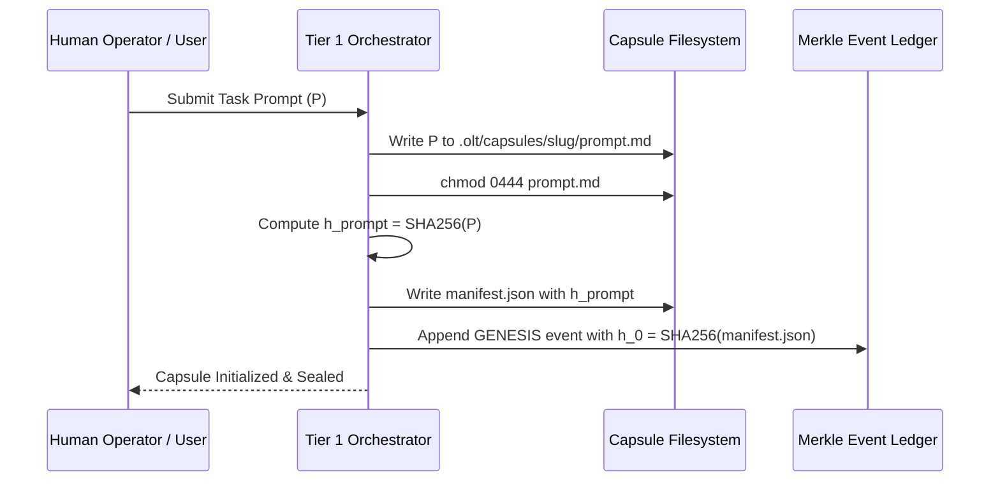

# Prompt Ingestion & SHA-256 Binding

---

[Previous: Chapter 04 Index](index.md) | [Chapter Index](index.md) | [All Chapters Index](../index.md) | [Next: 04-02 100% Prompt Line Coverage](04-02-one-hundred-percent-line-coverage.md)

---

## 1. Executive Summary & Epistemic Grounding

In autonomous software development pipelines, requirements drift represents a primary failure mode. When agents interpret user prompts iteratively over long horizons, prompts are frequently rewritten, summarized, or truncated, resulting in forgotten requirements and unverified edge cases.

The OLT (Orchestrating Long Tasks) engine enforces the **Prompt Ingestion & SHA-256 Sealing Protocol**. Under this protocol:

1. **Verbatim Ingestion**: The user's prompt is written directly to disk at `.olt/capsules/<slug>/prompt.md` without modification, summarization, or truncation.
2. **Mode 0444 Read-Only Lockdown**: The file permissions on `prompt.md` are locked to Unix mode `0444` (read-only), preventing any subsequent agent write operations.
3. **Cryptographic Binding**: The SHA-256 hash of `prompt.md` is recorded in `manifest.json` and anchored as genesis hash $h_0$ in `events.jsonl`.

```text
+--------------------------------------------------------------------------------------------------+
│                             PROMPT INGESTION & SEALING PIPELINE                                  │
+--------------------------------------------------------------------------------------------------+
│                                                                                                  │
│   User Prompt String (P) ──► Write to .olt/capsules/<slug>/prompt.md                             │
│                                           │                                                      │
│                                           ▼                                                      │
│                               chmod 0444 (Read-Only Lock)                                        │
│                                           │                                                      │
│                                           ▼                                                      │
│                       Compute SHA-256 Digest: h_prompt = SHA256(P)                               │
│                                           │                                                      │
│                                           ▼                                                      │
│   Seal Manifest & Genesis Hash ──► manifest.json & events.jsonl Genesis Block (h_0)              │
│                                                                                                  │
+--------------------------------------------------------------------------------------------------+
```

---

## 2. Mathematical Specification of Prompt Sealing

Let $P \in \{0, 1\}^*$ denote the raw UTF-8 byte stream of the ingested prompt.

The cryptographic digest $h_{\text{prompt}}$ is defined as:

$$h_{\text{prompt}} = \text{SHA256}(P)$$

The capsule manifest tuple $\mathcal{M}$ is constructed as:

$$\mathcal{M} = \Big\langle \text{slug}, \quad \text{timestamp}_{\text{init}}, \quad h_{\text{prompt}}, \quad |P|_{\text{bytes}}, \quad \text{schemaVersion: "2020-12"} \Big\rangle$$

The Preflight Tamper Verification Predicate $\Psi_{\text{tamper}}$ evaluates before every wave:

$$\Psi_{\text{tamper}}(\text{capsule}) = \big( \text{SHA256}(\text{ReadFile}(\texttt{"prompt.md"})) == \mathcal{M}.h_{\text{prompt}} \big)$$

$$\text{PreflightStatus} = \begin{cases} \text{PASS} & \text{if } \Psi_{\text{tamper}} = 1 \\ \text{TRAP (PROMPT\_CORRUPTION\_DETECTED)} & \text{if } \Psi_{\text{tamper}} = 0 \end{cases}$$



---

## 3. Manifest JSON Schema Specification

The capsule manifest ([`manifest.json`](file:///Users/onurseckinsenoglu/repos/skills/olt/scripts/src/engine/store/merkle-ledger.ts)) adheres to Draft 2020-12:

```json
{
  "$schema": "https://json-schema.org/draft/2020-12/schema",
  "slug": "feature-auth-tokens",
  "createdAt": "2026-08-29T03:22:00.000Z",
  "prompt": {
    "path": "prompt.md",
    "sha256": "8f3b2a1c90ef43217654ba98fedcba0987654321abcdef0123456789abcdef01",
    "byteLength": 4892,
    "lineCount": 142
  },
  "schemaVersion": "2020-12",
  "status": "SEALED"
}
```

---

## 4. Architectural Invariants Summary

1. **Immutable Ground Truth**: `prompt.md` is never modified after initialization.
2. **Cryptographic Tamper-Evident**: Any file modification breaks the SHA-256 seal and halts the scheduler.
3. **Hermetic Extraction**: All task obligations are derived directly from the sealed prompt.

---

[Previous: Chapter 04 Index](index.md) | [Chapter Index](index.md) | [All Chapters Index](../index.md) | [Next: 04-02 100% Prompt Line Coverage](04-02-one-hundred-percent-line-coverage.md)

---
