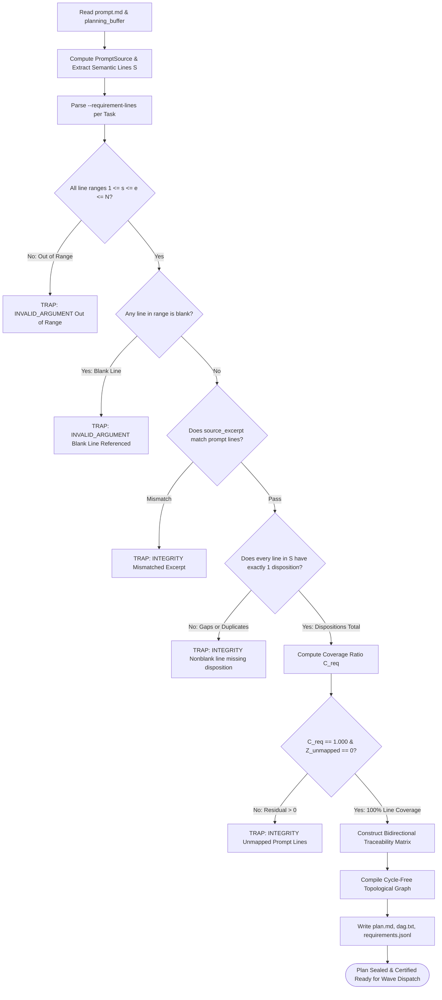

# 100% Prompt Line Coverage & Atomic Decomposition

---

[Previous: 04-01 Prompt Ingestion & SHA-256 Binding](04-01-prompt-ingestion-and-sha256-binding.md) | [Chapter Index](index.md) | [All Chapters Index](../index.md) | [Next: 04-03 Authority-Gated Obligations](04-03-authority-gated-obligations.md)

---

## 1. Executive Summary & The Cherry-Picking Problem

In autonomous software development, large language models (LLMs) exhibit a pervasive cognitive pathology: **requirement cherry-picking**. When presented with a complex specification containing a dozen functional, architectural, and quality obligations, an unconstrained agent often completes the five simplest items, marks the task as finished, and silently ignores the remaining seven complex requirements. Over multi-hour autonomous sessions, this degradation leads to half-implemented subsystems, missing error handlers, and unvalidated edge cases.

The OLT (Orchestrating Long Tasks) preplanning engine completely eliminates cherry-picking by enforcing the **100% Prompt Line Coverage Invariant ($C_{\text{req}} = 1.000, Z_{\text{unmapped\_req}} = 0$)**. Under this invariant:

1. **Total Line Disposition Totality**: Every non-blank line in the cryptographically sealed `prompt.md` must be assigned exactly one disposition: either bound to one or more formal atomic requirements ($O_k \in \mathcal{O}$) or explicitly categorized as contextual background, architecture constraint, or non-actionable framing with a recorded rationale.
2. **Bidirectional Traceability**: The planning compiler constructs a bidirectional graph linking every prompt line range $[s_k, e_k]$ to an atomic requirement $O_k$, to a compiled DAG task node $T_i$, to an isolated worktree scope $S_i$, and to a terminal verification test receipt $V_i$.
3. **Fail-Closed Mechanical Gate**: The `plan:compile` compiler rejects the plan and traps execution if even a single non-blank prompt line remains unbound or unallocated.

```text
+--------------------------------------------------------------------------------------------------+
│                             100% PROMPT LINE DECOMPOSITION TREE                                  │
+--------------------------------------------------------------------------------------------------+
│                                                                                                  │
│   prompt.md (Digest: h_prompt, N Lines)                                                          │
│   │                                                                                              │
│   ├── [Line 01-08]: Architectural Vision & Goals ────► Kind: "context" (Documented Rationale)    │
│   │                                                                                              │
│   ├── [Line 09-24]: Token Parsing & Regex Rules ─────► Req: "req-parse-tokens"                   │
│   │                                                    │                                         │
│   │                                                    ├──► Task: "task-token-parser" (Wave 1)   │
│   │                                                    └──► Scope: "src/engine/tokens.ts"        │
│   │                                                                                              │
│   ├── [Line 25-48]: Merkle Ledger Anchoring ─────────► Req: "req-merkle-anchor"                 │
│   │                                                    │                                         │
│   │                                                    ├──► Task: "task-merkle-ledger" (Wave 1)  │
│   │                                                    └──► Scope: "src/store/merkle.ts"         │
│   │                                                                                              │
│   ├── [Line 49-72]: Preflight Verification Gate ─────► Req: "req-preflight-gate"                 │
│   │                                                    │                                         │
│   │                                                    ├──► Task: "task-gate-interlock" (Wave 2) │
│   │                                                    └──► Scope: "src/guard/preflight.ts"      │
│   │                                                                                              │
│   └── [Line 73-90]: Bun Unit & Regression Tests ─────► Req: "req-test-suite"                    │
│                                                        │                                         │
│                                                        ├──► Task: "task-unit-tests" (Wave 2)     │
│                                                        └──► Scope: "tests/unit/tokens.test.ts"   │
│                                                                                                  │
│   ════════════════════════════════════════════════════════════════════════════════════════════   │
│   COVERAGE METRIC: C_req = |CoveredLines U ContextLines| / |NonBlankLines| == 1.0000 (PASS)      │
│   UNMAPPED RESIDUAL: Z_unmapped_req = 0 (Zero Unmapped Lines Invariant Enforced)                 │
│                                                                                                  │
+--------------------------------------------------------------------------------------------------+
```

---

## 2. Mathematical Formalization of Line Coverage & Bijectivity

Let $P \in \mathcal{U}$ be the sealed prompt byte stream, and let $L(P) = \langle l_1, l_2, \dots, l_N \rangle$ denote the ordered sequence of physical lines extracted via $\mathcal{S}_{\text{lines}}(P)$.

### A. Line Subsets & Partitioning

We partition the line index set $\{1, \dots, N\}$ into blank lines $\mathcal{B}(P)$ and semantic non-blank lines $\mathcal{S}(P)$:

$$\mathcal{B}(P) = \big\{ i \in \{1, \dots, N\} \;\big|\; \text{Trim}(l_i) = \emptyset \big\}$$

$$\mathcal{S}(P) = \{1, \dots, N\} \setminus \mathcal{B}(P) = \big\{ i \in \{1, \dots, N\} \;\big|\; \text{Trim}(l_i) \neq \emptyset \big\}$$

Let $\mathcal{O} = \{O_1, O_2, \dots, O_M\}$ denote the set of declared atomic requirements. Each requirement $O_k$ defines a non-empty subset of source lines:

$$\text{Lines}(O_k) \subseteq \mathcal{S}(P), \quad |\text{Lines}(O_k)| \ge 1$$

Let $\mathcal{D} = \{D_1, D_2, \dots, D_J\}$ denote the list of line dispositions recorded in the requirements manifest. Each disposition $D_j$ is a tuple:

$$D_j = \big\langle \text{line}: \lambda_j, \; \text{kind}: \kappa_j, \; \text{req\_ids}: \mathcal{R}_j, \; \text{rationale}: \rho_j \big\rangle$$

Where $\kappa_j \in \{\texttt{"requirement"}, \texttt{"context"}, \texttt{"constraint"}, \texttt{"non\_actionable"}\}$.

### B. The 100% Coverage Ratio Metric ($C_{\text{req}}$)

The coverage indicator for a semantic line index $i \in \mathcal{S}(P)$ is defined as:

$$ \mathbf{1}_{\text{covered}}(i) = \begin{cases}
1 & \text{if } \exists D_j \in \mathcal{D} \text{ such that } \lambda_j = i \land \kappa_j \in \{\texttt{"requirement"}, \texttt{"context"}, \texttt{"constraint"}, \texttt{"non\_actionable"}\} \\
0 & \text{otherwise}
\end{cases}$$

The Prompt Line Coverage Ratio $C_{\text{req}}$ is:

$$C_{\text{req}} = \frac{\sum_{i \in \mathcal{S}(P)} \mathbf{1}_{\text{covered}}(i)}{|\mathcal{S}(P)|}$$

The **100% Coverage Invariant** requires exact unity:

$$C_{\text{req}} \equiv 1.0000 \iff Z_{\text{unmapped\_req}} = \Big( |\mathcal{S}(P)| - \sum_{i \in \mathcal{S}(P)} \mathbf{1}_{\text{covered}}(i) \Big) \equiv 0$$

### C. Bijective Traceability & Excerpt Identity Predicates

In addition to line coverage, the compiler evaluates the **Exact Excerpt Identity Predicate** $\Psi_{\text{excerpt}}(O_k)$ for every atomic requirement:

$$\Psi_{\text{excerpt}}(O_k) = \Big( O_k.\text{source\_excerpt} == \text{Join}\big(\{l_i \mid i \in \text{Lines}(O_k)\}, \texttt{"\textbackslash n"}\big) \Big)$$

And the **Traceability Bijectivity Invariant** $\Phi_{\text{trace}}(\mathcal{O}, \mathcal{T})$ mapping obligations to DAG tasks $\mathcal{T} = \{T_1, \dots, T_W\}$:

$$\forall O_k \in \mathcal{O}, \quad \exists T_i \in \mathcal{T} \text{ such that } O_k \in \text{Obligations}(T_i)$$

$$\forall T_i \in \mathcal{T}, \quad \text{Obligations}(T_i) \neq \emptyset \land \Big( \forall O_k \in \text{Obligations}(T_i) \implies \text{Lines}(O_k) \subseteq \mathcal{S}(P) \Big)$$

$$\text{plan:compile}(P, \mathcal{T}) = \begin{cases}
\text{SUCCESS (Emit DAG)} & \text{if } C_{\text{req}} = 1.000 \land \big(\bigwedge_k \Psi_{\text{excerpt}}(O_k)\big) \land \Phi_{\text{trace}}(\mathcal{O}, \mathcal{T}) \\
\text{TRAP}(\texttt{INTEGRITY}) & \text{otherwise}
\end{cases}$$

---

## 3. Coverage Audit & Compilation Flow

The verification engine executes an exhaustive five-stage audit pipeline during plan compilation.



---

## 4. Concrete TypeScript Mapping Interfaces & Validation Schemas

The following TypeScript contracts represent the core data structures utilized in [`compiler.ts`](../../../../olt/scripts/src/requirements/compiler.ts) and [`validate-requirements.ts`](../../../../olt/scripts/src/requirements/validate-requirements.ts):

```typescript
/**
 * Atomic requirement specification extracted from prompt.md.
 */
export interface AtomicRequirement {
  readonly id: string;
  readonly source_lines: readonly number[];
  readonly source_excerpt: string;
  readonly instruction: string;
  readonly implementation: string;
  readonly subsystem: string;
  readonly acceptance: readonly AcceptanceCriterion[];
  readonly candidate_gates: readonly GateCommand[];
  readonly priority: number;
  readonly risk: "low" | "medium" | "high" | "critical";
  readonly dependencies: readonly string[];
  readonly disposition: "actionable" | "needs_authority" | "deferred";
  readonly status: "planned" | "in_progress" | "verified";
}

/**
 * Falsifiable acceptance criterion linked to concrete execution proof evidence.
 */
export interface AcceptanceCriterion {
  readonly id: string;
  readonly criterion: string;
  readonly evidence: readonly string[];
}

/**
 * Line disposition record ensuring 100% prompt line coverage totality.
 */
export interface LineDisposition {
  readonly line: number;
  readonly kind: "requirement" | "context" | "constraint" | "non_actionable";
  readonly requirement_id?: string | undefined;
  readonly requirement_ids?: readonly string[] | undefined;
  readonly rationale?: string | undefined;
}

/**
 * Complete requirements manifest sealed alongside compiled graph.
 */
export interface RequirementsDocument {
  readonly schema: "harness.requirements";
  readonly version: 1;
  readonly prompt_sha256: string;
  readonly requirements: readonly AtomicRequirement[];
  readonly dispositions: readonly LineDisposition[];
}

/**
 * Task declaration input provided during plan:compile.
 */
export interface TaskDeclaration {
  readonly id: string;
  readonly label: string;
  readonly writeScope: readonly string[];
  readonly gate: string | readonly string[];
  readonly deps?: readonly string[] | undefined;
  readonly depReasons?: Readonly<Record<string, string>> | undefined;
  readonly goal?: string | undefined;
  readonly criteria?: readonly string[] | undefined;
  readonly priority?: number | undefined;
  readonly effort?: number | undefined;
  readonly requirementLines?: readonly number[] | undefined;
}
```

### Traceability Matrix JSON Manifest (`requirements.jsonl`)

Each line in `requirements.jsonl` contains a fully resolved atomic requirement tuple:

```json
{
  "id": "req-session-grants",
  "source_lines": [14, 15, 16, 17, 18],
  "source_excerpt": "Enforce atomic session grant staging in .olt/sessions/<pid>.json.\nEnsure process ancestry binding to pid and ppid.\nRevoke grants on lease expiry or process termination.",
  "instruction": "Implement process ancestry session grant management in grants.ts",
  "implementation": "Implement stageSessionGrant, registerSessionGrant, and revokeSessionGrant in src/authority/session/grants.ts",
  "subsystem": "authority/session",
  "acceptance": [
    {
      "id": "crit-session-grants-1",
      "criterion": "Session grant payload is atomically written to .olt/sessions/<pid>.json",
      "evidence": ["Unit test receipts in tests/unit/authority/grants.test.ts"]
    }
  ],
  "candidate_gates": [
    { "argv": ["bun", "test", "tests/unit/authority/grants.test.ts"], "cwd": "." }
  ],
  "priority": 80,
  "risk": "medium",
  "dependencies": ["req-paths-resolver"],
  "disposition": "actionable",
  "status": "planned"
}
```

---

## 5. Anti-Blunder Matrix & Compilation Trap Dictionary

The OLT requirement compiler implements strict error traps to prevent common agent planning errors:

```text
+--------------------------------------------------------------------------------------------------+
│                             PREPLANNING ANTI-BLUNDER MATRIX                                      │
+-------------------------------+-------------------------+----------------------------------------+
│ Blunder Signature             │ Harness Error Code      │ Root Cause & Corrective Protocol       │
+-------------------------------+-------------------------+----------------------------------------+
│ Inverted Line Range           │ INVALID_ARGUMENT        │ Specified range "25-18" ends before it │
│ (e.g. --requirement-lines 25-18)                        │ starts. Must be monotonically ordered. │
+-------------------------------+-------------------------+----------------------------------------+
│ Line Out of Range             │ INVALID_ARGUMENT        │ Referenced line 142 in an 85-line       │
│ (e.g. line > prompt length)   │                         │ prompt. Must fall within [1, N].       │
+-------------------------------+-------------------------+----------------------------------------+
│ Blank Line Reference          │ INVALID_ARGUMENT        │ Pointed to an empty whitespace line.   │
│ (e.g. line contains no text)  │                         │ Requirement must bind semantic text.   │
+-------------------------------+-------------------------+----------------------------------------+
│ Unbound Task Declaration      │ INTEGRITY               │ Task declared without requirementLines │
│ (no mapped prompt lines)      │                         │ and cannot be folded into existing.    │
+-------------------------------+-------------------------+----------------------------------------+
│ Discrepant Source Excerpt     │ INTEGRITY               │ Cached excerpt text does not match the │
│ (excerpt != prompt.md slice)  │                         │ exact physical characters in prompt.   │
+-------------------------------+-------------------------+----------------------------------------+
│ Unmapped Prompt Line Gap      │ INTEGRITY               │ Semantic line has zero dispositions.   │
│ (Z_unmapped_req > 0)          │                         │ Must declare as req or context.        │
+-------------------------------+-------------------------+----------------------------------------+
│ Circular Acceptance Proof     │ WARNING / AUDIT BLOCK   │ Acceptance criteria only tests own task│
│ (unfalsifiable tautology)     │                         │ gate without independent test harness. │
+-------------------------------+-------------------------+----------------------------------------+
```

---

## 6. Architectural Invariants Summary

1. **Zero Unmapped Prompt Lines ($Z_{\text{unmapped\_req}} = 0$)**: The compiler fails-closed unless every semantic prompt line is explicitly accounted for in the requirements document.
2. **Deterministic Excerpt Identity**: `source_excerpt` strings are generated directly from the canonical line splitter and validated with exact string equality against `prompt.md`.
3. **Traceability Bijectivity**: Every prompt line connects to an obligation, every obligation connects to a task, and every task connects to an isolated worktree and verification gate.
4. **Permanent Audit Trail**: The complete requirements document and line dispositions are permanently serialized to `planning/requirements.jsonl` within the run capsule.

---

[Previous: 04-01 Prompt Ingestion & SHA-256 Binding](04-01-prompt-ingestion-and-sha256-binding.md) | [Chapter Index](index.md) | [All Chapters Index](../index.md) | [Next: 04-03 Authority-Gated Obligations](04-03-authority-gated-obligations.md)

---
$$
