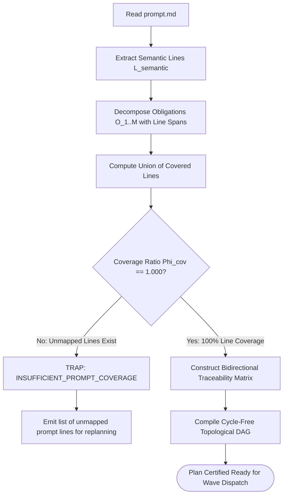

# 100% Prompt Line Coverage Invariant

---

[Previous: 04-01 Prompt Ingestion & SHA-256](04-01-prompt-ingestion-and-sha256-binding.md) | [Chapter Index](index.md) | [All Chapters Index](../index.md) | [Next: 04-03 Authority-Gated Obligations](04-03-authority-gated-obligations.md)

---

## 1. Executive Summary & The Cherry-Picking Problem

In autonomous software development, LLMs exhibit a well-documented cognitive bias: **cherry-picking**. When presented with a rich user specification containing 10 requirements, an agent often implements the 6 easiest items, declares the task completed, and quietly ignores the remaining 4 complex requirements.

The OLT (Orchestrating Long Tasks) engine eliminates cherry-picking by enforcing the **100% Prompt Line Coverage Invariant ($\Phi_{\text{cov}} = 1.000$)**. Under this invariant:

1. **Line-by-Line Obligation Extraction**: Every non-blank, non-comment line in `prompt.md` must be extracted as a formal obligation tuple.
2. **Bidirectional Traceability Matrix**: Every extracted obligation must map to at least one discrete task node in the compiled topological DAG, and every task node must cite its source lines.
3. **Mechanical Compilation Gate**: `plan:compile` fails-closed if any prompt line remains unmapped.

```text
+--------------------------------------------------------------------------------------------------+
│                             100% PROMPT LINE COVERAGE TOPOLOGY                                   │
+--------------------------------------------------------------------------------------------------+
│                                                                                                  │
│   prompt.md (Line-by-Line Extraction)                                                            │
│   ├── Line 01-12: Architecture & Constraints ──► Obligation O-01 ──► Task TASK-01 (Wave 1)       │
│   ├── Line 13-28: Data Model & Types         ──► Obligation O-02 ──► Task TASK-02 (Wave 1)       │
│   ├── Line 29-45: Core Engine Logic          ──► Obligation O-03 ──► Task TASK-03 (Wave 2)       │
│   └── Line 46-60: Unit & Integration Tests   ──► Obligation O-04 ──► Task TASK-04 (Wave 2)       │
│                                                                                                  │
│   ════════════════════════════════════════════════════════════════════════════════════════════   │
│   COVERAGE RATIO: Phi_cov = |CoveredLines| / |TotalLines| == 1.000 (Mechanical Invariant)         │
│                                                                                                  │
+--------------------------------------------------------------------------------------------------+
```

---

## 2. Mathematical Formalization of Coverage Invariant

Let $L(P) = \{1, 2, \dots, N\}$ denote the set of physical line indices in `prompt.md`.

Let $L_{\text{semantic}}(P) \subseteq L(P)$ denote the subset of lines containing substantive functional, architectural, or testing requirements (excluding empty lines and markdown headers).

Let $\mathcal{O} = \{O_1, O_2, \dots, O_M\}$ be the extracted obligation set, where each obligation $O_k$ spans a line interval $[s_k, e_k] \subset L(P)$.

The **Prompt Line Coverage Ratio** $\Phi_{\text{cov}}$ is:

$$\Phi_{\text{cov}} = \frac{\left| \bigcup_{k=1}^M [s_k, e_k] \cap L_{\text{semantic}}(P) \right|}{|L_{\text{semantic}}(P)|}$$

The **100% Coverage Invariant** strictly requires:

$$\Phi_{\text{cov}} \equiv 1.000$$

$$\text{plan:compile}(P) = \begin{cases} \text{DAG Compiled} & \text{if } \Phi_{\text{cov}} = 1.000 \\ \text{TRAP (INSUFFICIENT\_PROMPT\_COVERAGE)} & \text{if } \Phi_{\text{cov}} < 1.000 \end{cases}$$



---

## 3. The Bidirectional Traceability Matrix

The traceability matrix is permanently recorded in `state.json` ([`plan-validator.ts`](file:///Users/onurseckinsenoglu/repos/skills/olt/scripts/src/engine/planner/plan-validator.ts)):

```json
{
  "traceabilityMatrix": [
    {
      "obligationId": "O-01",
      "promptLineRange": { "start": 1, "end": 24 },
      "category": "ARCHITECTURAL_INVARIANT",
      "mappedTaskIds": ["TASK-01"],
      "satisfactionCriteria": "AST linter checks pass with zero any types"
    },
    {
      "obligationId": "O-02",
      "promptLineRange": { "start": 25, "end": 62 },
      "category": "IMPLEMENTATION",
      "mappedTaskIds": ["TASK-02", "TASK-03"],
      "satisfactionCriteria": "Bun unit test suite exits with code 0"
    }
  ]
}
```

---

## 4. Architectural Invariants Summary

1. **Zero Unmapped Requirements**: Every prompt obligation is tracked through DAG execution to terminal verification.
2. **Anti-Cherry-Picking**: Tasks cannot be marked complete if any mapped prompt lines lack proof receipts.
3. **Forensic Auditability**: Any line in the prompt can be traced directly to git commits and test receipts.

---

[Previous: 04-01 Prompt Ingestion & SHA-256](04-01-prompt-ingestion-and-sha256-binding.md) | [Chapter Index](index.md) | [All Chapters Index](../index.md) | [Next: 04-03 Authority-Gated Obligations](04-03-authority-gated-obligations.md)

---
