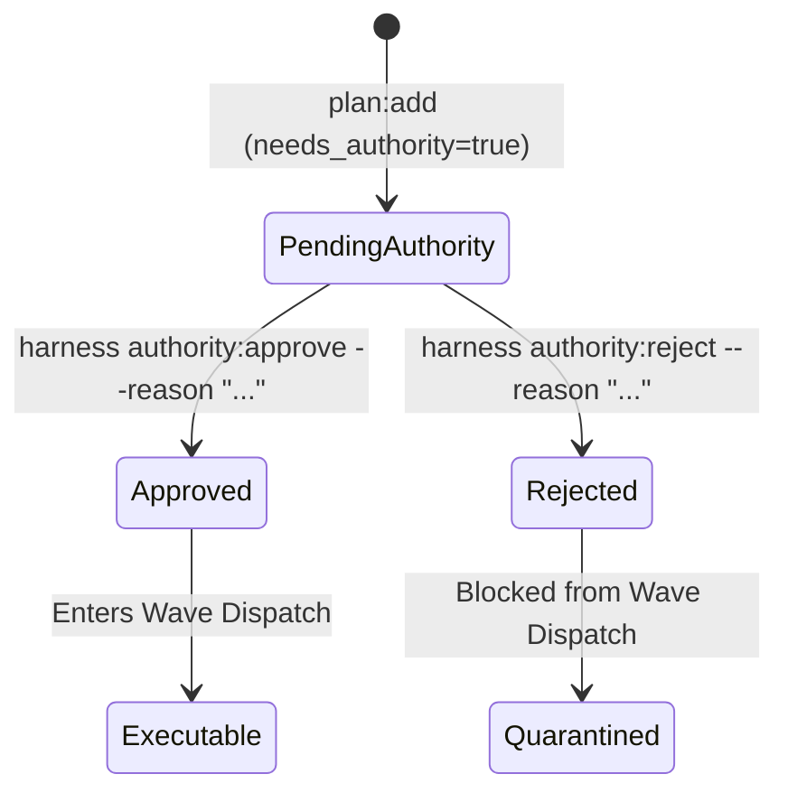

# Authority-Gated Obligations & Decision Ledgers

[OLT Documentation Hub](../../README.md) > [Architecture Index](../index.md) > [Chapter 04](./index.md) > 04-03 Authority Gating

---

[⏮️ Previous: 04-02 100% Line Coverage Invariant](04-02-one-hundred-percent-line-coverage.md) | [📂 Chapter Index](index.md) | [📚 All Chapters Index](../index.md) | [⏭️ Next: 04-04 Thematic Roadmap Clustering](04-04-thematic-roadmap-clustering.md)
---

## 1. The `needs_authority` Taxonomy

Certain software engineering actions cannot be autonomously decided by an agent without human or product owner authorization. OLT classifies these as **Authority-Gated Obligations**:

```text
┌─────────────────────────────────────────────────────────────────────────────┐
│                     AUTHORITY-GATED OBLIGATION TAXONOMY                     │
├──────────────────────────┬──────────────────────────────────────────────────┤
│ 1. Breaking API Changes  │ Modifying public endpoints or data contracts.    │
│ 2. Schema Drop / Migr    │ Dropping database columns or destructive schema. │
│ 3. External Secrets/Keys │ Provisioning new cloud credentials or payment APIs│
│ 4. Dependency Additions  │ Introducing new top-level npm / binary libraries.│
│ 5. Security Boundary Mod │ Altering RBAC policies or firewall exemptions.   │
└──────────────────────────┴──────────────────────────────────────────────────┘
```

---

## 2. The Authority Decision Ledger

When a requirement is flagged as `needs_authority`, it is recorded in the capsule's **Authority Decision Ledger** and transitions to state `pending_authority`:



### Honest Blocked Reporting vs. Hallucinated Authority

In conventional systems, agents hallucinate approval: _"Assuming the user wants me to add this dependency..."_  
OLT strictly forbids implicit assumptions. If an obligation lacks a formal signed approval record in the ledger, the task scheduler refuses to include it in executable waves, reporting it honestly as **BLOCKED ON AUTHORITY**.

---

[⏮️ Previous: 04-02 100% Line Coverage Invariant](04-02-one-hundred-percent-line-coverage.md) | [📂 Chapter Index](index.md) | [📚 All Chapters Index](../index.md) | [⏭️ Next: 04-04 Thematic Roadmap Clustering](04-04-thematic-roadmap-clustering.md)
---
