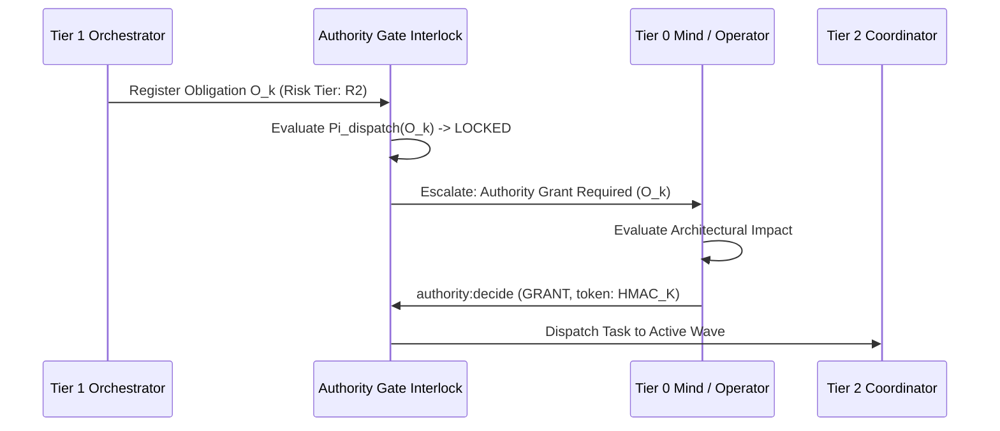

# Authority-Gated Obligations & Risk Bounds

---

[Previous: 04-02 100% Prompt Line Coverage](04-02-one-hundred-percent-line-coverage.md) | [Chapter Index](index.md) | [All Chapters Index](../index.md) | [Next: 04-04 Thematic Roadmap Clustering](04-04-thematic-roadmap-clustering.md)

---

## 1. Executive Summary & Epistemic Authority Bounds

In autonomous agent orchestration, tasks carry vastly different operational risk profiles:

- Low-risk tasks (e.g. authoring markdown documentation or writing isolated unit tests) can execute autonomously without human review.
- High-risk tasks (e.g. modifying core authentication contracts, deleting database migrations, or executing external network calls) can introduce catastrophic regressions if executed without explicit supervisory authorization.

The OLT (Orchestrating Long Tasks) engine implements **Authority-Gated Obligations & Risk Bounds**. Under this architecture:

1. **Automated Risk Classification**: Obligations are classified into 4 risk tiers ($\mathcal{R}_0 \dots \mathcal{R}_3$) based on target file scopes and tool commands.
2. **Authority Locks (`needs_authority: true`)**: Any obligation with risk tier $\ge \mathcal{R}_2$ is locked at compile time and cannot be leased to worker subagents without an explicit Grant Token minted by Tier 0 (Mind) or the Human Operator.

```text
+--------------------------------------------------------------------------------------------------+
│                             AUTHORITY GATE CLASSIFICATION MATRIX                                 │
+--------------------------------------------------------------------------------------------------+
│                                                                                                  │
│   RISK TIER R0 (Autonomous): Docs & README Edits ──► Auto-Leased without Gate                    │
│   RISK TIER R1 (Low Risk): Isolated Component Code ──► Auto-Leased with Dual Verification        │
│   RISK TIER R2 (High Risk): Core Contracts & RBAC ──► LOCKED: Requires Supervisor Grant Token     │
│   RISK TIER R3 (Critical): Root Deletes / External ──► LOCKED: Requires Human Operator Approval   │
│                                                                                                  │
+--------------------------------------------------------------------------------------------------+
```

---

## 2. Mathematical Formalization of Risk Classification

Let $O_k$ denote an extracted obligation targeting file paths $\mathcal{P}(O_k)$ and requiring tool operations $\mathcal{T}(O_k)$.

The **Risk Classification Function** $\mathcal{R}_{\text{tier}}(O_k) \in \{0, 1, 2, 3\}$ is:

$$\mathcal{R}_{\text{tier}}(O_k) = \max\Big( \text{PathRisk}(\mathcal{P}(O_k)), \; \text{ToolRisk}(\mathcal{T}(O_k)) \Big)$$

Where:

$$ \text{PathRisk}(p) = \begin{cases}
3 & \text{if } p \subseteq \texttt{"infra/"} \lor p \subseteq \texttt{".env*"} \\
2 & \text{if } p \subseteq \texttt{"core/security/"} \lor p \subseteq \texttt{"agents/*.yaml"} \\
1 & \text{if } p \subseteq \texttt{"src/"} \lor p \subseteq \texttt{"tests/"} \\
0 & \text{if } p \subseteq \texttt{"docs/"}
\end{cases}$$

The **Dispatch Permission Predicate** $\Pi_{\text{dispatch}}(O_k)$ is:

$$\Pi_{\text{dispatch}}(O_k) = \begin{cases}
1 \text{ (AUTO\_DISPATCH)} & \text{if } \mathcal{R}_{\text{tier}}(O_k) \le 1 \\
\mathbf{1}_{\text{GrantExists}}(O_k, \tau) & \text{if } \mathcal{R}_{\text{tier}}(O_k) \ge 2
\end{cases}$$



---

## 3. The Agent Grant Ledger

All granted authorities are recorded in the capsule grant ledger ([`agent-grant-ledger.ts`](file:///Users/onurseckinsenoglu/repos/skills/olt/scripts/src/authority/session/session-registry.ts)):

```json
{
  "grantId": "grant-auth-core-09",
  "taskId": "TASK-04",
  "riskTier": 2,
  "grantedTo": "implementer_security_task-04",
  "grantedBy": "mind_gen-6",
  "allowedScopes": ["olt/scripts/src/core/security/**"],
  "tokenSignature": "a7b8c9d0e1f2...",
  "expiresAt": "2026-08-29T03:27:00.000Z"
}
```

---

## 4. Architectural Invariants Summary

1. **Least-Privilege Default**: High-risk tasks are locked fail-closed by default.
2. **Signed Grant Tokens**: Subordinate agents cannot mint or modify grant tokens.
3. **Audit Trail**: Every authority escalation is permanently sealed in `events.jsonl`.

---

[Previous: 04-02 100% Prompt Line Coverage](04-02-one-hundred-percent-line-coverage.md) | [Chapter Index](index.md) | [All Chapters Index](../index.md) | [Next: 04-04 Thematic Roadmap Clustering](04-04-thematic-roadmap-clustering.md)

---
$$
