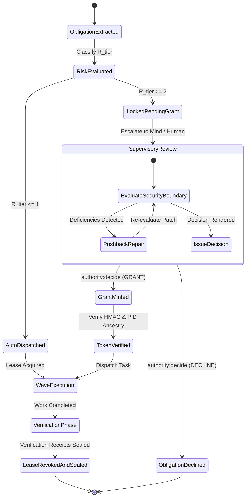

# Authority-Gated Obligations & Risk Bounds

---

[Previous: 04-02 100% Line Coverage & Atomic Decomposition](04-02-one-hundred-percent-line-coverage.md) | [Chapter Index](index.md) | [All Chapters Index](../index.md) | [Next: 04-04 Thematic Roadmap Clustering](04-04-thematic-roadmap-clustering.md)

---

## 1. Executive Summary & Epistemic Authority Bounds

In autonomous multi-agent software engineering, tasks exhibit fundamentally divergent operational risk profiles. A low-risk task (such as updating markdown documentation, formatting comments, or authoring isolated test mocks) can execute autonomously without human supervision. Conversely, high-risk operations (such as modifying core security contracts, altering role-based access control policies, issuing irreversible Git reflog rewrites, or calling destructive external network APIs) risk catastrophic repository corruption if executed without explicit supervisory authorization.

The OLT (Orchestrating Long Tasks) engine enforces **Authority-Gated Obligations & Risk Bounds**. Under this architecture:

1. **Static & Dynamic Risk Stratification**: Every requirement obligation $O_k$ is classified into one of four deterministic risk tiers ($\mathcal{R}_0 \dots \mathcal{R}_3$) based on target write paths, tool capabilities, and command patterns.
2. **Authority Lockout (`needs_authority: true`)**: Any obligation evaluated at risk tier $\mathcal{R}_2$ or higher is automatically locked at compile time. The scheduler cannot lease or dispatch the task without an explicit, cryptographically signed Grant Token minted by Tier 0 (Mind) or the Human Operator.
3. **Process Ancestry Session Grants**: Granted authorities are bound directly to the operating system process identifier (`pid`) and parent process identifier (`ppid`), preventing privilege escalation or token leakage across parallel worker worktrees.
4. **Permanent Supervisory Audit Trail**: Every grant request, approval token, pushback, or denial is hash-chained into the Merkle event ledger `events.jsonl`, establishing non-repudiable auditability.

```text
+--------------------------------------------------------------------------------------------------+
│                             AUTHORITY GATE LATTICE & RISK TIERS                                  │
+--------------------------------------------------------------------------------------------------+
│                                                                                                  │
│   TIER R3: CRITICAL RISK (Human Gate Required)                                                   │
│   ├── Target Scopes: infra/**, .env*, root deletes, destructive shell commands                   │
│   └── Authorization: Requires explicit CLI `authority:decide` approval from Human Operator      │
│                                                                                                  │
│   TIER R2: HIGH RISK (Tier 0 Mind Grant Required)                                                │
│   ├── Target Scopes: src/authority/**, agents/*.yaml, core security contracts, schema migrations │
│   └── Authorization: Mind Supervisor evaluates architectural impact & mints HMAC Grant Token     │
│                                                                                                  │
│   TIER R1: LOW / MEDIUM RISK (Autonomous with Dual Verification)                                 │
│   ├── Target Scopes: src/**, tests/**, engine algorithms, utility modules                        │
│   └── Authorization: Auto-leased to Tier 3 Implementer; gated by Cognitive & AST Verification    │
│                                                                                                  │
│   TIER R0: TRIVIAL RISK (Autonomous Execution)                                                   │
│   ├── Target Scopes: docs/**, *.md, comments, whitespace, non-functional assets                  │
│   └── Authorization: Immediate lease dispatch without supervisor intervention                    │
│                                                                                                  │
+--------------------------------------------------------------------------------------------------+
```

---

## 2. Mathematical Formalization of Risk Classification & Dispatch

Let $O_k$ denote an atomic obligation with target write paths $\mathcal{P}(O_k)$, required tool operations $\mathcal{T}(O_k)$, and domain classification $\mathcal{D}(O_k)$.

### A. Risk Classification Functions

The path risk function $\text{PathRisk}: \mathcal{P} \to \{0, 1, 2, 3\}$ evaluates target file path scopes:

$$ \text{PathRisk}(p) = \begin{cases}
3 & \text{if } p \cap \big(\texttt{"infra/"} \cup \texttt{".env*"} \cup \texttt{".git/"}\big) \neq \emptyset \\
2 & \text{if } p \cap \big(\texttt{"src/authority/"} \cup \texttt{"agents/"} \cup \texttt{"policy.json"}\big) \neq \emptyset \\
1 & \text{if } p \cap \big(\texttt{"src/"} \cup \texttt{"tests/"} \cup \texttt{"packages/"}\big) \neq \emptyset \\
0 & \text{if } p \cap \big(\texttt{"docs/"} \cup \texttt{"*.md"}\big) \neq \emptyset
\end{cases}$$

The tool risk function $\text{ToolRisk}: \mathcal{T} \to \{0, 1, 2, 3\}$ evaluates invocation capabilities:

$$\text{ToolRisk}(t) = \begin{cases}
3 & \text{if } t \in \{\texttt{shell:rm\_rf}, \texttt{git:push\_force}, \texttt{net:external\_mutate}\} \\
2 & \text{if } t \in \{\texttt{fs:write\_config}, \texttt{process:kill}, \texttt{session:grant}\} \\
1 & \text{if } t \in \{\texttt{fs:write\_code}, \texttt{test:run}, \texttt{git:commit}\} \\
0 & \text{if } t \in \{\texttt{fs:read}, \texttt{ast:lint}, \texttt{log:view}\}
\end{cases}$$

The aggregate risk tier $\mathcal{R}_{\text{tier}}(O_k) \in \{0, 1, 2, 3\}$ is defined as:

$$\mathcal{R}_{\text{tier}}(O_k) = \max\Big( \max_{p \in \mathcal{P}(O_k)} \text{PathRisk}(p), \; \max_{t \in \mathcal{T}(O_k)} \text{ToolRisk}(t) \Big)$$

### B. Dispatch Permission Predicate

Let $\tau = \langle \text{tokenId}, \text{actorId}, t_{\text{grant}}, \Delta t_{\text{TTL}}, \text{sig} \rangle$ be a candidate grant token presented for obligation $O_k$.

The validity of the grant token $\mathbf{1}_{\text{GrantValid}}(\tau, O_k, t)$ is evaluated as:

$$\mathbf{1}_{\text{GrantValid}}(\tau, O_k, t) = \big( t < t_{\text{grant}} + \Delta t_{\text{TTL}} \big) \land \Big( \text{HMAC}_{\text{SHA256}}\big(\tau.\text{body}, K_{\text{auth}}\big) == \tau.\text{sig} \Big) \land \big( \mathcal{P}(O_k) \subseteq \tau.\text{allowedScopes} \big)$$

The **Dispatch Permission Predicate** $\Pi_{\text{dispatch}}(O_k, \tau, t)$ governs wave scheduling:

$$\Pi_{\text{dispatch}}(O_k, \tau, t) = \begin{cases}
1 \text{ (AUTO\_DISPATCH)} & \text{if } \mathcal{R}_{\text{tier}}(O_k) \le 1 \\
\mathbf{1}_{\text{GrantValid}}(\tau, O_k, t) & \text{if } \mathcal{R}_{\text{tier}}(O_k) \ge 2
\end{cases}$$

If $\Pi_{\text{dispatch}}(O_k, \tau, t) = 0$, task leasing is strictly refused, and the scheduler transitions the task node to `LOCKED_PENDING_AUTHORITY`.

---

## 3. Authority Approval State Machine

The lifecycle of an authority-gated obligation follows a deterministic state machine with explicit human-in-the-loop escalation branches.



---

## 4. Concrete TypeScript Interfaces & Security Boundaries

The session grant and authority evaluation interfaces are codified in [`grants.ts`](file:///Users/onurseckinsenoglu/repos/skills/olt/scripts/src/authority/session/grants.ts) and [`types.ts`](file:///Users/onurseckinsenoglu/repos/skills/olt/scripts/src/authority/session/types.ts):

```typescript
import type { ExecutionTier } from "../thread/index.ts";

/**
 * Immutable session identity granted to an active worker agent.
 */
export interface SessionIdentity {
  readonly agent_id: string;
  readonly role: string;
  readonly tier: ExecutionTier;
  readonly token: string;
  readonly pid: number;
  readonly ppid: number;
  readonly run_id?: string | undefined;
  readonly task_id?: string | undefined;
  readonly write_scope?: readonly string[] | undefined;
  readonly can_execute_shell: boolean;
  readonly can_edit_files: boolean;
  readonly host: string;
  readonly mechanisms_detected: readonly string[];
  readonly granted_at: string;
}

/**
 * Options for registering an authenticated agent session grant.
 */
export interface RegisterSessionOptions {
  readonly runRoot?: string | undefined;
  readonly agentId: string;
  readonly role: string;
  readonly customToken?: string | undefined;
  readonly pid?: number | undefined;
  readonly ppid?: number | undefined;
  readonly taskId?: string | undefined;
  readonly writeScope?: readonly string[] | undefined;
  readonly host?: string | undefined;
  readonly bindProcessAncestry?: boolean | undefined;
  readonly worktreeDir?: string | undefined;
}

/**
 * Authority grant token payload issued during supervisory review.
 */
export interface AuthorityGrantToken {
  readonly grantId: string;
  readonly taskId: string;
  readonly riskTier: 2 | 3;
  readonly grantedTo: string;
  readonly grantedBy: "mind_supervisor" | "human_operator";
  readonly allowedScopes: readonly string[];
  readonly tokenSignature: string;
  readonly grantedAt: string;
  readonly expiresAt: string;
}

/**
 * Staged session grant structure supporting atomic writes and rollback.
 */
export interface StagedSessionGrant {
  readonly session: SessionIdentity;
  readonly repoRoot: string;
  readonly globalDir: string;
  readonly payload: string;
  readonly processSnapshots: readonly unknown[];
  readonly capsuleSnapshot?: unknown | undefined;
}
```

### Authority Session Grant Manifest (`.olt/sessions/<pid>.json`)

The runtime grant is written directly to disk locked to the worker process identifier:

```json
{
  "agent_id": "implementer_security_task-04",
  "role": "implementer",
  "tier": 3,
  "token": "tok_live_4f98a21bc9e14a87b320d58f3192bc0a98ef1122",
  "pid": 84210,
  "ppid": 84102,
  "run_id": "auth-session-refactor",
  "task_id": "TASK-04",
  "write_scope": ["src/authority/session/**"],
  "can_execute_shell": false,
  "can_edit_files": true,
  "host": "darwin",
  "mechanisms_detected": ["registration", "process_ancestry"],
  "granted_at": "2026-08-29T04:22:15.000Z"
}
```

---

## 5. Failure Modes, Security Traps, & Recovery Matrices

The authority gate interlock enforces fail-closed containment against unauthorized mutations, privilege escalations, and expired tokens.

```text
+--------------------------------------------------------------------------------------------------+
│                             AUTHORITY GATE RECOVERY MATRIX                                       │
+-------------------------------+-------------------------+----------------------------------------+
│ Violation Event               │ Harness Error Code      │ Deterministic Engine Action            │
+-------------------------------+-------------------------+----------------------------------------+
│ Worker attempts mutation      │ PERMISSION_DENIED       │ Abort filesystem transaction; revoke   │
│ outside granted write_scope   │                         │ session token; roll back worktree.     │
+-------------------------------+-------------------------+----------------------------------------+
│ Task requires Tier R2/R3 but  │ INTEGRITY               │ Lock task in LOCKED_PENDING_AUTHORITY; │
│ lacks valid grant token       │                         │ halt wave dispatch; request review.    │
+-------------------------------+-------------------------+----------------------------------------+
│ Grant token TTL expired       │ EXPIRED_CREDENTIAL      │ Evict active lease; kill worker        │
│ (t > granted_at + TTL)        │                         │ process tree (SIGTERM -> SIGKILL).     │
+-------------------------------+-------------------------+----------------------------------------+
│ Process ancestry PID mismatch │ SECURITY_VIOLATION      │ Reject session registration; log PID   │
│ (spoofed process credentials) │                         │ spoofing event to Merkle ledger.       │
+-------------------------------+-------------------------+----------------------------------------+
│ Deadlock on supervisory gate  │ TIMEOUT                 │ If supervisor does not decide within   │
│ (no approval after timeout)   │                         │ SLA, escalate directly to operator.    │
+-------------------------------+-------------------------+----------------------------------------+
```

### Forensic Investigation Command Workflow

When an authority violation occurs, the operator audits active sessions and inspects grant locks:

```bash
# Check active authority grants and verify process bindings
$ olt authority check --run .olt/capsules/auth-session-refactor

[AUDIT: PASS] Process ancestry verified for PID 84210 (PPID 84102)
[AUDIT: ACTIVE] Grant 'tok_live_4f98a21bc9e14a87b320d58f3192bc0a98ef1122'
  Target Scope: src/authority/session/**
  Expires In:   242s
```

---

## 6. Architectural Invariants Summary

1. **Fail-Closed Least Privilege**: High-risk tasks are locked by default. Execution is physically prohibited without cryptographic grant tokens.
2. **Process Ancestry Locking**: Session grants are tied to OS-level `pid` and `ppid` tuples, preventing cross-process token usurpation.
3. **Cryptographic Non-Repudiation**: All grants are signed using HMAC keys and recorded in `events.jsonl` with nanosecond timestamps.
4. **Autonomous Low-Risk Execution**: Low-risk tasks ($\mathcal{R} \le 1$) flow seamlessly through parallel waves without introducing human latency bottlenecks.

---

[Previous: 04-02 100% Line Coverage & Atomic Decomposition](04-02-one-hundred-percent-line-coverage.md) | [Chapter Index](index.md) | [All Chapters Index](../index.md) | [Next: 04-04 Thematic Roadmap Clustering](04-04-thematic-roadmap-clustering.md)

---
$$
