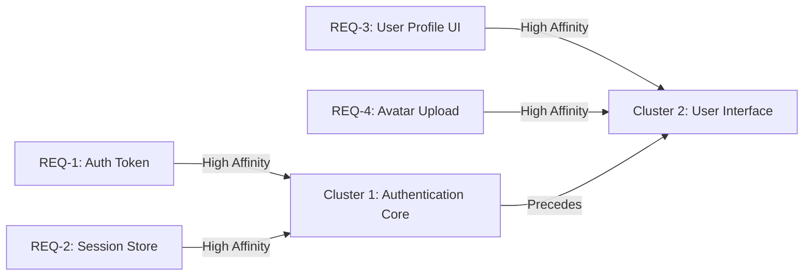

# Thematic Roadmap Clustering & DAG Generation

[OLT Documentation Hub](../../README.md) > [Architecture Index](../index.md) > [Chapter 04](./index.md) > 04-04 Thematic Clustering

---

[⏮️ Previous: 04-03 Authority-Gated Obligations](04-03-authority-gated-obligations.md) | [📂 Chapter Index](index.md) | [📚 All Chapters Index](../index.md) | [⏭️ Next: Chapter 05: Concurrency Scaling & Straggler SLA](../05-concurrency-straggler-sla/index.md)
---

## 1. Affinity Scoring & Graph Partitioning

Once requirements are derived and authority-cleared, the preplanning factory groups them into cohesive, modular implementation milestones using **Semantic & Structural Affinity Scoring**:

$$\text{Affinity}(R_a, R_b) = w_1 \cdot \text{FileOverlap}(R_a, R_b) + w_2 \cdot \text{DomainSimilarity}(R_a, R_b) + w_3 \cdot \text{DependencyCoupling}(R_a, R_b)$$

---

## 2. Generational DAG Compilation ($G_0 \to G_k$)

The clusters are compiled into a topological Directed Acyclic Graph where:

- Nodes represent atomic execution tasks ($V = \{T_1, T_2, \dots, T_n\}$).
- Edges represent strict prerequisite dependencies ($E = \{(T_i, T_j) \mid T_i \prec T_j\}$).
- Each task specifies exact granted filesystem write scopes to guarantee disjoint parallel execution.

---

[⏮️ Previous: 04-03 Authority-Gated Obligations](04-03-authority-gated-obligations.md) | [📂 Chapter Index](index.md) | [📚 All Chapters Index](../index.md) | [⏭️ Next: Chapter 05: Concurrency Scaling & Straggler SLA](../05-concurrency-straggler-sla/index.md)
---
