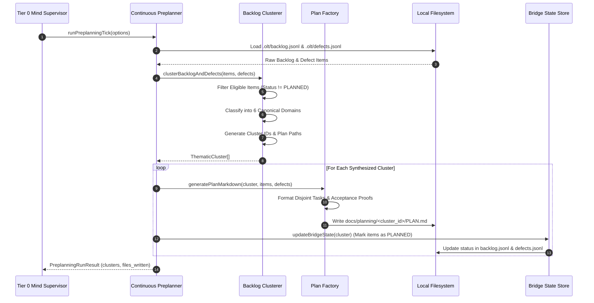

# Thematic Roadmap Clustering & Multi-Wave Decomposition

---

[Previous: 04-03 Authority-Gated Obligations](04-03-authority-gated-obligations.md) | [Chapter Index](index.md) | [All Chapters Index](../index.md) | [Next: Chapter 05: Concurrency & Straggler SLA](../05-concurrency-straggler-sla/index.md)

---

## 1. Executive Summary & Autonomous Discovery Synthesis

In continuous autonomous software engineering systems, discoveries, defect detections, and strategic backlog items arrive asynchronously across disparate channels. When background daemons, test harnesses, Socratic review auditors, and Tier 0 Mind supervisors continuously identify codebase issues, the resulting issue stream quickly becomes overwhelming. If an orchestrator attempts to schedule these items naively as a flat queue, execution collapses into Git merge conflicts, file access contention, and cascading sequential bottlenecks.

The OLT (Orchestrating Long Tasks) preplanning engine solves this scalability dilemma through **Thematic Roadmap Clustering & Multi-Wave Decomposition**. Under this architecture:

1. **6-Domain Canonical Clustering**: Unplanned backlog items and defects are classified into six canonical architectural domains (`core`, `validation`, `tooling`, `engine`, `mind`, `reporting`) using deterministic lexical and path affinity heuristics.
2. **Deterministic Cluster Identification**: Discovered items within each domain are partitioned into unique, hash-addressed thematic clusters ($C_1, \dots, C_K$), yielding reproducible milestone blueprints located at `docs/planning/<cluster-id>/PLAN.md`.
3. **Multi-Wave DAG Synthesis**: Within each thematic cluster, tasks are organized into decoupled, sequential waves ($W_1, \dots, W_M$) using Kahn's topological sort and Brent's work-span optimization theorem.
4. **Scope-Disjoint Concurrency**: Tasks co-located within the same execution wave are mathematically guaranteed to have mutually disjoint file write scopes, preventing Git merge conflicts across parallel worktrees.
5. **Bridge State Lifecycle Synchronization**: Discovery items transition atomically from `PENDING` or `OPEN` to `PLANNED` upon plan publication, binding the cluster blueprint back to `.olt/backlog.jsonl` and `.olt/defects.jsonl`.

```text
+--------------------------------------------------------------------------------------------------+
│                             THEMATIC CLUSTERING & ROADMAP TOPOLOGY                               │
+--------------------------------------------------------------------------------------------------+
│                                                                                                  │
│   UNSTRUCTURED DISCOVERY FEEDS                                                                   │
│   ├── .olt/backlog.jsonl ───────────────┐                                                        │
│   ├── .olt/defects.jsonl ───────────────┼──► Ingestion & Eligibility Filter                      │
│   └── Telemetry / Audit Findings ───────┘    (Status != PLANNED, COMPLETED, DECLINED)            │
│                                                              │                                   │
│                                                              ▼                                   │
│   6-DOMAIN CANONICAL CLUSTERING ENGINE                                                           │
│   ├── [Domain: core] ────────► Cluster: cluster-core-3a7b9f1c ───────► docs/planning/.../PLAN.md │
│   ├── [Domain: validation] ──► Cluster: cluster-validation-8e12d4a5 ─► docs/planning/.../PLAN.md │
│   ├── [Domain: tooling] ─────► Cluster: cluster-tooling-4c910fa2 ────► docs/planning/.../PLAN.md │
│   ├── [Domain: engine] ──────► Cluster: cluster-engine-7d4e219b ─────► docs/planning/.../PLAN.md │
│   ├── [Domain: mind] ────────► Cluster: cluster-mind-1b5e89ac ───────► docs/planning/.../PLAN.md │
│   └── [Domain: reporting] ───► Cluster: cluster-reporting-9f0a31de ──► docs/planning/.../PLAN.md │
│                                                              │                                   │
│                                                              ▼                                   │
│   MULTI-WAVE TOPOLOGICAL SYNTHESIS (Work-Span P = ceil(W/S))                                     │
│   ├── Wave 1: [Task 1.1 (Scope: src/core/types.ts)] || [Task 1.2 (Scope: src/core/errors.ts)]    │
│   │           └── (Barrier: Unit tests pass, AST clean, Git staged)                              │
│   └── Wave 2: [Task 2.1 (Scope: src/core/engine.ts)]                                             │
│               └── (Barrier: Integration tests pass, Terminal proof sealed)                       │
│                                                                                                  │
+--------------------------------------------------------------------------------------------------+
```

---

## 2. Mathematical Formulation of Thematic Clustering

Let $\mathcal{I} = \mathcal{B} \cup \mathcal{D}$ represent the universe of eligible discovery items, where $\mathcal{B} = \{b_1, \dots, b_N\}$ is the set of unassigned backlog items from `.olt/backlog.jsonl` and $\mathcal{D} = \{d_1, \dots, d_M\}$ is the set of open defects from `.olt/defects.jsonl`.

### A. Semantic Affinity & Domain Classification

Let $\Omega = \{\texttt{core}, \texttt{validation}, \texttt{tooling}, \texttt{engine}, \texttt{mind}, \texttt{reporting}\}$ denote the canonical domain set.

The domain classification function $\mathcal{C}_{\text{domain}}: \mathcal{I} \to \Omega$ maps an item $x \in \mathcal{I}$ based on title, description, category, and error code vectors:

$$ \mathcal{C}_{\text{domain}}(x) = \begin{cases}
\text{DomainOverride}(x) & \text{if } \text{category}(x) \in \Omega \\
\text{HeuristicMatch}(\text{LexicalVector}(x)) & \text{otherwise}
\end{cases}$$

For any pair of items $u, v \in \mathcal{I}$, we define the **Pairwise Semantic Affinity Metric** $\mathcal{A}(u, v) \in [0, 1]$:

$$\mathcal{A}(u, v) = \alpha \cdot \mathbf{1}_{[\mathcal{C}_{\text{domain}}(u) = \mathcal{C}_{\text{domain}}(v)]} + \beta \cdot \text{Jaccard}\big(\text{Tokens}(u), \text{Tokens}(v)\big) + \gamma \cdot \text{PathPrefixMatch}\big(\mathcal{P}(u), \mathcal{P}(v)\big)$$

Where $\alpha = 0.60, \beta = 0.25, \gamma = 0.15$ with $\alpha + \beta + \gamma = 1.0$.

### B. Thematic Clustering Objective Function

The preplanner partitions $\mathcal{I}$ into $K \le |\Omega|$ disjoint clusters $C_1, C_2, \dots, C_K$ by solving the constrained maximization problem:

$$\max_{\{C_1, \dots, C_K\}} \mathcal{Q}(C) = \sum_{k=1}^K \sum_{u, v \in C_k} \mathcal{A}(u, v) - \lambda \sum_{k \neq l} \sum_{u \in C_k, v \in C_l} \text{DependencyEdges}(u, v)$$

Subject to the cluster size and domain exclusivity constraints:

$$\forall k \in \{1, \dots, K\}, \quad \forall u, v \in C_k \implies \mathcal{C}_{\text{domain}}(u) \equiv \mathcal{C}_{\text{domain}}(v)$$

$$|C_k| \le M_{\text{max\_items}} \quad (\text{Default: } M_{\text{max\_items}} = 10)$$

### C. Unique Cluster Identification

For each synthesized cluster $C_k$, the engine generates a deterministic, collision-resistant identifier:

$$\text{ClusterID}(C_k) = \texttt{"cluster-"} \;\|\; \text{Domain}(C_k) \;\|\; \texttt{"-"} \;\|\; \text{SHA-256}\Big(\text{Sort}\big(\text{ItemIDs}(C_k)\big)\Big)[0..8]$$

$$\text{PlanPath}(C_k) = \texttt{"docs/planning/"} \;\|\; \text{ClusterID}(C_k) \;\|\; \texttt{"/PLAN.md"}$$

### D. Dynamic Wave Decoupling & Work-Span Sizing

For a cluster $C_k$ decomposed into task graph $G_k = (V_k, E_k)$, let $W = \sum_{v \in V_k} \text{effort}(v)$ represent total sequential work, and let $S = \text{CriticalPathLength}(G_k)$ represent the span (longest path through $G_k$).

The dynamic wave decoupling factor $P_{\text{decouple}}$ is defined as:

$$P_{\text{decouple}} = \left\lceil \frac{W}{S} \right\rceil$$

Where $P_{\text{decouple}}$ establishes the target parallel worker width for the cluster wave dispatcher, ensuring the entire wave fulfills the 5-minute ($300\text{s}$) execution SLA.

---

## 3. Thematic Roadmap Synthesis Pipeline

The preplanning cycle runs continuously as an autonomous background tick or on-demand invocation.



---

## 4. Concrete TypeScript Roadmap Interfaces & Schemas

The preplanning and roadmap clustering interfaces are codified in [`types.ts`](file:///Users/onurseckinsenoglu/repos/skills/olt/scripts/src/mind/preplanning/types.ts), [`backlog-clusterer.ts`](file:///Users/onurseckinsenoglu/repos/skills/olt/scripts/src/mind/preplanning/backlog-clusterer.ts), and [`parallel-decoupler.ts`](file:///Users/onurseckinsenoglu/repos/skills/olt/scripts/src/plan/parallel-decoupler.ts):

```typescript
/**
 * Canonical domain categories supported by OLT clustering.
 */
export type DomainCategory =
  | "core"
  | "validation"
  | "tooling"
  | "engine"
  | "mind"
  | "reporting";

/**
 * Raw backlog item loaded from .olt/backlog.jsonl.
 */
export interface RawBacklogItem {
  readonly id: string;
  readonly title?: string | undefined;
  readonly content?: string | undefined;
  readonly category?: string | undefined;
  readonly domain?: string | undefined;
  readonly status?: string | undefined;
  readonly plan_path?: string | undefined;
}

/**
 * Raw defect item loaded from .olt/defects.jsonl.
 */
export interface RawDefectItem {
  readonly id: string;
  readonly title?: string | undefined;
  readonly message?: string | undefined;
  readonly description?: string | undefined;
  readonly category?: string | undefined;
  readonly domain?: string | undefined;
  readonly error_code?: string | undefined;
  readonly status?: string | undefined;
  readonly plan_path?: string | undefined;
}

/**
 * Synthesized thematic cluster ready for plan generation.
 */
export interface ThematicCluster {
  readonly cluster_id: string;
  readonly domain: DomainCategory;
  readonly title: string;
  readonly plan_path: string;
  readonly backlog_item_ids: readonly string[];
  readonly defect_ids: readonly string[];
  readonly planned_at: string;
  readonly description: string;
}

/**
 * Execution summary returned by the continuous preplanner tick.
 */
export interface PreplanningRunResult {
  readonly clusters: readonly ThematicCluster[];
  readonly items_planned: number;
  readonly defects_planned: number;
  readonly plan_files_written: readonly string[];
  readonly started_at: string;
  readonly completed_at: string;
  readonly duration_ms: number;
}

/**
 * Dynamic wave decoupling calculation based on Brent's Work-Span theorem.
 */
export function dynamicWaveDecoupling(work: number, span: number): number {
  if (span <= 0) return 1;
  return Math.ceil(work / span);
}
```

### Generated Master Plan Blueprint (`PLAN.md`)

The generated markdown blueprint adheres to strict structural standards:

```markdown
# Validation Domain Continuous Pre-Planning Domain Cluster Master Plan

> **Tracking ID:** `fb-cluster-validation-8e12d4a5`
> **Status:** `PHASE 1 - EXHAUSTIVE ARCHITECTURAL SPECIFICATION & TASK BREAKDOWN`
> **Target Subsystems:** `olt/scripts/src/validation/`, `tests/unit/validation/`
> **Author:** Tier 0 Strategic Mind Supervisor & Infinite Product Owner
> **Created:** 2026-08-29

---

## 1. Work Breakdown & Disjoint Task Specifications

### Task 1.1: Feature: Optical Focus Ring Validator
- **Owner / Tier:** Tier 3 Implementer + Independent Validator
- **Backlog Ref:** `item-focus-ring-01`
- **Write Scope:** `olt/scripts/src/validation/focus-ring.ts`
- **Read-Only Scope:** `olt/scripts/src/validation/`
- **Acceptance Criteria (Stub Must Fail):**
  - Implement optical contrast ring detection.
  - Zero TypeScript `any`, zero compiler suppressions.
  - Command: `bun test tests/unit/validation/focus-ring.test.ts` (100% PASS).

### Task 1.2: Defect Remediation: Focus Ring Geometry Off-By-One
- **Owner / Tier:** Tier 3 Implementer + Independent Validator
- **Defect Ref:** `defect-opt-142` (Error Code: `GEOMETRY_MISMATCH`)
- **Write Scope:** `olt/scripts/src/validation/geometry.ts`
- **Read-Only Scope:** `olt/scripts/src/validation/`
- **Acceptance Criteria (Stub Must Fail):**
  - Remediate off-by-one pixel offset in ring radius calculation.
  - Zero TypeScript `any`, zero compiler suppressions.
  - Command: `bun test tests/unit/validation/geometry.test.ts` (100% PASS).
```

---

## 5. Failure Modes, Wave Knots, & Remediation Matrix

The thematic clustering engine incorporates defenses against domain fragmentation, merge contention, and stale plan drift.

```text
+--------------------------------------------------------------------------------------------------+
│                             ROADMAP CLUSTERING REMEDIATION MATRIX                                │
+-------------------------------+-------------------------+----------------------------------------+
│ Failure Symptom               │ Root Architectural Cause│ Deterministic Engine Remediation       │
+-------------------------------+-------------------------+----------------------------------------+
│ Cross-domain circular lock    │ Task in Domain A depends│ Tarjan SCC cycle breaker forces edge   │
│ between planned clusters      │ on unreleased Domain B  │ reversal or splits into shared core.   │
+-------------------------------+-------------------------+----------------------------------------+
│ Scope collision within wave   │ Multiple tasks in wave  │ Scope independence analyzer pushes     │
│ (overlapping writeScope paths)│ claim identical file    │ colliding task into subsequent wave.   │
+-------------------------------+-------------------------+----------------------------------------+
│ Unbound defect cherry-picking │ Defect marked resolved  │ Bridge state verifier requires git     │
│ without verification receipt  │ without test receipt    │ commit hash and passing test receipt.  │
+-------------------------------+-------------------------+----------------------------------------+
│ Straggler span explosion      │ Cluster critical path   │ Apply Brent's theorem: decompose long  │
│ exceeding 5-minute SLA        │ span S > 300 seconds    │ task into P = ceil(W/S) sub-tasks.     │
+-------------------------------+-------------------------+----------------------------------------+
│ Stale plan drift across       │ Codebase evolved while  │ plan:replan evaluates git diff and     │
│ unexecuted legacy plans       │ plan sat in backlog     │ invalidates out-of-date AST scopes.    │
+-------------------------------+-------------------------+----------------------------------------+
```

---

## 6. Architectural Invariants Summary

1. **Deterministic Domain Partitioning**: Items are mapped strictly into the 6 canonical domains without unclassified residuals.
2. **Scope Disjointness Guarantee**: Tasks scheduled in the same parallel wave have mutually exclusive file write scopes.
3. **Bridge State Synchronization**: An item's status in `backlog.jsonl` or `defects.jsonl` is updated atomically to `PLANNED` upon plan publication.
4. **Falsifiable Plan Blueprints**: Every generated plan contains explicit acceptance criteria, file scopes, and test execution commands.

---

[Previous: 04-03 Authority-Gated Obligations](04-03-authority-gated-obligations.md) | [Chapter Index](index.md) | [All Chapters Index](../index.md) | [Next: Chapter 05: Concurrency & Straggler SLA](../05-concurrency-straggler-sla/index.md)

---
$$
