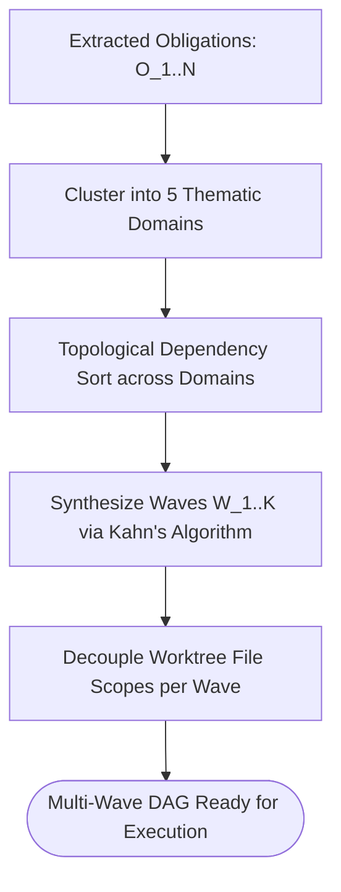

# Thematic Roadmap Clustering & Multi-Wave Decomposition

---

[Previous: 04-03 Authority-Gated Obligations](04-03-authority-gated-obligations.md) | [Chapter Index](index.md) | [All Chapters Index](../index.md) | [Next: Chapter 05 Index](../05-concurrency-straggler-sla/index.md)

---

## 1. Executive Summary & Wave Decomposition

In large software projects, executing dozens of unorganized tasks simultaneously causes unmanageable dependency knots and merge contention.

The OLT (Orchestrating Long Tasks) engine implements **Thematic Roadmap Clustering & Multi-Wave Decomposition**. Under this model:

1. **5-Domain Thematic Partitioning**: Obligations are clustered into 5 cohesive architectural domains (Foundations, Core Engine, Validation & Gates, Tooling & CLI, Documentation).
2. **Multi-Wave DAG Synthesis**: Tasks within the same domain are organized into sequential, decoupled waves ($W_1 \dots W_K$).
3. **Work-Span Minimization**: The scheduler maximizes parallel width $\mathcal{W}(G)$ while minimizing critical path span $S(G)$.

```text
+--------------------------------------------------------------------------------------------------+
│                             THEMATIC CLUSTERING & WAVE TOPOLOGY                                  │
+--------------------------------------------------------------------------------------------------+
│                                                                                                  │
│   DOMAIN 1: Foundations (Contracts & Types) ──► Wave 1 (Parallel Tasks 1A, 1B, 1C)               │
│                                                       │                                          │
│                                                       ▼                                          │
│   DOMAIN 2: Core Engine & Graph Scheduler   ──► Wave 2 (Parallel Tasks 2A, 2B)                   │
│                                                       │                                          │
│                                                       ▼                                          │
│   DOMAIN 3: Verification & Evidence Gates   ──► Wave 3 (Parallel Tasks 3A, 3B, 3C)               │
│                                                       │                                          │
│                                                       ▼                                          │
│   DOMAIN 4: CLI & Operator Tooling          ──► Wave 4 (Parallel Tasks 4A, 4B)                   │
│                                                       │                                          │
│                                                       ▼                                          │
│   DOMAIN 5: Architecture Documentation      ──► Wave 5 (Parallel Docs Sync)                      │
│                                                                                                  │
+--------------------------------------------------------------------------------------------------+
```

---

## 2. Mathematical Formalization of Thematic Clustering

Let $\mathcal{O} = \{O_1, \dots, O_N\}$ be the set of extracted obligations.

We define the semantic affinity matrix $\mathcal{A}_{ij} = \text{Sim}(O_i, O_j) \in [0, 1]$ based on shared file paths and dependency edges.

The **Thematic Clustering Objective** partitions $\mathcal{O}$ into $K \le 5$ clusters $C_1, \dots, C_K$ to maximize intra-cluster cohesion while minimizing cross-cluster dependencies:

$$\max_{\{C_1 \dots C_K\}} \sum_{k=1}^K \sum_{u, v \in C_k} \mathcal{A}_{uv} - \lambda \sum_{k \neq l} \text{CrossEdges}(C_k, C_l)$$



---

## 3. Wave Execution & Decoupling Invariants

1. **Strict Scope Disjointness**: Tasks in the same wave $W_m$ must have mutually disjoint write scopes:

$$\forall T_a, T_b \in W_m \; (a \neq b) \implies \text{Scope}(T_a) \cap \text{Scope}(T_b) = \emptyset$$

2. **Sequential Wave Barriers**: Wave $W_{m+1}$ cannot commence until all tasks in wave $W_m$ are certified completed.

---

## 4. Architectural Invariants Summary

1. **Maximized Parallelism**: Independent modules execute concurrently across worktrees.
2. **Zero File Collisions**: Scope disjointness prevents Git merge conflicts.
3. **Structured Roadmaps**: Multi-wave clustering provides clear milestone visibility.

---

[Previous: 04-03 Authority-Gated Obligations](04-03-authority-gated-obligations.md) | [Chapter Index](index.md) | [All Chapters Index](../index.md) | [Next: Chapter 05 Index](../05-concurrency-straggler-sla/index.md)

---
