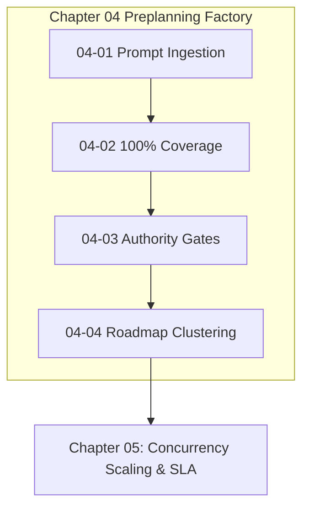

# Chapter 04: Continuous Preplanning Factory

---

[Previous: Chapter 03 Index](../03-mind-product-owner/index.md) | [Chapter Index](index.md) | [All Chapters Index](../index.md) | [Next: 04-01 Prompt Ingestion & SHA-256 Binding](04-01-prompt-ingestion-and-sha256-binding.md)

---

## 1. Chapter Overview & Preplanning Architecture

Welcome to Chapter 04 of the OLT Architecture Book. This chapter establishes the theoretical foundations, mathematical invariants, and pipeline mechanics governing the **Continuous Preplanning Factory** in the OLT (Orchestrating Long Tasks) engine.

Ad-hoc agent execution fails when requirements are interpreted loosely or partially forgotten as execution progresses. Chapter 04 codifies the Prompt Ingestion & SHA-256 Sealing protocol, formalizes the 100% Prompt Line Coverage Invariant, details Authority-Gated Obligations, and explores Thematic Roadmap Clustering.

```text
+--------------------------------------------------------------------------------------------------+
│                             CHAPTER 04: PREPLANNING FACTORY TOPOLOGY                             │
+--------------------------------------------------------------------------------------------------+
│                                                                                                  │
│    ┌───────────────────────────┐                    ┌───────────────────────────┐                │
│    │ 04-01: Prompt Ingestion   │                    │ 04-02: 100% Prompt Line   │                │
│    │ & SHA-256 Digest Sealing  │ ══════════════════►│ Coverage Invariant        │                │
│    └─────────────┬─────────────┘                    └─────────────┬─────────────┘                │
│                  │                                                │                              │
│                  ▼                                                ▼                              │
│    ┌───────────────────────────┐                    ┌───────────────────────────┐                │
│    │ 04-03: Authority-Gated    │                    │ 04-04: Thematic Roadmap   │                │
│    │ Obligations & Risk Bounds │ ══════════════════►│ Clustering & Wave Decouple│                │
│    └───────────────────────────┘                    └───────────────────────────┘                │
│                                                                                                  │
+--------------------------------------------------------------------------------------------------+
```

---

## 2. Chapter Table of Contents & Learning Path

```text
+--------------------------------------------------+--------------+--------------------------------+
│ Document                                         │ Classification│ Core Architectural Focus       │
+--------------------------------------------------+--------------+--------------------------------+
│ 04-01 Prompt Ingestion & SHA-256 Binding         │ Ingestion    │ Mode 0444 & tamper prevention  │
│ 04-02 100% Prompt Line Coverage Invariant        │ Traceability │ Bidirectional coverage matrix  │
│ 04-03 Authority-Gated Obligations                │ Security     │ Risk triggers & grant gates    │
│ 04-04 Thematic Roadmap Clustering                │ Planning     │ 5-domain clustering & waves    │
+--------------------------------------------------+--------------+--------------------------------+
```

### [04-01: Prompt Ingestion & SHA-256 Binding](04-01-prompt-ingestion-and-sha256-binding.md)

Deconstructs mode `0444` read-only prompt ingestion, SHA-256 cryptographic manifest sealing, and preflight tamper verification.

### [04-02: 100% Prompt Line Coverage Invariant](04-02-one-hundred-percent-line-coverage.md)

Formalizes the mathematical coverage predicate $\Phi_{\text{cov}} = 1.000$, the bidirectional Traceability Matrix, and anti-cherry-picking rules.

### [04-03: Authority-Gated Obligations & Risk Bounds](04-03-authority-gated-obligations.md)

Details the risk classification matrix, high-risk operational triggers, supervisory grant gates, and the Agent Grant Ledger.

### [04-04: Thematic Roadmap Clustering & Multi-Wave Decomposition](04-04-thematic-roadmap-clustering.md)

Explains the 5-domain partitioning matrix, multi-wave DAG synthesis, dynamic wave decoupling, and work-span minimization.

---

## 3. Core Preplanning Metrics Reference Table

$$ \begin{array}{|l|l|l|}
\hline
\textbf{Metric} & \textbf{Mathematical Formulation} & \textbf{Acceptance Standard} \\ \hline
\text{Prompt Hash} & h_{\text{prompt}} = \text{SHA256}(P) & \text{Cryptographically immutable} \\ \hline
\text{Coverage Ratio} & \Phi_{\text{cov}} = \frac{|\text{CoveredLines}(P)|}{|\text{TotalLines}(P)|} & \Phi_{\text{cov}} \equiv 1.000 \text{ (100\% Coverage)} \\ \hline
\text{Risk Gate} & \text{NeedsAuthority}(O_i) \implies \text{GrantToken} & \text{Explicit supervisor approval} \\ \hline
\text{Cluster Quality} & \mathcal{Q}(C) = \sum \text{Sim}(u, v) - \lambda \text{CrossEdges} & \text{Maximized module cohesion} \\ \hline
\end{array}$$



---

## 4. Summary & Transition

The preplanning algorithms and prompt coverage invariants codified in Chapter 04 ensure that autonomous runs execute with zero requirement omissions, strict authority boundaries, and optimal dependency partitioning.

Proceed to [04-01: Prompt Ingestion & SHA-256 Binding](04-01-prompt-ingestion-and-sha256-binding.md) or advance directly to [Chapter 05: Concurrency Scaling & Straggler SLA](../05-concurrency-straggler-sla/index.md).

---

[Previous: Chapter 03 Index](../03-mind-product-owner/index.md) | [Chapter Index](index.md) | [All Chapters Index](../index.md) | [Next: 04-01 Prompt Ingestion & SHA-256 Binding](04-01-prompt-ingestion-and-sha256-binding.md)

---
$$
