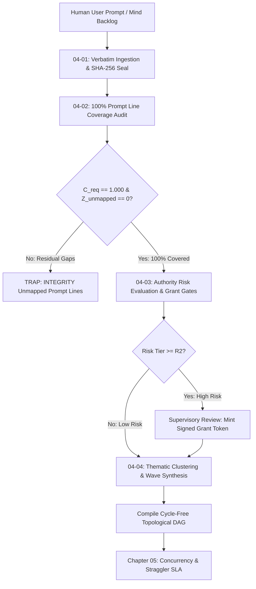

# Chapter 04: Continuous Preplanning Factory

---

[Previous: Chapter 03: Mind Product Owner](../03-mind-product-owner/index.md) | [Chapter Index](index.md) | [All Chapters Index](../index.md) | [Next: 04-01 Prompt Ingestion & SHA-256 Binding](04-01-prompt-ingestion-and-sha256-binding.md)

---

## 1. Chapter Overview & Architectural Role

Welcome to Chapter 04 of the OLT Architecture Book. This chapter establishes the theoretical foundations, mathematical invariants, and pipeline mechanics governing the **Continuous Preplanning Factory** in the OLT (Orchestrating Long Tasks) multi-agent operating system.

In long-horizon autonomous software engineering, ad-hoc execution architectures fail when specifications are interpreted loosely, requirements are selectively skipped, or changes are scheduled without structural risk gating. Chapter 04 defines the deterministic preplanning pipeline that transforms raw human intent and continuous discovery logs into cryptographically sealed, 100% line-covered, authority-gated, and thematically clustered execution blueprints.

```text
+--------------------------------------------------------------------------------------------------+
│                             CHAPTER 04: PREPLANNING FACTORY TOPOLOGY                             │
+--------------------------------------------------------------------------------------------------+
│                                                                                                  │
│   ┌───────────────────────────────────────────┐         ┌─────────────────────────────────────┐  │
│   │ 04-01: Prompt Ingestion & SHA-256 Binding │         │ 04-02: 100% Line Coverage Invariant │  │
│   │ - Verbatim prompt ingestion               │ ═══════►│ - C_req = 1.000 (Z_unmapped_req = 0)│  │
│   │ - POSIX mode 0444 read-only lockdown      │         │ - Bidirectional Traceability Matrix │  │
│   │ - Cryptographic SHA-256 genesis anchor    │         │ - Anti-cherry-picking verification  │  │
│   └─────────────────────┬─────────────────────┘         └──────────────────┬──────────────────┘  │
│                         │                                                  │                     │
│                         ▼                                                  ▼                     │
│   ┌───────────────────────────────────────────┐         ┌─────────────────────────────────────┐  │
│   │ 04-03: Authority-Gated Obligations        │         │ 04-04: Thematic Roadmap Clustering  │  │
│   │ - 4-tier risk classification (R0 to R3)   │ ═══════►│ - 6-domain canonical clustering     │  │
│   │ - HMAC-signed supervisory Grant Tokens    │         │ - Dynamic wave decoupling (P=W/S)   │  │
│   │ - Process ancestry (PID/PPID) session lock│         │ - Scope-disjoint execution waves    │  │
│   └───────────────────────────────────────────┘         └─────────────────────────────────────┘  │
│                                                                                                  │
+--------------------------------------------------------------------------------------------------+
```

---

## 2. Chapter Table of Contents & Subtopics Map

```text
+---------------------------------------------------+--------------+-------------------------------+
| Document                                          | Focus Area   | Key Invariant / Mechanism     |
+---------------------------------------------------+--------------+-------------------------------+
| 04-01 Prompt Ingestion & SHA-256 Binding          | Ingestion    | Mode 0444 & SHA-256 sealing   |
| 04-02 100% Line Coverage & Atomic Decomposition   | Traceability | C_req = 1.000 & Z_unmapped = 0|
| 04-03 Authority-Gated Obligations & Risk Bounds   | Security     | HMAC tokens & Process Ancestry|
| 04-04 Thematic Roadmap Clustering & Multi-Wave    | Synthesis    | 6-domain cluster & Brent math |
+---------------------------------------------------+--------------+-------------------------------+
```

### [04-01: Prompt Ingestion & SHA-256 Binding](04-01-prompt-ingestion-and-sha256-binding.md)

Deconstructs verbatim prompt ingestion, Unicode newline normalization across POSIX and Windows boundaries, POSIX octal mode `0444` filesystem lockdown, SHA-256 cryptographic manifest sealing, and preflight tamper verification before every execution wave.

### [04-02: 100% Line Coverage & Atomic Decomposition](04-02-one-hundred-percent-line-coverage.md)

Formalizes the mathematical coverage predicate $C_{\text{req}} = 1.000$, zero unmapped requirements ($Z_{\text{unmapped\_req}} = 0$), the Bidirectional Traceability Matrix, exact source excerpt validation, and anti-cherry-picking mechanical compilation gates.

### [04-03: Authority-Gated Obligations & Risk Bounds](04-03-authority-gated-obligations.md)

Details the 4-tier operational risk classification lattice ($\mathcal{R}_0 \dots \mathcal{R}_3$), high-risk supervisory grant gates (`needs_authority: true`), HMAC-signed Grant Tokens, process ancestry (`pid`/`ppid`) locking, and failure recovery matrices.

### [04-04: Thematic Roadmap Clustering & Multi-Wave Decomposition](04-04-thematic-roadmap-clustering.md)

Explains the 6-domain canonical partitioning engine (`core`, `validation`, `tooling`, `engine`, `mind`, `reporting`), automated roadmap milestone synthesis, dynamic wave decoupling ($P = \lceil W/S \rceil$), and scope-disjoint concurrency guarantees.

---

## 3. Core Preplanning Metrics & Mathematical Invariants

$$ \begin{array}{|l|l|l|}
\hline
\textbf{Metric / Invariant} & \textbf{Mathematical Formulation} & \textbf{Acceptance Boundary} \\ \hline
\text{Prompt Hash} & h_{\text{prompt}} = \text{SHA-256}(P) & \text{Bit-for-bit immutable identity} \\ \hline
\text{Coverage Ratio} & C_{\text{req}} = \frac{\sum_{i \in \mathcal{S}(P)} \mathbf{1}_{\text{covered}}(i)}{|\mathcal{S}(P)|} & C_{\text{req}} \equiv 1.0000 \text{ (100\% Coverage)} \\ \hline
\text{Unmapped Residual} & Z_{\text{unmapped\_req}} = |\mathcal{S}(P)| - \sum \mathbf{1}_{\text{covered}}(i) & Z_{\text{unmapped\_req}} \equiv 0 \text{ (Zero Unmapped Lines)} \\ \hline
\text{Dispatch Gate} & \Pi_{\text{dispatch}}(O_k) = \mathbf{1}_{[\mathcal{R} \le 1]} \lor \mathbf{1}_{\text{GrantValid}}(\tau) & \text{Fail-closed authority interlock} \\ \hline
\text{Thematic Quality} & \mathcal{Q}(C) = \sum \mathcal{A}(u, v) - \lambda \sum \text{CrossEdges} & \text{Maximized architectural cohesion} \\ \hline
\text{Wave Decoupling} & P = \lceil W / S \rceil & \text{5-minute SLA execution sizing} \\ \hline
\end{array}$$

---

## 4. End-to-End Preplanning Workflow

The preplanning pipeline guarantees that no implementation task is leased without full requirement coverage, risk clearance, and topological dependency ordering.



---

## 5. Architectural Pillars of Preplanning Integrity

```text
+--------------------------------------------------------------------------------------------------+
│                             THE FOUR PILLARS OF PREPLANNING INTEGRITY                            │
+-------------------------------+------------------------------------------------------------------+
│ Architectural Pillar          │ Concrete System Guarantee                                        │
+-------------------------------+------------------------------------------------------------------+
│ 1. Immutable Ground Truth     │ User prompts are locked to POSIX mode 0444 upon ingestion and    │
│                               │ anchored in manifest.json with a SHA-256 cryptographic seal.     │
+-------------------------------+------------------------------------------------------------------+
│ 2. Zero Unmapped Requirements │ Every non-blank prompt line must have a recorded disposition;    │
│                               │ plan:compile fails-closed if coverage ratio C_req < 1.000.       │
+-------------------------------+------------------------------------------------------------------+
│ 3. Fail-Closed Authority Gates│ Operations touching security files or root configs require HMAC  │
│                               │ grant tokens bound to worker OS process ancestry (PID/PPID).     │
+-------------------------------+------------------------------------------------------------------+
│ 4. Scope-Disjoint Parallelism │ Thematic clusters are decomposed into execution waves where all  │
│                               │ concurrent tasks possess mutually disjoint file write scopes.    │
+-------------------------------+------------------------------------------------------------------+
```

---

## 6. Summary & Next Steps

The preplanning architecture codified in Chapter 04 ensures that autonomous agent swarms execute with zero requirement omissions, strict least-privilege security boundaries, and optimal dependency partitioning.

Proceed to the initial deep dive: [04-01: Prompt Ingestion & SHA-256 Binding](04-01-prompt-ingestion-and-sha256-binding.md) or advance directly to the concurrency scaling theorems in [Chapter 05: Concurrency & Straggler SLA](../05-concurrency-straggler-sla/index.md).

---

[Previous: Chapter 03: Mind Product Owner](../03-mind-product-owner/index.md) | [Chapter Index](index.md) | [All Chapters Index](../index.md) | [Next: 04-01 Prompt Ingestion & SHA-256 Binding](04-01-prompt-ingestion-and-sha256-binding.md)

---
$$
