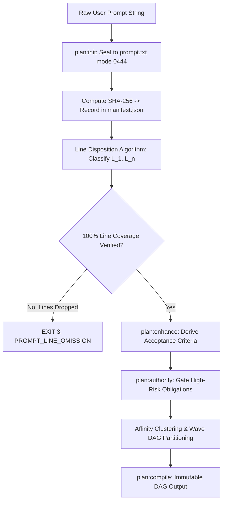

# Chapter 04: Continuous Preplanning Factory & Prompt Compilation

[OLT Documentation Hub](../../README.md) > [Architecture Index](../index.md) > Chapter 04: Continuous Preplanning Factory

---

[⏮️ Previous: Chapter 03: Mind Product Owner & Cadence](../03-mind-product-owner/index.md) | [📂 Chapter Index](index.md) | [📚 All Chapters Index](../index.md) | [⏭️ Next: 04-01 Prompt Ingestion & SHA-256 Binding](04-01-prompt-ingestion-and-sha256-binding.md)
---

## 1. Chapter Overview

Flawed execution is almost always the consequence of incomplete preplanning. If a requirements specification omits subtle constraints, contains ambiguous natural language, or leaves dependencies implicit, implementers will hallucinate solutions or create incompatible changes.

The **Continuous Preplanning Factory** transforms raw user prompts into deterministic, mathematically verified execution DAGs. It enforces **Byte-Exact Prompt Capture**, **100% Prompt Line Coverage**, **Authority-Gated Obligations**, and **Topological Affinity Clustering**.

```text
┌──────────────────────────────────────────────────────────────────────────────────────────────────┐
│                     CHAPTER 04: CONTINUOUS PREPLANNING FACTORY TOPOLOGY                          │
├──────────────────────────┬──────────────────────────┬────────────────────────────────────────────┤
│ Sub-Topic                │ Key Architectural Model  │ Primary Invariants Enforced                │
├──────────────────────────┼──────────────────────────┼────────────────────────────────────────────┤
│ 01. Prompt Ingestion     │ Mode 0444 Immutability   │ Byte-Exact SHA-256 Binding in Manifest     │
│ 02. 100% Line Coverage   │ Line Disposition Alg     │ Every Line Mapped to {Req, Noise, Context} │
│ 03. Authority Gating     │ Authority Decision Ledger│ needs_authority Honest Blocked Reporting   │
│ 04. Thematic Clustering  │ Topological DAG Compiler │ Semantic Affinity Graph Partitioning       │
└──────────────────────────┴──────────────────────────┴────────────────────────────────────────────┘
```

---

## 2. Table of Contents

1. **[04-01: Prompt Ingestion & SHA-256 Binding](./04-01-prompt-ingestion-and-sha256-binding.md)**  
   _`plan:init` byte-exact capture, mode `0444` immutability, and manifest cryptographic sealing._
2. **[04-02: 100% Prompt Line Coverage Invariant](./04-02-one-hundred-percent-line-coverage.md)**  
   _Formal line disposition algorithm, `--requirement-lines` binding, and omission detection._
3. **[04-03: Authority-Gated Obligations](./04-03-authority-gated-obligations.md)**  
   _`needs_authority` taxonomy, decision ledgers, and honest blocked requirement reporting._
4. **[04-04: Thematic Roadmap Clustering](./04-04-thematic-roadmap-clustering.md)**  
   _Affinity scoring, topological graph clustering, and DAG compilation ($G_0 \to G_k$)._

---

## 3. Preplanning Compilation Pipeline



---

[⏮️ Previous: Chapter 03: Mind Product Owner & Cadence](../03-mind-product-owner/index.md) | [📂 Chapter Index](index.md) | [📚 All Chapters Index](../index.md) | [⏭️ Next: 04-01 Prompt Ingestion & SHA-256 Binding](04-01-prompt-ingestion-and-sha256-binding.md)
---
