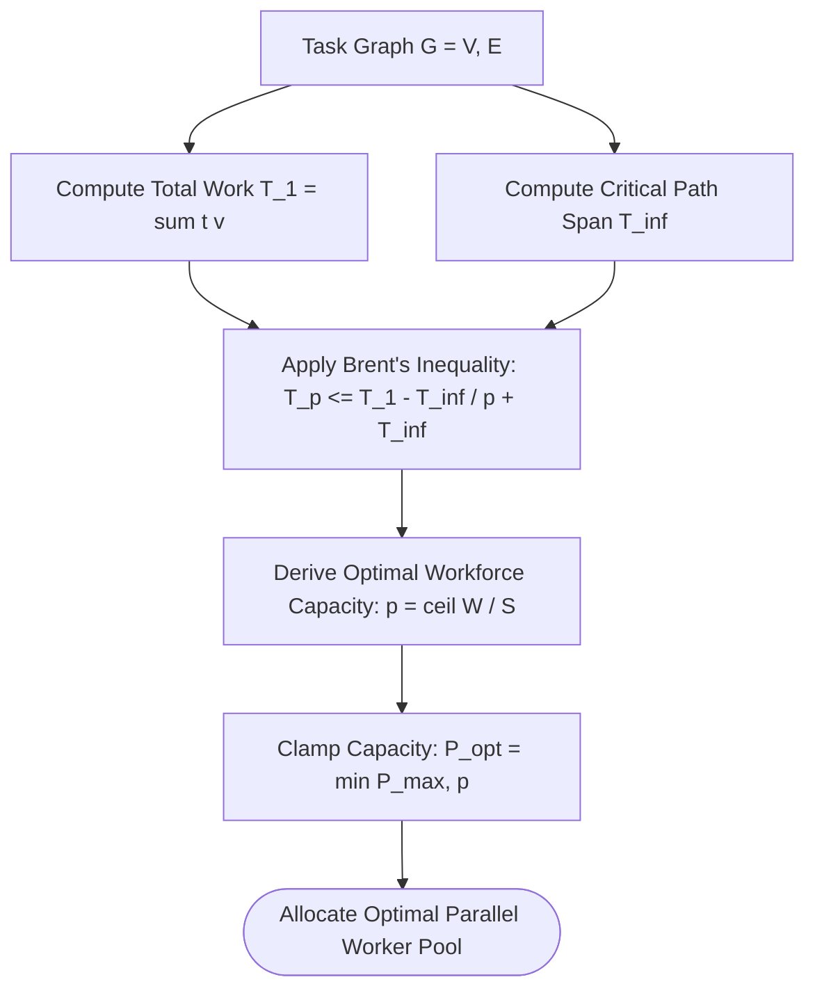

# Brent Work-Span Theorem & Parallel Speedup

---

[Previous: Chapter 05 Index](index.md) | [Chapter Index](index.md) | [All Chapters Index](../index.md) | [Next: 05-02 Coffman-Graham Width Bounds](05-02-coffman-graham-width-bounds.md)

---

## 1. Executive Summary & The Work-Span Foundation

In parallel computing and distributed task orchestration, understanding the fundamental theoretical limits of concurrent execution is essential. Uncoordinated agent systems either spawn excessive subagents (wasting API tokens and causing lock thrashing) or execute sequentially (suffering unacceptable latency).

The OLT (Orchestrating Long Tasks) engine models task DAG execution using the **Brent Work-Span Theorem**. Under this model:

- **Total Work ($T_1$)**: The cumulative execution time of all tasks running sequentially on a single worker.
- **Critical Path Span ($T_\infty$)**: The execution duration along the longest dependency chain in the DAG.
- **Optimal Parallel Time ($T_p$)**: The execution time achievable with $p$ concurrent workers, bounded strictly by Brent's inequality.

```text
+--------------------------------------------------------------------------------------------------+
│                                 BRENT WORK-SPAN SCALING MODEL                                    │
+--------------------------------------------------------------------------------------------------+
│                                                                                                  │
│   TOTAL WORK (T_1): sum of all task durations (e.g. 120 minutes sequential work)                │
│   CRITICAL PATH SPAN (T_inf): longest dependency path (e.g. 25 minutes minimum span)             │
│                                                                                                  │
│   BRENT'S THEOREM:  T_p <= (T_1 - T_inf) / p + T_inf                                             │
│                                                                                                  │
│   With p = 4 workers:  T_4 <= (120 - 25)/4 + 25 = 23.75 + 25 = 48.75 minutes                     │
│   With p = 8 workers:  T_8 <= (120 - 25)/8 + 25 = 11.87 + 25 = 36.87 minutes                     │
│                                                                                                  │
+--------------------------------------------------------------------------------------------------+
```

---

## 2. Mathematical Formalization of Brent's Theorem

Let $G = (V, E)$ be a directed acyclic task graph with vertex execution times $t(v)$ for $v \in V$.

The **Total Work** $T_1$ is:

$$T_1 = \sum_{v \in V} t(v)$$

The **Critical Path Span** $T_\infty$ along the longest directed path $\Pi = \langle v_1, v_2, \dots, v_k \rangle \subseteq V$ is:

$$T_\infty = \max_{\Pi \subseteq G} \sum_{v \in \Pi} t(v)$$

### Brent's Scheduling Theorem

For any greedy list scheduler executing on $p$ identical parallel worker agents:

$$T_p \le \frac{T_1 - T_\infty}{p} + T_\infty$$

### Parallel Speedup and Efficiency

The theoretical speedup $S_p$ and parallel efficiency $E_p$ are defined as:

$$S_p = \frac{T_1}{T_p} \le p, \qquad E_p = \frac{S_p}{p} = \frac{T_1}{p \cdot T_p} \le 1.0$$



---

## 3. Multi-Coordinator Fleet Partitioning

When the required worker capacity exceeds the span capacity of a single Tier 2 Coordinator ($p > 6$), the Tier 1 Orchestrator partitions the graph into multiple independent sub-DAGs and assigns a dedicated Coordinator to each partition:

$$N_{\text{coordinators}} = \left\lceil \frac{P_{\text{opt}}}{4} \right\rceil$$

---

## 4. Architectural Invariants Summary

1. **Span Lower Bound**: No allocation of workers can reduce execution time below $T_\infty$.
2. **Greedy List Optimality**: OLT's topological wave scheduler satisfies the greedy scheduling condition.
3. **Capacity Clamping**: Worker concurrency is bounded by host limits to prevent token exhaustion.

---

[Previous: Chapter 05 Index](index.md) | [Chapter Index](index.md) | [All Chapters Index](../index.md) | [Next: 05-02 Coffman-Graham Width Bounds](05-02-coffman-graham-width-bounds.md)

---
