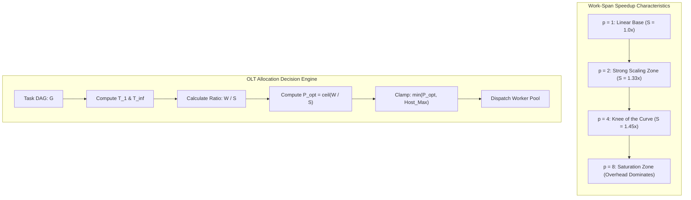

# Brent Work-Span Theorem & Parallel Speedup

---

[Previous: Chapter 05: Concurrency & Straggler SLA](index.md) | [Chapter Index](index.md) | [All Chapters Index](../index.md) | [Next: 05-02 Coffman-Graham Width Bounds](05-02-coffman-graham-width-bounds.md)

---

## 1. Executive Summary & Epistemic Foundations

In large-scale autonomous software engineering swarms, allocating compute capacity without formal scheduling bounds produces two severe failure modes:

1. **Under-Allocation**: Dispatching agents strictly sequentially converts embarrassingly parallel graph components into high-latency bottlenecks, extending wall-clock execution by orders of magnitude.
2. **Over-Allocation**: Spawning unconstrained parallel workers floods local CPU cores, exhausts host file descriptors, triggers LLM provider HTTP 429 rate limits, and incurs exponential coordination overhead.

The Orchestrating Long Tasks (OLT) runtime governs parallel agent dispatch using the **Brent Work-Span Theorem** (Brent, 1974). By modeling task graphs as directed acyclic dependency structures with discrete task execution costs, OLT mathematically bounds parallel execution time, derives the optimal workforce size $P_{\text{opt}} = \lceil W / S \rceil$, and prevents resource thrashing through greedy list scheduling.

```text
+===================================================================================================+
|                                  BRENT WORK-SPAN SCALING MODEL                                    |
+===================================================================================================+
|                                                                                                   |
|   TASK GRAPH METRICS:                                                                             |
|   • Total Work (T_1 or W) : Cumulative execution time of all tasks on a single serial worker     |
|   • Critical Span (T_inf or S): Execution duration along the longest directed dependency chain    |
|   • Concurrency Degree (p): Number of active parallel Tier-3 implementer worker processes       |
|                                                                                                   |
|   BRENT'S SCHEDULING INEQUALITY:                                                                 |
|                                                                                                   |
|                       T_p  <=  (T_1 - T_inf) / p  +  T_inf                                        |
|                                                                                                   |
|   THEORETICAL LIMITS:                                                                             |
|   1. Lower Bound on Latency : T_p >= max( T_1 / p,  T_inf )                                       |
|   2. Optimal Concurrency    : P_opt = ceil( T_1 / T_inf ) = ceil( W / S )                         |
|   3. Maximum Linear Speedup : S_p = T_1 / T_p <= p                                                |
|                                                                                                   |
+===================================================================================================+
```

---

## 2. High-Density Work-Span DAG Topology & Execution Profile

Consider a representative OLT preplanned task wave containing 8 modular implementation tasks $\{v_1, v_2, \dots, v_8\}$. Directed edges denote strict dependency obligations (e.g., database schema migration must precede endpoint implementations).

```text
+---------------------------------------------------------------------------------------------------+
|                                  TASK GRAPH DAG TOPOLOGY (G = V, E)                               |
+---------------------------------------------------------------------------------------------------+
|                                                                                                   |
|               [ v1: DB Schema Migration ] (t=20m)                                                |
|                      /         |        \                                                         |
|                     /          |         \                                                        |
|                    v           v          v                                                       |
|             [ v2: Auth ]  [ v3: User ]  [ v4: Billing ]                                           |
|               (t=15m)       (t=25m)       (t=30m)                                                 |
|                    \           |          /   \                                                   |
|                     \          |         /     \                                                  |
|                      v         v        v       v                                                 |
|                 [ v5: API Router ] (t=10m)    [ v6: Stripe Webhook ] (t=20m)                      |
|                                |                      |                                           |
|                                v                      v                                           |
|                 [ v7: End-to-End Integration ] (t=25m)                                            |
|                                |                                                                  |
|                                v                                                                  |
|                 [ v8: Adversarial Audit ] (t=15m)                                                 |
|                                                                                                   |
|   WORK & SPAN COMPUTATION:                                                                        |
|   • Total Work (T_1) = 20 + 15 + 25 + 30 + 10 + 20 + 25 + 15 = 160 minutes                         |
|   • Longest Path (Critical Span T_inf):                                                           |
|       Path Pi = < v1 (20m) -> v4 (30m) -> v6 (20m) -> v7 (25m) -> v8 (15m) >                      |
|       T_inf   = 20 + 30 + 20 + 25 + 15 = 110 minutes                                              |
|   • Concurrency Ratio (Average Parallelism):                                                      |
|       A = T_1 / T_inf = 160 / 110 = 1.455                                                         |
|   • Optimal Workforce: P_opt = ceil( 160 / 110 ) = 2 workers                                      |
|                                                                                                   |
+---------------------------------------------------------------------------------------------------+
```

### 2.1 Execution Timeline Comparison

The table below illustrates execution duration $T_p$, theoretical speedup $S_p = T_1 / T_p$, and parallel efficiency $E_p = S_p / p$ across varying worker pool allocations for this DAG:

```text
+---------+-------------------+--------------------+------------------+-----------------------------+
| Workers | Upper Bound T_p   | Observed T_p (Opt) | Speedup S_p      | Efficiency E_p (S_p / p)    |
+---------+-------------------+--------------------+------------------+-----------------------------+
| p = 1   | 160.00 min        | 160.00 min         | 1.00x            | 100.0% (Serial Execution)   |
| p = 2   | 135.00 min        | 120.00 min         | 1.33x            | 66.7%  (Optimal Allocation) |
| p = 3   | 126.67 min        | 115.00 min         | 1.39x            | 46.3%  (Diminishing Return) |
| p = 4   | 122.50 min        | 110.00 min         | 1.45x            | 36.4%  (Span Constrained)   |
| p = 8   | 116.25 min        | 110.00 min         | 1.45x            | 18.2%  (Excessive Overhead) |
| p = inf | 110.00 min        | 110.00 min         | 1.45x            | 0.0%   (Asymptotic Limit)   |
+---------+-------------------+--------------------+------------------+-----------------------------+
```

---

## 3. Mathematical Formalization & Proof of Brent's Theorem

Let $G = (V, E)$ be a directed acyclic task graph where each node $v \in V$ represents an atomic task with non-negative deterministic execution duration $t(v) \in \mathbb{R}^+$.

### 3.1 Fundamental Metric Definitions

The **Total Work** $T_1$ represents the total computational effort:

$$T_1 = \sum_{v \in V} t(v)$$

The **Critical Path Span** $T_\infty$ is the length of the weight-maximal directed path from any source node to any sink node in $G$:

$$T_\infty = \max_{\Pi \in \text{Paths}(G)} \left( \sum_{v \in \Pi} t(v) \right)$$

The **Average Parallelism** $A_{\text{dag}}$ is the maximum theoretical speedup possible with infinite processors:

$$A_{\text{dag}} = \frac{T_1}{T_\infty}$$

### 3.2 Brent's Scheduling Theorem

**Theorem (Brent, 1974)**: Let $G$ be a task graph with work $T_1$ and span $T_\infty$. Any greedy list scheduler executing on $p$ identical parallel worker agents completes the graph in time $T_p$ satisfying:

$$T_p \le \frac{T_1 - T_\infty}{p} + T_\infty$$

#### Mathematical Proof:

1. Discretize execution into unit time steps $\tau \in \{1, 2, \dots, T_p\}$. At each step $\tau$, let $W(\tau)$ denote the number of active tasks executed.
2. A greedy scheduler guarantees that if at least $p$ tasks are ready at step $\tau$, exactly $p$ tasks are assigned to workers (a _full step_). If fewer than $p$ tasks are ready, all ready tasks are executed (a _deficient step_).
3. Let $k_{\text{full}}$ be the number of full steps ($W(\tau) = p$) and $k_{\text{def}}$ be the number of deficient steps ($W(\tau) < p$). Total time is:

$$T_p = k_{\text{full}} + k_{\text{def}}$$

4. In any deficient step, the set of ready tasks is strictly smaller than $p$. Because all available ready tasks are executed, every maximal directed path in the remaining unexecuted subgraph has its unexecuted length reduced by at least 1 unit. Therefore, the total number of deficient steps cannot exceed the critical path length:

$$k_{\text{def}} \le T_\infty$$

5. The total work performed across all steps equals $T_1$:

$$T_1 = \sum_{\tau=1}^{T_p} W(\tau) \ge p \cdot k_{\text{full}} + 1 \cdot k_{\text{def}} = p (T_p - k_{\text{def}}) + k_{\text{def}}$$

6. Rearranging for $T_p$:

$$p \cdot T_p \le T_1 + (p - 1) k_{\text{def}} \le T_1 + (p - 1) T_\infty$$

7. Dividing both sides by $p$:

$$T_p \le \frac{T_1}{p} + \frac{p-1}{p} T_\infty = \frac{T_1 - T_\infty}{p} + T_\infty \quad \blacksquare$$

---

## 4. Amdahl vs Gustafson Bounds in Autonomous Agentic Swarms

Distributed agentic swarms exhibit non-uniform parallelizability due to mandatory supervisory phases, cryptographic signing, and monotonic merge serialization.



### 4.1 Amdahl's Law (Fixed Workload Latency Bound)

Let $s \in [0, 1]$ be the strictly sequential fraction of the preplanned DAG (such as final validation gates and Merkle state commits). The speedup $S_{\text{Amdahl}}(p)$ is bounded by:

$$S_{\text{Amdahl}}(p) = \frac{1}{(1 - s) + \frac{s}{p}} \le \frac{1}{1 - s}$$

If supervisory validation and serial merges constitute $25\%$ of the total work ($s = 0.25$), no swarm allocation can ever exceed a speedup of:

$$S_{\max} = \frac{1}{0.25} = 4.0\times$$

### 4.2 Gustafson's Law (Scaled Workload Throughput Bound)

When the autonomous Mind product owner expands candidate scopes dynamically as capacity increases, the scaled speedup $S_{\text{Gustafson}}(p)$ accounts for expanded problem size:

$$S_{\text{Gustafson}}(p) = p - \alpha (p - 1)$$

Where $\alpha$ is the serial overhead coefficient. For OLT pipelines with $\alpha \le 0.05$, expanding concurrent waves delivers near-linear throughput scaling across independent functional sub-domains.

---

## 5. Multi-Coordinator Fleet Partitioning Topology

When an admitted epic requires a workforce allocation exceeding the span capacity of a single Tier-2 Coordinator ($p > 6$), the Tier-1 Orchestrator partitions the graph into disjoint sub-DAGs and assigns dedicated Tier-2 Coordinators.

```text
+---------------------------------------------------------------------------------------------------+
|                            MULTI-COORDINATOR FLEET PARTITIONING                                   |
+---------------------------------------------------------------------------------------------------+
|                                                                                                   |
|                                 [ TIER-1 ORCHESTRATOR ]                                           |
|                               /                         \                                         |
|                 Partition A  /                           \  Partition B                           |
|                             v                             v                                       |
|             [ TIER-2 COORDINATOR A ]              [ TIER-2 COORDINATOR B ]                        |
|             (Sub-DAG: Core Services)              (Sub-DAG: Admin UI & Webhooks)                  |
|                 /        |       \                    /        |        \                         |
|                v         v        v                  v         v         v                        |
|             [W1:DB]  [W2:Auth]  [W3:API]          [W4:UI]   [W5:Hook]  [W6:Audit]                 |
|             (Slot 1) (Slot 2)  (Slot 3)          (Slot 4)  (Slot 5)   (Slot 6)                    |
|                                                                                                   |
|   PARTITIONING INVARIANT:                                                                         |
|   N_coordinators = ceil( P_opt / 4 )                                                              |
|   Max workers per Coordinator = 4 (hard budget to prevent coordinator context thrashing)          |
|                                                                                                   |
+---------------------------------------------------------------------------------------------------+
```

---

## 6. TypeScript Architectural Schemas & Scheduling Interfaces

The OLT scheduling runtime encodes the Brent work-span formulation in [`concurrency-allocator.ts`](../../../../olt/scripts/src/graph/forensics/brent-bounds.ts):

```typescript
/**
 * Core Work-Span DAG Metrics computed prior to wave dispatch.
 */
export interface WorkSpanMetrics {
  /** Sum of estimated/observed execution durations for all vertices in ms (T_1) */
  totalWorkMs: number;
  /** Longest directed path duration in ms (T_infinity) */
  criticalSpanMs: number;
  /** Average parallelism ratio: T_1 / T_infinity */
  averageParallelism: number;
  /** Total vertex count in the scheduled sub-DAG */
  taskCount: number;
}

/**
 * Workforce Allocation Decision Envelope.
 */
export interface ConcurrencyAllocation {
  /** Optimal workforce calculated via ceil(T_1 / T_infinity) */
  pOptimal: number;
  /** Clamped workforce respecting host hardware and rate-limit constraints */
  pAllocated: number;
  /** Theoretical upper bound execution duration under pAllocated (ms) */
  brentUpperBoundMs: number;
  /** Theoretical speedup factor S_p */
  predictedSpeedup: number;
  /** Parallel efficiency metric E_p in range [0.0, 1.0] */
  predictedEfficiency: number;
  /** Required number of Tier-2 Coordinator supervisors */
  coordinatorsRequired: number;
}

/**
 * Evaluates a task graph and derives optimal concurrency allocation under Brent's Theorem.
 */
export function calculateBrentAllocation(
  metrics: WorkSpanMetrics,
  hostMaxConcurrency: number,
): ConcurrencyAllocation {
  const { totalWorkMs, criticalSpanMs } = metrics;

  if (criticalSpanMs <= 0 || totalWorkMs <= 0) {
    return {
      pOptimal: 1,
      pAllocated: 1,
      brentUpperBoundMs: totalWorkMs,
      predictedSpeedup: 1.0,
      predictedEfficiency: 1.0,
      coordinatorsRequired: 1,
    };
  }

  const pOptimal = Math.max(1, Math.ceil(totalWorkMs / criticalSpanMs));
  const pAllocated = Math.min(pOptimal, Math.max(1, hostMaxConcurrency));

  // Brent's inequality: T_p <= (T_1 - T_inf) / p + T_inf
  const brentUpperBoundMs = Math.round(
    (totalWorkMs - criticalSpanMs) / pAllocated + criticalSpanMs,
  );

  const predictedSpeedup = Number((totalWorkMs / brentUpperBoundMs).toFixed(3));
  const predictedEfficiency = Number((predictedSpeedup / pAllocated).toFixed(3));
  const coordinatorsRequired = Math.ceil(pAllocated / 4);

  return {
    pOptimal,
    pAllocated,
    brentUpperBoundMs,
    predictedSpeedup,
    predictedEfficiency,
    coordinatorsRequired,
  };
}
```

---

## 7. Anti-Blunder Matrix: Concurrency & Scaling Failures

```text
+------------------------------+---------------------------------------+---------------------------------------+
| Failure Mode / Blunder       | Root Architectural Defect             | OLT Engine Defense                    |
+------------------------------+---------------------------------------+---------------------------------------+
| Concurrency Over-Allocation  | Spawning 20+ workers on a graph with  | Brent allocation clamps p to          |
| (Resource Thrashing)         | span T_inf = 0.8 * T_1.               | P_opt = ceil(T_1 / T_inf).            |
+------------------------------+---------------------------------------+---------------------------------------+
| Span Lower Bound Ignorance   | Expecting 10x speedup on an inherently| Rejects impossible deadlines during   |
| (Hallucinated Deadlines)     | sequential 5-step dependency chain.   | preplanning if TargetTime < T_inf.    |
+------------------------------+---------------------------------------+---------------------------------------+
| Coordinator Overload         | Single Tier-2 Coordinator attempting  | Fleet Partitioning forces new         |
| (Context Window Exhaustion)  | to supervise > 6 active workers.      | Coordinator spawn every 4 workers.    |
+------------------------------+---------------------------------------+---------------------------------------+
| Rate Limit Starvation        | Concurrent tool calls trigger HTTP    | Dynamic Load Throttling applies AIMD  |
| (API 429 Cascade)            | 429 backoff across all workers.       | backoff to pAllocated in real-time.   |
+------------------------------+---------------------------------------+---------------------------------------+
| Sequential Merge Choke       | Workers finish concurrently but wait  | Worktree branching enables lock-free  |
| (Git Lock Bottlenecks)       | in single-file merge queues.          | isolated testing prior to integration.|
+------------------------------+---------------------------------------+---------------------------------------+
```

---

## 8. Architectural Invariants & Verification Protocol

The OLT engine mechanically enforces three invariant checks prior to wave dispatch:

1. **Span Boundedness Invariant**:
   $$\forall p \ge 1, \quad T_p \ge T_\infty$$
   No schedule plan may promise completion in duration less than $T_\infty$.
2. **Greedy List Progress Invariant**:
   $$\text{IdleWorkers}(t) > 0 \implies \text{ReadyTasks}(t) = \emptyset$$
   No worker agent may remain idle while unblocked ready tasks exist in the wave.
3. **Coordinator Span Budget Invariant**:
   $$\forall c \in \text{Coordinators}, \quad |\text{SupervisedWorkers}(c)| \le 4$$
   Supervisory token budgets are protected by capping active worker fan-out per Coordinator.

---

[Previous: Chapter 05: Concurrency & Straggler SLA](index.md) | [Chapter Index](index.md) | [All Chapters Index](../index.md) | [Next: 05-02 Coffman-Graham Width Bounds](05-02-coffman-graham-width-bounds.md)

---
